# 侦察 (TA0043)

## 一句话理解

> **侦察就像小偷在踩点，观察目标的环境和弱点——了解得越多，下手越容易。**

## 战术概述

侦察是网络攻击的**第一步**，就像小偷在动手前先要"踩点"一样。攻击者在正式入侵目标系统之前，会花大量时间收集目标的各种信息，包括：目标有哪些服务器、用了什么软件、员工是谁、网络结构是什么样的等等。

**通俗解释：**
侦察就像小偷在作案前的踩点——他们会观察目标小区的门禁系统、保安巡逻时间、摄像头位置，甚至通过社交媒体了解住户的生活规律。信息收集得越多，作案成功率越高。

**在攻击中的作用：**
侦察位于MITRE ATT&CK攻击链的**最前端**，是所有后续攻击行动的基础。没有充分的侦察，攻击者就像蒙着眼闯进陌生建筑，成功率极低。侦察阶段通常不会被安全设备直接检测到（尤其是被动侦察），因此是攻击者最安全的信息收集窗口。

**包含的技术类型：**
- **被动侦察**：不直接接触目标系统，从公开渠道收集信息，就像在远处用望远镜观察
- **主动侦察**：直接与目标系统交互，就像走到门口敲敲门看看有没有人

## 战术在攻击链中的位置

### 攻击链全景图

```mermaid
graph LR
    A["侦察<br/>TA0043"] --> B["资源开发<br/>TA0042"]
    B --> C["初始访问<br/>TA0001"]
    C --> D["执行<br/>TA0002"]
    D --> E["持久化<br/>TA0003"]
    E --> F["权限提升<br/>TA0004"]
    F --> G["隐蔽<br/>TA0005"]
    G --> H["防御削弱<br/>TA0112"]
    H --> I["凭证访问<br/>TA0006"]
    I --> J["发现<br/>TA0007"]
    J --> K["横向移动<br/>TA0008"]
    K --> L["收集<br/>TA0009"]
    L --> M["命令与控制<br/>TA0011"]
    M --> N["数据窃取<br/>TA0010"]
    N --> O["影响<br/>TA0040"]

    style A fill:#ff6b6b,stroke:#333,stroke-width:2px
```

### 当前战术的角色

侦察是攻击链的第一步，发生在任何实际入侵之前。攻击者在这个阶段尽可能多地收集目标信息，为后续的攻击做准备。侦察做得越充分，后续攻击越容易成功。

### 前置战术

- **无**：侦察是整个攻击链的起点，没有前置战术要求。攻击者可以直接从侦察阶段开始。

### 后续战术

- **资源开发 (TA0042)**：根据侦察结果准备攻击工具、搭建C2基础设施、获取凭证等
- **初始访问 (TA0001)**：利用侦察发现的弱点尝试进入目标系统
- **执行 (TA0002)**：在获得初始访问后执行恶意代码

## 技术索引表

| 技术ID | 中文名称 | 难度 | 子技术数 | 一句话理解 | 文档状态 |
|--------|---------|------|---------|-----------|----------|
| [T1589](T1589-Gather-Victim-Identity-Information.md) | 收集受害者身份信息 | ⭐⭐ | 3 | 收集目标员工的姓名、邮箱、密码等个人信息 | ✅ 已完成 |
| [T1590](T1590-Gather-Victim-Network-Information.md) | 收集受害者网络信息 | ⭐⭐ | 6 | 摸清目标的域名、DNS、IP地址和网络拓扑 | ✅ 已完成 |
| [T1591](T1591-Gather-Victim-Org-Information.md) | 收集受害者组织信息 | ⭐ | 4 | 了解目标公司的组织架构、业务关系和运营节奏 | ✅ 已完成 |
| [T1592](T1592-Gather-Victim-Host-Information.md) | 收集受害者主机信息 | ⭐⭐ | 4 | 了解目标电脑的硬件、软件和配置详情 | ✅ 已完成 |
| [T1593](T1593-Search-Open-Websites-Domains.md) | 搜索开放网站/域名 | ⭐ | 3 | 从社交媒体、搜索引擎和代码仓库中搜集目标信息 | ✅ 已完成 |
| [T1594](T1594-Search-Victim-Owned-Websites.md) | 搜索受害者拥有的网站 | ⭐ | 0 | 直接浏览目标公司的官网和内部系统找信息 | ✅ 已完成 |
| [T1595](T1595-Active-Scanning.md) | 主动扫描 | ⭐⭐ | 3 | 直接扫描目标系统，找开放端口和漏洞 | ✅ 已完成 |
| [T1596](T1596-Search-Open-Technical-Databases.md) | 搜索开放技术数据库 | ⭐⭐ | 5 | 查询DNS、WHOIS、证书等公开技术数据库 | ✅ 已完成 |
| [T1597](T1597-Search-Closed-Sources.md) | 搜索闭源资料 | ⭐⭐⭐ | 2 | 从付费情报平台和地下市场购买目标信息 | ✅ 已完成 |
| [T1598](T1598-Phishing-for-Information.md) | 钓鱼获取信息 | ⭐⭐ | 4 | 用假邮件、假网站、假电话骗取目标的敏感信息 | ✅ 已完成 |
| [T1681](T1681-Search-Threat-Vendor-Data.md) | 搜索威胁供应商数据 | ⭐⭐⭐ | 0 | 攻击者查看安全公司对自己的分析报告来调整策略 | ✅ 已完成 |
| [T1682](T1682-Query-Public-AI-Services.md) | 查询公开AI服务 | ⭐⭐ | 0 | 利用ChatGPT等AI工具辅助侦察和攻击规划 | ✅ 已完成 |

### 统计信息

- **技术总数**：12 个
- **子技术总数**：34 个
- **已完成文档**：12 个
- **进行中文档**：0 个
- **待编写文档**：0 个

## 推荐阅读顺序

### 入门阶段（第1-2周）

> 适合零基础的安全爱好者，从最简单、最直观的技术开始。

**前置知识：** 了解基本的网络概念、会使用浏览器搜索

**推荐阅读：**

1. **[T1591 收集受害者组织信息](T1591-Gather-Victim-Org-Information.md)** - 难度最低，从了解目标公司的公开信息开始，适合新手入门
2. **[T1593 搜索开放网站/域名](T1593-Search-Open-Websites-Domains.md)** - 学习如何从社交媒体和搜索引擎收集信息
3. **[T1594 搜索受害者拥有的网站](T1594-Search-Victim-Owned-Websites.md)** - 学习如何从目标官网获取情报，技术门槛最低

**学习建议：**
- 先理解被动侦察的概念，不需要搭建实验环境
- 使用Google Dorking搜索语法练习公开信息收集
- 注意：所有练习必须在授权范围内进行

### 进阶阶段（第3-4周）

> 适合有一定基础的学习者，开始接触更复杂的技术。

**前置知识：** 了解DNS、WHOIS等网络基础概念

**推荐阅读：**

1. **[T1589 收集受害者身份信息](T1589-Gather-Victim-Identity-Information.md)** - 学习如何收集员工个人信息，理解社会工程学基础
2. **[T1590 收集受害者网络信息](T1590-Gather-Victim-Network-Information.md)** - 学习如何映射目标网络，理解DNS侦察技术
3. **[T1592 收集受害者主机信息](T1592-Gather-Victim-Host-Information.md)** - 学习如何识别目标设备详情
4. **[T1596 搜索开放技术数据库](T1596-Search-Open-Technical-Databases.md)** - 学习使用Shodan、Censys等工具进行被动技术侦察

**学习建议：**
- 尝试使用theHarvester、DNSRecon等工具进行实战练习
- 在TryHackMe等平台上找OSINT相关的实验室练习
- 使用Shodan搜索自己组织的暴露资产

### 高级阶段（第5-6周）

> 适合有较好技术基础的学习者，深入理解复杂技术原理。

**前置知识：** 了解端口扫描、社会工程学基础

**推荐阅读：**

1. **[T1595 主动扫描](T1595-Active-Scanning.md)** - 学习端口扫描和漏洞扫描技术
2. **[T1598 钓鱼获取信息](T1598-Phishing-for-Information.md)** - 学习社会工程学信息收集
3. **[T1597 搜索闭源资料](T1597-Search-Closed-Sources.md)** - 了解付费情报和地下市场
4. **[T1681 搜索威胁供应商数据](T1681-Search-Threat-Vendor-Data.md)** - 了解攻击者的反侦察意识
5. **[T1682 查询公开AI服务](T1682-Query-Public-AI-Services.md)** - 了解AI如何被用于侦察

**学习建议：**
- 在隔离环境中搭建靶场练习Nmap扫描
- 使用Gophish搭建钓鱼测试环境
- 关注安全公司的威胁报告，了解真实APT组织的侦察手法

## 参考资料

### 官方文档

- [MITRE ATT&CK 侦察战术](https://attack.mitre.org/tactics/TA0043/)
- [MITRE ATT&CK Enterprise Matrix v19](https://attack.mitre.org/matrices/enterprise/)

### 学习资源

- [CISA: Volt Typhoon Advisory](https://www.cisa.gov/news-events/cybersecurity-advisories/aa24-038a) - 美国CISA发布的伏特台风APT组织分析报告
- [Microsoft: Staying Ahead of Threat Actors in the Age of AI](https://www.microsoft.com/en-us/security/blog/2024/02/14/staying-ahead-of-threat-actors-in-the-age-of-ai/) - 微软关于AI时代威胁的分析报告

### 相关工具

- [Shodan](https://www.shodan.io/) - 互联网设备搜索引擎
- [theHarvester](https://github.com/laramies/theHarvester) - 开源情报收集工具
- [Nmap](https://nmap.org/) - 网络发现和安全审计工具

---
