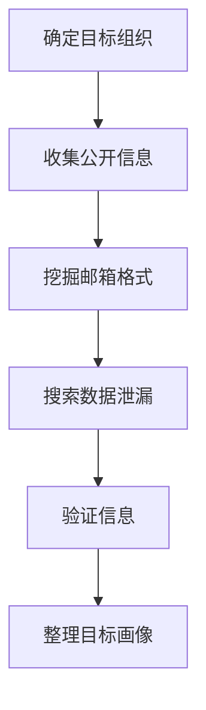

# 收集受害者身份信息 (T1589)

## 一句话通俗理解

> **收集受害者身份信息就像小偷在动手前先打听房主的姓名、电话和日常习惯，方便后续伪装成熟人骗开大门。**

## 难度等级

⭐⭐ 中级 - 需要一定的社会工程学技巧和信息检索能力

## 技术描述

**通俗解释：**
想象你要骗一个人开门，首先得知道他叫什么、在哪上班、平时几点回家。攻击者在发动网络攻击前，也需要先摸清目标组织里有哪些人、他们的邮箱是什么、职位是什么，这样才能设计出更有针对性的骗局。

**技术原理：**
收集受害者身份信息（T1589）是指攻击者主动收集目标组织内个人的身份详细信息，为后续的社会工程学攻击和凭证攻击做准备。这些信息包括：

- **凭证**：用户名、密码、密码哈希值等
- **电子邮件地址**：员工的工作邮箱和个人邮箱
- **员工姓名**：姓名、职位、部门、工作经历等

攻击者可以通过以下渠道获取这些信息：

1. **公开来源**：社交媒体（LinkedIn、微博）、公司官网、招聘网站、GitHub代码仓库
2. **数据泄漏**：暗网市场、数据泄露数据库、Paste类网站
3. **主动探测**：枚举邮箱服务的用户名、探测身份验证接口

**用途与影响：**
收集到的身份信息主要用于：

- 制作高度定制化的鱼叉式钓鱼邮件
- 猜测或暴力破解凭证
- 冒充目标员工进行社会工程学攻击
- 利用被盗凭证进行横向移动

## 子技术列表

**该技术共有 3 个子技术：**

| 子技术ID | 中文名称 | 通俗解释 |
|----------|---------|---------|
| T1589.001 | 凭证收集 | 收集用户名、密码等登录凭据，比如从暗网买泄露的密码库 |
| T1589.002 | 电子邮件地址收集 | 收集员工的邮箱地址，用于后续发钓鱼邮件 |
| T1589.003 | 员工姓名收集 | 收集员工姓名、职位、部门等信息，用于伪装成熟人 |

## 各子技术详细说明

### T1589.001 - 凭证收集

**通俗理解：** 收集目标的用户名和密码，就像拿到别人家的钥匙

**详细说明：**
攻击者通过数据泄露数据库（如Have I Been Pwned）、暗网市场、密码窃取木马（如VIDAR、REDLINE）等渠道获取目标组织员工的凭证信息。

### T1589.002 - 电子邮件地址收集

**通俗理解：** 找到目标员工的工作邮箱，就像拿到别人的门牌号

**详细说明：**
攻击者通过LinkedIn、公司官网、Hunter.io、theHarvester等工具收集员工的邮箱地址，确定公司邮箱命名规则。

### T1589.003 - 员工姓名收集

**通俗理解：** 了解目标公司谁是谁，就像摸清一个小区里哪家住谁

**详细说明：**
攻击者从LinkedIn、公司"关于我们"页面、招聘广告、新闻报道中收集员工姓名、职位、部门等信息。

## 攻击流程

### 典型攻击流程

```
确定目标组织 --> 收集公开信息 --> 挖掘邮箱格式 --> 搜索数据泄漏 --> 验证信息 --> 整理目标画像
```



**步骤详解：**

1. **确定目标组织**
   - 通俗描述：选择要攻击的公司或机构
   - 技术细节：根据攻击目的确定目标的范围和规模
   - 常用工具：无

2. **收集公开信息**
   - 通俗描述：浏览公司官网、LinkedIn页面、招聘广告，获取员工姓名和职位
   - 技术细节：使用theHarvester、LinkedIn Sales Navigator等工具批量收集
   - 常用工具：theHarvester、LinkedIn

3. **挖掘邮箱格式**
   - 通俗描述：确定公司邮箱的命名规则
   - 技术细节：如 `firstname.lastname@company.com` 或 `f.lastname@company.com`
   - 常用工具：Hunter.io

4. **搜索数据泄漏**
   - 通俗描述：在暗网市场或数据泄露数据库中搜索目标域名的已泄露凭证
   - 技术细节：使用Dehashed、Snusbase等平台搜索历史泄露数据
   - 常用工具：Dehashed、Have I Been Pwned

5. **验证信息**
   - 通俗描述：通过邮箱验证服务或社交工程确认收集到的信息是否有效
   - 技术细节：使用SMTP验证或第三方邮箱检查服务
   - 常用工具：Hunter.io验证、Phonebook.cz

6. **整理目标画像**
   - 通俗描述：将收集到的信息整理成结构化的目标档案
   - 技术细节：建立包含姓名、邮箱、职位、社交关系等信息的表格
   - 常用工具：Excel、Obsidian、Maltego

## 真实案例

### 案例1：LAPSUS$通过社交媒体收集员工信息进行社会工程学攻击

- **时间**: 2021-2022年
- **目标**: 多家全球科技和电信公司（Okta、NVIDIA、Samsung等）
- **攻击组织**: LAPSUS$
- **手法**: LAPSUS$黑客组织广泛使用LinkedIn和Twitter收集目标组织员工的姓名、职位、邮箱和组织结构信息，然后冒充IT支持或高管，诱使员工泄露凭证或批准异常访问请求
- **影响**: 多家科技公司内部系统被入侵，源代码和客户数据泄露
- **参考链接**: [Mandiant: LAPSUS$ Analysis](https://www.mandiant.com/resources/blog/lapsus-actor-takedown)

### 案例2：Snowflake云存储凭证泄露事件

- **时间**: 2024年
- **目标**: Ticketmaster（Live Nation）、Santander Bank、AT&T等
- **攻击组织**: UNC5537
- **手法**: 攻击者UNC5537利用此前通过信息窃取木马（VIDAR、REDLINE等）收集的凭证，访问了未启用多因素认证的Snowflake账户。这些凭证是通过长期的凭证收集活动获得的，部分凭证甚至在数年前就已被窃取
- **影响**: 全球数百家企业的云存储数据被泄露
- **参考链接**: [Snowflake安全事件通报](https://www.snowflake.com/blog/security-actions-protect-customers/)

### 案例3：APT29通过GitHub泄漏收集凭证和身份信息

- **时间**: 2020年至今
- **目标**: 多个科技公司和政府机构
- **攻击组织**: APT29（Cozy Bear）
- **手法**: APT29搜索公开的代码仓库，寻找嵌入在源代码中的API密钥、数据库连接字符串和内部凭证，然后利用这些信息进行针对性的鱼叉式钓鱼攻击
- **影响**: 多个政府机构的数据被窃取
- **参考链接**: [CISA: APT29 Joint Advisory](https://www.cisa.gov/news-events/cybersecurity-advisories/aa21-008a)

### 案例4：2025年AI增强的凭证收集攻击

- **时间**: 2025年
- **目标**: 全球各行业组织
- **攻击组织**: 多个AI增强的APT组织
- **手法**: 根据CrowdStrike 2026全球威胁报告，AI增强的敌对活动增长了89%。攻击者使用LLM自动化分析社交媒体数据，快速识别目标组织中的高价值人员（如IT管理员、财务高管），并自动生成针对性极强的鱼叉式钓鱼内容。AI辅助的凭证收集使攻击效率大幅提升
- **影响**: 攻击成功率显著提高，从侦察到凭证获取的时间从数天缩短到数小时
- **参考链接**: [CrowdStrike 2026 Global Threat Report](https://www.crowdstrike.com/global-threat-report/)

## 红队视角

> ⚠️ **免责声明**：以下内容仅用于合法的安全测试、渗透测试和教育目的。未经授权对他人系统进行测试是违法行为。

### 实战技巧

1. **LinkedIn是金矿**：通过LinkedIn Sales Navigator可以高效搜索目标公司的员工，按职位、部门、地区筛选
2. **Hunter.io查邮箱**：输入目标域名即可获取该公司的邮箱格式和部分邮箱地址
3. **GitHub搜索语法**：使用 `org:company_name password` 或 `company_name API_KEY` 等语法搜索泄露的凭证
4. **Have I Been Pwned**：查询目标域名的邮箱是否出现在已知的数据泄露中
5. **Phonebook.cz**：一个免费的邮箱地址搜索引擎，可以按域名批量查找

### 常用工具

| 工具名称                 | 用途                                   | 平台   | 链接                                               |
| ------------------------ | -------------------------------------- | ------ | -------------------------------------------------- |
| theHarvester             | 从多个公开来源收集邮箱、子域名和IP地址 | Linux  | [GitHub](https://github.com/laramies/theHarvester) |
| Hunter.io                | 企业邮箱发现和验证平台                 | Web    | [Hunter.io](https://hunter.io/)                    |
| LinkedIn Sales Navigator | 高级人员搜索工具                       | Web    | [LinkedIn](https://www.linkedin.com/sales)         |
| Dehashed                 | 数据泄露数据库搜索引擎                 | Web    | [Dehashed](https://dehashed.com/)                  |
| Git-secrets              | 防止敏感信息提交到Git仓库              | 全平台 | [GitHub](https://github.com/awslabs/git-secrets)   |

### 注意事项

- 不要对目标系统进行主动探测，保持被动侦察以避免被发现
- 收集到的凭证不要直接使用，先验证其有效性
- 注意操作安全（OPSEC），使用匿名账号和VPN进行信息收集

## 蓝队视角

### 检测要点

1. **监控GitHub等代码仓库**：使用工具自动扫描公司代码仓库中意外提交的凭证
2. **监控暗网和数据泄漏**：订阅数据泄露监控服务，及时发现员工凭证被泄露
3. **邮箱服务日志**：监控邮箱服务的枚举攻击（大量用户名验证尝试）
4. **社交媒体监控**：关注员工在社交媒体上分享的敏感工作信息

### 监控建议

- 部署凭证泄漏监控服务（如Have I Been Pwned的企业版）
- 定期审计公开代码仓库中的敏感信息
- 监控邮箱服务的异常认证请求模式

## 检测建议

### 网络层检测

**检测方法：** 监控邮箱服务枚举攻击的特征流量

**具体规则/命令示例：**

```bash
# 监控SMTP VRFY/RCPT TO枚举尝试
tcpdump -i eth0 port 25 | grep -E "VRFY|RCPT"
```

### 主机层检测

**检测方法：** 监控凭证访问工具的异常行为

**Windows事件ID：**

- 事件ID 4625：大量登录失败可能表明凭证枚举
- 事件ID 4771：Kerberos预认证失败

**Linux日志：**

- 日志文件：`/var/log/auth.log`
- 关键字段：`Failed password for invalid user`

**具体命令示例：**

```bash
# 检测大量登录失败
journalctl -u sshd | grep "Failed password" | wc -l
```

### 应用层检测

**Sigma规则示例：**

```yaml
title: Password Spray Attempt
status: experimental
description: Detects potential password spraying attack from a single source
logsource:
  category: authentication
  product: windows
detection:
  selection:
    EventID: 4625
    Count: 10
  timeframe: 5m
  condition: selection
level: high
tags:
  - attack.t1589
```

## 缓解措施

### 优先级1：关键措施

**措施名称：** 强化身份验证

**具体实施步骤：**

1. 在所有关键系统中实施多因素认证（MFA）
2. 优先使用防钓鱼的MFA方案（如FIDO2安全密钥）
3. 实施基于风险的自适应认证

**配置示例：**

```powershell
# 在Azure AD中启用条件访问策略
# 要求所有管理员使用MFA
New-AzureADMSConditionalAccessPolicy -Name "Require MFA for Admins"
```

### 优先级2：重要措施

**措施名称：** 最小化信息暴露

**具体实施步骤：**

1. 审查公司在公开来源中共享的员工信息量
2. 避免公开详细的组织架构图和员工邮箱格式
3. 使用邮箱隐私服务隐藏域名注册信息

### 优先级3：建议措施

**措施名称：** 代码安全扫描与员工培训

**具体实施步骤：**

1. 定期扫描代码仓库中的意外凭证泄露
2. 使用pre-commit钩子防止敏感信息被提交
3. 教育员工关于社交媒体信息分享的风险

### MITRE ATT&CK 缓解措施映射

| 缓解措施ID | 缓解措施名称 | 适用性 | 说明                                |
| ---------- | ------------ | ------ | ----------------------------------- |
| M1032      | 多因素认证   | 适用   | MFA可有效防止凭证泄露后的未授权访问 |
| M1017      | 用户培训     | 适用   | 培训员工识别钓鱼攻击和信息泄露风险  |
| M1026      | 特权账户管理 | 适用   | 限制特权账户的数量和使用范围        |
| M1018      | 用户账户管理 | 适用   | 定期审计账户权限                    |

## 动手实验

> ⚠️ **重要提示**：所有实验必须在隔离的实验室环境中进行，禁止对未授权的真实系统进行测试。

### 实验环境准备

**推荐靶场/实验平台：**

| 平台名称        | 类型     | 难度 | 链接                                 |
| --------------- | -------- | ---- | ------------------------------------ |
| TryHackMe OSINT | 虚拟靶场 | 初级 | [TryHackMe](https://tryhackme.com)   |
| HackTheBox      | CTF      | 中级 | [HackTheBox](https://hackthebox.com) |

**所需工具：**

- theHarvester：开源情报收集工具
- Hunter.io：企业邮箱发现平台

**环境搭建：**

```bash
# 在Kali Linux上安装theHarvester
sudo apt update && sudo apt install theharvester
```

### 实验1：OSINT信息收集练习（初级）

**实验目标：** 使用theHarvester收集公开信息

**实验步骤：**

1. 使用theHarvester搜索一个域名：`theHarvester -d example.com -b linkedin`
2. 分析收集到的邮箱和员工信息
3. 尝试使用不同的数据源（google、bing等）

**预期结果：** 获得目标域名的关联邮箱和员工信息列表

**学习要点：** 理解被动信息收集的基本方法

### 实验2：GitHub敏感信息搜索（中级）

**实验目标：** 练习在GitHub中搜索泄露的敏感信息

**实验步骤：**

1. 使用GitHub搜索语法搜索 `"company_name" password`
2. 分析搜索结果，识别泄露的凭证
3. 练习使用TruffleHog自动化搜索

**预期结果：** 发现至少一个泄露的敏感信息

**学习要点：** 理解代码仓库中信息泄露的风险

## 术语解释

| 术语         | 英文原名                    | 通俗解释                                                      |
| ------------ | --------------------------- | ------------------------------------------------------------- |
| OSINT        | Open Source Intelligence    | 开源情报，从公开来源收集的情报，像从报纸和新闻中收集信息      |
| 鱼叉式钓鱼   | Spear Phishing              | 针对特定个人或组织的定制化钓鱼攻击，比普通钓鱼更精准          |
| 凭证         | Credential                  | 用户名和密码等用于身份验证的信息，像大门的钥匙和门禁卡        |
| 暗网         | Dark Web                    | 需要特殊软件（如Tor浏览器）才能访问的网络部分，常用于非法交易 |
| 信息窃取木马 | InfoStealer                 | 专门用于窃取浏览器保存的密码、Cookie等敏感信息的恶意软件      |
| 社会工程学   | Social Engineering          | 通过心理操纵欺骗人们泄露信息或执行操作的技术                  |
| API密钥      | API Key                     | 应用程序接口的访问凭证，泄露后可能被用于未授权访问            |
| MFA          | Multi-Factor Authentication | 多因素认证，要求两种以上验证方式，像密码+短信验证码           |
| FIDO2        | FIDO2                       | 一种防钓鱼的硬件安全密钥认证标准                              |
| OPSEC        | Operational Security        | 操作安全，保护行动信息不被对手发现                            |

## 参考资料

### 官方文档

- [MITRE ATT&CK - 收集受害者身份信息 (T1589)](https://attack.mitre.org/techniques/T1589/)
- [MITRE ATT&CK - 凭证收集 (T1589.001)](https://attack.mitre.org/techniques/T1589/001)
- [MITRE ATT&CK - 电子邮件地址收集 (T1589.002)](https://attack.mitre.org/techniques/T1589/002)
- [MITRE ATT&CK - 员工姓名收集 (T1589.003)](https://attack.mitre.org/techniques/T1589/003)

### 安全报告

- [Snowflake安全事件通报](https://www.snowflake.com/blog/security-actions-protect-customers/) - 2024年大规模凭证泄露事件
- [Microsoft: Staying Ahead of Threat Actors in the Age of AI](https://www.microsoft.com/en-us/security/blog/2024/02/14/staying-ahead-of-threat-actors-in-the-age-of-ai/)
- [CrowdStrike 2026 Global Threat Report](https://www.crowdstrike.com/global-threat-report/) - AI增强攻击趋势

### 工具与资源

- [theHarvester](https://github.com/laramies/theHarvester) - 开源情报收集工具
- [Hunter.io](https://hunter.io/) - 企业邮箱发现平台

### 学习资料

- [CISA: T1589 信息页](https://www.cisa.gov/eviction-strategies-tool/info-attack/T1589)
- [Startup Defense: T1589 Analysis](https://www.startupdefense.io/mitre-attack-techniques/t1589-gather-victim-identity-information/)
