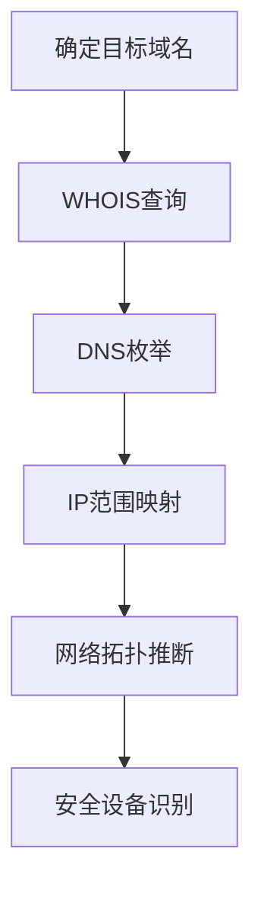

# 收集受害者网络信息 (T1590)

## 一句话通俗理解

> **收集受害者网络信息就像绘制一张目标的"地图"，了解有哪些路（网络）、哪些门（端口）和哪些锁（安全设备）。**

## 难度等级

⭐⭐ 中级 - 需要基础的网络知识和信息检索能力

## 技术描述

**通俗解释：**
你要闯入一栋大楼，首先得知道大楼在哪、有几层、有几个入口、装了什么监控系统。攻击者在入侵目标网络前，也需要先搞清楚目标的网络结构：有哪些域名、IP地址是多少、DNS怎么配置的、用了哪些安全设备等。这些信息能帮助攻击者找到最薄弱的突破口。

**技术原理：**
收集受害者网络信息（T1590）是指攻击者收集目标组织网络基础设施的详细信息，为后续攻击行动提供环境情报。这些信息包括：

- **域名属性**：域名注册信息、到期时间、注册商等
- **DNS记录**：A记录、MX记录、TXT记录、CNAME记录等
- **网络信任依赖**：组织与其他实体之间的信任关系
- **网络拓扑**：网络结构、子网划分、VLAN配置等
- **IP地址**：公网IP范围、内网IP段、CDN节点等
- **网络安全设备**：防火墙、IDS/IPS、WAF等设备的类型和配置

攻击者可以通过被动手段（查询WHOIS、DNS记录）或主动手段（端口扫描、网络探测）获取这些信息。

**用途与影响：**
收集到的网络信息主要用于：
- 识别潜在的攻击入口点
- 规划横向移动路径
- 绕过安全控制
- 识别可利用的信任关系

## 子技术列表

**该技术共有 6 个子技术：**

| 子技术ID | 中文名称 | 通俗解释 |
|----------|---------|---------|
| T1590.001 | 域名属性 | 查询目标域名的注册信息，如注册人、注册时间、到期时间 |
| T1590.002 | DNS | 查询目标的DNS记录，了解邮件服务器、子域名等配置 |
| T1590.003 | 网络信任依赖 | 了解目标与哪些合作伙伴有网络信任关系，可能通过合作伙伴入侵 |
| T1590.004 | 网络拓扑 | 映射目标的网络结构，了解子网划分和关键系统位置 |
| T1590.005 | IP地址 | 收集目标的公网和内网IP地址范围 |
| T1590.006 | 网络安全设备 | 识别目标使用的防火墙、IDS/IPS、WAF等安全设备 |

<details>
<summary><strong>展开查看各子技术详细说明</strong></summary>

各子技术详细说明请参阅独立文档：

- [T1590.001 - 域名属性](./T1590/T1590.001-Domain-Properties.md) — 查目标域名的"户口本"，看是谁注册的、什么时候到期的
- [T1590.002 - DNS协议](./T1590/T1590.002-DNS.md) — 查目标的"电话本"，看各个子域名对应什么IP
- [T1590.003 - 网络信任依赖](./T1590/T1590.003-Network-Trust-Dependencies.md) — 了解目标跟哪些公司有"内部通道"
- [T1590.004 - 网络拓扑](./T1590/T1590.004-Network-Topology.md) — 画目标公司的"建筑平面图"
- [T1590.005 - IP地址](./T1590/T1590.005-IP-Addresses.md) — 摸清目标公司有哪些"门牌号"
- [T1590.006 - 网络安全设备](./T1590/T1590.006-Network-Security-Appliances.md) — 了解目标公司装了哪些"防盗门"

</details>

## 攻击流程

### 典型攻击流程

```
确定目标域名 --> WHOIS查询 --> DNS枚举 --> IP范围映射 --> 网络拓扑推断 --> 安全设备识别
```



**步骤详解：**

1. **确定目标域名**
   - 通俗描述：确定要侦察的目标组织的主域名
   - 技术细节：确认目标的标志性域名和关联域名
   - 常用工具：无

2. **WHOIS查询**
   - 通俗描述：查询域名注册信息，获取注册人、DNS服务器等详情
   - 技术细节：使用whois命令或在线服务查询
   - 常用工具：whois、ICANN Lookup

3. **DNS枚举**
   - 通俗描述：查询各种DNS记录，发现子域名和关联服务
   - 技术细节：使用DNSRecon、Amass等工具进行DNS枚举
   - 常用工具：DNSRecon、Amass、DNS Dumpster

4. **IP范围映射**
   - 通俗描述：确定目标的IP地址范围
   - 技术细节：通过BGP数据和ARIN/RIPE等注册机构确定
   - 常用工具：BGP.he.net、ipinfo.io

5. **网络拓扑推断**
   - 通俗描述：通过traceroute推断网络结构
   - 技术细节：分析路由路径和TTL值推断拓扑
   - 常用工具：traceroute、MTR

6. **安全设备识别**
   - 通俗描述：通过探测响应特征识别安全设备
   - 技术细节：分析HTTP响应头、错误页面等特征
   - 常用工具：Wappalyzer、WhatWeb

## 真实案例

### 案例1：HAFNIUM针对Microsoft Exchange服务器的域名情报收集

- **时间**: 2020-2021年
- **目标**: 全球多个组织的Microsoft Exchange服务器
- **攻击组织**: HAFNIUM（Silk Typhoon）
- **手法**: HAFNIUM在利用Exchange零日漏洞之前，通过被动手段收集了目标组织的完全限定域名（FQDNs），使用公开DNS服务和WHOIS查询映射目标的Exchange基础设施，识别内部服务器名称和外部访问点
- **影响**: 全球数万个Exchange服务器被入侵
- **参考链接**: [Volexity: Microsoft Exchange Zero-Day](https://www.volexity.com/blog/2021/03/02/active-exploitation-of-microsoft-exchange-zero-day-vulnerabilities/)

### 案例2：Volt Typhoon对美国关键基础设施的网络拓扑侦察

- **时间**: 2023-2025年
- **目标**: 美国关键基础设施（通信、能源、水务系统）
- **攻击组织**: Volt Typhoon
- **手法**: Volt Typhoon进行了广泛的前期网络侦察，使用主动扫描技术映射网络拓扑，识别关键系统之间的连接关系、网络分段边界以及潜在的横向移动路径。该组织还利用被入侵的SOHO路由器作为跳板，隐藏真实的攻击来源
- **影响**: 持续数年对美国关键基础设施的渗透
- **参考链接**: [CISA: Volt Typhoon Advisory](https://www.cisa.gov/news-events/cybersecurity-advisories/aa24-038a)

### 案例3：Salt Typhoon电信网络侦察

- **时间**: 2024年
- **目标**: 美国主要电信运营商（AT&T、Verizon、T-Mobile等）
- **攻击组织**: Salt Typhoon
- **手法**: Salt Typhoon在入侵电信网络前，进行了深入的网络拓扑侦察，识别了路由器、防火墙和VPN设备的位置和配置，利用这些信息规划了对核心网络基础设施的入侵路径。攻击者特别关注网络边缘设备和DNS配置
- **影响**: 至少9家美国电信运营商的通话记录被窃取
- **参考链接**: [CISA: Salt Typhoon Advisory](https://www.cisa.gov/news-events/cybersecurity-advisories/aa24-038a)

### 案例4：2025年AI增强的自动化网络侦察

- **时间**: 2025-2026年
- **目标**: 全球各行业组织
- **攻击组织**: 多个AI增强的APT组织
- **手法**: 根据Mandiant M-Trends 2026报告，攻击者开始使用AI代理自动化网络侦察流程。AI驱动的工具能够自动完成WHOIS查询、DNS枚举、证书透明度分析等任务，并将结果整合成结构化的网络画像。CrowdStrike 2026报告指出AI增强的攻击活动增长了89%
- **影响**: 网络侦察的速度和规模大幅提升，从原来数天的工作缩短到数小时
- **参考链接**: [Mandiant M-Trends 2026](https://services.google.com/fh/files/misc/m-trends-2026-executive-edition-en.pdf)

## 红队视角

> ⚠️ **免责声明**：以下内容仅用于合法的安全测试、渗透测试和教育目的。未经授权对他人系统进行测试是违法行为。

### 实战技巧

1. **DNS Dumpster**：免费的DNS侦察工具，可以可视化展示目标的DNS关系图
2. **SecurityTrails**：提供历史DNS数据和子域名枚举
3. **Shodan/Censys**：搜索暴露在互联网上的网络设备和服务
4. **BGP.he.net**：查看目标的BGP路由和IP地址分配
5. **Traceroute分析**：通过traceroute推断网络路径和中间设备

### 常用工具

| 工具名称 | 用途 | 平台 | 链接 |
|----------|------|------|------|
| DNSRecon | DNS侦察和区域传送测试 | Linux | [GitHub](https://github.com/darkoperator/dnsrecon) |
| Amass | OWASP子域名枚举工具 | Linux | [GitHub](https://github.com/owasp-amass/amass) |
| Masscan | 高速端口扫描器 | Linux | [GitHub](https://github.com/robertdavidgraham/masscan) |
| Nmap | 网络发现和安全审计 | 全平台 | [Nmap](https://nmap.org/) |
| Recon-ng | 模块化网络侦察框架 | Linux | [GitHub](https://github.com/lanmaster53/recon-ng) |

### 注意事项

- DNS查询通常是被动的，不会触发安全告警
- 但主动扫描（如端口扫描）可能会被IDS/IPS检测到
- 使用多个DNS服务器分散查询，避免被识别为侦察行为

## 蓝队视角

### 检测要点

1. **DNS查询监控**：监控异常的DNS查询模式，如大量针对不存在域名的查询
2. **区域传送检测**：检测未经授权的DNS区域传送（AXFR）请求
3. **WHOIS查询监控**：监控对组织域名的频繁WHOIS查询
4. **网络扫描检测**：部署IDS/IPS检测端口扫描和网络探测行为

### 监控建议

- 配置DNS服务器记录所有查询日志
- 限制DNS区域传送仅允许授权服务器
- 使用被动DNS服务监控域名的DNS变化

## 检测建议

### 网络层检测

**检测方法：** 监控异常的DNS查询和区域传送请求

**具体规则/命令示例：**
```bash
# 捕获DNS流量进行分析
tcpdump -i eth0 port 53 -X | grep -E "AXFR|IXFR"
```

### 主机层检测

**检测方法：** 监控WHOIS和DNS查询工具的异常使用

**Windows事件ID：**
- 事件ID 5156：监控网络连接行为
- 事件ID 5157：监控被阻止的连接

**Linux日志：**
- 日志文件：`/var/log/syslog`
- 关键字段：dnsmasq、named相关的查询日志

**具体命令示例：**
```bash
# 分析DNS查询日志
cat /var/log/named.log | grep -E "query|update"
```

### 应用层检测

**Sigma规则示例：**
```yaml
title: DNS AXFR Transfer Request
status: experimental
description: Detects unauthorized DNS zone transfer requests
logsource:
    category: dns
    product: windows
detection:
    selection:
        Opcode: "AXFR"
        ClientIP|notin:
            - '10.0.0.0/8'
            - '172.16.0.0/12'
            - '192.168.0.0/16'
    condition: selection
level: high
tags:
    - attack.t1590
```

## 缓解措施

### 优先级1：关键措施

**措施名称：** DNS安全加固

**具体实施步骤：**
1. 实施DNSSEC防止DNS欺骗和缓存投毒
2. 限制区域传送（AXFR）仅限授权的名称服务器
3. 配置DNS服务器隐藏版本信息

**配置示例：**
```bash
# BIND DNS server - 限制区域传送
options {
    allow-transfer { 10.0.0.2; };
    version "none";
};
```

### 优先级2：重要措施

**措施名称：** 网络分段和最小化暴露

**具体实施步骤：**
1. 实施严格的网络分段，隔离关键资产
2. 使用防火墙和ACL限制网络段之间的流量
3. 定期审查和最小化面向公众的服务暴露面

### 优先级3：建议措施

**措施名称：** 威胁情报集成

**具体实施步骤：**
1. 利用威胁情报服务获取已知恶意基础设施信息
2. 将威胁情报集成到防火墙和IDS/IPS中
3. 动态更新阻止列表

### MITRE ATT&CK 缓解措施映射

| 缓解措施ID | 缓解措施名称 | 适用性 | 说明 |
|------------|-------------|--------|------|
| M1031 | 网络入侵检测 | 适用 | IDS/IPS检测扫描和探测行为 |
| M1030 | 网络分段 | 适用 | 限制网络拓扑信息的暴露 |
| M1018 | 用户账户管理 | 部分适用 | 限制DNS管理权限 |
| M1021 | 限制Web内容 | 不适用 | - |

## 动手实验

> ⚠️ **重要提示**：所有实验必须在隔离的实验室环境中进行，禁止对未授权的真实系统进行测试。

### 实验环境准备

**推荐靶场/实验平台：**

| 平台名称 | 类型 | 难度 | 链接 |
|----------|------|------|------|
| TryHackMe - DNS | 虚拟靶场 | 初级 | [TryHackMe](https://tryhackme.com) |
| HackTheBox | CTF | 中级 | [HackTheBox](https://hackthebox.com) |

**所需工具：**
- DNSRecon：DNS侦察工具
- whois：域名查询工具

**环境搭建：**
```bash
# 在Kali Linux上安装DNSRecon
sudo apt update && sudo apt install dnsrecon
```

### 实验1：DNS侦察练习（初级）

**实验目标：** 对目标域名进行DNS枚举

**实验步骤：**
1. 使用DNSRecon枚举DNS记录：`dnsrecon -d example.com -t std`
2. 使用nslookup查询不同类型记录
3. 使用DNS Dumpster生成DNS关系图

**预期结果：** 获得目标域名的完整DNS记录信息

**学习要点：** 理解DNS记录的类型和用途

### 实验2：WHOIS信息收集（初级）

**实验目标：** 查询目标域名的注册信息

**实验步骤：**
1. 使用whois命令查询域名：`whois example.com`
2. 分析WHOIS信息中的敏感数据
3. 对比不同域名的隐私保护情况

**预期结果：** 获得域名注册人、注册商、到期时间等信息

**学习要点：** 理解WHOIS信息的组成和隐私保护的影响

## 术语解释

| 术语 | 英文原名 | 通俗解释 |
|------|----------|----------|
| DNS | Domain Name System | 域名系统，将域名转换为IP地址的系统，像电话本把人名转成电话号码 |
| WHOIS | WHOIS | 查询域名注册信息的协议和数据库，像查房产证 |
| IP地址 | IP Address | 互联网协议地址，网络中设备的唯一标识，像门牌号 |
| 子网 | Subnet | 将大网络划分为小网络的逻辑分段，像把一个小区分成几个单元 |
| VLAN | Virtual LAN | 虚拟局域网，在物理网络上创建的逻辑隔离网络 |
| DNSSEC | DNS Security Extensions | DNS安全扩展，通过数字签名验证DNS响应的真实性 |
| AXFR | DNS Zone Transfer | DNS区域传送协议，在DNS服务器之间同步区域数据 |
| BGP | Border Gateway Protocol | 边界网关协议，互联网路由的核心协议 |
| ACL | Access Control List | 访问控制列表，网络设备上控制流量的规则集 |
| IDS/IPS | Intrusion Detection/Prevention System | 入侵检测/防御系统，像小区的监控摄像头和门禁 |

## 参考资料

### 官方文档

- [MITRE ATT&CK - 收集受害者网络信息 (T1590)](https://attack.mitre.org/techniques/T1590/)
- [MITRE ATT&CK - 域名属性 (T1590.001)](https://attack.mitre.org/techniques/T1590/001)
- [MITRE ATT&CK - DNS (T1590.002)](https://attack.mitre.org/techniques/T1590/002)
- [MITRE ATT&CK - 网络信任依赖 (T1590.003)](https://attack.mitre.org/techniques/T1590/003)
- [MITRE ATT&CK - 网络拓扑 (T1590.004)](https://attack.mitre.org/techniques/T1590/004)
- [MITRE ATT&CK - IP地址 (T1590.005)](https://attack.mitre.org/techniques/T1590/005)
- [MITRE ATT&CK - 网络安全设备 (T1590.006)](https://attack.mitre.org/techniques/T1590/006)

### 安全报告

- [CISA: Volt Typhoon Advisory](https://www.cisa.gov/news-events/cybersecurity-advisories/aa24-038a) - 关键基础设施侦察威胁
- [Volexity: Exchange Zero-Day](https://www.volexity.com/blog/2021/03/02/active-exploitation-of-microsoft-exchange-zero-day-vulnerabilities/) - HAFNIUM侦察案例
- [Mandiant M-Trends 2026](https://services.google.com/fh/files/misc/m-trends-2026-executive-edition-en.pdf) - AI增强的网络侦察趋势

### 工具与资源

- [DNSRecon](https://github.com/darkoperator/dnsrecon) - DNS侦察工具
- [Amass](https://github.com/owasp-amass/amass) - 子域名枚举工具
- [Shodan](https://www.shodan.io/) - 互联网设备搜索引擎

### 学习资料

- [CISA: T1590 信息页](https://www.cisa.gov/eviction-strategies-tool/info-attack/T1590)
- [Startup Defense: T1590 Analysis](https://www.startupdefense.io/mitre-attack-techniques/t1590-gather-victim-network-information/)
