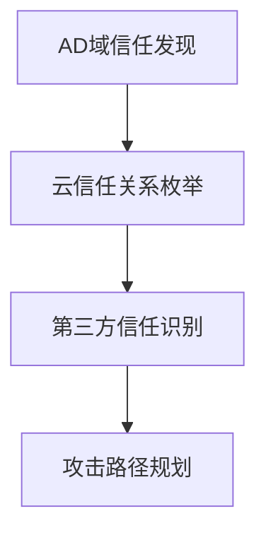

# 网络信任依赖 (T1590.003)

## 一句话通俗理解

> **网络信任依赖就像小偷在踩点时研究目标公司跟哪些人有"暗号"——知道谁跟谁互相信任，就能利用这个信任关系混进去。**

## 难度等级

⭐⭐⭐ 高级 - 需要深入理解网络信任模型、AD域信任和云IAM知识

## 技术描述

网络信任依赖是攻击者收集目标网络信任关系信息的技术。

**通俗解释：**
公司的网络不是孤立的，不同的系统之间、不同的公司之间会有"信任关系"——比如你在公司电脑上登录一次，就能访问公司的所有系统，这就是信任在背后起了作用。攻击者如果搞清楚了这些信任链条，就能找到"借道而入"的机会。

**技术原理：**
攻击者通过识别目标组织网络中的信任链，了解不同网络域、云环境、合作伙伴系统和第三方集成之间的认证和访问信任关系。网络信任信息帮助攻击者规划从初始访问点到高价值目标的攻击路径。

网络信任依赖的信息来源包括：
1. **AD域信任**：Active Directory域和林信任关系，如从测试域到生产域的单向信任
2. **DNS区域传输**：外部DNS委托、子域名和邮件交换器配置
3. **SSL/TLS证书日志**：证书透明度日志识别不同域名的关联证书
4. **LDAP查询**：域信任关系的枚举
5. **云平台配置**：跨账户角色信任、OAuth应用权限、服务主体信任
6. **合作伙伴连接**：B2B/VPN连接信息、泄露的VPN配置、IPsec隧道信息

**用途与影响：**
- 规划从低安全域穿越到高安全域的攻击路径
- 识别可被滥用的跨组织信任关系
- 通过受信任的第三方访问原本无法直接访问的资源
- 利用OAuth应用权限进行横向移动

## 子技术列表

该子技术没有进一步分解的子技术。

## 攻击流程

### 典型攻击流程

```
AD域信任发现 --> 云信任关系枚举 --> 第三方信任识别 --> 攻击路径规划
```



**步骤详解：**

1. **AD域信任发现**
   - 通俗描述：使用系统命令查看当前域与其他域的信任关系
   - 技术细节：使用 `nltest /domain_trusts` 和 `Get-ADTrust` PowerShell命令枚举AD域和林信任
   - 常用工具：nltest、PowerShell ActiveDirectory模块

2. **云信任关系枚举**
   - 通俗描述：查看云平台中的跨账户角色信任策略
   - 技术细节：分析AWS IAM角色信任策略文档、Azure AD中的OAuth应用权限
   - 常用工具：AWS CLI、Azure CLI、PowerShell

3. **第三方信任识别**
   - 通俗描述：识别组织使用的第三方集成和API连接
   - 技术细节：通过公开API文档、泄露的开发者密钥了解不同服务之间的信任关系
   - 常用工具：Postman、浏览器开发者工具

4. **攻击路径规划**
   - 通俗描述：分析找到的信任关系，规划最易突破的路径
   - 技术细节：绘制信任关系图，识别最短攻击路径
   - 常用工具：BloodHound（AD攻击路径分析）

## 真实案例

### 案例1：APT29 - AD域信任关系发现

- **时间**: 2020-2021年
- **目标**: 美国政府机构、IT公司
- **攻击组织**: APT29（Nobelium）
- **手法**: APT29在SolarWinds供应链攻击中获得了对目标组织本地AD环境的访问权限。他们使用`nltest /domain_trusts`和PowerShell的`Get-ADTrust`枚举AD域和林信任关系。通过发现有问题的AD信任——如从测试域到生产域的单向信任，或从传统AD到Azure AD Connect的同步信任——APT29规划了从低安全域穿越到高安全域的攻击路径。他们还利用Azure AD Connect的Pass-through Authentication代理跨到云资源
- **影响**: 长达数月的持续入侵，多个政府机构数据泄露
- **参考链接**: [MITRE ATT&CK - APT29](https://attack.mitre.org/groups/G0143/)

### 案例2：Gold Selenium - 云信任关系利用

- **时间**: 2022年
- **目标**: 东南亚金融机构
- **攻击组织**: Gold Selenium
- **手法**: Gold Selenium组织在入侵目标的本地网络后，枚举AWS IAM角色信任策略，发现了一个允许从本地AD联邦身份到AWS管理角色的SAML 2.0信任关系。通过利用本地AD域管理员权限，他们伪造SAML断言（Golden SAML攻击）以跨信任链访问云环境。攻击者通过分析IAM信任策略文档，识别了被信任的外部账户列表和条件约束
- **影响**: 云环境数据泄露和资源被控制
- **参考链接**: [MITRE ATT&CK - Gold Selenium](https://attack.mitre.org/groups/G0122/)

### 案例3：PAWN STORM - 第三方信任滥用

- **时间**: 2023年
- **目标**: 全球SaaS提供商和其客户
- **攻击组织**: PAWN STORM
- **手法**: PAWN STORM组织针对第三方集成信任发起攻击。他们首先识别目标SaaS提供商使用的OAuth应用权限，通过公共API文档和泄露的开发者密钥了解不同服务之间的信任关系。攻击者利用合法的OAuth授权流程在第三方应用和目标客户的云平台之间建立信任隧道，通过受信任的第三方访问原本无法直接访问的客户资源
- **影响**: 多个SaaS客户的数据泄露
- **参考链接**: [MITRE ATT&CK - PAWN STORM](https://attack.mitre.org/groups/G1016/)

### 案例4：2024-2025年Salt Typhoon电信网络信任链利用

- **时间**: 2024-2025年
- **目标**: 美国主要电信运营商（AT&T、Verizon、T-Mobile等）
- **攻击组织**: Salt Typhoon
- **手法**: Salt Typhoon在入侵电信网络过程中，深入分析了电信运营商的内部网络信任关系，包括不同网络域之间的路由信任、合作伙伴之间的BGP peering信任、以及运维系统的SSH密钥信任。攻击者利用这些信任关系从边缘设备逐步渗透到核心网络，利用了运维信任链中最薄弱的环节
- **影响**: 至少9家美国电信运营商被入侵，通话记录和元数据被窃取
- **参考链接**: [CISA: Salt Typhoon Advisory](https://www.cisa.gov/news-events/cybersecurity-advisories/aa24-038a)

## 红队视角

> ⚠️ **免责声明**：以下内容仅用于合法的安全测试、渗透测试和教育目的。未经授权对他人系统进行测试是违法行为。

### 实战技巧

1. **AD信任枚举**：使用 BloodHound 分析 AD 信任关系，可视化攻击路径
2. **云信任审计**：使用 ScoutSuite 或 Pacu 等工具审计云平台信任配置
3. **OAuth权限审查**：检查企业应用授予的 OAuth 权限范围
4. **证书透明度分析**：通过 crt.sh 分析SSL证书关联的信任域
5. **第三方集成清单**：从企业应用商店或API文档中收集第三方集成信息

### 常用工具

| 工具名称 | 用途 | 平台 | 链接 |
|----------|------|------|------|
| BloodHound | AD攻击路径分析和信任关系可视化 | Windows/Linux | [GitHub](https://github.com/BloodHoundAD/BloodHound) |
| nltest | Windows域信任关系枚举工具 | Windows | 系统内置 |
| PingCastle | AD安全审计和信任关系分析 | Windows | [GitHub](https://github.com/vletoux/pingcastle) |
| ScoutSuite | 多云平台安全审计工具 | Linux | [GitHub](https://github.com/nccgroup/ScoutSuite) |
| Pacu | AWS利用框架，包含IAM信任枚举 | Linux | [GitHub](https://github.com/RhinoSecurityLabs/pacu) |

### 注意事项

- 信任关系枚举通常在获得初始访问后进行，属于后渗透阶段的侦察
- AD信任枚举操作可能触发EDR告警
- 云信任枚举通常使用云API，操作相对隐蔽
- 必须获得授权后才能进行信任关系分析

## 蓝队视角

### 检测要点

1. **信任枚举命令监控**：监控 `nltest /domain_trusts`、`Get-ADTrust` 等信任枚举命令的执行
2. **云信任策略访问**：审计AWS IAM `GetRole`、`ListRoles` 等API操作
3. **OAuth权限授予**：审计Azure AD中异常的OAuth应用权限授予
4. **LDAP查询监控**：检测对AD信任属性的批量LDAP查询

### 监控建议

- 监控 `nltest /domain_trusts`、`Get-ADTrust` 等信任枚举命令的执行
- 审计 Azure AD 中的 OAuth 应用权限授予以发现异常的跨组织信任关系
- 监控 AWS IAM 角色信任策略文档的访问操作（`GetRole`、`ListRoles`）
- 对 DNS 区域传输请求和 SSL/TLS 证书枚举行为进行告警
- 检测对 AD 信任属性的批量 LDAP 查询
- 在云 API 日志中审计异常的跨账户角色假设行为（`sts:AssumeRole`）

## 检测建议

### 网络层检测

**检测方法：** 监控DNS区域传输请求（AXFR）和证书透明度查询

**具体规则/命令示例：**
```bash
# 监控DNS区域传输请求
tcpdump -i eth0 port 53 -X | grep "AXFR"
```

### 主机层检测

**检测方法：** 监控信任枚举命令的执行

**Windows事件ID：**
- 事件ID 4688：检测 `nltest.exe` 或 `powershell.exe` 执行信任枚举
- 事件ID 4662：检测对AD信任属性的异常访问

**Linux日志：**
- 日志文件：`/var/log/auth.log`
- 关键字段：sssd或winbind相关的信任枚举操作

### 应用层检测

**Sigma规则示例：**
```yaml
title: AD Trust Enumeration via Nltest
status: experimental
description: Detects nltest /domain_trusts execution for AD trust enumeration
logsource:
    category: process_creation
    product: windows
detection:
    selection:
        Image|endswith: '\nltest.exe'
        CommandLine|contains: 'domain_trusts'
    condition: selection
level: high
tags:
    - attack.t1590.003
```

## 缓解措施

### 优先级1：关键措施

**措施名称：** 最小化信任关系

**具体实施步骤：**
1. 仅创建业务必需的信任关系，删除不再使用的信任连接
2. 对AD信任使用选择性认证（Selective Authentication）而非全局认证
3. 定期审计AD域和林信任配置

**配置示例：**
```powershell
# 查看当前域所有信任关系
Get-ADTrust -Filter *

# 检查信任类型和方向
Get-ADTrust -Filter * | Select-Object Name, Direction, TrustType, TrustAttributes
```

### 优先级2：重要措施

**措施名称：** 云平台信任加固

**具体实施步骤：**
1. 使用条件访问策略限制跨账户资源访问
2. 对SAML断言声明进行签名验证和过期限制
3. 定期审计第三方OAuth应用的权限和访问范围

### 优先级3：建议措施

**措施名称：** 持续监控和审计

**具体实施步骤：**
1. 实施Azure AD Identity Protection检测异常的OAuth流程使用
2. 部署云安全态势管理（CSPM）工具自动审计信任配置
3. 建立信任关系的变更审批流程

### MITRE ATT&CK 缓解措施映射

| 缓解措施ID | 缓解措施名称 | 适用性 | 说明 |
|------------|-------------|--------|------|
| M1026 | 特权账户管理 | 适用 | 限制域管理员账户的使用范围 |
| M1028 | 操作系统配置 | 部分适用 | 配置AD安全策略 |
| M1018 | 用户账户管理 | 适用 | 定期审计信任账户 |
| M1030 | 网络分段 | 适用 | 限制信任关系传播路径 |

## 动手实验

> ⚠️ **重要提示**：所有实验必须在隔离的实验室环境中进行，禁止对未授权的真实系统进行测试。

### 实验环境准备

**推荐靶场/实验平台：**

| 平台名称 | 类型 | 难度 | 链接 |
|----------|------|------|------|
| TryHackMe - Active Directory | 虚拟靶场 | 中级 | [TryHackMe](https://tryhackme.com) |
| HackTheBox - Active Directory | CTF | 高级 | [HackTheBox](https://hackthebox.com) |

**所需工具：**
- BloodHound：AD攻击路径分析工具
- nltest：Windows内置的域信任查询工具

**环境搭建：**
```bash
# 在Kali Linux上安装BloodHound
sudo apt update && sudo apt install bloodhound
```

### 实验1：AD信任关系枚举（初级）

**实验目标：** 在实验室AD环境中枚举域信任关系

**实验步骤：**
1. 使用 `nltest /domain_trusts` 列出当前域的所有信任关系
2. 使用PowerShell `Get-ADTrust -Filter *` 获取详细信任信息
3. 分析信任类型（父子、林、外部）和方向（单向/双向）

**预期结果：** 看到至少一个信任关系的详细信息，包括信任名称、方向和类型

**学习要点：** 理解AD信任关系的基础概念和枚举方法

### 实验2：BloodHound信任分析（中级）

**实验目标：** 使用BloodHound可视化分析信任关系攻击路径

**实验步骤：**
1. 使用SharpHound收集AD数据
2. 将数据导入BloodHound
3. 查询"从当前域到目标域的最短路径"

**预期结果：** BloodHound显示从当前节点到目标节点的攻击路径

**学习要点：** 理解攻击者如何利用信任关系规划攻击路径

## 术语解释

| 术语 | 英文原名 | 通俗解释 |
|------|----------|----------|
| AD域 | Active Directory Domain | Windows网络中的用户和计算机管理单位，像一个组织的大花名册 |
| 信任关系 | Trust Relationship | 一个系统允许另一个系统的用户访问自己资源的授权关系 |
| 林信任 | Forest Trust | 两个AD林之间的信任关系，像两个公司之间建立的合作关系 |
| OAuth | Open Authorization | 一种授权协议，允许第三方应用在不暴露密码的情况下访问用户资源 |
| SAML | Security Assertion Markup Language | 一种用于在系统之间交换身份认证和授权数据的XML协议 |
| IAM | Identity and Access Management | 身份和访问管理，控制谁可以访问什么资源的系统 |
| Golden SAML | Golden SAML Attack | 伪造SAML断言来冒充任何用户的攻击技术 |
| 证书透明度 | Certificate Transparency | 公开发布所有SSL/TLS证书的审计日志系统 |
| BGP peering | BGP Peering | 两个网络之间交换路由信息的连接关系 |
| LDAP | Lightweight Directory Access Protocol | 轻量级目录访问协议，用于查询和修改目录服务中的数据 |

## 参考资料

### 官方文档

- [MITRE ATT&CK - 网络信任依赖 (T1590.003)](https://attack.mitre.org/techniques/T1590/003)
- [MITRE ATT&CK - 收集受害者网络信息 (T1590)](https://attack.mitre.org/techniques/T1590/)

### 安全报告

- [MITRE ATT&CK - APT29](https://attack.mitre.org/groups/G0143/) - APT29组织的TTPs分析
- [MITRE ATT&CK - Gold Selenium](https://attack.mitre.org/groups/G0122/) - Gold Selenium云信任利用
- [CISA: Salt Typhoon Advisory](https://www.cisa.gov/news-events/cybersecurity-advisories/aa24-038a)

### 工具与资源

- [BloodHound](https://github.com/BloodHoundAD/BloodHound) - AD攻击路径分析工具
- [PingCastle](https://github.com/vletoux/pingcastle) - AD安全审计工具

### 学习资料

- [Microsoft - AD信任关系安全](https://docs.microsoft.com/en-us/windows-server/identity/ad-ds/manage/security-best-practices-for-active-directory)
- [Microsoft - 保护AD免受攻击](https://learn.microsoft.com/en-us/security/compass/active-directory-security)
