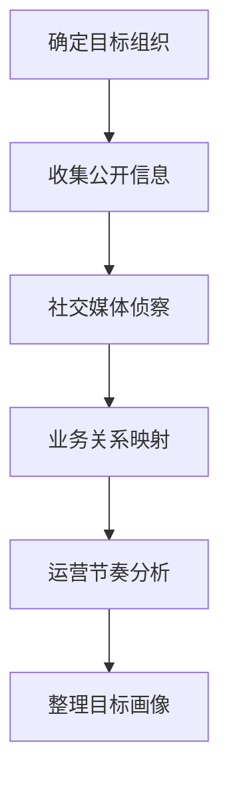

# 收集受害者组织信息 (T1591)

## 一句话通俗理解

> **收集受害者组织信息就像小偷在踩点前先了解这家公司的老板是谁、有几个部门、跟谁做生意，方便后续伪装和行骗。**

## 难度等级

⭐ 初级 - 主要从公开渠道收集，技术门槛低

## 技术描述

**通俗解释：**
你想骗一家公司，首先得知道这家公司叫什么、在哪办公、老板是谁、有几个部门、平时跟谁合作。这些信息都可以从公司官网、新闻稿、招聘广告中找到。攻击者在发动攻击前，也会花时间了解目标公司的"家底"，这样冒充合作伙伴或供应商时就更容易让人相信。

**技术原理：**
收集受害者组织信息（T1591）是指攻击者收集目标组织的整体结构和运营详细信息，为后续攻击提供背景情报。这些信息包括：

- **物理位置**：办公地址、分支机构、数据中心位置
- **业务关系**：供应商、合作伙伴、客户关系
- **业务节奏**：工作时间、会议周期、财务周期、假期安排
- **组织角色**：部门结构、关键人员、决策链

攻击者可以通过以下渠道获取这些信息：
- 公司官网和年度报告
- 社交媒体（LinkedIn、微博等）
- 新闻稿和媒体报道
- 招聘网站和职位描述
- 商业信息平台（如天眼查、企查查、ZoomInfo等）

**用途与影响：**
收集到的组织信息主要用于：
- 制定高度定制化的社会工程学攻击
- 识别高价值目标（如财务总监、IT管理员）
- 确定最佳攻击时机（如财务结算期、假期前后）
- 伪装成可信实体（如供应商、合作伙伴）

## 子技术列表

**该技术共有 4 个子技术：**

| 子技术ID | 中文名称 | 通俗解释 |
|----------|---------|---------|
| T1591.001 | 确定物理位置 | 了解目标公司有哪些办公室、分支机构在哪里 |
| T1591.002 | 识别业务关系 | 了解目标公司跟哪些供应商、合作伙伴有业务往来 |
| T1591.003 | 识别业务节奏 | 了解目标公司的日常工作节奏，如上班时间、财务结算周期 |
| T1591.004 | 识别角色 | 了解目标公司的组织架构，谁是关键人物 |

<details>
<summary><strong>展开查看各子技术详细说明</strong></summary>

### T1591.001 - 确定物理位置

**通俗理解：** 查目标公司都在哪儿办公

**详细说明：**
从公司官网的"联系我们"页面、分支机构介绍、招聘信息中的工作地点等收集物理位置信息。

### T1591.002 - 识别业务关系

**通俗理解：** 查目标公司跟谁有生意往来

**详细说明：**
通过新闻稿、案例研究、合作公告等识别供应商、合作伙伴和客户关系。

### T1591.003 - 识别业务节奏

**通俗理解：** 摸清目标公司的上下班时间和作息规律

**详细说明：**
从招聘信息中的工作时间、社交媒体上的工作动态、行业新闻中的财务周期等推断。

### T1591.004 - 识别角色

**通俗理解：** 搞清楚目标公司谁说了算

**详细说明：**
从LinkedIn、公司"团队"页面、新闻稿中的人物引用等收集关键人员信息。

</details>

## 攻击流程

### 典型攻击流程

```
确定目标组织 --> 收集公开信息 --> 社交媒体侦察 --> 业务关系映射 --> 运营节奏分析 --> 整理目标画像
```



**步骤详解：**

1. **确定目标组织**
   - 通俗描述：选择要攻击的公司或机构
   - 技术细节：确认目标的全称、主域名和业务范围
   - 常用工具：无

2. **收集公开信息**
   - 通俗描述：浏览公司官网、年度报告、新闻稿
   - 技术细节：系统性地收集所有公开的组织信息
   - 常用工具：浏览器、cURL

3. **社交媒体侦察**
   - 通俗描述：在LinkedIn、微博等平台搜索目标公司的员工和组织信息
   - 技术细节：使用高级搜索语法筛选目标公司员工
   - 常用工具：LinkedIn Sales Navigator

4. **业务关系映射**
   - 通俗描述：识别目标公司的供应商、合作伙伴和客户
   - 技术细节：分析新闻稿、案例研究中的业务关系
   - 常用工具：天眼查、企查查

5. **运营节奏分析**
   - 通俗描述：确定工作时间、假期安排、财务周期等
   - 技术细节：从招聘信息和行业新闻中推断
   - 常用工具：无

6. **整理目标画像**
   - 通俗描述：将收集到的信息整理成结构化的目标档案
   - 技术细节：建立组织的完整档案
   - 常用工具：Maltego、Excel

## 真实案例

### 案例1：FIN7利用商业信息服务进行目标选拔

- **时间**: 2020-2024年
- **目标**: 全球多家零售、餐饮和酒店公司
- **攻击组织**: FIN7
- **手法**: FIN7网络犯罪组织使用ZoomInfo等商业信息服务收集目标组织的详细信息，根据公司收入、员工规模和行业特点过滤潜在目标，建立基于财务吸引力的优先目标列表。这些信息被用于制定针对特定行业的攻击策略
- **影响**: 全球数百家企业遭受经济欺诈和数据泄露
- **参考链接**: [BI.ZONE: FIN7 Analysis](https://bi-zone.medium.com/from-pentest-to-apt-attack-cybercriminal-group-fin7-disguises-its-malware-as-an-ethical-hackers-c23c9a75e319)

### 案例2：APT28利用LLM研究卫星能力

- **时间**: 2024年
- **目标**: 航空航天和国防承包商
- **攻击组织**: APT28（Fancy Bear）
- **手法**: APT28利用大型语言模型（LLM）加速对目标组织的侦察工作，使用AI工具研究卫星通信能力和相关技术，以识别潜在的高价值目标。这种方法显著提高了信息收集的速度和范围
- **影响**: 多个国防承包商成为后续攻击的目标
- **参考链接**: [Microsoft: AI Threat Report](https://www.microsoft.com/en-us/security/blog/2024/02/14/staying-ahead-of-threat-actors-in-the-age-of-ai/)

### 案例3：Kimsuky收集组织层级信息进行社会工程学攻击

- **时间**: 2021-2024年
- **目标**: 韩国政府机构、智库和研究组织
- **攻击组织**: Kimsuky
- **手法**: Kimsuky收集了目标组织的详细层级结构、职能描述和新闻稿，建立全面的目标画像，冒充内部人员或业务合作伙伴进行高度个性化的鱼叉式钓鱼攻击
- **影响**: 多个智库和政府机构的信息被窃取
- **参考链接**: [CISA: Kimsuky Advisory](https://www.cisa.gov/news-events/cybersecurity-advisories/aa23-074a)

### 案例4：2025年AI驱动的深度组织信息收集

- **时间**: 2025-2026年
- **目标**: 全球各行业组织
- **攻击组织**: 多个APT组织
- **手法**: 根据Anthropic 2026年披露的数据，2025-2026年期间AI被广泛用于组织信息收集。攻击者使用LLM自动化分析目标公司的公开信息，包括年报、新闻稿、招聘广告和社交媒体，快速建立完整的目标组织画像。Anthropic的LLM ATT&CK Navigator显示，AI已覆盖ATT&CK框架的全部14个战术和482个子技术
- **影响**: 组织信息收集的效率和规模大幅提升
- **参考链接**: [Anthropic LLM ATT&CK Navigator](https://red.anthropic.com/2026/attack-navigator/)

## 红队视角

> ⚠️ **免责声明**：以下内容仅用于合法的安全测试、渗透测试和教育目的。未经授权对他人系统进行测试是违法行为。

### 实战技巧

1. **天眼查/企查查**：查询公司的工商注册信息、股东结构、分支机构
2. **LinkedIn高级搜索**：按公司、职位、地区筛选目标员工
3. **招聘信息分析**：招聘广告中常暴露技术栈（如"熟悉AWS"说明使用云服务）
4. **新闻稿分析**：公司新闻稿中常包含合作伙伴、项目进展等信息
5. **社交媒体监控**：关注公司官方账号和员工的社交媒体动态

### 常用工具

| 工具名称 | 用途 | 平台 | 链接 |
|----------|------|------|------|
| 天眼查 | 中国企业工商信息查询 | Web | [天眼查](https://www.tianyancha.com/) |
| ZoomInfo | 全球企业商业情报 | Web | [ZoomInfo](https://www.zoominfo.com/) |
| LinkedIn Sales Navigator | 高级人员和公司搜索 | Web | [LinkedIn](https://www.linkedin.com/sales) |
| SpiderFoot | 自动化OSINT侦察 | Linux | [GitHub](https://github.com/smicallef/spiderfoot) |
| Google Dorking | 高级搜索语法获取信息 | Web | [Google](https://www.google.com) |

### 注意事项

- 组织信息收集通常是完全被动的，不会被安全设备检测
- 注意不要在信息收集过程中暴露自己的身份
- 收集到的信息可能包含过时或不准确的数据，需要交叉验证

## 蓝队视角

### 检测要点

1. **信息暴露审计**：定期审计公司在公开渠道暴露的信息量
2. **社交媒体监控**：监控员工在社交媒体上分享的敏感工作信息
3. **招聘信息审查**：审查招聘广告中是否包含过多技术细节
4. **商业信息平台**：了解公司在商业信息平台上的公开信息

### 监控建议

- 定期进行OSINT审计，评估组织的信息暴露面
- 建立员工社交媒体使用指南
- 审查对外发布的信息（新闻稿、年度报告）中的敏感内容

## 检测建议

### 网络层检测

**检测方法：** 监控异常的Web浏览模式，特别是频繁访问商业信息网站

**具体规则/命令示例：**
```bash
# 分析代理日志中的商业信息网站访问
cat proxy.log | grep -E "zoominfo|crunchbase|linkedin"
```

### 主机层检测

**检测方法：** 监控对组织内部目录和敏感文档的访问

**Windows事件ID：**
- 事件ID 4663：访问敏感组织文档
- 事件ID 5140：文件共享访问

**Linux日志：**
- 日志文件：`/var/log/audit/audit.log`
- 关键字段：`type=FILE_WATCH`

### 应用层检测

**Sigma规则示例：**
```yaml
title: Organization OSINT Data Collection
status: experimental
description: Detects access to commercial business intelligence platforms
logsource:
    category: web_access
    product: proxy
detection:
    selection:
        Domain|contains:
            - 'zoominfo.com'
            - 'crunchbase.com'
            - 'rocketreach.co'
    condition: selection
level: low
tags:
    - attack.t1591
```

## 缓解措施

### 优先级1：关键措施

**措施名称：** 最小化信息暴露

**具体实施步骤：**
1. 审查公司在公开来源中共享的组织信息量
2. 避免公开详细的组织架构图和敏感职位信息
3. 限制年度报告和新闻稿中的技术细节

### 优先级2：重要措施

**措施名称：** 员工安全意识培训

**具体实施步骤：**
1. 教育员工关于社会工程学攻击的风险
2. 培训员工识别利用组织信息的攻击
3. 建立信息分享的政策和指南

### 优先级3：建议措施

**措施名称：** 数据分类和处理

**具体实施步骤：**
1. 实施数据分类方案保护敏感组织信息
2. 限制对组织结构文档的访问
3. 加密存储敏感的组织信息

### MITRE ATT&CK 缓解措施映射

| 缓解措施ID | 缓解措施名称 | 适用性 | 说明 |
|------------|-------------|--------|------|
| M1017 | 用户培训 | 适用 | 培训员工组织信息保护意识 |
| M1018 | 用户账户管理 | 部分适用 | 限制对组织信息的访问 |
| M1026 | 特权账户管理 | 部分适用 | 保护管理账户信息 |
| M1035 | 数据分类 | 适用 | 对组织信息进行分类保护 |

## 动手实验

> ⚠️ **重要提示**：所有实验必须在隔离的实验室环境中进行，禁止对未授权的真实系统进行测试。

### 实验环境准备

**推荐靶场/实验平台：**

| 平台名称 | 类型 | 难度 | 链接 |
|----------|------|------|------|
| TryHackMe OSINT | 虚拟靶场 | 初级 | [TryHackMe](https://tryhackme.com) |
| HackTheBox | CTF | 中级 | [HackTheBox](https://hackthebox.com) |

**所需工具：**
- SpiderFoot：自动化OSINT工具
- 天眼查/企查查：企业信息查询

### 实验1：公司信息收集练习（初级）

**实验目标：** 使用天眼查等平台收集公司公开信息

**实验步骤：**
1. 选择一家公开公司，使用天眼查查询工商信息
2. 分析公司的股东结构、分支机构和高管信息
3. 从公司官网收集团队和联系方式信息

**预期结果：** 获得目标公司完整的公开信息档案

**学习要点：** 理解组织信息的公开性和被利用的途径

### 实验2：LinkedIn侦察练习（初级）

**实验目标：** 练习从LinkedIn收集组织信息

**实验步骤：**
1. 搜索目标公司的员工列表
2. 识别关键人员（IT经理、HR总监、财务总监）
3. 分析员工的技能和背景信息

**预期结果：** 获得目标公司的人员结构和关键角色信息

**学习要点：** 理解社交媒体信息的社会工程学利用价值

## 术语解释

| 术语 | 英文原名 | 通俗解释 |
|------|----------|----------|
| OSINT | Open Source Intelligence | 开源情报，从公开来源收集的情报，像从报纸新闻中收集信息 |
| 社会工程学 | Social Engineering | 通过心理操纵欺骗人们泄露信息或执行操作的技术 |
| 鱼叉式钓鱼 | Spear Phishing | 针对特定个人或组织的定制化钓鱼攻击 |
| 商业情报 | Business Intelligence | 关于公司运营、财务和市场地位的信息 |
| 组织架构 | Organization Structure | 公司内部的部门结构和汇报关系 |
| Google Dorking | Google Dorking | 使用Google高级搜索语法获取特定信息的技术 |
| LLM | Large Language Model | 大型语言模型，如ChatGPT、Claude等AI工具 |
| 年度报告 | Annual Report | 公司每年发布的财务和运营报告 |

## 参考资料

### 官方文档

- [MITRE ATT&CK - 收集受害者组织信息 (T1591)](https://attack.mitre.org/techniques/T1591/)
- [MITRE ATT&CK - 确定物理位置 (T1591.001)](https://attack.mitre.org/techniques/T1591/001)
- [MITRE ATT&CK - 识别业务关系 (T1591.002)](https://attack.mitre.org/techniques/T1591/002)
- [MITRE ATT&CK - 识别业务节奏 (T1591.003)](https://attack.mitre.org/techniques/T1591/003)
- [MITRE ATT&CK - 识别角色 (T1591.004)](https://attack.mitre.org/techniques/T1591/004)

### 安全报告

- [Microsoft: AI Threat Actors](https://www.microsoft.com/en-us/security/blog/2024/02/14/staying-ahead-of-threat-actors-in-the-age-of-ai/) - APT组织使用LLM案例
- [Anthropic LLM ATT&CK Navigator](https://red.anthropic.com/2026/attack-navigator/) - AI在侦察中的应用分析
- [Mandiant M-Trends 2026](https://services.google.com/fh/files/misc/m-trends-2026-executive-edition-en.pdf)

### 工具与资源

- [SpiderFoot](https://github.com/smicallef/spiderfoot) - 自动化OSINT侦察工具
- [天眼查](https://www.tianyancha.com/) - 中国企业信息查询平台

### 学习资料

- [Startup Defense: T1591 Analysis](https://www.startupdefense.io/mitre-attack-techniques/t1591-gather-victim-org-information/)
