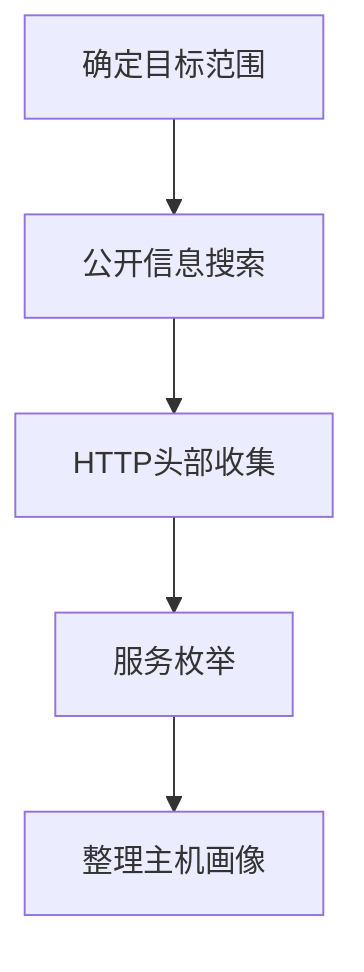

# 收集受害者主机信息 (T1592)

## 一句话通俗理解

> **收集受害者主机信息就像小偷在踩点时观察目标家里用什么锁、装什么牌子的监控，好准备对应的开锁工具。**

## 难度等级

⭐⭐ 中级 - 需要一定的技术知识来理解硬件和软件配置

## 技术描述

**通俗解释：**
你要攻击一台电脑，首先得知道它用的是什么操作系统、装了哪些软件、有没有杀毒软件。攻击者在发动攻击前，需要了解目标主机的具体配置，这样才能选择最合适的攻击工具和方法。比如，如果目标用的是Windows 10且没有打最新补丁，攻击者就知道该用什么漏洞来突破。

**技术原理：**
收集受害者主机信息（T1592）是指攻击者收集目标组织内特定主机或设备的详细信息，包括：

- **硬件信息**：CPU型号、内存大小、网络适配器类型、物联网设备型号等
- **软件信息**：操作系统版本、安装的应用程序、浏览器类型和版本
- **固件信息**：BIOS/UEFI版本、路由器固件版本、IoT设备固件
- **客户端配置**：浏览器设置、安全软件配置、网络代理设置

攻击者可以通过以下方式获取这些信息：
- **水坑攻击**：在目标常访问的网站植入恶意脚本，收集访问者的系统信息
- **HTTP头部分析**：分析User-Agent等HTTP头部信息
- **公开来源**：招聘网站、简历、采购发票中暴露的技术栈信息
- **主动探测**：通过端口扫描和服务枚举识别运行的软件版本

**用途与影响：**
收集到的主机信息主要用于：
- 选择和定制攻击载荷
- 绕过安全控制（如根据杀毒软件类型选择免杀方案）
- 识别可利用的漏洞
- 提高攻击成功率

## 子技术列表

**该技术共有 4 个子技术：**

| 子技术ID | 中文名称 | 通俗解释 |
|----------|---------|---------|
| T1592.001 | 硬件 | 了解目标电脑的硬件配置，如CPU、内存、网卡型号 |
| T1592.002 | 软件 | 了解目标电脑装了什么操作系统和应用程序 |
| T1592.003 | 固件 | 了解目标设备的固件版本，如路由器、IoT设备 |
| T1592.004 | 客户端配置 | 了解目标的浏览器设置、安全软件配置等 |

<details>
<summary><strong>展开查看各子技术详细说明</strong></summary>

各子技术详细说明请参阅独立文档：

- [T1592.001 - 硬件](./T1592/T1592.001-Hardware.md) — 摸清目标电脑的"配置单"
- [T1592.002 - 软件](./T1592/T1592.002-Software.md) — 搞清楚目标电脑装了哪些软件
- [T1592.003 - 固件](./T1592/T1592.003-Firmware.md) — 了解目标设备的"底层系统"版本
- [T1592.004 - 客户端配置](./T1592/T1592.004-Client-Configurations.md) — 了解目标电脑的安全设置

</details>

## 攻击流程

### 典型攻击流程

```
确定目标范围 --> 公开信息搜索 --> 水坑攻击部署 --> HTTP头部收集 --> 服务枚举 --> 整理主机画像
```



**步骤详解：**

1. **确定目标范围**
   - 通俗描述：确定要侦察的主机或设备类型
   - 技术细节：根据攻击目的选择目标类型（服务器、员工PC、IoT设备等）
   - 常用工具：无

2. **公开信息搜索**
   - 通俗描述：从招聘网站、简历、技术论坛搜索目标的技术栈信息
   - 技术细节：分析招聘广告中的技能要求（如"熟悉AWS"说明使用云服务）
   - 常用工具：搜索引擎、招聘网站

3. **HTTP头部收集**
   - 通俗描述：分析访问者的User-Agent字符串识别操作系统和浏览器
   - 技术细节：部署脚本或使用分析工具收集HTTP头部信息
   - 常用工具：Wappalyzer、BuiltWith

4. **服务枚举**
   - 通俗描述：通过端口扫描识别运行的服务和版本
   - 技术细节：使用Nmap等工具进行服务版本探测
   - 常用工具：Nmap、Masscan

5. **整理主机画像**
   - 通俗描述：将收集到的信息整理成目标主机的配置档案
   - 技术细节：建立包含操作系统、应用版本、安全软件等信息的档案
   - 常用工具：Excel、Maltego

## 真实案例

### 案例1：SolarWinds供应链攻击中的主机信息收集

- **时间**: 2020年
- **目标**: 多个美国政府机构和私营公司
- **攻击组织**: APT29（Nobelium）
- **手法**: APT29在SolarWinds供应链攻击中，利用被植入的Orion软件在受害者环境中使用PowerShell脚本枚举Windows主机，收集操作系统版本、主机名、IP地址和运行的安全产品等详细信息，以便进行横向移动
- **影响**: 包括美国联邦机构在内的18000+组织受影响
- **参考链接**: [CISA: SolarWinds Advisory](https://www.cisa.gov/news-events/cybersecurity-advisories/aa20-352a)

### 案例2：Andariel组织通过水坑攻击收集浏览器和系统信息

- **时间**: 2018-2024年
- **目标**: 韩国和全球用户
- **攻击组织**: Andariel
- **手法**: 朝鲜黑客组织Andariel在合法网站上植入JavaScript侦察工具，自动收集访问者的浏览器类型、系统语言、Flash Player版本等信息，然后根据特定系统配置定制恶意软件投递
- **影响**: 多个行业用户的主机信息被收集
- **参考链接**: [Trend Micro: Andariel](https://www.trendmicro.com/en_us/research/18/g/new-andariel-reconnaissance-tactics-hint-at-next-targets.html)

### 案例3：XZ Utils后门事件中的长期侦察

- **时间**: 2024年
- **目标**: 使用XZ Utils的Linux系统
- **攻击组织**: Jia Tan（疑似国家背景）
- **手法**: 攻击者花费数年时间以可信贡献者身份渗透XZ Utils开源项目，在5.6.0和5.6.1版本中插入后门。在插入后门前，攻击者对目标系统的配置和依赖关系进行了深入侦察，确保后门能够在特定环境中正常运行
- **影响**: 全球大量Linux系统的SSH服务面临后门风险
- **参考链接**: [CISA: XZ Utils Advisory](https://www.cisa.gov/news-events/alerts/2024/04/03/reported-supply-chain-compromise-xz-utils)

### 案例4：2025年AI增强的主机指纹识别

- **时间**: 2025-2026年
- **目标**: 全球各行业组织
- **攻击组织**: 多个APT组织
- **手法**: 根据CrowdStrike 2026全球威胁报告，攻击者使用AI增强的扫描工具自动识别目标主机的操作系统、软件版本和安全产品。AI辅助的指纹识别能够更准确地区分不同版本的服务和应用，减少了人工分析的工作量
- **影响**: 主机信息收集的准确性和速度大幅提升
- **参考链接**: [CrowdStrike 2026 Global Threat Report](https://www.crowdstrike.com/global-threat-report/)

## 红队视角

> ⚠️ **免责声明**：以下内容仅用于合法的安全测试、渗透测试和教育目的。未经授权对他人系统进行测试是违法行为。

### 实战技巧

1. **Wappalyzer**：浏览器扩展，可以识别网站使用的技术栈
2. **BuiltWith**：网站技术栈查询工具
3. **Shodan**：搜索暴露在互联网上的设备和服务，可以识别操作系统和软件版本
4. **HTTP头部分析**：从HTTP响应中提取服务器版本、框架信息
5. **招聘信息分析**：招聘广告中常暴露技术栈（如"熟悉Kubernetes"说明使用容器化）

### 常用工具

| 工具名称 | 用途 | 平台 | 链接 |
|----------|------|------|------|
| Wappalyzer | 网站技术栈识别 | 全平台 | [Wappalyzer](https://www.wappalyzer.com/) |
| BuiltWith | 网站技术查询 | Web | [BuiltWith](https://builtwith.com/) |
| Shodan | 互联网设备搜索引擎 | Web | [Shodan](https://www.shodan.io/) |
| Nmap | 服务版本识别 | 全平台 | [Nmap](https://nmap.org/) |
| WhatWeb | 网站指纹识别 | Linux | [GitHub](https://github.com/urbanadventurer/WhatWeb) |

### 注意事项

- 主动扫描可能会被安全设备检测，优先使用被动方法
- 水坑攻击需要在目标常访问的网站植入脚本，操作复杂度较高
- 注意收集的信息可能是过时的，需要交叉验证

## 蓝队视角

### 检测要点

1. **HTTP请求监控**：监控异常的HTTP请求模式，特别是收集User-Agent的请求
2. **网站完整性监控**：监控公司网站是否被植入恶意脚本
3. **端点检测**：部署EDR检测可疑的信息收集行为
4. **网络流量分析**：检测向已知恶意域名发送系统信息的行为

### 监控建议

- 部署WAF检测和阻止恶意脚本注入
- 定期扫描公司网站检查是否被篡改
- 监控端点上的异常系统枚举行为

## 检测建议

### 网络层检测

**检测方法：** 监控异常的HTTP/HTTPS请求模式

**具体规则/命令示例：**
```bash
# 捕获异常的User-Agent请求
tcpdump -i eth0 -A | grep "User-Agent" | sort | uniq -c
```

### 主机层检测

**检测方法：** 检测可疑的系统枚举命令

**Windows事件ID：**
- 事件ID 4688：检测PowerShell脚本执行
- 事件ID 5156：监控网络连接

**Linux日志：**
- 日志文件：`/var/log/audit/audit.log`
- 关键字段：进程执行记录

**具体命令示例：**
```bash
# 监控系统信息枚举命令执行
ausearch -c systeminfo -c uname -c hostname
```

### 应用层检测

**Sigma规则示例：**
```yaml
title: Host Information Enumeration via Systeminfo
status: experimental
description: Detects execution of systeminfo command for host enumeration
logsource:
    category: process_creation
    product: windows
detection:
    selection:
        Image|endswith: '\systeminfo.exe'
        CommandLine|contains: 'systeminfo'
    condition: selection
level: medium
tags:
    - attack.t1592
```

## 缓解措施

### 优先级1：关键措施

**措施名称：** 最小化信息暴露

**具体实施步骤：**
1. 配置Web服务器隐藏详细的版本信息
2. 禁用详细的错误消息返回给用户
3. 移除HTTP响应中的Server、X-Powered-By等头部

**配置示例：**
```nginx
# Nginx配置隐藏版本信息
server_tokens off;
proxy_hide_header X-Powered-By;
```

### 优先级2：重要措施

**措施名称：** 应用白名单和网络分段

**具体实施步骤：**
1. 部署应用白名单防止未授权脚本执行
2. 使用Windows Defender应用控制（WDAC）
3. 实施严格的网络分段，限制用户工作站直接访问服务器

### 优先级3：建议措施

**措施名称：** 补丁管理

**具体实施步骤：**
1. 实施强大的补丁管理流程
2. 及时更新操作系统和应用程序
3. 特别关注面向公众的系统

### MITRE ATT&CK 缓解措施映射

| 缓解措施ID | 缓解措施名称 | 适用性 | 说明 |
|------------|-------------|--------|------|
| M1042 | 应用白名单 | 适用 | 防止未授权的脚本执行 |
| M1030 | 网络分段 | 适用 | 限制主机扫描的范围 |
| M1027 | 操作系统加固 | 适用 | 减少攻击面 |
| M1017 | 用户培训 | 部分适用 | 培训员工识别水坑攻击 |

## 动手实验

> ⚠️ **重要提示**：所有实验必须在隔离的实验室环境中进行，禁止对未授权的真实系统进行测试。

### 实验环境准备

**推荐靶场/实验平台：**

| 平台名称 | 类型 | 难度 | 链接 |
|----------|------|------|------|
| TryHackMe - Web | 虚拟靶场 | 初级 | [TryHackMe](https://tryhackme.com) |
| HackTheBox | CTF | 中级 | [HackTheBox](https://hackthebox.com) |

**所需工具：**
- Wappalyzer：技术栈识别浏览器扩展
- Nmap：服务版本探测

### 实验1：网站技术栈识别（初级）

**实验目标：** 使用Wappalyzer和BuiltWith识别不同网站的技术栈

**实验步骤：**
1. 安装Wappalyzer浏览器扩展
2. 访问5个不同的网站，记录每个网站的技术栈
3. 使用BuiltWith验证结果

**预期结果：** 获得每个网站使用的Web服务器、框架和CMS信息

**学习要点：** 理解如何从外部识别网站技术栈

### 实验2：Shodan搜索练习（中级）

**实验目标：** 使用Shodan搜索特定操作系统的设备

**实验步骤：**
1. 注册Shodan账户并搜索 `os:"Windows 10"`
2. 分析搜索结果中的设备信息
3. 使用搜索过滤条件缩小范围

**预期结果：** 发现特定操作系统的互联网暴露设备

**学习要点：** 理解Shodan搜索语法和信息收集方法

## 术语解释

| 术语 | 英文原名 | 通俗解释 |
|------|----------|----------|
| User-Agent | User-Agent | HTTP请求头部，包含浏览器类型、操作系统等信息，像自我介绍 |
| 水坑攻击 | Watering Hole | 在目标常访问的网站植入恶意代码的攻击方式 |
| 固件 | Firmware | 嵌入在硬件设备中的软件，控制设备的基本功能 |
| EDR | Endpoint Detection and Response | 端点检测和响应，监控电脑安全状态的系统 |
| 供应链攻击 | Supply Chain Attack | 通过攻击软件供应链来入侵最终目标的攻击方式 |
| BIOS/UEFI | BIOS/UEFI | 计算机启动时运行的固件，控制硬件初始化 |
| CSP | Content Security Policy | 内容安全策略，限制网页可以加载的资源 |
| FIM | File Integrity Monitoring | 文件完整性监控，检测文件是否被篡改 |

## 参考资料

### 官方文档

- [MITRE ATT&CK - 收集受害者主机信息 (T1592)](https://attack.mitre.org/techniques/T1592/)
- [MITRE ATT&CK - 硬件信息收集 (T1592.001)](https://attack.mitre.org/techniques/T1592/001)
- [MITRE ATT&CK - 软件信息收集 (T1592.002)](https://attack.mitre.org/techniques/T1592/002)
- [MITRE ATT&CK - 固件信息收集 (T1592.003)](https://attack.mitre.org/techniques/T1592/003)
- [MITRE ATT&CK - 客户端配置收集 (T1592.004)](https://attack.mitre.org/techniques/T1592/004)

### 安全报告

- [CISA: SolarWinds Advisory](https://www.cisa.gov/news-events/cybersecurity-advisories/aa20-352a) - 供应链攻击中的主机侦察
- [Trend Micro: Andariel](https://www.trendmicro.com/en_us/research/18/g/new-andariel-reconnaissance-tactics-hint-at-next-targets.html) - 水坑攻击案例
- [CrowdStrike 2026 Global Threat Report](https://www.crowdstrike.com/global-threat-report/) - AI增强侦察趋势

### 工具与资源

- [Shodan](https://www.shodan.io/) - 互联网设备搜索引擎
- [Wappalyzer](https://www.wappalyzer.com/) - 网站技术栈识别
- [WhatWeb](https://github.com/urbanadventurer/WhatWeb) - 网站指纹识别

### 学习资料

- [CISA: T1592 Guidance](https://www.cisa.gov/eviction-strategies-tool/info-attack/T1592)
