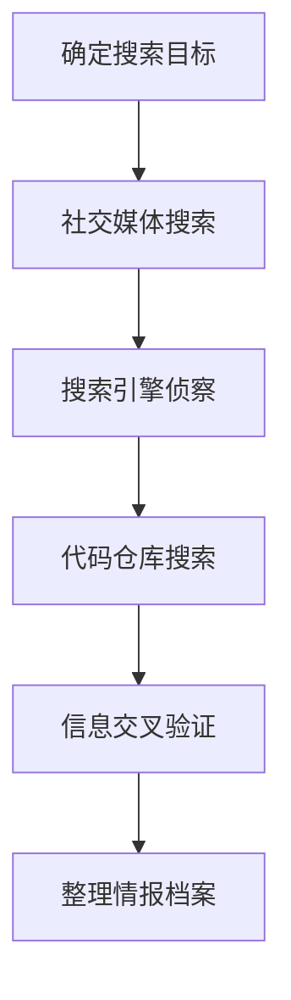

# 搜索开放网站/域名 (T1593)

## 一句话通俗理解

> **搜索开放网站/域名就像在网上"人肉搜索"目标，从社交媒体、搜索引擎和代码仓库中挖掘有用信息。**

## 难度等级

⭐ 初级 - 技术门槛低，主要利用公开的网站和搜索引擎

## 技术描述

**通俗解释：**
你想了解一个人，最简单的方法就是上网搜他的名字。攻击者也一样，他们会通过搜索引擎、社交媒体、代码仓库等公开网站搜索目标组织的信息。这些网站上的信息是公开的，不需要任何特殊权限就能访问，所以这种侦察方式非常隐蔽，几乎不可能被检测到。

**技术原理：**
搜索开放网站/域名（T1593）是指攻击者利用公开可访问的网站和域名收集目标信息。这些信息来源包括：

- **社交媒体**：LinkedIn、微博、Twitter、Facebook等，包含员工信息、组织结构、项目动态
- **搜索引擎**：Google、Bing、百度等，使用高级搜索语法（Google Dorking）可以发现敏感信息
- **代码仓库**：GitHub、GitLab、Gitee等，可能包含泄露的凭证、配置文件和内部技术细节

与直接搜索受害者拥有的网站（T1594）不同，T1593关注的是第三方平台上的信息。

**用途与影响：**
收集到的信息主要用于：
- 发现泄露的凭证和API密钥
- 了解组织的技术栈和安全实践
- 识别关键人员用于社会工程学攻击
- 发现组织的安全弱点

## 子技术列表

**该技术共有 3 个子技术：**

| 子技术ID | 中文名称 | 通俗解释 |
|----------|---------|---------|
| T1593.001 | 社交媒体 | 从LinkedIn、微博等社交平台收集员工和组织信息 |
| T1593.002 | 搜索引擎 | 使用Google等搜索引擎的高级语法搜索敏感信息 |
| T1593.003 | 代码仓库 | 从GitHub等代码仓库中搜索泄露的凭证和技术细节 |

<details>
<summary><strong>展开查看各子技术详细说明</strong></summary>

### T1593.001 - 社交媒体

**通俗理解：** 在朋友圈、微博上扒目标的信息

**详细说明：**
从LinkedIn、Twitter、微博等平台收集员工姓名、职位、技能、工作经历等信息。

### T1593.002 - 搜索引擎

**通俗理解：** 用Google的"高级搜索技巧"找目标的敏感信息

**详细说明：**
使用Google Dorking语法搜索特定类型的敏感文件和页面。

### T1593.003 - 代码仓库

**通俗理解：** 在GitHub上翻目标的代码找密码

**详细说明：**
搜索公开代码仓库中的凭证、API密钥、配置文件等敏感信息。

</details>

## 攻击流程

### 典型攻击流程

```
确定搜索目标 --> 社交媒体搜索 --> 搜索引擎侦察 --> 代码仓库搜索 --> 信息交叉验证 --> 整理情报档案
```



**步骤详解：**

1. **确定搜索目标**
   - 通俗描述：确定要搜索的组织名称、域名或关键词
   - 技术细节：明确搜索的范围和目标类型
   - 常用工具：无

2. **社交媒体搜索**
   - 通俗描述：在LinkedIn等平台搜索目标公司的员工信息
   - 技术细节：使用高级搜索过滤职位、部门、地区
   - 常用工具：LinkedIn Sales Navigator

3. **搜索引擎侦察**
   - 通俗描述：使用Google Dorking语法搜索敏感信息
   - 技术细节：使用特定的搜索语法组合
   - 常用工具：Google、Google Hacking Database

4. **代码仓库搜索**
   - 通俗描述：在GitHub搜索目标公司的代码仓库
   - 技术细节：搜索泄露的凭证、配置文件
   - 常用工具：GitHub搜索、TruffleHog

5. **信息交叉验证**
   - 通俗描述：从多个来源验证收集到的信息
   - 技术细节：对比不同来源的信息一致性
   - 常用工具：无

6. **整理情报档案**
   - 通俗描述：将收集到的信息整理成结构化的档案
   - 技术细节：分类存储各种信息
   - 常用工具：Obsidian、Maltego

## 真实案例

### 案例1：APT-C-36（Blind Eagle）针对哥伦比亚金融机构的社交媒体侦察

- **时间**: 2020-2024年
- **目标**: 哥伦比亚金融机构（Bancolombia、BBVA等）
- **攻击组织**: APT-C-36（Blind Eagle）
- **手法**: APT-C-36在LinkedIn和Facebook上进行广泛侦察，识别财务部门的员工，然后利用这些信息制作高度定制化的鱼叉式钓鱼邮件。攻击者甚至创建了虚假的招聘账号来与目标员工建立联系
- **影响**: 多家金融机构的客户数据和资金被窃取
- **参考链接**: [Mandiant: Blind Eagle](https://www.mandiant.com/resources/blog/blind-eagle-targets-colombia)

### 案例2：Mustang Panda利用开源研究识别目标

- **时间**: 2020-2024年
- **目标**: 政府机构和外交人员
- **攻击组织**: Mustang Panda
- **手法**: Mustang Panda在Twitter和LinkedIn上收集政府员工和外交人员的信息，利用这些信息制作武器化的钓鱼诱饵和附件。攻击者特别关注目标的职位、兴趣和社交关系
- **影响**: 多个政府机构的外交事务信息被窃取
- **参考链接**: [Recorded Future: Mustang Panda](https://www.recordedfuture.com/chinese-apt-group-mustang-panda-targets-vatican/)

### 案例3：Contagious Interview利用代码仓库进行侦察

- **时间**: 2023-2025年
- **目标**: 安全研究人员和开发者
- **攻击组织**: Contagious Interview
- **手法**: Contagious Interview组织在GitHub和GitLab上搜索安全工具和配置文件，了解目标组织使用的防御技术，然后据此调整攻击策略。该组织还监控VirusTotal和MalTrail等平台，了解自己的活动是否已被发现
- **影响**: 多个安全研究者的个人信息和凭证被窃取
- **参考链接**: [SentinelOne: Contagious Interview](https://www.sentinelone.com/labs/contagious-interview-threat-actors-scout-cyber-intel-platforms-reveal-plans-and-ops/)

### 案例4：2025年AI增强的开源信息收集

- **时间**: 2025-2026年
- **目标**: 全球各行业组织
- **攻击组织**: 多个APT和网络犯罪组织
- **手法**: 根据2026年Cofense报告，AI让钓鱼攻击从每42秒一次加速到每19秒一次。攻击者使用AI代理自动化社交媒体信息收集、Google Dorking和代码仓库扫描。AI驱动的开源信息收集工具能够在数分钟内完成原本需要数天的人工搜索工作
- **影响**: 开源信息收集的速度和规模大幅提升
- **参考链接**: [Cofense: AI-Powered Phishing Report 2026](https://cofense.com/Blog/Cofense-Report-Reveals-AI-Powered-Phishing-Accelerated-to-One-Attack-Every-19-Seconds)

## 红队视角

> ⚠️ **免责声明**：以下内容仅用于合法的安全测试、渗透测试和教育目的。未经授权对他人系统进行测试是违法行为。

### 实战技巧

1. **Google Dorking**：使用高级搜索语法发现敏感信息
   - `site:target.com filetype:pdf` - 搜索目标网站上的PDF文件
   - `site:target.com inurl:admin` - 搜索管理后台页面
   - `"target.com" password` - 搜索包含密码的页面
2. **LinkedIn高级搜索**：按公司、职位、地区筛选目标员工
3. **GitHub搜索语法**：`org:company_name password` 或 `company_name API_KEY`
4. **社交媒体监控**：关注目标公司的官方账号和员工动态

### 常用工具

| 工具名称 | 用途 | 平台 | 链接 |
|----------|------|------|------|
| Google Dorking | 高级搜索语法 | Web | [Google](https://www.google.com) |
| LinkedIn Sales Navigator | 高级人员搜索 | Web | [LinkedIn](https://www.linkedin.com/sales) |
| SpiderFoot | 自动化OSINT侦察 | Linux | [GitHub](https://github.com/smicallef/spiderfoot) |
| Maltego | 可视化情报分析 | 全平台 | [Maltego](https://www.maltego.com/) |
| TruffleHog | 代码仓库敏感信息扫描 | Linux | [GitHub](https://github.com/trufflesecurity/trufflehog) |

### 注意事项

- 开放网站搜索是完全被动的，不会被检测到
- 注意不要在搜索过程中暴露自己的身份
- 收集到的信息需要交叉验证，避免被虚假信息误导

## 蓝队视角

### 检测要点

1. **社交媒体监控**：监控组织在社交媒体上的信息暴露
2. **代码仓库扫描**：定期扫描公开代码仓库中的敏感信息
3. **搜索引擎监控**：使用Google Alerts监控组织相关的搜索结果
4. **员工意识培训**：教育员工关于社交媒体信息分享的风险

### 监控建议

- 部署代码泄漏监控服务（如GitHub的秘密扫描）
- 定期进行OSINT审计
- 建立员工社交媒体使用指南

## 检测建议

### 网络层检测

**检测方法：** 监控对社交媒体和商业信息网站的异常访问

**具体规则/命令示例：**
```bash
# 分析代理日志中的社交媒体访问
cat proxy.log | grep -E "linkedin|github|twitter" | awk '{print $1}' | sort | uniq -c
```

### 主机层检测

**检测方法：** 监控自动化OSINT工具的执行

**Windows事件ID：**
- 事件ID 4688：检测OSINT工具的进程创建

**Linux日志：**
- 日志文件：`/var/log/audit/audit.log`
- 关键字段：OSINT工具的执行记录

### 应用层检测

**Sigma规则示例：**
```yaml
title: Automated OSINT Tool Usage
status: experimental
description: Detects execution of common OSINT reconnaissance tools
logsource:
    category: process_creation
    product: linux
detection:
    selection:
        Image|endswith:
            - '/theHarvester'
            - '/spiderfoot'
            - '/maltego'
    condition: selection
level: low
tags:
    - attack.t1593
```

## 缓解措施

### 优先级1：关键措施

**措施名称：** 代码安全扫描

**具体实施步骤：**
1. 使用pre-commit钩子防止敏感信息被提交
2. 部署代码泄漏监控工具（如GitGuardian）
3. 定期扫描代码仓库中的敏感信息

**配置示例：**
```yaml
# .pre-commit-config.yaml
repos:
  - repo: https://github.com/awslabs/git-secrets
    rev: master
    hooks:
      - id: git-secrets
```

### 优先级2：重要措施

**措施名称：** 员工社交媒体政策

**具体实施步骤：**
1. 建立员工社交媒体使用指南
2. 教育员工关于信息分享的风险
3. 限制在社交媒体上分享敏感工作信息

### 优先级3：建议措施

**措施名称：** 信息分类和处理

**具体实施步骤：**
1. 实施数据分类方案
2. 限制敏感信息的公开访问
3. 定期审计公开信息

### MITRE ATT&CK 缓解措施映射

| 缓解措施ID | 缓解措施名称 | 适用性 | 说明 |
|------------|-------------|--------|------|
| M1017 | 用户培训 | 适用 | 培训员工社交媒体信息分享风险 |
| M1026 | 特权账户管理 | 部分适用 | 保护开发者GitHub账户 |
| M1041 | 加密敏感信息 | 部分适用 | 加密配置文件中的凭证 |
| M1035 | 数据分类 | 适用 | 分类和保护敏感信息 |

## 动手实验

> ⚠️ **重要提示**：所有实验必须在隔离的实验室环境中进行，禁止对未授权的真实系统进行测试。

### 实验环境准备

**推荐靶场/实验平台：**

| 平台名称 | 类型 | 难度 | 链接 |
|----------|------|------|------|
| TryHackMe OSINT | 虚拟靶场 | 初级 | [TryHackMe](https://tryhackme.com) |
| Google Hacking Database | 在线资源 | 初级 | [Exploit-DB](https://www.exploit-db.com/google-hacking-database) |

**所需工具：**
- 浏览器：用于Google Dorking练习
- GitHub：用于代码仓库搜索

### 实验1：Google Dorking练习（初级）

**实验目标：** 练习使用Google高级搜索语法

**实验步骤：**
1. 搜索 `site:example.com filetype:pdf` 查找PDF文件
2. 搜索 `inurl:admin intitle:login` 查找登录页面
3. 使用Google Hacking Database学习更多语法

**预期结果：** 发现目标网站上公开的有趣文件

**学习要点：** 理解Google Dorking的基本语法和应用场景

### 实验2：GitHub敏感信息搜索（中级）

**实验目标：** 练习在GitHub搜索泄露的凭证

**实验步骤：**
1. 搜索 `"example.com" password` 查找泄露的凭证
2. 搜索 `"example.com" api_key` 查找API密钥
3. 使用TruffleHog自动化扫描

**预期结果：** 发现至少一个泄露的敏感信息项

**学习要点：** 理解代码仓库中的信息泄露风险

## 术语解释

| 术语 | 英文原名 | 通俗解释 |
|------|----------|----------|
| Google Dorking | Google Dorking | 使用Google高级搜索语法发现敏感信息的技术 |
| OSINT | Open Source Intelligence | 开源情报，从公开来源收集的情报 |
| 社交媒体 | Social Media | 在线社交平台，如LinkedIn、微博、Twitter |
| 代码仓库 | Code Repository | 存储和管理代码的在线平台，如GitHub、GitLab |
| API密钥 | API Key | 应用程序接口的访问凭证，泄露后可能被用于未授权访问 |
| 鱼叉式钓鱼 | Spear Phishing | 针对特定个人或组织的定制化钓鱼攻击 |
| 信息窃取 | Information Theft | 收集敏感信息用于后续攻击的行为 |
| Paste网 | Paste Sites | 用于粘贴和分享文本的网站，常被用于泄露数据 |

## 参考资料

### 官方文档

- [MITRE ATT&CK - 搜索开放网站/域名 (T1593)](https://attack.mitre.org/techniques/T1593/)
- [MITRE ATT&CK - 社交媒体 (T1593.001)](https://attack.mitre.org/techniques/T1593/001)
- [MITRE ATT&CK - 搜索引擎 (T1593.002)](https://attack.mitre.org/techniques/T1593/002)
- [MITRE ATT&CK - 代码仓库 (T1593.003)](https://attack.mitre.org/techniques/T1593/003)

### 安全报告

- [SentinelOne: Contagious Interview](https://www.sentinelone.com/labs/contagious-interview-threat-actors-scout-cyber-intel-platforms-reveal-plans-and-ops/) - 代码仓库侦察案例
- [Cofense 2026 Report](https://cofense.com/Blog/Cofense-Report-Reveals-AI-Powered-Phishing-Accelerated-to-One-Attack-Every-19-Seconds) - AI增强的侦察趋势
- [Recorded Future: Google Dorking Analysis](https://www.recordedfuture.com/threat-intelligence-101/threat-analysis-techniques/google-dorks)

### 工具与资源

- [Exploit-DB Google Hacking Database](https://www.exploit-db.com/google-hacking-database) - Google Dorking语法库
- [SpiderFoot](https://github.com/smicallef/spiderfoot) - 自动化OSINT工具

### 学习资料

- [CISA: T1593 Guidance](https://www.cisa.gov/eviction-strategies-tool/info-attack/T1593.001)
- [Startup Defense: T1593 Analysis](https://www.startupdefense.io/mitre-attack-techniques/t1593-search-open-websites-domains/)
