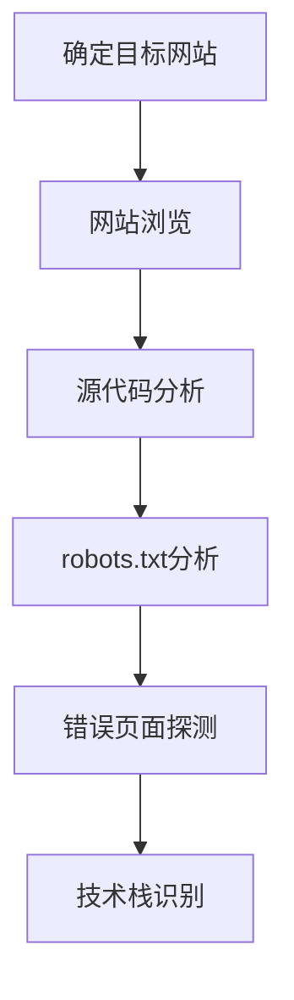

# 搜索受害者拥有的网站 (T1594)

## 一句话通俗理解

> **搜索受害者拥有的网站就像直接去目标公司门口看公告栏，从他们自己的网站上找有用的信息。**

## 难度等级

⭐ 初级 - 直接浏览目标网站，技术门槛最低

## 技术描述

**通俗解释：**
你想了解一家公司，最直接的方法就是去他们官网看看。攻击者也一样，他们会仔细浏览目标组织的官网、员工门户、合作伙伴页面等，从中收集员工联系方式、组织结构、技术栈等信息。有时候，网站的源代码、robots.txt文件、错误页面等"边角料"里也藏着有价值的信息。

**技术原理：**
搜索受害者拥有的网站（T1594）是指攻击者系统性地检查目标组织自己拥有和运营的网站，收集可用于攻击的情报。与搜索第三方网站（T1593）不同，T1594专门针对目标组织自己的网站资产。

攻击者通常关注以下信息：
- **员工联系信息**：姓名、邮箱、电话号码，用于社会工程学攻击
- **组织结构**：部门划分、汇报关系，用于识别高价值目标
- **技术栈信息**：网站使用的框架、CMS、服务器软件，用于识别漏洞
- **业务关系**：合作伙伴、供应商信息，用于供应链攻击
- **物理位置**：办公地址、分支机构，用于物理渗透或定向攻击
- **安全实践**：安全策略、合规认证，用于评估防御水平

**用途与影响：**
收集到的信息主要用于：
- 制作高度定制化的钓鱼攻击
- 识别网站的技术漏洞
- 了解组织的安全实践
- 规划物理渗透测试

## 子技术列表

该技术目前没有定义子技术。

## 攻击流程

### 典型攻击流程

```
确定目标网站 --> 网站浏览 --> 源代码分析 --> robots.txt分析 --> 错误页面探测 --> 技术栈识别
```



**步骤详解：**

1. **确定目标网站**
   - 通俗描述：识别目标组织的所有网站资产
   - 技术细节：主站、子站、门户、员工入口等
   - 常用工具：搜索引擎

2. **网站浏览**
   - 通俗描述：系统性浏览网站的各个页面，收集公开信息
   - 技术细节：关注"关于我们"、"团队"、"联系我们"等页面
   - 常用工具：浏览器

3. **源代码分析**
   - 通俗描述：查看网页源代码，寻找注释和隐藏信息
   - 技术细节：搜索HTML注释中的敏感信息、JavaScript中的API端点
   - 常用工具：浏览器开发者工具

4. **robots.txt分析**
   - 通俗描述：检查robots.txt文件，发现被隐藏的目录
   - 技术细节：访问 `/robots.txt` 查看不想被爬取的路径
   - 常用工具：浏览器

5. **错误页面探测**
   - 通俗描述：访问不存在的页面，从错误信息中获取技术栈细节
   - 技术细节：访问不存在的路径，分析错误页面内容
   - 常用工具：cURL

6. **技术栈识别**
   - 通俗描述：识别网站使用的CMS、框架和服务器软件
   - 技术细节：使用Wappalyzer等工具自动识别
   - 常用工具：Wappalyzer、BuiltWith

## 真实案例

### 案例1：Silent Librarian针对大学网站的侦察

- **时间**: 2020-2024年
- **目标**: 全球多所大学
- **攻击组织**: Silent Librarian（TA407）
- **手法**: Silent Librarian系统性地爬取大学网站的源代码、品牌元素和组织联系信息，构建逼真的凭证收集钓鱼页面。攻击者仔细研究目标大学的登录页面设计，创建几乎完全相同的虚假页面来窃取师生的凭证
- **影响**: 全球数百所大学的师生凭证被盗
- **参考链接**: [CISA: Silent Librarian](https://www.cisa.gov/news-events/cybersecurity-advisories/aa23-208a)

### 案例2：Sandworm Team针对乌克兰政府网站的侦察

- **时间**: 2020-2024年
- **目标**: 乌克兰政府机构
- **攻击组织**: Sandworm Team
- **手法**: Sandworm Team对乌克兰政府网站进行深入侦察，收集政府部门结构、关键人员和基础设施信息。攻击者特别关注网站上发布的官方文件和公告，从中提取可用于攻击的情报
- **影响**: 多个政府机构遭受网络攻击和破坏
- **参考链接**: [CISA: Sandworm](https://www.cisa.gov/news-events/cybersecurity-advisories/aa23-208a)

### 案例3：APT29针对外交组织网站的侦察

- **时间**: 2020-2025年
- **目标**: 政府和外交组织
- **攻击组织**: APT29（Cozy Bear）
- **手法**: APT29监控外交部和使馆网站，收集员工信息、出访计划和活动安排，用于制作高度定制化的鱼叉式钓鱼攻击。攻击者特别关注官方网站上发布的会议通知和人员变动信息
- **影响**: 多个外交机构的敏感信息被窃取
- **参考链接**: [NCSC: APT29 Advisory](https://www.ncsc.gov.uk/files/Advisory-APT29.pdf)

### 案例4：2025年AI自动化网站信息提取

- **时间**: 2025-2026年
- **目标**: 各行业组织
- **攻击组织**: 多个APT和网络犯罪组织
- **手法**: 攻击者使用AI代理自动化爬取和分析目标网站内容。AI能够从海量页面中提取员工信息、技术栈详情和安全配置，并自动生成结构化的目标画像。根据Ransomnews 2026年4月报道，AI驱动的侦察代理正在取代人工侦察
- **影响**: 网站信息收集效率提升数倍
- **参考链接**: [Ransomnews: AI Recon Agents 2026](https://ransomnews.com/ai-agents-automate-reconnaissance-2026/)

## 红队视角

> ⚠️ **免责声明**：以下内容仅用于合法的安全测试、渗透测试和教育目的。未经授权对他人系统进行测试是违法行为。

### 实战技巧

1. **查看网页源代码**：右键查看源代码，搜索注释、隐藏字段和JavaScript变量
2. **检查robots.txt**：访问 `target.com/robots.txt` 查看被禁止爬取的目录
3. **查看sitemap.xml**：访问 `target.com/sitemap.xml` 获取网站的完整页面结构
4. **错误页面探测**：访问不存在的页面，获取服务器版本和框架信息
5. **使用Wappalyzer**：识别网站使用的技术栈

### 常用工具

| 工具名称 | 用途 | 平台 | 链接 |
|----------|------|------|------|
| Wappalyzer | 网站技术栈识别 | 全平台 | [Wappalyzer](https://www.wappalyzer.com/) |
| BuiltWith | 网站技术查询 | Web | [BuiltWith](https://builtwith.com/) |
| Dirb/Gobuster | 目录枚举工具 | Linux | [Dirb](https://tools.kali.org/web-applications/dirb) |
| WhatWeb | 网站指纹识别 | Linux | [GitHub](https://github.com/urbanadventurer/WhatWeb) |
| Curl/Wget | 网页内容抓取 | 全平台 | 系统内置 |

### 注意事项

- 浏览公开网站是完全合法和被动的
- 但主动探测（如目录枚举）可能会被WAF检测到
- 注意不要触发网站的速率限制

## 蓝队视角

### 检测要点

1. **Web服务器日志**：监控异常的访问模式，如大量请求不存在的页面
2. **WAF告警**：检测目录枚举和扫描工具的特征
3. **信息暴露审计**：定期审计网站上暴露的敏感信息
4. **源代码审查**：检查网页源代码中的敏感注释和隐藏字段

### 监控建议

- 配置WAF检测和阻止目录枚举
- 定期审计网站上的信息暴露
- 监控异常的访问模式

## 检测建议

### 网络层检测

**检测方法：** 监控大量404错误响应（目录枚举特征）

**具体规则/命令示例：**
```bash
# 分析Web日志中的404错误
cat access.log | grep " 404 " | awk '{print $1}' | sort | uniq -c | sort -nr
```

### 主机层检测

**检测方法：** 监控WAF告警和速率限制触发

**Windows事件ID：**
- 事件ID 5156：网络连接
- 事件ID 5157：被阻止的连接

**Linux日志：**
- 日志文件：`/var/log/nginx/access.log`
- 关键字段：`404`状态码、高频率访问

### 应用层检测

**Sigma规则示例：**
```yaml
title: Directory Enumeration via Gobuster
status: experimental
description: Detects pattern of 404 errors indicative of directory brute-force
logsource:
    category: web_access
    product: nginx
detection:
    selection:
        Status: 404
        Count: 20
    timeframe: 1m
    condition: selection
level: medium
tags:
    - attack.t1594
```

## 缓解措施

### 优先级1：关键措施

**措施名称：** 最小化信息暴露

**具体实施步骤：**
1. 移除HTTP响应中的版本信息头部（Server、X-Powered-By等）
2. 配置自定义错误页面，不泄露框架详情
3. 禁用目录列表功能
4. 审查并删除网页源代码中的敏感注释

**配置示例：**
```nginx
# Nginx配置隐藏版本信息
server_tokens off;
error_page 404 /custom_404.html;
```

### 优先级2：重要措施

**措施名称：** Web服务器加固

**具体实施步骤：**
1. 实施速率限制防止自动化扫描
2. 配置WAF检测和阻止扫描活动
3. 定期更新Web服务器和CMS

### 优先级3：建议措施

**措施名称：** 信息分类和审查

**具体实施步骤：**
1. 建立信息发布审查流程
2. 限制网站上暴露的员工信息
3. 定期审计网站内容

### MITRE ATT&CK 缓解措施映射

| 缓解措施ID | 缓解措施名称 | 适用性 | 说明 |
|------------|-------------|--------|------|
| M1043 | Web服务器加固 | 适用 | 隐藏版本信息，自定义错误页 |
| M1017 | 用户培训 | 适用 | 培训员工关于网站信息暴露风险 |
| M1021 | 限制Web内容 | 适用 | 实施WAF和速率限制 |
| M1030 | 网络分段 | 部分适用 | 隔离公共Web服务器 |

## 动手实验

> ⚠️ **重要提示**：所有实验必须在隔离的实验室环境中进行，禁止对未授权的真实系统进行测试。

### 实验环境准备

**推荐靶场/实验平台：**

| 平台名称 | 类型 | 难度 | 链接 |
|----------|------|------|------|
| TryHackMe - Web | 虚拟靶场 | 初级 | [TryHackMe](https://tryhackme.com) |
| HackTheBox | CTF | 中级 | [HackTheBox](https://hackthebox.com) |

**所需工具：**
- Wappalyzer：技术栈识别
- Curl：网页内容获取

### 实验1：网站信息收集练习（初级）

**实验目标：** 系统性收集目标网站的公开信息

**实验步骤：**
1. 浏览目标网站的所有公开页面
2. 查看网页源代码，搜索注释和隐藏字段
3. 检查robots.txt和sitemap.xml

**预期结果：** 发现至少3个可能被攻击者利用的信息泄露

**学习要点：** 理解网站信息暴露的多样性

### 实验2：技术栈识别练习（初级）

**实验目标：** 使用Wappalyzer和BuiltWith识别网站技术栈

**实验步骤：**
1. 安装Wappalyzer浏览器扩展
2. 访问多个网站，记录技术栈
3. 分析技术栈的潜在安全风险

**预期结果：** 准确识别网站使用的框架、CMS和服务器

**学习要点：** 理解技术栈信息对攻击者的价值

## 术语解释

| 术语 | 英文原名 | 通俗解释 |
|------|----------|----------|
| CMS | Content Management System | 内容管理系统，如WordPress、Drupal |
| robots.txt | robots.txt | 网站根目录下的文件，告诉搜索引擎哪些页面可以爬取 |
| sitemap.xml | sitemap.xml | 网站的页面索引文件，列出所有可访问的页面 |
| 目录枚举 | Directory Enumeration | 使用工具探测网站隐藏目录和文件的技术 |
| WAF | Web Application Firewall | Web应用防火墙，保护网站免受攻击 |
| 源代码 | Source Code | 网页的HTML、CSS和JavaScript代码 |
| 速率限制 | Rate Limiting | 限制单位时间内的请求次数，防止滥用 |
| 技术栈 | Technology Stack | 网站使用的技术组合，包括服务器、框架、数据库 |

## 参考资料

### 官方文档

- [MITRE ATT&CK - 搜索受害者拥有的网站 (T1594)](https://attack.mitre.org/techniques/T1594/)

### 安全报告

- [CISA: Silent Librarian Advisory](https://www.cisa.gov/news-events/cybersecurity-advisories/aa23-208a) - 大学网站侦察案例
- [Ransomnews: AI Recon Agents 2026](https://ransomnews.com/ai-agents-automate-reconnaissance-2026/) - AI自动化网站侦察

### 工具与资源

- [Wappalyzer](https://www.wappalyzer.com/) - 网站技术栈识别
- [BuiltWith](https://builtwith.com/) - 网站技术查询

### 学习资料

- [CISA: T1594 Guidance](https://www.cisa.gov/eviction-strategies-tool/info-attack/T1594)
- [Startup Defense: T1594 Analysis](https://www.startupdefense.io/mitre-attack-techniques/t1594-search-victim-owned-websites/)
