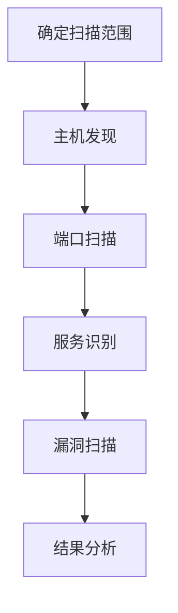

# 主动扫描 (T1595)

## 一句话通俗理解

> **主动扫描就像小偷挨家挨户敲门，看哪扇门没锁、哪个窗户开着，直接试探目标的弱点。**

## 难度等级

⭐⭐ 中级 - 需要网络基础知识和扫描工具使用经验

## 技术描述

**通俗解释：**
被动侦察是在远处用望远镜观察，而主动扫描是直接走到目标门口敲门试探。攻击者会向目标系统发送各种探测数据包，根据响应来判断：哪些端口是开放的、运行着什么服务、用的什么操作系统、有没有已知漏洞。这种方式信息更准确，但也更容易被发现。

**技术原理：**
主动扫描（T1595）是指攻击者通过网络流量直接与目标基础设施交互，收集可用于攻击的信息。与被动侦察不同，主动扫描涉及发送探测数据包（如TCP SYN、UDP、ICMP）到目标系统，并分析响应。

主动扫描收集的信息包括：
- **开放端口**：哪些端口正在监听（如80、443、3389等）
- **运行服务**：每个端口上运行的服务类型和版本
- **操作系统指纹**：目标使用的操作系统类型和版本
- **应用版本**：Web应用、数据库等软件的具体版本
- **漏洞信息**：已知漏洞的存在和可利用性

**用途与影响：**
主动扫描的结果主要用于：
- 识别可利用的攻击入口点
- 发现未打补丁的漏洞
- 映射网络中的活跃主机
- 枚举特定应用程序或服务

## 子技术列表

**该技术共有 3 个子技术：**

| 子技术ID | 中文名称 | 通俗解释 |
|----------|---------|---------|
| T1595.001 | 扫描IP块 | 对目标的IP地址范围进行批量扫描，找出哪些IP是活跃的 |
| T1595.002 | 漏洞扫描 | 使用专业工具扫描目标系统是否存在已知漏洞 |
| T1595.003 | 字典扫描 | 使用预定义的词典扫描特定服务（如子域名爆破、目录枚举） |

<details>
<summary><strong>展开查看各子技术详细说明</strong></summary>

### T1595.001 - 扫描IP块

**通俗理解：** 在目标公司的IP地址范围内挨个敲门

**详细说明：**
对目标的IP段进行批量扫描，识别活跃的主机和开放的端口。

### T1595.002 - 漏洞扫描

**通俗理解：** 用专业的检查清单逐个检查目标系统有没有已知的安全漏洞

**详细说明：**
使用Nessus、OpenVAS、Nuclei等工具扫描已知漏洞。

### T1595.003 - 字典扫描

**通俗理解：** 用常用的密码本尝试猜子域名和目录

**详细说明：**
使用字典文件暴力枚举子域名、URL路径、用户名等。

</details>

## 攻击流程

### 典型攻击流程

```
确定扫描范围 --> 主机发现 --> 端口扫描 --> 服务识别 --> 漏洞扫描 --> 结果分析
```



**步骤详解：**

1. **确定扫描范围**
   - 通俗描述：确定要扫描的IP地址范围或域名
   - 技术细节：根据之前的被动侦察结果确定目标范围
   - 常用工具：无

2. **主机发现**
   - 通俗描述：使用ICMP ping或ARP扫描发现活跃主机
   - 技术细节：发送探测包判断主机是否在线
   - 常用工具：Nmap

3. **端口扫描**
   - 通俗描述：对活跃主机进行端口扫描，识别开放端口
   - 技术细节：使用TCP SYN、UDP等扫描技术
   - 常用工具：Nmap、Masscan

4. **服务识别**
   - 通俗描述：对开放端口进行服务版本识别
   - 技术细节：分析服务指纹确定具体版本
   - 常用工具：Nmap -sV

5. **漏洞扫描**
   - 通俗描述：使用漏洞扫描器检查已知漏洞
   - 技术细节：使用CVE数据库匹配扫描结果
   - 常用工具：Nuclei、Nessus

6. **结果分析**
   - 通俗描述：分析扫描结果，识别潜在的攻击入口
   - 技术细节：按风险等级排序发现的漏洞
   - 常用工具：无

## 真实案例

### 案例1：APT28针对政府和关键基础设施的大规模扫描

- **时间**: 2024年
- **目标**: 政府和关键基础设施组织（全球范围）
- **攻击组织**: APT28（Fancy Bear）
- **手法**: APT28进行了大规模的IP块扫描和漏洞扫描，特别关注与政府和关键基础设施相关的IP范围，寻找未打补丁的系统和暴露的服务。攻击者使用定制的扫描工具和公开的漏洞数据库来识别潜在目标
- **影响**: 多个政府机构的系统被识别为潜在目标
- **参考链接**: [CISA: APT28 Advisory](https://www.cisa.gov/sites/default/files/2024-09/aa24-249a-russian-military-cyber-actors-target-us-and-global-critical-infrastructure.pdf)

### 案例2：Volt Typhoon对美国关键基础设施的持续扫描

- **时间**: 2023-2025年
- **目标**: 美国关键基础设施（能源、水务、通信）
- **攻击组织**: Volt Typhoon
- **手法**: Volt Typhoon使用主动扫描技术映射网络拓扑，识别关键系统之间的连接关系。该组织特别关注路由器、VPN设备和防火墙等网络边缘设备，利用这些设备作为跳板隐藏真实的攻击来源
- **影响**: 关键基础设施系统被长期渗透
- **参考链接**: [CISA: Volt Typhoon Advisory](https://www.cisa.gov/news-events/cybersecurity-advisories/aa24-038a)

### 案例3：APT41利用专业漏洞扫描工具进行定制攻击

- **时间**: 2021-2024年
- **目标**: 医疗、电信和高科技行业
- **攻击组织**: APT41
- **手法**: APT41使用Acunetix（SQL注入检测）和JexBoss（Java应用漏洞扫描）等专业工具，结合定制恶意软件进行有针对性的攻击。攻击者将扫描结果直接用于漏洞利用，实现了从侦察到攻击的快速转化
- **影响**: 多个行业的企业系统被入侵
- **参考链接**: [Group-IB: APT41](https://www.group-ib.com/blog/apt41-world-tour-2021/)

### 案例4：2025-2026年AI增强的自动化扫描

- **时间**: 2025-2026年
- **目标**: 全球各行业组织
- **攻击组织**: 多个APT组织
- **手法**: 根据CrowdStrike 2026报告，AI被用于自动选择和优化扫描参数，提高扫描效率。攻击者使用LLM驱动的扫描工具自动分析扫描结果，识别最可能的突破口。CrowdStrike报告指出AI增强的攻击活动增长了89%，平均突破时间缩短到29分钟
- **影响**: 扫描和突破的速度大幅提升
- **参考链接**: [CrowdStrike 2026 Global Threat Report](https://www.crowdstrike.com/global-threat-report/)

## 红队视角

> ⚠️ **免责声明**：以下内容仅用于合法的安全测试、渗透测试和教育目的。未经授权对他人系统进行测试是违法行为。

### 实战技巧

1. **Nmap基础扫描**：`nmap -sV -sC -O target.com` 进行服务版本、脚本和操作系统检测
2. **Masscan快速扫描**：`masscan -p1-65535 target_ip --rate=10000` 高速全端口扫描
3. **Nuclei漏洞扫描**：`nuclei -u target.com -t cves/` 使用模板扫描已知漏洞
4. **子域名爆破**：使用subfinder、amass等工具枚举子域名
5. **隐蔽扫描**：使用慢速扫描、分片数据包等技术规避IDS检测

### 常用工具

| 工具名称 | 用途 | 平台 | 链接 |
|----------|------|------|------|
| Nmap | 网络发现和安全审计的瑞士军刀 | 全平台 | [Nmap](https://nmap.org/) |
| Masscan | 互联网规模的高速端口扫描器 | Linux | [GitHub](https://github.com/robertdavidgraham/masscan) |
| Nuclei | 基于模板的漏洞扫描器 | Linux | [GitHub](https://github.com/projectdiscovery/nuclei) |
| ZMap | 互联网范围的网络扫描器 | Linux | [GitHub](https://github.com/zmap/zmap) |
| Amass | OWASP子域名枚举工具 | Linux | [GitHub](https://github.com/owasp-amass/amass) |

### 注意事项

- 主动扫描会产生大量网络流量，容易被IDS/IPS检测
- 在授权范围内进行扫描，避免触犯法律
- 使用VPN或代理隐藏真实IP地址
- 控制扫描速率，避免对目标系统造成影响

## 蓝队视角

### 检测要点

1. **IDS/IPS告警**：配置规则检测已知扫描工具的指纹
2. **网络流量监控**：监控异常的连接模式，如大量SYN包
3. **防火墙日志**：分析被拒绝的连接请求
4. **蜜罐部署**：部署蜜罐检测和收集扫描活动

### 监控建议

- 配置IDS/IPS检测Nmap、Masscan等工具的特征
- 监控来自单一IP的大量连接尝试
- 部署蜜罐收集攻击者的扫描行为

## 检测建议

### 网络层检测

**检测方法：** 监控异常的网络流量模式

**具体规则/命令示例：**
```bash
# Snort/Suricata规则检测端口扫描
alert tcp $EXTERNAL_NET any -> $HOME_NET any (msg:"Port Scan Detected"; detection_filter:track by_src, count 50, seconds 10; sid:1000001; rev:1;)
```

### 主机层检测

**检测方法：** 监控异常的网络连接尝试

**Windows事件ID：**
- 事件ID 5156：监控网络连接
- 事件ID 5157：监控被阻止的连接

**Linux日志：**
- 日志文件：`/var/log/syslog`
- 关键字段：iptables日志中的拒绝记录

**具体命令示例：**
```bash
# 检测端口扫描
iptables -A INPUT -m recent --name portscan --rcheck --seconds 60 -j LOG --log-prefix "Portscan:"
```

### 应用层检测

**Sigma规则示例：**
```yaml
title: Nmap Scan Detection
status: experimental
description: Detects potential Nmap scanning activity
logsource:
    category: firewall
    product: windows
detection:
    selection:
        EventID: 5157
        Count: 50
    timeframe: 1m
    condition: selection
level: high
tags:
    - attack.t1595
```

## 缓解措施

### 优先级1：关键措施

**措施名称：** 网络分段

**具体实施步骤：**
1. 实施严格的网络分段
2. 使用防火墙和ACL限制网络流量
3. 隔离关键资产

### 优先级2：重要措施

**措施名称：** 最小化暴露面

**具体实施步骤：**
1. 定期审查面向公众的服务
2. 禁用不必要的服务和端口
3. 考虑使用端口敲门或SPA技术

**配置示例：**
```bash
# 使用iptables限制SSH访问
iptables -A INPUT -p tcp --dport 22 -s 10.0.0.0/8 -j ACCEPT
iptables -A INPUT -p tcp --dport 22 -j DROP
```

### 优先级3：建议措施

**措施名称：** 补丁管理

**具体实施步骤：**
1. 实施强大的补丁管理流程
2. 及时更新面向公众的系统
3. 使用自动化补丁工具

### MITRE ATT&CK 缓解措施映射

| 缓解措施ID | 缓解措施名称 | 适用性 | 说明 |
|------------|-------------|--------|------|
| M1031 | 网络入侵检测 | 适用 | IDS/IPS检测扫描活动 |
| M1030 | 网络分段 | 适用 | 限制扫描可达范围 |
| M1042 | 应用白名单 | 部分适用 | 限制服务暴露 |
| M1027 | 操作系统加固 | 适用 | 减少攻击面 |

## 动手实验

> ⚠️ **重要提示**：所有实验必须在隔离的实验室环境中进行，禁止对未授权的真实系统进行测试。

### 实验环境准备

**推荐靶场/实验平台：**

| 平台名称 | 类型 | 难度 | 链接 |
|----------|------|------|------|
| TryHackMe - Nmap | 虚拟靶场 | 初级 | [TryHackMe](https://tryhackme.com) |
| HackTheBox | CTF | 中级 | [HackTheBox](https://hackthebox.com) |

**所需工具：**
- Nmap：网络扫描工具
- Metasploitable：漏洞靶机

**环境搭建：**
```bash
# 在Kali Linux上安装Nmap
sudo apt update && sudo apt install nmap
```

### 实验1：Nmap基础练习（初级）

**实验目标：** 练习各种Nmap扫描技术

**实验步骤：**
1. 使用SYN扫描：`nmap -sS target_ip`
2. 使用服务版本检测：`nmap -sV target_ip`
3. 使用操作系统检测：`nmap -O target_ip`

**预期结果：** 获得目标主机的端口、服务和操作系统信息

**学习要点：** 理解Nmap扫描的基本原理和参数

### 实验2：漏洞扫描练习（中级）

**实验目标：** 使用Nuclei扫描已知漏洞

**实验步骤：**
1. 安装并配置Nuclei
2. 扫描目标：`nuclei -u https://target.com -t cves/`
3. 分析漏洞报告

**预期结果：** 发现至少一个已知漏洞

**学习要点：** 理解漏洞扫描的工作流程

## 术语解释

| 术语 | 英文原名 | 通俗解释 |
|------|----------|----------|
| 端口 | Port | 网络通信的端点，不同服务使用不同的端口号，像大楼的不同门 |
| TCP SYN | TCP SYN | TCP协议的同步包，用于建立连接，常用于端口扫描 |
| UDP | User Datagram Protocol | 用户数据报协议，一种无连接的网络协议 |
| ICMP | Internet Control Message Protocol | 互联网控制消息协议，用于网络诊断（如ping） |
| 操作系统指纹 | OS Fingerprinting | 通过网络协议栈特征识别操作系统类型的技术 |
| IDS/IPS | Intrusion Detection/Prevention System | 入侵检测/防御系统，像小区的监控摄像头 |
| 蜜罐 | Honeypot | 模拟真实系统的陷阱，用于检测和研究攻击行为 |
| 漏洞 | Vulnerability | 系统或软件中的安全弱点，像门锁的缺陷 |
| SPA | Single Packet Authorization | 单数据包授权，隐藏服务的技术 |

## 参考资料

### 官方文档

- [MITRE ATT&CK - 主动扫描 (T1595)](https://attack.mitre.org/techniques/T1595/)
- [MITRE ATT&CK - 扫描IP块 (T1595.001)](https://attack.mitre.org/techniques/T1595/001)
- [MITRE ATT&CK - 漏洞扫描 (T1595.002)](https://attack.mitre.org/techniques/T1595/002)
- [MITRE ATT&CK - 字典扫描 (T1595.003)](https://attack.mitre.org/techniques/T1595/003)

### 安全报告

- [CISA: APT28 Advisory](https://www.cisa.gov/sites/default/files/2024-09/aa24-249a-russian-military-cyber-actors-target-us-and-global-critical-infrastructure.pdf)
- [CISA: Volt Typhoon Advisory](https://www.cisa.gov/news-events/cybersecurity-advisories/aa24-038a)
- [CrowdStrike 2026 Global Threat Report](https://www.crowdstrike.com/global-threat-report/)

### 工具与资源

- [Nmap](https://nmap.org/) - 网络扫描工具
- [Nuclei](https://github.com/projectdiscovery/nuclei) - 模板化漏洞扫描器

### 学习资料

- [CISA: T1595 Guidance](https://www.cisa.gov/eviction-strategies-tool/info-attack/T1595)
