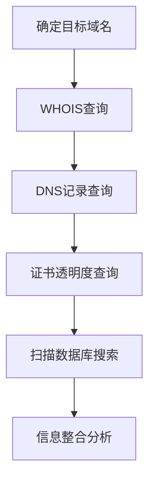

# 搜索开放技术数据库 (T1596)

## 一句话通俗理解

> **搜索开放技术数据库就像去"天眼查"查企业的工商信息，只不过这里查的是目标的域名、IP、证书等技术信息。**

## 难度等级

⭐⭐ 中级 - 需要了解DNS、WHOIS等网络基础知识

## 技术描述

**通俗解释：**
互联网上有很多公开的技术数据库，记录着每个网站的域名注册信息、DNS配置、SSL证书等技术细节。攻击者不需要直接扫描目标，只需要查询这些数据库就能获取大量目标的基础设施信息。这种方式比主动扫描更隐蔽，因为不会在目标系统上留下任何痕迹。

**技术原理：**
搜索开放技术数据库（T1596）是指攻击者查询公开可用的技术数据库和存储库，收集目标组织的互联网基础设施信息。这些数据库由第三方持续索引互联网，攻击者利用这些现成的数据源获取情报。

主要的技术数据库类型包括：
- **DNS/被动DNS**：域名解析记录、历史DNS数据
- **WHOIS**：域名注册信息（注册人、注册商、到期时间等）
- **数字证书**：SSL/TLS证书信息，可以发现子域名和关联服务
- **CDN**：内容分发网络的节点信息
- **扫描数据库**：Shodan、Censys、FOFA等互联网扫描数据库

**用途与影响：**
收集到的技术情报主要用于：
- 映射目标的互联网暴露面
- 发现子域名和关联服务
- 识别技术栈和软件版本
- 规划主动扫描和漏洞利用

## 子技术列表

**该技术共有 5 个子技术：**

| 子技术ID | 中文名称 | 通俗解释 |
|----------|---------|---------|
| T1596.001 | DNS/被动DNS | 查询域名的DNS解析记录和历史变化 |
| T1596.002 | WHOIS | 查询域名的注册信息，如注册人、注册时间 |
| T1596.003 | 数字证书 | 查询SSL/TLS证书信息，发现子域名和服务 |
| T1596.004 | CDN | 查询内容分发网络的节点信息 |
| T1596.005 | 扫描数据库 | 使用Shodan、Censys等平台查询暴露的服务和设备 |

<details>
<summary><strong>展开查看各子技术详细说明</strong></summary>

各子技术详细说明请参阅独立文档：

- [T1596.001 - DNS/被动DNS](./T1596/T1596.001-DNS-Passive-DNS-DNS.md) — 查目标的DNS"历史记录"
- [T1596.002 - WHOIS查询](./T1596/T1596.002-WHOIS-WHOIS.md) — 查域名的"户口本"
- [T1596.003 - 数字证书](./T1596/T1596.003-Digital-Certificates.md) — 通过SSL证书找到目标的所有子域名
- [T1596.004 - CDN服务](./T1596/T1596.004-CDN-CDN.md) — 了解目标用了哪个CDN加速
- [T1596.005 - 扫描数据库](./T1596/T1596.005-Scan-Databases.md) — 用Shodan搜目标暴露了什么设备在网上

</details>

## 攻击流程

### 典型攻击流程

```
确定目标域名 --> WHOIS查询 --> DNS记录查询 --> 证书透明度查询 --> 扫描数据库搜索 --> 信息整合分析
```



**步骤详解：**

1. **确定目标域名**
   - 通俗描述：确定要侦察的目标组织的主域名
   - 技术细节：确认目标的标志性域名和所有子域名
   - 常用工具：无

2. **WHOIS查询**
   - 通俗描述：查询域名注册信息
   - 技术细节：使用whois命令或ICANN Lookup
   - 常用工具：whois、ICANN Lookup

3. **DNS记录查询**
   - 通俗描述：查询A、MX、TXT、NS等DNS记录
   - 技术细节：使用dig、nslookup等工具
   - 常用工具：dig、nslookup

4. **证书透明度查询**
   - 通俗描述：通过crt.sh查询SSL证书，发现子域名
   - 技术细节：查询证书透明度日志
   - 常用工具：crt.sh

5. **扫描数据库搜索**
   - 通俗描述：在Shodan、Censys中搜索目标的暴露资产
   - 技术细节：使用平台搜索语法精确匹配
   - 常用工具：Shodan、Censys、FOFA

6. **信息整合分析**
   - 通俗描述：将多个来源的信息整合成完整的目标画像
   - 技术细节：关联多个数据源的信息
   - 常用工具：Maltego、Recon-ng

## 真实案例

### 案例1：APT28和Kimsuky利用WHOIS和DNS进行基础设施侦察

- **时间**: 2020-2024年
- **目标**: 全球多个组织的域名和DNS基础设施
- **攻击组织**: APT28、Kimsuky
- **手法**: APT28和Kimsuky利用公开的WHOIS数据库和DNS查询服务收集目标组织的域名注册详情和DNS记录。攻击者使用who.is、ICANN Lookup等服务查询注册信息，使用DNS Dumpster、SecurityTrails等工具枚举DNS记录
- **影响**: 多个组织的域名和DNS基础设施被全面映射
- **参考链接**: [CISA: APT28 Advisory](https://www.cisa.gov/news-events/cybersecurity-advisories/aa23-108a)

### 案例2：APT41利用FOFA平台进行被动扫描

- **时间**: 2021-2024年
- **目标**: 全球多个行业的组织
- **攻击组织**: APT41
- **手法**: APT41特别使用中国的FOFA平台进行被动互联网扫描，查询特定IP范围、域名和SSL证书指纹，精准定位目标组织的资产。这种方法使攻击者能够在不直接交互的情况下识别暴露资产
- **影响**: 多个行业的组织资产被映射
- **参考链接**: [Group-IB: APT41](https://www.group-ib.com/blog/apt41-world-tour-2021/)

### 案例3：Volt Typhoon利用多个扫描数据库进行关键基础设施侦察

- **时间**: 2023-2025年
- **目标**: 美国关键基础设施组织
- **攻击组织**: Volt Typhoon
- **手法**: Volt Typhoon利用Shodan、Censys和FOFA等多个公开扫描数据库，应用搜索过滤器从数十亿条记录中精准定位目标组织的资产。这些信息被用于规划对关键基础设施的精确入侵
- **影响**: 关键基础设施系统的暴露资产被全面识别
- **参考链接**: [CISA: Volt Typhoon Advisory](https://www.cisa.gov/news-events/cybersecurity-advisories/aa24-038a)

### 案例4：2025-2026年AI增强的被动扫描

- **时间**: 2025-2026年
- **目标**: 全球各行业组织
- **攻击组织**: 多个APT组织
- **手法**: 根据Mandiant M-Trends 2026报告，攻击者开始使用AI代理自动化查询多个技术数据库，自动关联WHOIS、DNS、证书和扫描数据库的信息。AI驱动的侦察工具能够在数小时内建立目标组织的完整基础设施画像。Cofense 2026报告指出AI加速了攻击速度，恶意邮件攻击达到每19秒一次
- **影响**: 开放式数据库侦察的效率和覆盖范围大幅提升
- **参考链接**: [Mandiant M-Trends 2026](https://services.google.com/fh/files/misc/m-trends-2026-executive-edition-en.pdf)

## 红队视角

> ⚠️ **免责声明**：以下内容仅用于合法的安全测试、渗透测试和教育目的。未经授权对他人系统进行测试是违法行为。

### 实战技巧

1. **Shodan搜索语法**
   - `org:"Company Name"` - 搜索目标组织的资产
   - `hostname:"target.com"` - 搜索目标域名的资产
   - `ssl.cert.subject.CN:"target.com"` - 搜索SSL证书匹配的资产
2. **Censys搜索**：使用Censys的高级查询语言搜索证书和主机
3. **FOFA搜索**：使用FOFA的语法搜索中国地区的资产
4. **证书透明度**：通过crt.sh查询SSL证书发现子域名
5. **被动DNS**：使用SecurityTrails查询历史DNS记录

### 常用工具

| 工具名称 | 用途 | 平台 | 链接 |
|----------|------|------|------|
| Shodan | 互联网设备搜索引擎 | Web | [Shodan](https://www.shodan.io/) |
| Censys | 互联网资产搜索引擎 | Web | [Censys](https://censys.io/) |
| FOFA | 中国互联网资产搜索引擎 | Web | [FOFA](https://fofa.info/) |
| SecurityTrails | 被动DNS和域名情报 | Web | [SecurityTrails](https://securitytrails.com/) |
| crt.sh | 证书透明度查询 | Web | [crt.sh](https://crt.sh/) |

### 注意事项

- 搜索开放技术数据库是完全被动的，不会被目标检测到
- 不同平台的数据覆盖范围不同，需要综合使用
- 数据可能有延迟，不一定是实时的

## 蓝队视角

### 检测要点

1. **信息暴露审计**：定期审计组织在公开技术数据库中的暴露信息
2. **证书监控**：监控组织域名的证书透明度日志
3. **资产发现**：使用相同的工具审计自己的暴露面
4. **DNS监控**：监控组织域名的DNS记录变化

### 监控建议

- 定期使用Shodan等工具审计组织的暴露资产
- 监控证书透明度日志中的新证书
- 使用被动DNS服务监控域名变化

## 检测建议

### 网络层检测

**检测方法：** 监控证书透明度日志中的新证书

**具体规则/命令示例：**
```bash
# 使用certspotter监控新证书
certspotter example.com
```

### 主机层检测

**检测方法：** 监控DNS记录变化

**Windows事件ID：**
- 事件ID 8001：DNS服务器事件
- 事件ID 5156：网络连接

**Linux日志：**
- 日志文件：`/var/log/named.log`
- 关键字段：DNS查询和区域传输记录

### 应用层检测

**Sigma规则示例：**
```yaml
title: Certificate Transparency Monitoring
status: experimental
description: Detect unexpected SSL certificate issuance for monitored domains
logsource:
    category: certificate
    product: ct
detection:
    selection:
        Domain: target.com
    condition: selection
level: high
tags:
    - attack.t1596
```

## 缓解措施

### 优先级1：关键措施

**措施名称：** 最小化信息暴露

**具体实施步骤：**
1. 使用域名隐私服务隐藏注册信息
2. 最小化DNS记录中的敏感信息
3. 定期审计暴露的技术信息

### 优先级2：重要措施

**措施名称：** 资产发现和管理

**具体实施步骤：**
1. 维护组织互联网资产的准确清单
2. 定期扫描边界识别未授权暴露
3. 确保所有资产都有适当的安全控制

**配置示例：**
```bash
# 使用Shodan监控暴露资产
shodan search "org:CompanyName" --limit 100
```

### 优先级3：建议措施

**措施名称：** 网络分段和访问控制

**具体实施步骤：**
1. 实施严格的网络分段
2. 限制面向公众的服务暴露面
3. 使用防火墙控制网络流量

### MITRE ATT&CK 缓解措施映射

| 缓解措施ID | 缓解措施名称 | 适用性 | 说明 |
|------------|-------------|--------|------|
| M1021 | 限制Web内容 | 部分适用 | 管理技术信息暴露 |
| M1030 | 网络分段 | 适用 | 限制暴露面 |
| M1035 | 数据分类 | 部分适用 | 保护技术信息 |
| M1017 | 用户培训 | 部分适用 | 培训信息保护意识 |

## 动手实验

> ⚠️ **重要提示**：所有实验必须在隔离的实验室环境中进行，禁止对未授权的真实系统进行测试。

### 实验环境准备

**推荐靶场/实验平台：**

| 平台名称 | 类型 | 难度 | 链接 |
|----------|------|------|------|
| TryHackMe - OSINT | 虚拟靶场 | 初级 | [TryHackMe](https://tryhackme.com) |
| HackTheBox | CTF | 中级 | [HackTheBox](https://hackthebox.com) |

**所需工具：**
- crt.sh：证书透明度查询
- Shodan：设备搜索引擎

### 实验1：Shodan搜索练习（初级）

**实验目标：** 练习使用Shodan的各种搜索语法

**实验步骤：**
1. 注册Shodan账户
2. 使用 `org:"Company Name"` 搜索目标组织的资产
3. 使用 `hostname:"target.com"` 搜索域名资产

**预期结果：** 发现目标组织在互联网上的暴露资产

**学习要点：** 理解Shodan搜索语法和被动侦察的价值

### 实验2：证书透明度查询（中级）

**实验目标：** 使用crt.sh查询SSL证书发现子域名

**实验步骤：**
1. 访问crt.sh
2. 搜索 `%.target.com`
3. 分析发现的子域名和关联服务

**预期结果：** 发现目标域名的所有子域名和相关证书信息

**学习要点：** 理解证书透明度日志在侦察中的作用

## 术语解释

| 术语 | 英文原名 | 通俗解释 |
|------|----------|----------|
| DNS | Domain Name System | 域名系统，将域名转换为IP地址的系统，像电话本 |
| WHOIS | WHOIS | 查询域名注册信息的协议和数据库，像查房产证 |
| SSL/TLS | SSL/TLS | 安全套接层/传输层安全协议，用于加密网络通信 |
| 证书透明度 | Certificate Transparency | 公开记录所有SSL/TLS证书的系统，像房产登记系统 |
| CDN | Content Delivery Network | 内容分发网络，加速网站访问的全球服务器网络 |
| 被动DNS | Passive DNS | 历史DNS数据的聚合服务 |
| IP地址 | IP Address | 互联网协议地址，网络中设备的唯一标识 |
| 子域名 | Subdomain | 主域名下的下级域名（如mail.example.com） |

## 参考资料

### 官方文档

- [MITRE ATT&CK - 搜索开放技术数据库 (T1596)](https://attack.mitre.org/techniques/T1596/)
- [MITRE ATT&CK - DNS/被动DNS (T1596.001)](https://attack.mitre.org/techniques/T1596/001)
- [MITRE ATT&CK - WHOIS (T1596.002)](https://attack.mitre.org/techniques/T1596/002)
- [MITRE ATT&CK - 数字证书 (T1596.003)](https://attack.mitre.org/techniques/T1596/003)
- [MITRE ATT&CK - CDN (T1596.004)](https://attack.mitre.org/techniques/T1596/004)
- [MITRE ATT&CK - 扫描数据库 (T1596.005)](https://attack.mitre.org/techniques/T1596/005)

### 安全报告

- [CISA: Volt Typhoon Advisory](https://www.cisa.gov/news-events/cybersecurity-advisories/aa24-038a) - 扫描数据库用于关键基础设施侦察
- [Mandiant M-Trends 2026](https://services.google.com/fh/files/misc/m-trends-2026-executive-edition-en.pdf)
- [CrowdStrike 2026 Global Threat Report](https://www.crowdstrike.com/global-threat-report/)

### 工具与资源

- [Shodan](https://www.shodan.io/) - 互联网设备搜索引擎
- [Censys](https://censys.io/) - 互联网资产搜索引擎
- [crt.sh](https://crt.sh/) - 证书透明度查询

### 学习资料

- [Startup Defense: T1596 Analysis](https://www.startupdefense.io/mitre-attack-techniques/t1596-search-open-technical-databases)
