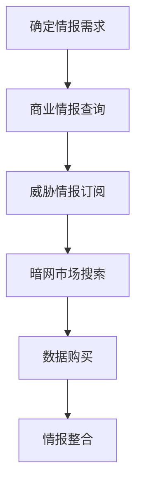

# 搜索闭源资料 (T1597)

## 一句话通俗理解

> **搜索闭源资料就像花钱买"情报"，从付费平台和地下市场获取公开渠道找不到的深度信息。**

## 难度等级

⭐⭐⭐ 高级 - 需要资金投入和暗网访问经验

## 技术描述

**通俗解释：**
公开渠道能收集到的信息有限，有些更详细、更敏感的信息需要花钱买。攻击者会订阅商业情报平台、购买威胁情报报告，甚至在暗网市场上购买泄露的数据库和凭证。这些付费来源通常能提供比公开来源更准确、更及时的情报。

**技术原理：**
搜索闭源资料（T1597）是指攻击者从付费、私有或其他不可自由获取的来源中搜索和收集目标信息。这些来源包括：

- **威胁情报供应商**：付费的威胁情报feeds和门户，提供关于攻击者工具、技术和程序的信息
- **商业情报平台**：ZoomInfo、RocketReach、CrunchBase等，提供企业的详细联系和组织信息
- **数据经纪人**：收集和出售个人数据的公司
- **地下市场**：暗网中出售泄露凭证、数据库的市场

**用途与影响：**
闭源信息的主要价值在于：
- 获取比公开来源更详细的目标信息
- 获得泄露的凭证和会话令牌
- 了解防御者对攻击者的了解程度
- 调整攻击策略以规避检测

## 子技术列表

**该技术共有 2 个子技术：**

| 子技术ID | 中文名称 | 通俗解释 |
|----------|---------|---------|
| T1597.001 | 威胁情报供应商 | 订阅付费的威胁情报服务，了解防御者的检测能力 |
| T1597.002 | 购买技术数据 | 从商业平台或地下市场购买目标的技术信息和凭证 |

<details>
<summary><strong>展开查看各子技术详细说明</strong></summary>

### T1597.001 - 威胁情报供应商

**通俗理解：** 花钱订阅安全公司的情报，了解自己有没有被盯上

**详细说明：**
攻击者订阅Recorded Future、CrowdStrike等威胁情报服务，了解防御者对自己的了解程度。

### T1597.002 - 购买技术数据

**通俗理解：** 从暗网"商贩"手里买目标的泄露数据

**详细说明：**
从暗网市场或数据经纪人处购买目标的泄露凭证、数据库转储等技术数据。

</details>

## 攻击流程

### 典型攻击流程

```
确定情报需求 --> 商业情报查询 --> 威胁情报订阅 --> 暗网市场搜索 --> 数据购买 --> 情报整合
```



**步骤详解：**

1. **确定情报需求**
   - 通俗描述：确定需要哪些类型的闭源信息
   - 技术细节：评估当前信息缺口，确定需要付费获取的情报类型
   - 常用工具：无

2. **商业情报查询**
   - 通俗描述：使用ZoomInfo等平台查询目标企业的详细信息
   - 技术细节：利用商业信息平台的筛选功能精准定位
   - 常用工具：ZoomInfo、RocketReach

3. **威胁情报订阅**
   - 通俗描述：订阅威胁情报服务，了解防御者的检测能力
   - 技术细节：监控安全公司的威胁情报feed
   - 常用工具：Recorded Future、AlienVault OTX

4. **暗网市场搜索**
   - 通俗描述：在暗网市场搜索目标的泄露凭证和数据库
   - 技术细节：使用Tor浏览器访问暗网市场
   - 常用工具：Tor Browser

5. **数据购买**
   - 通俗描述：使用加密货币购买所需的数据
   - 技术细节：通过加密货币交易完成匿名购买
   - 常用工具：加密货币钱包

6. **情报整合**
   - 通俗描述：将闭源信息与公开信息整合
   - 技术细节：建立完整的目标画像
   - 常用工具：Maltego

## 真实案例

### 案例1：EXOTIC LILY利用商业情报平台进行目标人员研究

- **时间**: 2021-2024年
- **目标**: 全球多个组织的员工
- **攻击组织**: EXOTIC LILY
- **手法**: EXOTIC LILY利用RocketReach和CrunchBase等付费商业情报平台收集目标个体的详细信息，包括联系详情、组织角色和业务关系。攻击者从这些服务中获取信息后，创建虚假人设冒充目标组织的员工，发送高度可信的钓鱼邮件
- **影响**: 多个组织的员工和社会活动人士被针对
- **参考链接**: [Recorded Future: EXOTIC LILY](https://www.recordedfuture.com/exotic-lily-target-society)

### 案例2：威胁情报供应商数据被用于规避检测

- **时间**: 持续进行中
- **目标**: 各种威胁组织
- **攻击组织**: 多个APT组织
- **手法**: 高级威胁组织会访问付费的威胁情报供应商数据和安全报告，了解防御者对其TTPs的了解程度。通过监控这些来源，攻击者可以调整策略以规避已知的检测方法
- **影响**: 攻击者据此调整TTPs，提高隐蔽性
- **参考链接**: [Mandiant: Threat Intelligence Anti-Patterns](https://www.mandiant.com/resources/blog/threat-intelligence-anti-patterns)

### 案例3：LAPSUS$从地下市场购买凭证

- **时间**: 2021-2022年
- **目标**: 多家全球科技和电信公司
- **攻击组织**: LAPSUS$
- **手法**: LAPSUS$从地下市场和网络犯罪论坛购买被盗凭证数据库和会话令牌，使用加密货币支付以保持匿名。这些购买的凭证被用于对Okta、NVIDIA和Samsung等公司的攻击
- **影响**: 多家财富500强公司的内部系统被入侵
- **参考链接**: [Mandiant: LAPSUS$](https://www.mandiant.com/resources/blog/lapsus-actor-takedown)

### 案例4：2025年AI增强的闭源情报分析

- **时间**: 2025-2026年
- **目标**: 全球各行业组织
- **攻击组织**: 多个APT组织
- **手法**: 根据Anthropic 2026年LLM ATT&CK Navigator报告，攻击者使用LLM高效分析威胁情报供应商的报告和安全公告，快速理解防御者对其TTPs的了解程度，并自动调整攻击策略。AI使这一过程从数小时缩短到数分钟
- **影响**: 攻击者从闭源情报中提取价值的速度大幅提升
- **参考链接**: [Anthropic LLM ATT&CK Navigator](https://red.anthropic.com/2026/attack-navigator/)

## 红队视角

> ⚠️ **免责声明**：以下内容仅用于合法的安全测试、渗透测试和教育目的。未经授权对他人系统进行测试是违法行为。

### 实战技巧

1. **商业情报平台**：使用ZoomInfo、RocketReach等平台获取企业联系信息
2. **威胁情报订阅**：订阅威胁情报服务了解防御趋势
3. **暗网监控**：使用暗网监控服务搜索泄露的凭证
4. **加密货币支付**：使用加密货币进行匿名购买
5. **数据验证**：交叉验证购买数据的准确性

### 常用工具

| 工具名称 | 用途 | 平台 | 链接 |
|----------|------|------|------|
| ZoomInfo | 企业商业情报平台 | Web | [ZoomInfo](https://www.zoominfo.com/) |
| RocketReach | 联系信息发现平台 | Web | [RocketReach](https://rocketreach.co/) |
| CrunchBase | 企业信息数据库 | Web | [CrunchBase](https://www.crunchbase.com/) |
| Recorded Future | 威胁情报平台 | Web | [Recorded Future](https://www.recordedfuture.com/) |
| AlienVault OTX | 开放的威胁情报社区 | Web | [AlienVault](https://otx.alienvault.com/) |

### 注意事项

- 暗网市场存在法律风险，参与非法交易可能触犯法律
- 购买的数据可能是过时或虚假的
- 注意操作安全，避免暴露真实身份

## 蓝队视角

### 检测要点

1. **暗网监控**：监控暗网市场中组织的泄露数据
2. **凭证泄漏检测**：订阅凭证泄漏监控服务
3. **威胁情报共享**：参与行业威胁情报共享
4. **数据分类保护**：保护敏感数据不被泄露

### 监控建议

- 订阅暗网监控服务（如SpyCloud、Recorded Future）
- 定期检查组织的凭证是否出现在泄露数据库中
- 参与行业威胁情报共享计划

## 检测建议

### 网络层检测

**检测方法：** 监控与已知暗网市场相关的加密货币交易

**具体规则/命令示例：**
```bash
# 监控Tor出口节点流量
tcpdump -i eth0 port 9001 -X | grep -E "market|buy|sell|credentials"
```

### 主机层检测

**检测方法：** 监控Tor浏览器和加密货币钱包的使用

**Windows事件ID：**
- 事件ID 4688：监控Tor浏览器进程启动
- 事件ID 5156：监控异常的网络连接

### 应用层检测

**Sigma规则示例：**
```yaml
title: Tor Browser Usage Detection
status: experimental
description: Detects Tor browser on endpoints
logsource:
    category: process_creation
    product: windows
detection:
    selection:
        Image|endswith: '\tor.exe'
        CommandLine|contains: '--default-tor'
    condition: selection
level: medium
tags:
    - attack.t1597
```

## 缓解措施

### 优先级1：关键措施

**措施名称：** 凭证泄漏监控

**具体实施步骤：**
1. 部署凭证泄漏监控服务
2. 定期检查员工凭证是否出现在泄露数据库中
3. 当检测到泄漏时强制重置密码

### 优先级2：重要措施

**措施名称：** 最小化信息暴露

**具体实施步骤：**
1. 减少在公开来源中共享的敏感信息
2. 降低攻击者从闭源资料获取价值的动机
3. 限制商业信息平台上的组织数据

### 优先级3：建议措施

**措施名称：** 威胁情报共享

**具体实施步骤：**
1. 参与行业威胁情报共享计划
2. 利用威胁情报服务获取关于新兴威胁的信息
3. 将威胁情报集成到安全控制中

### MITRE ATT&CK 缓解措施映射

| 缓解措施ID | 缓解措施名称 | 适用性 | 说明 |
|------------|-------------|--------|------|
| M1017 | 用户培训 | 部分适用 | 培训员工关于数据泄露风险 |
| M1035 | 数据分类 | 适用 | 保护敏感数据 |
| M1029 | 远程访问控制 | 部分适用 | 限制外部数据访问 |
| M1018 | 用户账户管理 | 部分适用 | 管理商业平台账户 |

## 动手实验

> ⚠️ **重要提示**：所有实验必须在隔离的实验室环境中进行，禁止对未授权的真实系统进行测试。

### 实验环境准备

**推荐靶场/实验平台：**

| 平台名称 | 类型 | 难度 | 链接 |
|----------|------|------|------|
| TryHackMe - Darkweb | 虚拟靶场 | 中级 | [TryHackMe](https://tryhackme.com) |

**所需工具：**
- Tor Browser：暗网访问
- Have I Been Pwned：凭证泄漏查询

### 实验1：商业情报平台探索（初级）

**实验目标：** 了解商业情报平台的功能和数据范围

**实验步骤：**
1. 注册ZoomInfo或类似平台试用
2. 搜索一家公开公司的信息
3. 分析平台暴露的信息类型

**预期结果：** 了解商业情报平台提供的信息类型和精度

**学习要点：** 理解商业情报平台在侦察中的价值

### 实验2：凭证泄漏检测练习（初级）

**实验目标：** 使用Have I Been Pwned检查凭证是否泄露

**实验步骤：**
1. 访问Have I Been Pwned
2. 使用自己的邮箱查询是否出现在泄露中
3. 分析泄露的来源和影响

**预期结果：** 了解自己的邮箱是否在历史泄露事件中出现过

**学习要点：** 理解凭证泄漏的规模和长期风险

## 术语解释

| 术语 | 英文原名 | 通俗解释 |
|------|----------|----------|
| 暗网 | Dark Web | 需要特殊软件（如Tor）才能访问的网络，常用于非法交易 |
| 威胁情报 | Threat Intelligence | 关于攻击者活动、工具和策略的情报信息 |
| 数据经纪人 | Data Broker | 收集和出售个人数据的公司或个人 |
| 加密货币 | Cryptocurrency | 去中心化的数字货币，如比特币，常用于匿名支付 |
| 会话令牌 | Session Token | 用于维持用户登录状态的凭证，被盗后可冒充用户 |
| TTPs | Tactics, Techniques, Procedures | 战术、技术和程序，攻击者的行为模式 |
| 凭证 | Credential | 用户名和密码等身份验证信息 |
| OSINT | Open Source Intelligence | 开源情报，从公开来源收集的情报 |

## 参考资料

### 官方文档

- [MITRE ATT&CK - 搜索闭源资料 (T1597)](https://attack.mitre.org/techniques/T1597/)
- [MITRE ATT&CK - 威胁情报供应商 (T1597.001)](https://attack.mitre.org/techniques/T1597/001)
- [MITRE ATT&CK - 购买技术数据 (T1597.002)](https://attack.mitre.org/techniques/T1597/002)

### 安全报告

- [Recorded Future: EXOTIC LILY](https://www.recordedfuture.com/exotic-lily-target-society) - 商业情报被用于侦察的案例
- [Anthropic LLM ATT&CK Navigator](https://red.anthropic.com/2026/attack-navigator/) - AI增强的情报分析
- [Mandiant M-Trends 2026](https://services.google.com/fh/files/misc/m-trends-2026-executive-edition-en.pdf)

### 工具与资源

- [Have I Been Pwned](https://haveibeenpwned.com/) - 凭证泄露查询

### 学习资料

- [Startup Defense: T1597 Analysis](https://www.startupdefense.io/mitre-attack-techniques/t1597-search-closed-sources)
