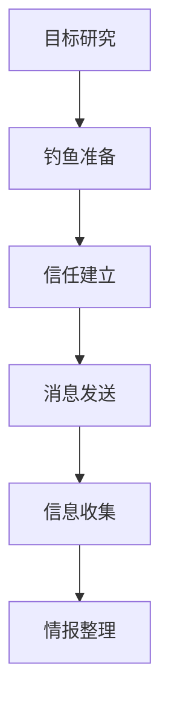

# 钓鱼获取信息 (T1598)

## 一句话通俗理解

> **钓鱼获取信息就像骗子假装成银行客服打电话问你的密码，目的不是偷钱，而是先套取你的个人信息。**

## 难度等级

⭐⭐ 中级 - 需要社会工程学技巧和钓鱼工具使用经验

## 技术描述

**通俗解释：**
你可能收到过这样的短信："您的银行账户异常，请点击链接验证身份"。这就是钓鱼。攻击者通过发送看似可信的邮件、短信或电话，诱使目标主动交出密码、个人信息等敏感数据。与直接入侵系统相比，钓鱼获取信息是一种"攻心"战术，利用人的信任和恐惧来获取情报。

**技术原理：**
钓鱼获取信息（T1598）是指攻击者通过欺骗性通信手段，诱使目标自愿透露敏感信息。与旨在交付恶意代码的传统钓鱼不同，此技术专注于信息收集作为主要目标。

攻击者使用各种社会工程学技巧：
- **建立信任**：伪装成可信实体（如IT支持、银行、合作伙伴）
- **制造紧迫感**：声称账户异常、需要立即验证
- **利用好奇心**：提供看似有价值的文档或信息

攻击渠道包括：
- **电子邮件**：最常见的钓鱼渠道
- **社交媒体**：通过LinkedIn、微信等平台发送消息
- **语音电话**：冒充客服或IT支持打电话
- **短信/即时消息**：发送包含链接的短信

**用途与影响：**
钓鱼获取的信息主要用于：
- 窃取凭证用于后续入侵
- 收集个人信息用于更精准的钓鱼
- 获取组织内部信息用于攻击规划
- 绕过多因素认证

## 子技术列表

**该技术共有 4 个子技术：**

| 子技术ID | 中文名称 | 通俗解释 |
|----------|---------|---------|
| T1598.001 | 服务型钓鱼 | 通过第三方服务（如社交媒体、个人邮箱）发送钓鱼消息 |
| T1598.002 | 附件型钓鱼 | 发送包含恶意附件的钓鱼邮件，附件中隐藏凭证收集机制 |
| T1598.003 | 链接型钓鱼 | 发送包含钓鱼链接的邮件或消息，指向伪造的登录页面 |
| T1598.004 | 语音型钓鱼 | 通过电话冒充可信身份，骗取目标的敏感信息 |

<details>
<summary><strong>展开查看各子技术详细说明</strong></summary>

各子技术详细说明请参阅独立文档：

- [T1598.001 - 服务型钓鱼](./T1598/T1598.001-Service-Phishing.md) — 用假社交账号给目标发私信
- [T1598.002 - 附件型钓鱼](./T1598/T1598.002-Attachment-Phishing.md) — 发带毒的文档，打开后自动窃取信息
- [T1598.003 - 链接型钓鱼](./T1598/T1598.003-Link-Phishing.md) — 发假链接，点进去后输入的信息直接发给攻击者
- [T1598.004 - 语音型钓鱼](./T1598/T1598.004-Voice-Phishing.md) — 冒充xxx部门打电话来套取信息

</details>

## 攻击流程

### 典型攻击流程

```
目标研究 --> 钓鱼准备 --> 信任建立 --> 消息发送 --> 信息收集 --> 情报整理
```



**步骤详解：**

1. **目标研究**
   - 通俗描述：收集目标的姓名、职位、联系方式等信息
   - 技术细节：通过OSINT收集目标的基本信息
   - 常用工具：theHarvester、LinkedIn

2. **钓鱼准备**
   - 通俗描述：创建伪造的登录页面或准备恶意附件
   - 技术细节：使用钓鱼工具包搭建钓鱼页面
   - 常用工具：Evilginx2、Gophish

3. **信任建立**
   - 通俗描述：伪装成可信实体（如IT支持、银行、合作伙伴）
   - 技术细节：使用域名伪装、邮件欺骗技术
   - 常用工具：SET

4. **消息发送**
   - 通俗描述：通过邮件、电话或社交媒体发送钓鱼消息
   - 技术细节：选择合适的发送渠道和时间
   - 常用工具：Gophish、King Phisher

5. **信息收集**
   - 通俗描述：诱使目标输入凭证或透露敏感信息
   - 技术细节：捕获并验证目标输入的信息
   - 常用工具：Evilginx2

6. **情报整理**
   - 通俗描述：将收集到的信息整理成可用的情报
   - 技术细节：验证凭证有效性，分类整理
   - 常用工具：无

## 真实案例

### 案例1：Scattered Spider利用语音钓鱼绕过MFA

- **时间**: 2022-2025年
- **目标**: 电信、零售和科技公司
- **攻击组织**: Scattered Spider
- **手法**: Scattered Spider通过电话联系目标员工，冒充IT支持或安全团队，诱使受害者访问伪造的凭证收集网站或直接透露MFA代码。该组织特别擅长绕过基于推送通知的MFA，因为他们可以实时说服受害者批准身份验证请求。2024年该组织扩展到零售、航空和保险行业
- **影响**: 多家大型企业被入侵，包括MGM Resorts等
- **参考链接**: [CrowdStrike: Scattered Spider](https://www.crowdstrike.com/blog/scattered-spider-attempts-to-avoid-detection/)

### 案例2：APT28利用鱼叉式钓鱼链接进行凭证收集

- **时间**: 2021-2025年
- **目标**: 全球多个组织的员工
- **攻击组织**: APT28（Fancy Bear）
- **手法**: APT28发起大规模的鱼叉式钓鱼链接活动，使用伪造的企业单点登录（SSO）页面。攻击者使用URL混淆技术（如hxxp://google.com@1157586937格式）隐藏真实目的地，并结合浏览器内浏览器（BitB）技术绕过传统的URL验证
- **影响**: 多个政府机构和军事组织的凭证被窃取
- **参考链接**: [Microsoft: APT28 Targeting](https://www.microsoft.com/en-us/security/blog/2022/06/22/apt28-uses-lofty-ambition-to-target-new-sectors/)

### 案例3：二维码钓鱼（Quishing）成为2024-2025年新趋势

- **时间**: 2024-2025年
- **目标**: 银行、医疗、政府和教育机构
- **攻击组织**: 多个网络犯罪组织
- **手法**: 攻击者将恶意URL嵌入QR码中，通过邮件或物理介质（如海报、停车计时器）分发。QR码可以绕过传统邮件安全过滤器，因为恶意URL嵌入在图片中而非文本中。2024年多家安全公司报告了QR码钓鱼攻击的大幅增长
- **影响**: 大量用户的凭证被窃取
- **参考链接**: [Cofense: QR Code Phishing](https://cofense.com/blog/qr-code-phishing-quishing/)

### 案例4：2025-2026年AI驱动的钓鱼攻击激增

- **时间**: 2025-2026年
- **目标**: 全球各行业组织
- **攻击组织**: 多个APT和网络犯罪组织
- **手法**: 根据Cofense 2026年报告，AI让钓鱼攻击发生频率从每42秒一次加速到每19秒一次。AI用于生成高度个性化的钓鱼邮件、自动创建伪造的登录页面、以及模拟真实的人类对话。Mandiant M-Trends 2026报告显示语音钓鱼跃升为第二大初始入侵向量（11%），而传统邮件钓鱼从14%降至6%。CrowdStrike 2026报告指出AI增强的攻击活动增长了89%
- **影响**: 钓鱼攻击的规模和精准度大幅提升，传统防御面临严峻挑战
- **参考链接**: [Cofense 2026 Report](https://cofense.com/Blog/Cofense-Report-Reveals-AI-Powered-Phishing-Accelerated-to-One-Attack-Every-19-Seconds)

## 红队视角

> ⚠️ **免责声明**：以下内容仅用于合法的安全测试、渗透测试和教育目的。未经授权对他人系统进行测试是违法行为。

### 实战技巧

1. **Gophish**：开源的钓鱼模拟平台，用于安全测试
2. **Evilginx2**：高级的中间人钓鱼框架，可以绕过MFA
3. **SET（Social Engineering Toolkit）**：社会工程学工具集
4. **QR码生成**：使用在线工具生成包含链接的QR码
5. **域名伪装**：使用相似域名（如g00gle.com）增加可信度

### 常用工具

| 工具名称 | 用途 | 平台 | 链接 |
|----------|------|------|------|
| Gophish | 钓鱼模拟和安全意识测试平台 | 全平台 | [GitHub](https://github.com/gophish/gophish) |
| Evilginx2 | 中间人钓鱼框架 | Linux | [GitHub](https://github.com/kgretzky/evilginx2) |
| SET | 社会工程学工具集 | Linux | [GitHub](https://github.com/trustedsec/social-engineer-toolkit) |
| King Phisher | 钓鱼邮件活动管理工具 | Linux | [GitHub](https://github.com/securestate/king-phisher) |
| Modlishka | 反向代理钓鱼框架 | Linux | [GitHub](https://github.com/drk1wi/Modlishka) |

### 注意事项

- 未经授权的钓鱼攻击是违法的
- 在红队评估中必须获得书面授权
- 钓鱼测试后应进行安全意识培训
- 注意不要收集过多敏感信息

## 蓝队视角

### 检测要点

1. **邮件安全网关**：部署先进的邮件安全解决方案
2. **URL分析**：检查邮件中的链接是否指向已知的钓鱼域名
3. **用户行为监控**：检测异常的登录尝试和凭证使用
4. **安全意识培训**：定期进行钓鱼模拟测试

### 监控建议

- 部署邮件安全网关（如Proofpoint、Mimecast）
- 使用URL重写和沙箱检查邮件中的链接
- 监控异常的登录尝试和凭证使用模式

## 检测建议

### 网络层检测

**检测方法：** 监控钓鱼域名的DNS查询

**具体规则/命令示例：**
```bash
# 使用被动DNS检测钓鱼域名
dig +short phishing-domain.com A
```

### 主机层检测

**检测方法：** 监控异常的登录失败和MFA挑战

**Windows事件ID：**
- 事件ID 4625：登录失败
- 事件ID 4771：Kerberos预认证失败

**Linux日志：**
- 日志文件：`/var/log/auth.log`
- 关键字段：`Failed password`

### 应用层检测

**Sigma规则示例：**
```yaml
title: Suspicious Login After Phishing
status: experimental
description: Detects login from unusual location after phishing
logsource:
    category: authentication
    product: azure
detection:
    selection:
        Location:
            - 'Russia'
            - 'China'
        EventType: 'login'
    condition: selection
level: high
tags:
    - attack.t1598
```

## 缓解措施

### 优先级1：关键措施

**措施名称：** 员工培训和意识

**具体实施步骤：**
1. 定期进行钓鱼防范培训
2. 进行模拟钓鱼攻击测试
3. 培训员工识别社会工程学迹象

### 优先级2：重要措施

**措施名称：** 技术控制

**具体实施步骤：**
1. 实施DMARC、SPF和DKIM邮件认证
2. 禁用不必要的宏和脚本执行
3. 使用电子邮件隔离和沙箱

**配置示例：**
```txt
# DNSTXT record for DMARC
_dmarc.example.com TXT "v=DMARC1; p=reject; rua=mailto:dmarc@example.com"
```

### 优先级3：建议措施

**措施名称：** 访问最小化

**具体实施步骤：**
1. 实施最小权限原则
2. 使用防钓鱼的MFA方案（如FIDO2）
3. 实施特权访问管理（PAM）

### MITRE ATT&CK 缓解措施映射

| 缓解措施ID | 缓解措施名称 | 适用性 | 说明 |
|------------|-------------|--------|------|
| M1017 | 用户培训 | 适用 | 钓鱼防范培训 |
| M1032 | 多因素认证 | 适用 | 防钓鱼MFA实施 |
| M1021 | 限制Web内容 | 部分适用 | 邮件安全网关 |
| M1042 | 应用白名单 | 部分适用 | 禁用宏和脚本 |

## 动手实验

> ⚠️ **重要提示**：所有实验必须在隔离的实验室环境中进行，禁止对未授权的真实系统进行测试。

### 实验环境准备

**推荐靶场/实验平台：**

| 平台名称 | 类型 | 难度 | 链接 |
|----------|------|------|------|
| TryHackMe - Phishing | 虚拟靶场 | 中级 | [TryHackMe](https://tryhackme.com) |

**所需工具：**
- Gophish：钓鱼模拟平台
- SET：社会工程学工具集

### 实验1：Gophish钓鱼模拟（中级）

**实验目标：** 在授权环境中使用Gophish进行钓鱼测试

**实验步骤：**
1. 安装并配置Gophish
2. 设计钓鱼邮件模板
3. 创建伪造的登录页面
4. 发送测试钓鱼邮件

**预期结果：** 成功发送钓鱼邮件并收集测试用户的凭证

**学习要点：** 理解钓鱼攻击的基本流程和工具使用

### 实验2：钓鱼邮件识别练习（初级）

**实验目标：** 学习识别钓鱼邮件的常见特征

**实验步骤：**
1. 检查邮件发送地址的完整性
2. 悬停查看链接的真实目的地
3. 分析邮件中的语法和格式异常

**预期结果：** 准确识别钓鱼邮件的可疑特征

**学习要点：** 提高对钓鱼邮件的识别能力

## 术语解释

| 术语 | 英文原名 | 通俗解释 |
|------|----------|----------|
| 钓鱼 | Phishing | 通过欺骗性通信获取敏感信息的攻击方式，像用假饵钓鱼 |
| 鱼叉式钓鱼 | Spear Phishing | 针对特定个人的定制化钓鱼攻击 |
| 语音钓鱼 | Vishing | 通过电话进行的钓鱼攻击（Voice Phishing） |
| 二维码钓鱼 | Quishing | 通过QR码进行的钓鱼攻击（QR Code Phishing） |
| MFA | Multi-Factor Authentication | 多因素认证，要求两种以上验证方式 |
| 中间人攻击 | Man-in-the-Middle | 攻击者在通信双方之间截获和修改数据的攻击 |
| PhaaS | Phishing-as-a-Service | 钓鱼即服务，降低钓鱼攻击门槛的平台 |
| DMARC | DMARC | 基于域的消息认证、报告和一致性，防止邮件欺骗 |
| FIDO2 | FIDO2 | 一种防钓鱼的硬件安全密钥认证标准 |
| URL混淆 | URL Obfuscation | 使用技术手段隐藏真实URL目的地的方法 |

## 参考资料

### 官方文档

- [MITRE ATT&CK - 钓鱼获取信息 (T1598)](https://attack.mitre.org/techniques/T1598/)
- [MITRE ATT&CK - 服务型钓鱼 (T1598.001)](https://attack.mitre.org/techniques/T1598/001)
- [MITRE ATT&CK - 附件型钓鱼 (T1598.002)](https://attack.mitre.org/techniques/T1598/002)
- [MITRE ATT&CK - 链接型钓鱼 (T1598.003)](https://attack.mitre.org/techniques/T1598/003)
- [MITRE ATT&CK - 语音型钓鱼 (T1598.004)](https://attack.mitre.org/techniques/T1598/004)

### 安全报告

- [CrowdStrike: Scattered Spider](https://www.crowdstrike.com/blog/scattered-spider-attempts-to-avoid-detection/)
- [Cofense 2026 Report](https://cofense.com/Blog/Cofense-Report-Reveals-AI-Powered-Phishing-Accelerated-to-One-Attack-Every-19-Seconds) - AI驱动的钓鱼攻击趋势
- [Mandiant M-Trends 2026](https://services.google.com/fh/files/misc/m-trends-2026-executive-edition-en.pdf) - 语音钓鱼成为第二大入侵向量
- [CrowdStrike 2026 Global Threat Report](https://www.crowdstrike.com/global-threat-report/)

### 工具与资源

- [Gophish](https://github.com/gophish/gophish) - 钓鱼模拟平台
- [Evilginx2](https://github.com/kgretzky/evilginx2) - 中间人钓鱼框架

### 学习资料

- [CISA: Phishing Guidance](https://www.cisa.gov/stopransomware/phishing-guidance)
