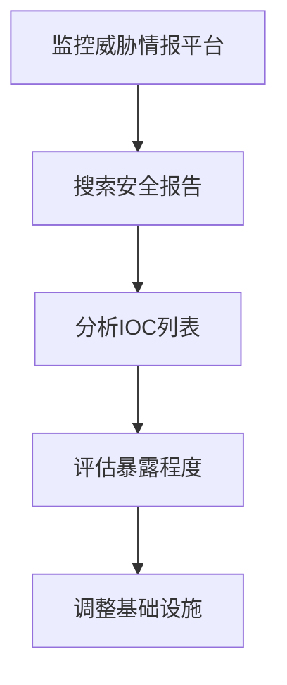

# 搜索威胁供应商数据 (T1681)

## 一句话通俗理解

> **搜索威胁供应商数据就像小偷去看警察的通缉令，了解警察掌握了多少自己的线索，好调整逃跑策略。**

## 难度等级

⭐⭐⭐ 高级 - 需要深入了解威胁情报生态和反侦察意识

## 技术描述

**通俗解释：**
高级攻击者不仅关心目标的信息，还关心防御者对自己的了解程度。他们会查看安全公司发布的威胁报告、漏洞公告和IOC（入侵指标）列表，了解自己的工具和基础设施是否已经被发现。如果发现自己的IP地址或恶意软件已经被曝光，他们就会迅速更换基础设施，避免被追踪。

**技术原理：**
搜索威胁供应商数据（T1681）是指攻击者监控威胁情报平台、安全供应商报告和开源情报（OSINT）来源，收集关于自己活动的信息。这是一种"反侦察"行为，帮助攻击者：

- **识别暴露**：了解自己的基础设施和工具是否已被检测和归因
- **理解IOC**：知道哪些入侵指标正在被共享
- **评估防御能力**：了解防御者使用了哪些检测方法
- **调整策略**：修改TTPs以规避已知的检测方法
- **评估OPSEC**：评价自己的操作安全措施是否有效

这种技术对长期运营的APT组织特别重要，因为他们需要在数月甚至数年的攻击活动中保持隐蔽。

**用途与影响：**
搜索威胁供应商数据的主要目的：
- 维护操作安全（OPSEC）
- 规避检测和归因
- 优化攻击策略
- 及时更换被暴露的基础设施

## 子技术列表

该技术目前没有定义子技术。

## 攻击流程

### 典型攻击流程

```
监控威胁情报平台 --> 搜索安全报告 --> 分析IOC列表 --> 评估暴露程度 --> 调整基础设施
```



**步骤详解：**

1. **监控威胁情报平台**
   - 通俗描述：注册并监控VirusTotal、Maltrail等平台
   - 技术细节：设置自动监控脚本，检测新的IOC
   - 常用工具：VirusTotal、AlienVault OTX

2. **搜索安全报告**
   - 通俗描述：搜索安全公司发布的关于自己的威胁报告
   - 技术细节：持续关注CrowdStrike、Mandiant等公司的博客
   - 常用工具：RSS阅读器、Google Alerts

3. **分析IOC列表**
   - 通俗描述：检查自己的IP、域名、恶意软件哈希是否出现在IOC列表中
   - 技术细节：自动化比对IOC和自己的基础设施清单
   - 常用工具：自定义脚本

4. **评估暴露程度**
   - 通俗描述：分析防御者对自己的了解程度
   - 技术细节：评估哪些工具和技术已经被发现
   - 常用工具：无

5. **调整基础设施**
   - 通俗描述：更换已被暴露的IP、域名和服务器
   - 技术细节：部署新的C2基础设施，修改恶意软件签名
   - 常用工具：无

## 真实案例

### 案例1：Contagious Interview监控威胁情报平台

- **时间**: 2023-2025年
- **目标**: 安全研究人员和开发者
- **攻击组织**: Contagious Interview
- **手法**: Contagious Interview组织注册了Validin、VirusTotal和Maltrail等威胁情报平台的账户，监控关于自己基础设施的报告。当发现自己的活动已被检测时，该组织会迅速部署新的基础设施，同时保持有限的变更以降低再次被检测的风险
- **影响**: 该组织能够在数月内持续活动而不被完全归因
- **参考链接**: [SentinelOne: Contagious Interview](https://www.sentinelone.com/labs/contagious-interview-threat-actors-scout-cyber-intel-platforms-reveal-plans-and-ops/)

### 案例2：UNC3886快速更换被暴露的基础设施

- **时间**: 2023-2024年
- **目标**: VMware ESXi环境
- **攻击组织**: UNC3886
- **手法**: UNC3886密切监控安全公司发布的关于其VMware ESXi零日利用活动的威胁报告。当安全供应商发布相关IOC（如特定的文件哈希、域名或IP地址）时，UNC3886会在一周内修改其基础设施，替换了被曝光的指标，展示了快速适应以规避检测的能力
- **影响**: 该组织的攻击活动能够持续较长时间
- **参考链接**: [Google Cloud: UNC3886](https://cloud.google.com/blog/topics/threat-intelligence/vmware-esxi-zero-day-bypass/)

### 案例3：APT28利用LLM研究安全报告

- **时间**: 2024年
- **目标**: 全球多个组织
- **攻击组织**: APT28（Fancy Bear）
- **手法**: APT28利用大型语言模型加速分析安全公司发布的威胁报告，快速理解防御者对其TTPs的了解程度。这种方法使攻击者能够更高效地调整策略，保持在防御者之前的领先优势
- **影响**: 攻击者能够更快地响应新的检测方法
- **参考链接**: [Microsoft: AI Threat Actors](https://www.microsoft.com/en-us/security/blog/2024/02/14/staying-ahead-of-threat-actors-in-the-age-of-ai/)

### 案例4：2025-2026年AI自动化威胁情报分析

- **时间**: 2025-2026年
- **目标**: 全球各行业组织
- **攻击组织**: 多个APT组织
- **手法**: 根据Anthropic 2026年LLM ATT&CK Navigator报告，攻击者使用AI代理自动化分析威胁情报供应商的数据，快速提取对自己活动的检测信息。AI驱动的分析工具能够从海量的安全报告中提取与自己相关的IOC和TTPs情报，并在数分钟内完成基础设施调整决策
- **影响**: 攻击者对威胁情报的消化速度大幅提升，防御者的IOC窗口期缩短
- **参考链接**: [Anthropic LLM ATT&CK Navigator](https://red.anthropic.com/2026/attack-navigator/)

## 红队视角

> ⚠️ **免责声明**：以下内容仅用于合法的安全测试、渗透测试和教育目的。未经授权对他人系统进行测试是违法行为。

### 实战技巧

1. **监控VirusTotal**：上传自己的工具检查是否已被标记
2. **订阅威胁情报**：订阅主要安全公司的威胁情报feeds
3. **检查IOC列表**：定期检查自己的基础设施是否出现在IOC列表中
4. **使用多层基础设施**：建立可快速更换的基础设施层级
5. **混淆技术**：使用代码混淆、域名轮换等技术规避检测

### 常用工具

| 工具名称 | 用途 | 平台 | 链接 |
|----------|------|------|------|
| VirusTotal | 恶意软件和URL分析平台 | Web | [VirusTotal](https://www.virustotal.com/) |
| Maltrail | 恶意流量检测系统 | Linux | [GitHub](https://github.com/stamparm/maltrail) |
| Validin | 威胁情报平台 | Web | [Validin](https://validin.com/) |
| AlienVault OTX | 开放的威胁情报社区 | Web | [AlienVault](https://otx.alienvault.com/) |
| Censys | 互联网资产搜索 | Web | [Censys](https://censys.io/) |

### 注意事项

- 监控威胁情报平台是合法的安全研究行为
- 但利用这些信息来规避检测进行非法活动是违法的
- 红队评估中应记录并报告发现的检测能力

## 蓝队视角

### 检测要点

1. **IOC共享策略**：谨慎决定哪些IOC可以公开共享
2. **延迟发布**：考虑延迟发布敏感的IOC信息
3. **欺骗技术**：在威胁情报中植入虚假的IOC
4. **归因能力**：提高归因能力使攻击者更难判断是否被发现

### 监控建议

- 监控威胁情报平台上的异常访问
- 使用欺骗技术检测攻击者的自我侦察
- 参与威胁情报共享社区

## 检测建议

### 网络层检测

**检测方法：** 监控对威胁情报平台的异常访问

**具体规则/命令示例：**
```bash
# 监控对威胁情报平台的API访问
tcpdump -i eth0 -A | grep -E "virustotal|otx.alienvault"
```

### 主机层检测

**检测方法：** 监控IOC比对工具的异常执行

**Linux日志：**
- 日志文件：`/var/log/syslog`
- 关键字段：curl、wget对威胁情报平台的访问

### 应用层检测

**Sigma规则示例：**
```yaml
title: Threat Intelligence Platform Query
status: experimental
description: Detects queries to threat intelligence platforms from internal hosts
logsource:
    category: web_access
    product: proxy
detection:
    selection:
        Domain|contains:
            - 'virustotal.com'
            - 'alienvault.com'
            - 'validin.com'
    condition: selection
level: low
tags:
    - attack.t1681
```

## 缓解措施

### 优先级1：关键措施

**措施名称：** IOC发布策略

**具体实施步骤：**
1. 建立IOC发布的审批流程
2. 考虑延迟发布敏感的IOC信息
3. 使用分层发布策略

### 优先级2：重要措施

**措施名称：** 欺骗技术

**具体实施步骤：**
1. 在威胁情报中植入虚假信息
2. 部署蜜罐和欺骗技术
3. 使用金丝雀令牌检测信息泄露

**配置示例：**
```bash
# 部署金丝雀令牌
canarytokens --type aws_key --memo "attacker access"
```

### 优先级3：建议措施

**措施名称：** 操作安全

**具体实施步骤：**
1. 保护威胁情报的收集和分析过程
2. 限制对敏感威胁情报的访问
3. 实施严格的访问控制

### MITRE ATT&CK 缓解措施映射

| 缓解措施ID | 缓解措施名称 | 适用性 | 说明 |
|------------|-------------|--------|------|
| M1018 | 用户账户管理 | 部分适用 | 管理情报账户 |
| M1026 | 特权账户管理 | 部分适用 | 限制情报系统访问 |
| M1037 | 欺骗技术 | 适用 | 部署虚假IOC和蜜罐 |
| M1013 | 威胁情报共享 | 部分适用 | 参与情报共享社区 |

## 动手实验

> ⚠️ **重要提示**：所有实验必须在隔离的实验室环境中进行，禁止对未授权的真实系统进行测试。

### 实验环境准备

**推荐靶场/实验平台：**

| 平台名称 | 类型 | 难度 | 链接 |
|----------|------|------|------|
| VirusTotal | 在线工具 | 初级 | [VirusTotal](https://www.virustotal.com/) |
| AlienVault OTX | 威胁情报社区 | 免费 | [AlienVault](https://otx.alienvault.com/) |

**所需工具：**
- VirusTotal：恶意软件分析
- AlienVault OTX：威胁情报

### 实验1：威胁情报平台探索（初级）

**实验目标：** 了解威胁情报平台的功能

**实验步骤：**
1. 注册VirusTotal账户
2. 上传一个测试文件查看检测结果
3. 分析检测报告中的信息

**预期结果：** 了解VirusTotal检测报告的结构和内容

**学习要点：** 理解威胁情报平台在攻击者侦察中的作用

### 实验2：IOC分析练习（中级）

**实验目标：** 分析公开的IOC列表

**实验步骤：**
1. 从AlienVault OTX获取近期的IOC数据
2. 分析IOC的类型（IP、域名、Hash）
3. 模拟攻击者如何利用这些信息调整基础设施

**预期结果：** 理解IOC的结构和攻击者的应对策略

**学习要点：** 理解IOC的生命周期和攻击者的反侦察行为

## 术语解释

| 术语 | 英文原名 | 通俗解释 |
|------|----------|----------|
| IOC | Indicator of Compromise | 入侵指标，如恶意IP、域名、文件哈希等，就像犯罪现场留下的指纹 |
| TTPs | Tactics, Techniques, Procedures | 战术、技术和程序，攻击者的行为模式 |
| OPSEC | Operational Security | 操作安全，保护行动信息不被发现 |
| 威胁情报 | Threat Intelligence | 关于攻击者活动、工具和策略的情报信息 |
| 归因 | Attribution | 确定攻击者身份和归属的过程 |
| 欺骗技术 | Deception Technology | 使用虚假信息和陷阱检测攻击者的技术 |
| 蜜罐 | Honeypot | 模拟真实系统的陷阱，用于检测和研究攻击行为 |
| APT | Advanced Persistent Threat | 高级持续性威胁，国家级攻击组织 |
| 零日利用 | Zero-Day Exploit | 利用尚未公开的漏洞进行攻击 |
| 代码混淆 | Code Obfuscation | 修改代码使其难以分析但功能不变的技术 |

## 参考资料

### 官方文档

- [MITRE ATT&CK - 搜索威胁供应商数据 (T1681)](https://attack.mitre.org/techniques/T1681/)

### 安全报告

- [SentinelOne: Contagious Interview](https://www.sentinelone.com/labs/contagious-interview-threat-actors-scout-cyber-intel-platforms-reveal-plans-and-ops/) - 攻击者监控威胁情报平台的案例
- [Google Cloud: UNC3886](https://cloud.google.com/blog/topics/threat-intelligence/vmware-esxi-zero-day-bypass/) - 快速更换被暴露基础设施
- [Anthropic LLM ATT&CK Navigator](https://red.anthropic.com/2026/attack-navigator/) - AI在威胁情报分析中的应用
- [Microsoft: AI Threat Actors](https://www.microsoft.com/en-us/security/blog/2024/02/14/staying-ahead-of-threat-actors-in-the-age-of-ai/)

### 工具与资源

- [VirusTotal](https://www.virustotal.com/) - 恶意软件分析平台
- [AlienVault OTX](https://otx.alienvault.com/) - 开放威胁情报社区

### 学习资料

- [CISA: Threat Intelligence Guidance](https://www.cisa.gov/threat-intelligence)
