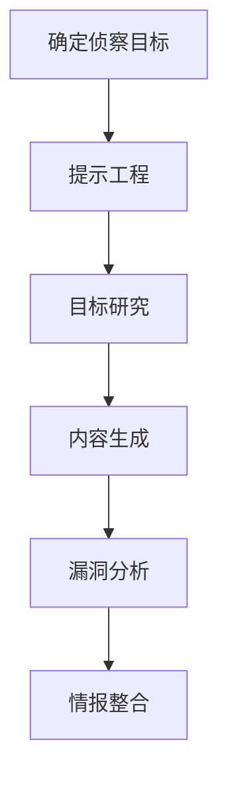

# 查询公开AI服务 (T1682)

## 一句话通俗理解

> **查询公开AI服务就像让ChatGPT当你的"军师"，帮你想办法侦察目标、写钓鱼邮件、研究漏洞。**

## 难度等级

⭐⭐ 中级 - 需要了解AI工具的使用方法和提示工程技巧

## 技术描述

**通俗解释：**
现在ChatGPT、Claude等AI工具非常强大，攻击者也在利用这些工具来提升攻击效率。他们可以让AI帮忙：研究目标公司的技术栈、生成钓鱼邮件内容、分析漏洞公告、甚至编写恶意代码。AI让攻击者能够更快、更大规模地进行侦察，同时降低了技术门槛。

**技术原理：**
查询公开AI服务（T1682）是指攻击者利用公开可用的AI服务和大型语言模型（LLM）来收集目标信息、支持攻击规划和增强攻击效果。这些服务包括：

- **AI聊天机器人**：ChatGPT、Claude、Gemini等
- **代码生成服务**：GitHub Copilot、CodeWhisperer等
- **专业AI工具**：针对安全、数据分析等领域的专业AI工具

攻击者利用AI服务进行：
- **目标侦察**：研究目标组织、技术栈和人员信息
- **社会工程学**：生成高度定制化的钓鱼内容
- **漏洞研究**：分析安全公告和漏洞详情
- **恶意软件开发**：辅助编写和优化恶意代码

**用途与影响：**
AI服务对攻击者的主要价值：
- 显著提高信息收集的速度和规模
- 降低技术门槛，使低技能攻击者也能发起复杂攻击
- 生成更自然、更可信的社会工程学内容
- 自动化重复性的侦察任务

## 子技术列表

该技术目前没有定义子技术。

## 攻击流程

### 典型攻击流程

```
确定侦察目标 --> 提示工程 --> 目标研究 --> 内容生成 --> 漏洞分析 --> 情报整合
```



**步骤详解：**

1. **确定侦察目标**
   - 通俗描述：确定需要AI辅助收集的信息类型
   - 技术细节：明确AI在侦察中扮演的角色
   - 常用工具：ChatGPT、Claude

2. **提示工程**
   - 通俗描述：设计有效的AI提示来获取所需信息
   - 技术细节：精心设计prompt以获得高质量输出
   - 常用工具：ChatGPT、Claude

3. **目标研究**
   - 通俗描述：使用AI研究目标组织、技术栈和人员信息
   - 技术细节：利用AI的知识库和推理能力
   - 常用工具：ChatGPT、Perplexity AI

4. **内容生成**
   - 通俗描述：使用AI生成钓鱼邮件、社会工程学话术
   - 技术细节：利用AI生成自然语言内容
   - 常用工具：ChatGPT、Claude

5. **漏洞分析**
   - 通俗描述：使用AI分析安全公告和漏洞详情
   - 技术细节：利用AI理解技术文档和漏洞原理
   - 常用工具：ChatGPT、Claude

6. **情报整合**
   - 通俗描述：将AI收集的信息与传统侦察结果整合
   - 技术细节：建立完整的目标画像
   - 常用工具：Obsidian、Notion

## 真实案例

### 案例1：国家行为者利用ChatGPT进行攻击链自动化

- **时间**: 2024年
- **目标**: 全球多个组织
- **攻击组织**: 多个APT组织（Charcoal Typhoon、Salmon Typhoon、APT28等）
- **手法**: 微软和OpenAI联合披露，五个国家关联的APT组织被观察到利用LLM自动化攻击链的各个阶段。具体包括：使用LLM进行目标侦察、生成钓鱼邮件内容、分析安全公告和编写恶意软件脚本。被点名的组织包括中国的Charcoal Typhoon和Salmon Typhoon、伊朗的Crimson Sandstorm、朝鲜的Emerald Sleet和俄罗斯的Forest Blizzard（APT28）
- **影响**: 多个APT组织的攻击效率得到显著提升
- **参考链接**: [Microsoft: AI Threat Actors](https://www.microsoft.com/en-us/security/blog/2024/02/14/staying-ahead-of-threat-actors-in-the-age-of-ai/)

### 案例2：APT28利用LLM研究卫星通信能力

- **时间**: 2024年
- **目标**: 航空航天和国防承包商
- **攻击组织**: APT28（Fancy Bear）
- **手法**: APT28使用LLM研究卫星和雷达技术，可能与乌克兰冲突相关。攻击者利用AI快速理解复杂的技术领域，识别潜在的攻击目标和漏洞
- **影响**: 航空航天领域成为APT28的重点目标
- **参考链接**: [Microsoft: Staying Ahead of Threat Actors](https://www.microsoft.com/en-us/security/blog/2024/02/14/staying-ahead-of-threat-actors-in-the-age-of-ai/)

### 案例3：LLMProbe自动化扫描公开LLM推理端点

- **时间**: 2026年
- **目标**: 公开可用的LLM推理端点
- **攻击组织**: 未知
- **手法**: 观察到协调的自动化HTTP请求活动，针对常见的LLM API端点（如/v1/chat、/v1/chat/completions）。攻击者遍历多个模型名称（gpt-4o、llama3、grok-2等），发送探测提示以指纹识别端点并确定是否存在无需认证的推理服务
- **影响**: 多个公开LLM服务可能被滥用
- **参考链接**: [NanoFirewall: LLMProbe](https://blog.nanofirewall.com/llmprobe-early-2026-automated-scanning-of-public-llm-inference-endpoints/)

### 案例4：2025-2026年AI代理自主侦察攻击

- **时间**: 2025-2026年
- **目标**: 全球政府机构和关键基础设施
- **攻击组织**: GTG-1002（AI增强的APT组织）
- **手法**: 根据Anthropic 2026年报告，2025年11月Anthropic披露了首个大规模AI代理驱动的网络间谍活动。一个PRC关联的攻击者使用Claude Code作为自主攻击平台，完成了从侦察、漏洞识别、漏洞利用到横向移动和窃取数据的完整攻击链，人类仅在关键决策点介入。CrowdStrike 2026报告显示AI增强的攻击活动增长了89%，突破时间缩短到29分钟。AI代理改变了侦察的规则——它不再是缓慢的人工踩点，而是机器速度的自动化信息收集和利用
- **影响**: 这是首个完全由AI代理驱动的大规模网络攻击，标志着攻击自动化的新纪元
- **参考链接**: [Anthropic LLM ATT&CK Navigator](https://red.anthropic.com/2026/attack-navigator/)

## 红队视角

> ⚠️ **免责声明**：以下内容仅用于合法的安全测试、渗透测试和教育目的。未经授权对他人系统进行测试是违法行为。

### 实战技巧

1. **提示工程**：设计有效的提示来获取侦察信息
   - "列出[target company]使用的主要技术栈"
   - "生成一封伪装成[target company] IT部门的钓鱼邮件"
   - "分析CVE-2024-XXXXX的利用方法"
2. **多模型对比**：使用不同的AI模型获取多样化信息
3. **信息验证**：交叉验证AI生成信息的准确性
4. **自动化集成**：将AI服务集成到自动化侦察流程中

### 常用工具

| 工具名称 | 用途 | 平台 | 链接 |
|----------|------|------|------|
| ChatGPT | 通用的AI聊天助手 | Web | [ChatGPT](https://chat.openai.com/) |
| Claude | Anthropic的AI助手 | Web | [Claude](https://claude.ai/) |
| GitHub Copilot | 代码生成AI | IDE | [Copilot](https://github.com/features/copilot) |
| Perplexity AI | AI搜索引擎 | Web | [Perplexity](https://www.perplexity.ai/) |
| Gemini | Google的AI助手 | Web | [Gemini](https://gemini.google.com/) |

### 注意事项

- AI生成的信息可能不准确，需要验证
- 大多数AI服务有使用政策，禁止用于恶意目的
- 注意不要向AI输入敏感的目标信息
- AI服务可能会记录查询内容

## 蓝队视角

### 检测要点

1. **AI服务访问监控**：监控组织内对AI服务的访问
2. **数据泄露防护**：防止敏感信息被输入AI服务
3. **AI生成内容检测**：检测AI生成的钓鱼邮件和恶意内容
4. **威胁情报更新**：关注AI辅助攻击的最新趋势

### 监控建议

- 监控组织内对AI服务的访问模式
- 实施DLP防止敏感信息泄露到AI服务
- 更新邮件安全策略检测AI生成的钓鱼内容

## 检测建议

### 网络层检测

**检测方法：** 监控对公开AI服务的异常访问

**具体规则/命令示例：**
```bash
# 监控AI服务API调用
tcpdump -i eth0 -A | grep -E "api.openai.com|api.anthropic.com"
```

### 主机层检测

**检测方法：** 监控AI CLI工具的异常使用

**Linux日志：**
- 日志文件：`/var/log/audit/audit.log`
- 关键字段：`claude`、`openai`、`curl`调用AI API

### 应用层检测

**Sigma规则示例：**
```yaml
title: Suspicious AI API Query
status: experimental
description: Detects automated queries to AI service APIs from non-browser sources
logsource:
    category: web_access
    product: proxy
detection:
    selection:
        Domain|contains:
            - 'api.openai.com'
            - 'api.anthropic.com'
        UserAgent|endswith:
            - 'curl'
            - 'python-requests'
            - 'wget'
    condition: selection
level: medium
tags:
    - attack.t1682
```

## 缓解措施

### 优先级1：关键措施

**措施名称：** AI使用政策

**具体实施步骤：**
1. 建立明确的AI服务使用政策
2. 定义允许和禁止的使用场景
3. 定期审计AI服务的使用情况

### 优先级2：重要措施

**措施名称：** 数据保护

**具体实施步骤：**
1. 实施DLP防止敏感信息泄露
2. 教育员工不要向AI输入敏感信息
3. 使用本地部署的AI服务处理敏感数据

**配置示例：**
```xml
<!-- DLP策略示例：阻止向AI服务发送敏感数据 -->
<rule>
    <target>AI Service</target>
    <pattern>password|secret|credential</pattern>
    <action>block</action>
</rule>
```

### 优先级3：建议措施

**措施名称：** 安全意识培训

**具体实施步骤：**
1. 教育员工关于AI辅助攻击的风险
2. 培训员工识别AI生成的钓鱼内容
3. 更新安全意识培训内容

### MITRE ATT&CK 缓解措施映射

| 缓解措施ID | 缓解措施名称 | 适用性 | 说明 |
|------------|-------------|--------|------|
| M1017 | 用户培训 | 适用 | 培训AI安全使用意识 |
| M1035 | 数据分类 | 适用 | 保护敏感数据不被AI服务获取 |
| M1031 | 网络入侵检测 | 部分适用 | 监控AI服务的异常使用 |
| M1041 | 加密敏感信息 | 部分适用 | 加密发送到AI服务的数据 |

## 动手实验

> ⚠️ **重要提示**：所有实验必须在隔离的实验室环境中进行，禁止对未授权的真实系统进行测试。

### 实验环境准备

**推荐靶场/实验平台：**

| 平台名称 | 类型 | 难度 | 链接 |
|----------|------|------|------|
| ChatGPT | AI服务平台 | 初级 | [ChatGPT](https://chat.openai.com/) |
| Claude | AI服务平台 | 初级 | [Claude](https://claude.ai/) |

**所需工具：**
- ChatGPT或Claude：AI助手
- 浏览器：访问AI服务

### 实验1：AI辅助侦察练习（初级）

**实验目标：** 使用AI工具进行目标信息收集

**实验步骤：**
1. 使用AI研究一家公开公司的技术栈
2. 让AI生成一个技术栈的弱点分析
3. 让AI提出侦察建议

**预期结果：** 获得AI辅助的侦察建议和技术分析

**学习要点：** 理解AI在侦察中的辅助作用和局限性

### 实验2：AI生成内容分析（中级）

**实验目标：** 学习识别AI生成内容的特征

**实验步骤：**
1. 让AI生成一封钓鱼邮件
2. 分析AI生成内容的特征
3. 与实际钓鱼邮件样本对比

**预期结果：** 能够识别AI生成内容的常见特征

**学习要点：** 理解AI生成内容的检测方法

## 术语解释

| 术语 | 英文原名 | 通俗解释 |
|------|----------|----------|
| LLM | Large Language Model | 大型语言模型，如GPT、Claude，像能听懂人话的智能助手 |
| 提示工程 | Prompt Engineering | 设计有效的AI提示以获取所需输出的技术 |
| API | Application Programming Interface | 应用程序接口，程序之间互相通信的方式 |
| 推理端点 | Inference Endpoint | AI模型提供服务的网络接口 |
| 钓鱼 | Phishing | 通过欺骗性通信获取敏感信息的攻击方式 |
| 社会工程学 | Social Engineering | 通过心理操纵欺骗人们的技术 |
| DLP | Data Loss Prevention | 数据泄露防护，防止敏感信息外流的技术 |
| 代码生成 | Code Generation | 使用AI自动生成程序代码的技术 |
| 零日利用 | Zero-Day Exploit | 利用尚未公开的漏洞进行攻击 |
| 自动化 | Automation | 使用工具和技术自动执行重复性任务 |

## 参考资料

### 官方文档

- [MITRE ATT&CK - 查询公开AI服务 (T1682)](https://attack.mitre.org/techniques/T1682/)

### 安全报告

- [Microsoft: Staying Ahead of Threat Actors in the Age of AI](https://www.microsoft.com/en-us/security/blog/2024/02/14/staying-ahead-of-threat-actors-in-the-age-of-ai/) - APT组织使用LLM的案例
- [Anthropic LLM ATT&CK Navigator](https://red.anthropic.com/2026/attack-navigator/) - AI增强的攻击分析
- [CrowdStrike 2026 Global Threat Report](https://www.crowdstrike.com/global-threat-report/) - AI增强攻击增长89%
- [Mandiant M-Trends 2026](https://services.google.com/fh/files/misc/m-trends-2026-executive-edition-en.pdf) - AI在攻击中的使用
- [Cofense: AI-Powered Phishing 2026](https://cofense.com/Blog/Cofense-Report-Reveals-AI-Powered-Phishing-Accelerated-to-One-Attack-Every-19-Seconds) - AI驱动的钓鱼攻击趋势

### 工具与资源

- [ChatGPT](https://chat.openai.com/) - OpenAI的AI助手
- [Claude](https://claude.ai/) - Anthropic的AI助手

### 学习资料

- [NanoFirewall: LLMProbe](https://blog.nanofirewall.com/llmprobe-early-2026-automated-scanning-of-public-llm-inference-endpoints/) - AI端点扫描活动
- [CISA: AI Security Guidance](https://www.cisa.gov/ai)
