# 资源开发 (TA0042)

## 一句话理解

> 攻击者在发动攻击之前，需要准备"武器"和"阵地"——买域名、租服务器、造木马、建假身份，这就是资源开发。

## 战术概述

资源开发是MITRE ATT&CK框架中攻击准备阶段的战术，编号为TA0042。

**通俗解释：**
想象一下，一个军事行动在发起总攻之前，需要先准备好弹药、搭建好指挥部、安排好后勤补给。网络攻击也是一样——攻击者在真正入侵目标系统之前，有一大堆准备工作要做。资源开发就是攻击者的"备战阶段"。

**在攻击中的作用：**
资源开发发生在侦察（踩点）之后、初始访问（正式入侵）之前。这个阶段决定了攻击者是否有足够的能力和条件发起攻击。没有充分的资源开发，攻击者的行动就像没有武器的士兵——寸步难行。

**包含的技术类型：**
在这个阶段，攻击者会做以下六类事情：
- **买基础设施**（[T1583](T1583-Acquire-Infrastructure.md)）：买域名、租服务器，搭建自己的"秘密基地"
- **偷基础设施**（[T1584](T1584-Compromise-Infrastructure.md)）：黑进别人的服务器当跳板，增加溯源难度
- **建假身份**（[T1585](T1585-Establish-Accounts.md)）：在LinkedIn上注册假账号，为钓鱼做准备
- **盗真账号**（[T1586](T1586-Compromise-Accounts.md)）：盗用已有账号，利用信任关系发起攻击
- **造武器**（[T1587](T1587-Develop-Capabilities.md)）：编写定制化的木马、漏洞利用代码
- **买武器**（[T1588](T1588-Obtain-Capabilities.md)）：从暗网购买现成的攻击工具
- **部署弹药**（[T1608](T1608-Stage-Capabilities.md)）：把恶意软件部署到服务器上，随时准备攻击
- **买钥匙**（[T1650](T1650-Acquire-Access.md)）：直接花钱买网络访问权限，跳过入侵步骤
- **内容注入**（[T1659](T1659-Content-Injection.md)）：在合法网站里偷偷塞入恶意代码
- **AI造假**（[T1683](T1683-Generate-Content.md)）：用AI生成钓鱼邮件、深度伪造视频

## 战术在攻击链中的位置

### 攻击链全景图

```mermaid
graph LR
    A["侦察<br/>TA0043"] --> B["资源开发<br/>TA0042"]
    B --> C["初始访问<br/>TA0001"]
    C --> D["执行<br/>TA0002"]
    D --> E["持久化<br/>TA0003"]
    E --> F["权限提升<br/>TA0004"]
    F --> G["隐蔽<br/>TA0005"]
    G --> H["防御削弱<br/>TA0112"]
    H --> I["凭证访问<br/>TA0006"]
    I --> J["发现<br/>TA0007"]
    J --> K["横向移动<br/>TA0008"]
    K --> L["收集<br/>TA0009"]
    L --> M["命令与控制<br/>TA0011"]
    M --> N["数据窃取<br/>TA0010"]
    N --> O["影响<br/>TA0040"]

    style B fill:#ff6b6b,stroke:#333,stroke-width:2px
```

### 当前战术的角色

资源开发是攻击链的**第二阶段**，位于侦察之后、初始访问之前。攻击者在侦察阶段摸清目标情况后，就需要在这个阶段准备好攻击所需的一切"弹药"和"阵地"。这个阶段之所以重要，是因为它发生在攻击真正造成危害之前——如果蓝队能在此阶段发现异常（如发现与公司域名相似的钓鱼域名），就能将攻击扼杀在摇篮里。

### 前置战术

- **[侦察 (TA0043)](../01-Reconnaissance/)**：攻击者需要先通过侦察了解目标信息（如公司名称、员工邮箱、技术架构），才能确定需要哪些资源。例如，知道了目标使用Office 365，攻击者才会去注册钓鱼域名 `companyname-365.com`。

### 后续战术

- **[初始访问 (TA0001)](../03-Initial-Access/)**：资源准备好之后，攻击者就可以利用这些资源发起初始攻击——用钓鱼域名发送邮件、用C2服务器控制被攻陷的系统、用恶意软件获取初始访问权限。
- **[执行 (TA0002)](../04-Execution/)**：获得初始访问后，攻击者需要在目标系统上执行恶意代码，此时之前开发的恶意软件就派上了用场。

## 技术索引表

| 技术ID | 中文名称 | 难度 | 子技术数 | 一句话理解 | 文档状态 |
|--------|----------|:----:|:--------:|------------|:--------:|
| [T1583](./T1583-Acquire-Infrastructure.md) | 获取基础设施 | ⭐⭐ | 8 | 买域名、租服务器，搭建攻击者的"秘密基地" | ✅ 已完成 |
| [T1584](./T1584-Compromise-Infrastructure.md) | 破坏基础设施 | ⭐⭐⭐ | 8 | 黑进别人的服务器当跳板，借刀杀人增加溯源难度 | ✅ 已完成 |
| [T1585](./T1585-Establish-Accounts.md) | 建立账户 | ⭐⭐ | 3 | 注册假账号、建假身份，为钓鱼和社工做准备 | ✅ 已完成 |
| [T1586](./T1586-Compromise-Accounts.md) | 破坏账户 | ⭐⭐⭐ | 3 | 盗用别人的真账号，利用已有信任关系发起攻击 | ✅ 已完成 |
| [T1587](./T1587-Develop-Capabilities.md) | 开发能力 | ⭐⭐⭐ | 4 | 自己动手造武器——写木马、挖漏洞、伪造证书 | ✅ 已完成 |
| [T1588](./T1588-Obtain-Capabilities.md) | 获取能力 | ⭐⭐ | 7 | 从暗网买现成的武器——木马、漏洞、工具 | ✅ 已完成 |
| [T1608](./T1608-Stage-Capabilities.md) | 暂存能力 | ⭐⭐⭐ | 6 | 把弹药部署到服务器上，随时准备开火 | ✅ 已完成 |
| [T1650](./T1650-Acquire-Access.md) | 获取访问权限 | ⭐⭐⭐ | 0 | 直接花钱买别人的钥匙，跳过入侵步骤 | ✅ 已完成 |
| [T1659](./T1659-Content-Injection.md) | 内容注入 | ⭐⭐⭐ | 0 | 在合法网站里偷偷塞入恶意代码，暗中下手 | ✅ 已完成 |
| [T1683](./T1683-Generate-Content.md) | 生成内容 | ⭐⭐ | 2 | 用AI造假——生成钓鱼邮件、假视频、假新闻 | ✅ 已完成 |

## 子技术索引

| 子技术ID | 名称 | 难度 | 一句话理解 | 文档状态 |
|----------|------|:----:|-----------|:--------:|
| [T1583.001](./T1583/T1583.001-Domains.md) | 域名 | ⭐⭐ | 注册一个看起来很像正规网站的域名，比如"paypa1.com" | ✅ 已完成 |
| [T1583.002](./T1583/T1583.002-DNS-Server.md) | DNS服务器 | ⭐⭐ | 自己架设DNS服务器，想把用户导到哪里就导到哪里 | ✅ 已完成 |
| [T1583.003](./T1583/T1583.003-Virtual Private Server-虚拟专用服务器(VPS).md) | 虚拟专用服务器(VPS) | ⭐⭐ | 租一台云服务器，用完就扔，不留痕迹 | ✅ 已完成 |
| [T1583.004](./T1583/T1583.004-Server.md) | 服务器 | ⭐⭐ | 买一台物理服务器，长期运营C2基础设施 | ✅ 已完成 |
| [T1583.005](./T1583/T1583.005-Botnet.md) | 机器人网络 | ⭐⭐ | 租一个僵尸网络，操控成千上万台"肉鸡" | ✅ 已完成 |
| [T1583.006](./T1583/T1583.006-Web-Services.md) | Web服务 | ⭐⭐ | 利用合法平台（GitHub、Pastebin）托管恶意内容 | ✅ 已完成 |
| [T1583.007](./T1583/T1583.007-Serverless.md) | 无服务器 | ⭐⭐ | 用云函数运行恶意代码，无需维护服务器 | ✅ 已完成 |
| [T1583.008](./T1583/T1583.008-Malvertising-恶意广告(Malvertising).md) | 恶意广告(Malvertising) | ⭐⭐ | 买广告位投放恶意广告，用户点击即中招 | ✅ 已完成 |
| [T1584.001](./T1584/T1584.001-Domains.md) | 域名 | ⭐⭐⭐ | 劫持别人的域名，把流量导到自己的恶意服务器 | ✅ 已完成 |
| [T1584.002](./T1584/T1584.002-DNS-Server.md) | DNS服务器 | ⭐⭐⭐ | 入侵DNS服务器，篡改解析记录 | ✅ 已完成 |
| [T1584.003](./T1584/T1584.003-Virtual Private Server-虚拟专用服务器(VPS).md) | 虚拟专用服务器(VPS) | ⭐⭐⭐ | 入侵别人的VPS当跳板 | ✅ 已完成 |
| [T1584.004](./T1584/T1584.004-Server.md) | 服务器 | ⭐⭐⭐ | 入侵合法网站服务器托管恶意内容 | ✅ 已完成 |
| [T1584.005](./T1584/T1584.005-Botnet.md) | 机器人网络 | ⭐⭐⭐ | 控制已有的僵尸网络为己所用 | ✅ 已完成 |
| [T1584.006](./T1584/T1584.006-Web-Services.md) | Web服务 | ⭐⭐⭐ | 入侵第三方Web服务用于恶意目的 | ✅ 已完成 |
| [T1584.007](./T1584/T1584.007-Serverless.md) | 无服务器 | ⭐⭐⭐ | 入侵无服务器平台托管恶意函数 | ✅ 已完成 |
| [T1584.008](./T1584/T1584.008-Network-Devices.md) | 网络设备 | ⭐⭐⭐ | 入侵路由器、防火墙等网络设备 | ✅ 已完成 |
| [T1585.001](./T1585/T1585.001-Social-Media-Accounts.md) | 社交媒体账户 | ⭐⭐ | 在LinkedIn、Facebook等平台创建假账号，经营假身份 | ✅ 已完成 |
| [T1585.002](./T1585/T1585.002-Email-Accounts.md) | 电子邮件账户 | ⭐⭐ | 注册Gmail、Outlook等邮箱，用于发送钓鱼邮件 | ✅ 已完成 |
| [T1585.003](./T1585/T1585.003-Cloud-Account.md) | 云账户 | ⭐⭐ | 注册AWS、Azure等云服务，用于搭建攻击基础设施 | ✅ 已完成 |
| [T1586.001](./T1586/T1586.001-Social-Media-Accounts.md) | 社交媒体账户 | ⭐⭐⭐ | 盗用LinkedIn、Facebook等社交媒体账号 | ✅ 已完成 |
| [T1586.002](./T1586/T1586.002-Email-Accounts.md) | 电子邮件账户 | ⭐⭐⭐ | 盗用邮箱账号，用于发送钓鱼邮件或接管邮件对话 | ✅ 已完成 |
| [T1586.003](./T1586/T1586.003-Cloud-Account.md) | 云账户 | ⭐⭐⭐ | 盗用AWS、Azure等云服务账号，用于数据外泄或托管恶意内容 | ✅ 已完成 |
| [T1587.001](./T1587/T1587.001-Malware.md) | 恶意软件 | ⭐⭐⭐ | 编写木马、后门、勒索软件等恶意程序 | ✅ 已完成 |
| [T1587.002](./T1587/T1587.002-Code-Signing-Certificates.md) | 代码签名证书 | ⭐⭐⭐ | 伪造代码签名证书，让恶意软件看起来合法 | ✅ 已完成 |
| [T1587.003](./T1587/T1587.003-Digital-Certificates.md) | 数字证书 | ⭐⭐⭐ | 创建SSL/TLS证书用于加密通信 | ✅ 已完成 |
| [T1587.004](./T1587/T1587.004-Exploits.md) | 漏洞利用 | ⭐⭐⭐ | 挖掘和利用软件漏洞的代码 | ✅ 已完成 |
| [T1588.001](./T1588/T1588.001-Malware.md) | 恶意软件 | ⭐⭐ | 从暗网购买木马、勒索软件、信息窃取器等 | ✅ 已完成 |
| [T1588.002](./T1588/T1588.002-Tools.md) | 工具 | ⭐⭐ | 购买Cobalt Strike、Metasploit等渗透测试工具 | ✅ 已完成 |
| [T1588.003](./T1588/T1588.003-Code-Signing-Certificates.md) | 代码签名证书 | ⭐⭐ | 购买或窃取代码签名证书，让恶意软件看起来合法 | ✅ 已完成 |
| [T1588.004](./T1588/T1588.004-Digital-Certificates.md) | 数字证书 | ⭐⭐ | 购买SSL/TLS证书用于加密C2通信 | ✅ 已完成 |
| [T1588.005](./T1588/T1588.005-Exploits.md) | 漏洞利用 | ⭐⭐ | 购买漏洞利用代码或漏洞利用工具包 | ✅ 已完成 |
| [T1588.006](./T1588/T1588.006-Vulnerability-Information.md) | 漏洞信息 | ⭐⭐ | 购买未公开的漏洞信息（零日漏洞） | ✅ 已完成 |
| [T1588.007](./T1588/T1588.007-Artificial-Intelligence.md) | 人工智能 | ⭐⭐ | 购买或利用AI模型用于恶意目的 | ✅ 已完成 |
| [T1608.001](./T1608/T1608.001-Upload-Malware.md) | 上传恶意软件 | ⭐⭐⭐ | 把木马上传到服务器上等待分发 | ✅ 已完成 |
| [T1608.002](./T1608/T1608.002-Upload-Tool.md) | 上传工具 | ⭐⭐⭐ | 把渗透工具上传到服务器上等待使用 | ✅ 已完成 |
| [T1608.003](./T1608/T1608.003-Install-Digital-Certificate.md) | 安装数字证书 | ⭐⭐⭐ | 在服务器上安装SSL证书，让恶意网站看起来安全 | ✅ 已完成 |
| [T1608.004](./T1608/T1608.004-Drive-by-Target.md) | 驱动式目标 | ⭐⭐⭐ | 创建恶意网页，用户访问即中招 | ✅ 已完成 |
| [T1608.005](./T1608/T1608.005-Link-Target.md) | 链接目标 | ⭐⭐⭐ | 创建钓鱼链接，诱导用户点击 | ✅ 已完成 |
| [T1608.006](./T1608/T1608.006-SEO-Poisoning.md) | SEO中毒 | ⭐⭐⭐ | 操纵搜索结果，让恶意网站排在前面 | ✅ 已完成 |
| [T1683.001](./T1683/T1683.001-Written-Content.md) | 书面内容 | ⭐⭐ | 用AI生成钓鱼邮件、假新闻、社交媒体帖子 | ✅ 已完成 |
| [T1683.002](./T1683/T1683.002-Audio-Video-Content.md) | 音视频内容 | ⭐⭐ | 用AI生成深度伪造视频、语音克隆 | ✅ 已完成 |

### 统计信息

- **技术总数**：10 个
- **子技术总数**：41 个
- **已完成文档**：41 个
- **进行中文档**：0 个
- **待编写文档**：0 个

## 推荐阅读顺序

### 入门阶段（第1-2周）

> 适合零基础的安全爱好者，从最简单、最直观的技术开始。

**前置知识：** 了解基本的网络概念（域名、服务器、邮箱），会使用浏览器搜索。

**推荐阅读：**

1. **[T1583 获取基础设施](./T1583-Acquire-Infrastructure.md)** - 最基础的操作，理解攻击者如何搭建"秘密基地"。就像玩游戏先买装备一样，这是所有攻击的基础。
2. **[T1585 建立账户](./T1585-Establish-Accounts.md)** - 了解攻击者如何创建虚假身份。技术门槛低，但概念非常重要——因为大多数攻击都始于信任欺骗。
3. **[T1588 获取能力](./T1588-Obtain-Capabilities.md)** - 了解攻击者如何获取攻击工具。展示网络犯罪的"黑市经济"，帮助理解攻击工具的商业化运作。

**学习建议：**
- 重点关注"攻击流程"部分，理解攻击者的完整操作链
- 尝试用WHOIS和DNS工具做简单的域名查询练习
- 关注真实案例，理解这些技术在现实世界中的应用

### 进阶阶段（第3-4周）

> 适合有一定基础的学习者，开始接触更复杂的技术。

**前置知识：** 了解基本的安全概念（C2、钓鱼、恶意软件），熟悉操作系统基本操作。

**推荐阅读：**

1. **[T1608 暂存能力](./T1608-Stage-Capabilities.md)** - 理解攻击者如何部署和分发恶意内容，这是从"准备"到"攻击"的关键环节。
2. **[T1650 获取访问权限](./T1650-Acquire-Access.md)** - 了解初始访问经纪人（IAB）的运作模式，理解网络犯罪的"专业化分工"。
3. **[T1659 内容注入](./T1659-Content-Injection.md)** - 了解Web层面的注入攻击，理解为什么信任的网站也可能不安全。
4. **[T1683 生成内容](./T1683-Generate-Content.md)** - 了解AI时代的新型内容伪造技术，理解深度伪造和AI钓鱼的威胁。

**学习建议：**
- 尝试在授权的测试环境中搭建简单的钓鱼页面
- 学习使用Shodan等工具评估网络暴露面
- 关注AI安全的最新发展，了解AI如何改变攻击方式

### 高级阶段（第5-6周）

> 适合有较好技术基础的学习者，深入理解复杂技术原理。

**前置知识：** 了解Web安全基础知识、编程基础（Python或C++）、渗透测试基本概念。

**推荐阅读：**

1. **[T1584 破坏基础设施](./T1584-Compromise-Infrastructure.md)** - 深入理解攻击者如何"借刀杀人"，包括DNS劫持、路由器入侵等高阶技术。
2. **[T1587 开发能力](./T1587-Develop-Capabilities.md)** - 了解攻击者如何开发恶意软件和漏洞利用，理解定制化攻击工具的运作原理。
3. **[T1586 破坏账户](./T1586-Compromise-Accounts.md)** - 深入理解账户劫持技术，包括OAuth滥用、邮件线路劫持等高级技巧。

**学习建议：**
- 在授权的实验环境中练习DNS劫持检测
- 学习使用YARA规则和沙箱分析恶意软件
- 参与CTF比赛，实践漏洞利用技术

## 参考资料

### 官方文档

- [MITRE ATT&CK - Resource Development](https://attack.mitre.org/tactics/TA0042/)
- [MITRE ATT&CK Enterprise Matrix v19](https://attack.mitre.org/matrices/enterprise/)

### 学习资源

- [CISA 网络安全资源](https://www.cisa.gov/) - 美国网络安全与基础设施安全局，提供大量安全指导
- [Red Team Field Manual (RTFM)](https://www.amazon.com/Red-Team-Field-Manual-Bottom/dp/1494295504) - 红队必备参考手册
- [MITRE ATT&CK 中文知识库](https://attack.mitre.org/) - ATT&CK框架官方中文资源

### 相关工具

- [DomainTools](https://www.domaintools.com/) - 域名监控和威胁情报平台
- [Shodan](https://www.shodan.io/) - 互联网设备搜索引擎，用于发现暴露的基础设施
- [dnstwist](https://github.com/elceef/dnstwist) - 域名相似度检测工具，发现钓鱼域名
- [Censys](https://censys.io/) - 互联网资产发现和监控平台
