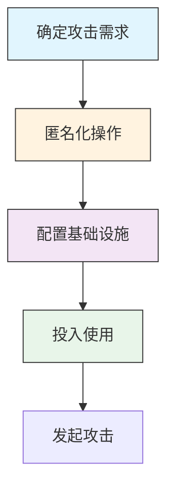

# 获取基础设施 (T1583)

## 一句话理解

> 攻击者花钱买域名、租服务器、搭VPN，就像小偷在作案前先租一间仓库藏赃物。

## 30秒速查卡

| 项目 | 内容 |
|------|------|
| 攻击目标 | 购买域名、服务器等攻击基础设施 |
| 典型手法 | 使用匿名支付和虚假注册信息购买网络资源 |
| 关键检测点 | 监控新注册域名、异常DNS查询和短生命周期域名 |
| 难度等级 | ⭐⭐ |


## 难度等级

⭐⭐（中级）— 技术门槛不高，但需要一定的资金和匿名化操作意识。

## 技术描述

获取基础设施是指攻击者通过购买、租赁或其他方式获得可以用于支持攻击行动的网络资源。这些资源包括：

- **域名**：用于搭建钓鱼网站、托管恶意软件、作为C2通信地址
- **服务器/VPS**：用于存放恶意软件、接收窃取的数据、运行C2服务
- **DNS服务器**：用于劫持DNS解析、实施中间人攻击
- **Web服务**：利用合法的第三方平台（如GitHub、Pastebin、云存储）托管恶意内容
- **无服务器平台**：利用AWS Lambda、Azure Functions等运行恶意代码
- **机器人网络**：租用僵尸网络进行DDoS攻击或大规模钓鱼

攻击者为什么要"买"而不是"偷"？因为购买的基础设施更可控、更稳定，而且可以通过匿名支付（加密货币）和虚假注册信息来隐藏真实身份。选择信誉好的云服务商还能让恶意流量混在正常流量中，增加检测难度。

## 子技术列表

| 子技术 ID | 名称 | 一句话理解 |
|-----------|------|------------|
| T1583.001 | 域名 | 注册一个看起来很像正规网站的域名，比如"paypa1.com" |
| T1583.002 | DNS服务器 | 自己架设DNS服务器，想把用户导到哪里就导到哪里 |
| T1583.003 | 虚拟专用服务器(VPS) | 租一台云服务器，用完就扔，不留痕迹 |
| T1583.004 | 服务器 | 买一台物理服务器，长期运营C2基础设施 |
| T1583.005 | 机器人网络 | 租一个僵尸网络，操控成千上万台"肉鸡" |
| T1583.006 | Web服务 | 利用合法平台（GitHub、Pastebin）托管恶意内容 |
| T1583.007 | 无服务器 | 用云函数运行恶意代码，无需维护服务器 |
| T1583.008 | 恶意广告(Malvertising) | 买广告位投放恶意广告，用户点击即中招 |

## 攻击流程

### 典型攻击流程

```
确定需求 --> 匿名化操作 --> 配置基础设施 --> 投入使用
```



**步骤详解：**

1. **确定攻击需求**
   - 通俗描述：攻击者先想清楚需要什么类型的资源
   - 技术细节：根据攻击目标和技术路线确定需求（钓鱼域名/C2服务器/分发渠道等）
   - 常用工具：域名注册商、VPS提供商、云服务商

2. **匿名化操作**
   - 通俗描述：用假身份、加密货币完成购买，隐藏真实身份
   - 技术细节：通过VPN/Tor注册账户，使用加密货币（如比特币、门罗币）支付，编造虚假注册信息
   - 常用工具：Tor浏览器、加密货币钱包、隐私保护服务

3. **配置基础设施**
   - 通俗描述：设置DNS解析、部署服务、配置SSL证书
   - 技术细节：配置域名DNS记录指向C2服务器，部署恶意服务端，申请或伪造SSL证书
   - 常用工具：Cloudflare、Let's Encrypt、Nginx、Apache

4. **投入使用**
   - 通俗描述：将基础设施用于实际的攻击行动
   - 技术细节：发送钓鱼邮件指向已配置的钓鱼域名，在服务器上托管恶意软件供下载
   - 常用工具：钓鱼工具包（GoPhish等）、C2框架（Cobalt Strike等）

## 真实案例

### 案例1：FancyBear服务器暴露——500天未更换的间谍基础设施
- **时间**：2024-2025年
- **目标**：北约、多国政府和军事机构
- **手法**：安全研究人员发现APT28（Fancy Bear）在NameCheap上租用的VPS服务器（IP: 203.161.50.145）自2024年9月起一直在使用，超过500天未更换。在公开目录中发现了2,800份被窃取的政府和军事电子邮件、240套被窃取的凭证（含TOTP 2FA密钥）、140条静默的邮件转发规则，以及来自多个国家受害者通讯录的11,500个联系地址。这个案例说明即使是最老练的APT组织也可能在基础设施管理上犯错。
- **链接**：[FancyBear Server Exposure Reveals Stolen Credentials, 2FA Secrets and NATO-Linked Targets](https://cybersecuritynews.com/fancybear-server-exposure-reveals-stolen-credentials/)

### 案例2：APT28利用路由器DNS劫持——大规模中间人攻击
- **时间**：2024-2026年
- **目标**：欧洲政府、军事和外交机构
- **手法**：自2024年以来，APT28利用TP-Link路由器漏洞（CVE-2023-50224）入侵小型办公室/家庭办公室（SOHO）路由器，修改其DHCP DNS设置，将流量重定向到攻击者控制的恶意DNS服务器。这些恶意DNS服务器进行中间人攻击（AitM），拦截和篡改网络流量。该行动影响范围广泛，涉及多个欧洲国家。
- **链接**：[APT28 exploit routers to enable DNS hijacking operations](https://www.ncsc.gov.uk/news/apt28-exploit-routers-to-enable-dns-hijacking-operations)

### 案例3：Sophos发现虚拟机基础设施被大规模恶意使用
- **时间**：2025年
- **目标**：全球各行业组织
- **手法**：SophosLabs分析师调查了多起WantToCry远程勒索软件事件，发现攻击者使用由ISPsystem（合法IT基础管理平台提供商）提供的Windows模板预配置虚拟机。CTU研究人员识别出多个与网络犯罪活动相关的互联网暴露系统，包括勒索软件运营和商品恶意软件交付。这些虚拟机具有自动生成的NetBIOS主机名，表明是批量部署的。
- **链接**：[Malicious use of virtual machine infrastructure | SOPHOS](https://www.sophos.com/en-us/blog/malicious-use-of-virtual-machine-infrastructure)

### 案例4：大规模钓鱼域名注册活动
- **时间**：2023年
- **目标**：全球消费者
- **手法**：在一个大规模网络钓鱼活动中，攻击者使用了超过800个不同的诈骗域名，冒充全球约340家合法公司，包括知名银行、邮政服务、快递服务、社交媒体和电子商务网站。这些域名采用`target[.]cheap_domain`的格式，例如`fedex.pay-i.cfd`和`fedex.send-nl.online`，利用廉价域名后缀降低注册成本。
- **链接**：[Analysis of a Massive Phishing Campaign | Imperva](https://www.imperva.com/blog/analysis-of-a-phishing-campaign/)

## 红队视角

> ⚠️ **免责声明**：以下内容仅用于合法的安全测试、渗透测试和教育目的。未经授权对他人系统进行测试是违法行为。

作为红队成员，获取基础设施是最基础的操作之一：

- **域名选择技巧**：注册与目标相似的域名（同形异义词攻击），使用国际化域名（IDN）创建视觉上相似的欺骗域名
- **匿名化策略**：使用加密货币支付、通过Tor注册、使用隐私保护服务隐藏WHOIS信息
- **基础设施多样化**：不要把所有鸡蛋放在一个篮子里，分散部署C2、钓鱼、数据外泄等不同功能的基础设施
- **利用免费资源**：很多云服务商提供免费试用期，可以零成本获取基础设施
- **选择信誉好的服务商**：恶意流量混在AWS、Azure等大厂的正常流量中更难被检测

## 蓝队视角

蓝队应该关注以下防御要点：

- **域名监控**：监控与组织域名相似的新注册域名，特别是使用同形异义词或不同顶级域名的变体
- **威胁情报**：订阅威胁情报源，及时获取已知恶意域名和IP地址的更新
- **DNS监控**：监控异常的DNS查询模式，特别是对新注册域名或短生命周期域名的查询
- **网络流量分析**：识别与已知C2基础设施的异常通信模式

## 检测建议

### 网络层检测

监控与已知恶意基础设施的网络通信，识别异常域名解析和基础设施扫描行为。

| 检测层面 | 检测方法 | 数据来源 | 检测规则示例 |
|---------|---------|---------|-------------|
| 网络边界 | 恶意域名/IP黑名单匹配 | DNS日志、NetFlow | 将威胁情报中的恶意域名/IP导入网络边界防火墙和DNS sinkhole |
| 网络边界 | 短生命周期域名检测 | DNS查询日志 | 检测注册时间≤30天但收到大量解析请求的域名 |
| 网络流量 | DoH/DoT隧道检测 | DNS over HTTPS流量 | 监控企业内部使用公共DoH服务器（如8.8.8.8/1.1.1.1）的DNS流量 |

**Snort/Suricata规则示例：**
```bash
# 检测到已知恶意C2域名的DNS查询
alert udp $HOME_NET any -> any 53 (msg:"Potential C2 DNS Query to Malicious Domain"; content:"|04|evil|03|com|00|"; classtype:trojan-activity; sid:1000003; rev:1;)

# 检测异常数量的DNS ANY查询（可能为基础设施探测）
alert udp $HOME_NET any -> any 53 (msg:"Excessive DNS ANY queries - possible recon"; dns_query_type; content:"ANY"; threshold:type threshold, track by_src, count 50, seconds 60; classtype:recon; sid:1000004; rev:1;)
```

### 主机层检测

监控主机上的网络连接行为和DNS解析行为，识别与恶意基础设施的通信。

| 检测层面 | 检测方法 | 数据来源 | 检测规则示例 |
|---------|---------|---------|-------------|
| 进程网络连接 | 异常出站连接监控 | Windows Event ID 5156/Sysmon Event ID 3 | 监控非浏览器进程发起的异常HTTPS连接 |
| 主机DNS | 本地DNS缓存审计 | PowerShell Get-DnsClientCache | 检查本地DNS缓存中是否存在已知恶意域名的解析记录 |
| 主机防火墙 | 防火墙策略审计 | Windows Firewall日志 | 检测异常出站规则授权 |

**Windows事件检测规则：**
```powershell
# 检测powershell执行DNS查询
Get-WinEvent -FilterHashtable @{LogName='Microsoft-Windows-Sysmon/Operational';ID=22} | Where-Object {$_.Message -match "QueryName.*\.xyz|\.top|\.loan"}
```

### 应用层检测

通过Sigma规则和YARA规则检测与恶意基础设施相关的应用程序行为和文件特征。


## 用人话说

> **检测解读**：这个技术的检测重点是发现攻击者在"备战"阶段的异常采购行为。正常企业不会频繁注册域名或租用服务器然后弃之不用，也不会用加密货币批量购买基础设施。如果你看到短时间内大量新域名指向同一IP，或者员工账户突然在注册多个云服务，这很可能是在搞资源开发。
>
> **避坑指南**：不要只盯着已知恶意域名，很多新注册的域名还没进黑名单。要关注"行为模式"而非"静态指标"——批量注册、匿名支付、短生命周期域名都是危险信号。

**Sigma规则示例：**

```yaml
title: 新注册域名与品牌相似域名监控
id: bd1c3a9a-8e2f-4d6b-9c5a-1f3e7d2a8b0c
status: experimental
description: 检测与已知品牌名称相似的异常域名注册和DNS查询活动
logsource:
  category: dns
  product: windows
detection:
  selection:
    QueryName|contains:
      - 'paypa1'
      - 'amaz0n'
      - 'g00gle'
      - 'micros0ft'
    QueryType: 'A'
  condition: selection
falsepositives:
  - 合法域名中的数字和字母组合
level: medium
```

```yaml
title: 新注册域名批量DNS查询检测
id: cd2d4b0b-9f3a-5e7c-0d6b-2a4f8e3c9d1e
status: experimental
description: 检测针对短生命周期域名的批量DNS查询
logsource:
  category: dns
  product: windows
detection:
  selection:
    QueryName|endswith:
      - '.xyz'
      - '.top'
      - '.loan'
      - '.work'
    QueryType: 'A'
  timeframe: 5m
  condition: selection | count() by SrcIp > 20
falsepositives:
  - 合法的批量域名解析服务
level: medium
```

## 缓解措施

### 优先级1：关键措施

**措施名称：** 域名防御性注册与监控

**具体实施步骤：**
1. 注册组织品牌名称常见的拼写错误域名变体
2. 订阅域名监控服务（如DomainTools），发现新注册的相似域名
3. 配置自动化告警，发现可疑域名时立即通知安全团队

**配置示例：**
```bash
# 使用dnstwist发现与组织域名相似的域名
dnstwist --format csv example.com | grep -v "example.com$"
```

### 优先级2：重要措施

**措施名称：** 部署DNSSEC和邮件认证协议

**具体实施步骤：**
1. 在域名注册商处启用DNSSEC支持
2. 配置SPF、DKIM和DMARC记录防止邮件欺骗
3. 定期检查DNS记录的完整性

**措施名称：** 强制启用多因素认证（MFA）

**具体实施步骤：**
1. 对所有远程访问服务（VPN、RDP、管理控制台）强制启用MFA
2. 优先使用硬件安全密钥（如YubiKey）或认证器应用
3. 禁用短信验证码等较弱的MFA方式

### 优先级3：建议措施

**措施名称：** 威胁情报集成

**具体实施步骤：**
1. 订阅威胁情报源（如AlienVault OTX、IBM X-Force）
2. 将威胁情报馈入SIEM系统，自动关联已知恶意基础设施
3. 定期更新IP黑名单和域名黑名单

**措施名称：** 安全意识培训

**具体实施步骤：**
1. 定期培训员工识别钓鱼域名和可疑链接
2. 模拟钓鱼攻击测试员工的识别能力
3. 建立便捷的举报机制

### MITRE ATT&CK 缓解措施映射

| 缓解措施ID | 缓解措施名称 | 适用性  | 说明                 |
| ------ | ------ | :--: | ------------------ |
| M0130  | 资产访问保护 |  适用  | 通过访问控制和MFA保护管理接口   |
| M0131  | 资产管理   |  适用  | 跟踪组织拥有的基础设施和证书     |
| M0105  | 网络安全架构 | 部分适用 | 零信任架构可减少基础设施被滥用的影响 |
| M0132  | 威胁情报计划 |  适用  | 订阅威胁情报服务监控恶意基础设施   |

## 动手实验

> ⚠️ **重要提示**：所有实验必须在隔离的实验室环境中进行，禁止对未授权的真实系统进行测试。

### 实验1：域名侦察
```bash
# 使用whois查询域名注册信息
whois example-phishing.com

# 使用dig查询DNS记录
dig example-phishing.com ANY

# 使用dnstwist发现相似域名
dnstwist --format csv example.com
```

### 实验2：搭建钓鱼域名（仅供学习）
1. 在Namecheap或GoDaddy注册一个测试域名
2. 使用Let's Encrypt申请免费SSL证书
3. 搭建一个简单的钓鱼登录页面
4. 观察域名解析和证书颁发过程

### 实验3（高级）：恶意基础设施追踪与威胁情报分析
1. 使用Shodan/Censys搜索与已知APT组织关联的基础设施（C2服务器IP段、SSL证书指纹）
2. 配置威胁情报平台（如MISP或OpenCTI），将发现的IOC导入并关联分析
3. 使用DomainTools逆向查询WHOIS信息，发现关联域名集群
4. 将分析结果与MITRE ATT&CK T1583子技术映射，形成完整的攻击者基础设施画像

## 术语解释

| 术语 | 英文原名 | 通俗解释 |
|------|----------|----------|
| 命令与控制 | Command & Control (C2) | 攻击者用来远程控制被入侵系统的"遥控器" |
| 虚拟专用服务器 | Virtual Private Server (VPS) | 在物理服务器上划分出的独立虚拟机，像租了一间独立的"网络仓库" |
| 域名系统 | Domain Name System (DNS) | 将人类可读的域名（如google.com）转换为IP地址的系统，就像电话本 |
| 同形异义词攻击 | Homograph Attack | 利用不同语言字符集（如西里尔字母、希腊语）创建视觉上相似的欺骗域名 |
| 国际化域名 | Internationalized Domain Name (IDN) | 支持非ASCII字符的域名，如包含中文的域名 |
| 恶意广告 | Malvertising | 利用在线广告网络传播恶意软件的恶意广告 |
| 初始访问经纪人 | Initial Access Broker (IAB) | 专门入侵组织网络并出售访问权限的犯罪分子 |
| WHOIS | WHOIS | 查询域名注册信息（所有者、注册日期等）的协议和服务 |

## 参考资料

- [MITRE ATT&CK 获取基础设施](https://attack.mitre.org/techniques/T1583/)
- [MITRE ATT&CK 获取基础设施：域名](https://attack.mitre.org/techniques/T1583/001/)
- [MITRE ATT&CK 获取基础设施：DNS服务器](https://attack.mitre.org/techniques/T1583/002/)
- [MITRE ATT&CK 获取基础设施：VPS](https://attack.mitre.org/techniques/T1583/003/)
- [MITRE ATT&CK 获取基础设施：服务器](https://attack.mitre.org/techniques/T1583/004/)
- [APT28 exploit routers to enable DNS hijacking operations](https://www.ncsc.gov.uk/news/apt28-exploit-routers-to-enable-dns-hijacking-operations)
- [FancyBear Server Exposure](https://cybersecuritynews.com/fancybear-server-exposure-reveals-stolen-credentials/)
- [Malicious use of virtual machine infrastructure | SOPHOS](https://www.sophos.com/en-us/blog/malicious-use-of-virtual-machine-infrastructure)
- [Analysis of a Massive Phishing Campaign | Imperva](https://www.imperva.com/blog/analysis-of-a-phishing-campaign/)
- [TeamCity Intrusion Saga | FortiGuard Labs](https://www.fortinet.com/blog/threat-research/teamcity-intrusion-saga-apt29-suspected-exploiting-cve-2023-42793)
