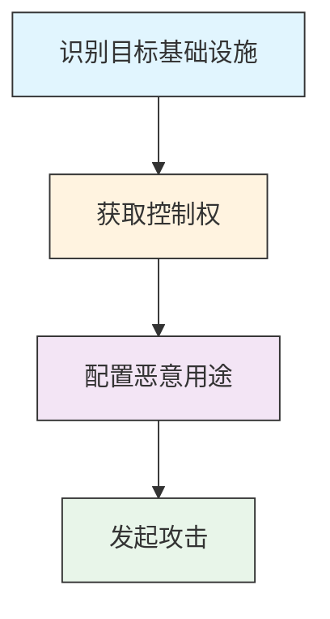

# 破坏基础设施 (T1584)

## 一句话理解

> 攻击者不自己买服务器，而是黑进别人的服务器当跳板——"借刀杀人"增加溯源难度。

## 难度等级

⭐⭐⭐（高级）— 需要一定的入侵能力，但回报是更高的隐蔽性。

## 技术描述

破坏基础设施是指攻击者未经授权地获取第三方基础设施的控制权，用于支持自己的攻击行动。与"获取基础设施"（T1583，花钱买）不同，"破坏基础设施"是直接黑进别人的。

为什么要这么做？好处很多：

- **成本低**：不用花钱买服务器，直接"借用"别人的
- **更隐蔽**：恶意流量来自合法服务器，更难被发现
- **溯源难**：安全团队追踪到的是受害者服务器，不是攻击者本人
- **信任度高**：利用已被信任的域名和服务器，绕过安全过滤

攻击者可能破坏的基础设施包括：
- 域名和子域名（劫持DNS解析）
- DNS服务器（篡改DNS记录）
- 虚拟专用服务器（VPS）
- 物理服务器
- 网络设备（路由器、防火墙）
- Web服务

## 子技术列表

| 子技术 ID | 名称 | 一句话理解 |
|-----------|------|------------|
| T1584.001 | 域名 | 劫持别人的域名，把流量导到自己的恶意服务器 |
| T1584.002 | DNS服务器 | 入侵DNS服务器，篡改解析记录 |
| T1584.003 | 虚拟专用服务器(VPS) | 入侵别人的VPS当跳板 |
| T1584.004 | 服务器 | 入侵合法网站服务器托管恶意内容 |
| T1584.005 | 机器人网络 | 控制已有的僵尸网络为己所用 |
| T1584.006 | Web服务 | 入侵第三方Web服务用于恶意目的 |
| T1584.007 | 无服务器 | 入侵无服务器平台托管恶意函数 |
| T1584.008 | 网络设备 | 入侵路由器、防火墙等网络设备 |

## 攻击流程

### 典型攻击流程

```
识别目标 --> 获取控制权 --> 配置恶意用途 --> 发起攻击
```



**步骤详解：**

1. **识别目标基础设施**
   - 通俗描述：攻击者寻找可以被入侵的第三方服务器或域名
   - 技术细节：扫描互联网上暴露的服务，寻找存在已知漏洞或配置不当的设备
   - 常用工具：Shodan、Censys、Nmap、Masscan

2. **获取控制权**
   - 通俗描述：利用漏洞或社会工程手段攻陷目标
   - 技术细节：利用已知漏洞（如CVE-2023-50224路由器漏洞），伪造身份联系域名注册商
   - 常用工具：Metasploit、自定义漏洞利用代码、社会工程工具包

3. **配置恶意用途**
   - 通俗描述：在被控系统上设置攻击所需的恶意功能
   - 技术细节：修改DNS记录指向恶意服务器，在Web服务器上植入恶意脚本
   - 常用工具：DNS管理工具、Web Shell、反向代理

4. **发起攻击**
   - 通俗描述：利用被控基础设施发动真正的攻击
   - 技术细节：通过被入侵的服务器分发恶意软件，劫持流量实施中间人攻击
   - 常用工具：C2框架、钓鱼工具包

## 真实案例

### 案例1：eth.limo域名劫持——社交工程攻击EasyDNS
- **时间**：2026年4月
- **目标**：eth.limo域名用户（以太坊生态系统）
- **手法**：攻击者通过社交工程攻击EasyDNS（eth.limo的域名服务提供商），冒充其团队成员启动账户恢复流程，获得对eth.limo账户的访问权限。攻击者更改了域名设置，将NS记录指向Cloudflare。但由于启用了DNSSEC，攻击者无法生成有效的加密签名，启用DNSSEC的解析器拒绝了伪造DNS响应，用户看到错误消息而不是被重定向到恶意网站。
- **链接**：[Friday's eth.limo Hijack Caused by Social Engineering on EasyDNS](https://cointelegraph.com/news/eth-limo-domain-hijack-dnssec-social-engineering)

### 案例2：CoW Swap域名劫持——120万美元损失
- **时间**：2026年4月
- **目标**：CoW Swap去中心化交易所用户
- **手法**：攻击者使用伪造文件和.fi域名注册过程中的供应链漏洞，说服注册商支持人员他们是cow.fi域名的合法所有者。攻击者修改了DNS A记录，将域名指向他们控制的恶意Cloudflare托管服务器。用户被重定向到钱包排空钓鱼网站，造成大约120万美元的用户损失。
- **链接**：[CoW Swap Frontend Attack Explained: DNS Hijacking](https://www.kucoin.com/blog/es-cow-swap-frontend-attack-explained-dns-hijacking-how-it-works-and-how-to-protect-your-wallet-in-defi)

### 案例3：APT28利用路由器漏洞进行DNS劫持
- **时间**：2024-2026年
- **目标**：欧洲政府、军事和外交机构
- **手法**：自2024年以来，APT28利用TP-Link路由器漏洞（CVE-2023-50224）入侵SOHO路由器，修改DHCP/DNS设置，将流量重定向到攻击者运行的恶意DNS服务器。这些恶意DNS服务器进行中间人攻击，收集网络流量和凭证。此行动涉及多个欧洲国家的关键基础设施。
- **链接**：[APT28 exploit routers to enable DNS hijacking operations](https://www.ncsc.gov.uk/news/apt28-exploit-routers-to-enable-dns-hijacking-operations)

### 案例4：DataTables.net域名劫持——伪造身份攻击
- **时间**：2025年7月
- **目标**：DataTables.net用户
- **手法**：攻击者通过社交工程手段，使用伪造的驾驶执照和水电费单据，说服域名注册商接受虚假身份。攻击者成功将域名转移到自己的控制下，更改了名称服务器指向不同的Cloudflare名称服务器。域名最终在攻击者放弃后通过提供所有权证据归还给合法所有者。
- **链接**：[Outage - post incident review](https://datatables.net/blog/2025/july-29-outage)

### 案例5：Turla利用被入侵的伊朗APT基础设施
- **时间**：持续进行中
- **目标**：中东和中亚地区
- **手法**：俄罗斯APT组织Turla（又称Snake、Venomous Bear）被发现利用被入侵的伊朗威胁行为者的VPS基础设施。Turla通过劫持伊朗APT组织的C2服务器，将其作为自己行动的跳板，既节省了资源又增加了归因难度——安全分析师最初可能将攻击归因于伊朗而非俄罗斯。
- **链接**：[MITRE ATT&CK Compromise Infrastructure](https://attack.mitre.org/techniques/T1584/)

## 红队视角

> ⚠️ **免责声明**：以下内容仅用于合法的安全测试、渗透测试和教育目的。未经授权对他人系统进行测试是违法行为。

作为红队成员，破坏基础设施是一种高效的隐蔽手段：

- **选择高信誉目标**：入侵知名的合法网站比自己搭建服务器更难被安全产品拦截
- **利用被入侵的路由器**：SOHO路由器数量庞大且安全防护薄弱，是理想的跳板
- **DNS劫持**：修改DNS记录可以实现流量劫持、中间人攻击、钓鱼等多种目的
- **嵌套跳板**：通过多层被入侵的基础设施增加溯源难度
- **注意隐蔽**：尽量不改变被入侵基础设施的正常功能，避免被发现

## 蓝队视角

蓝队应该关注以下防御要点：

- **基础设施监控**：监控组织拥有的域名、服务器和网络设备的异常变更
- **DNS安全**：部署DNSSEC防止DNS劫持，监控DNS记录的异常变更
- **网络设备加固**：确保路由器、防火墙等网络设备及时打补丁、修改默认密码
- **供应链安全**：监控域名注册商和云服务商的安全事件

## 检测建议

### 网络层检测

**检测方法：** 监控DNS解析异常、SSL证书透明日志中的异常证书签发，以及指向已妥协基础设施的可疑网络流量。

**具体规则/命令示例：**
```
# 检测异常DNS记录变更（NS/A记录指向非预期IP）
# 使用被动DNS数据监控
dnsmonitor --check-ns-changes --threshold 24h --alert-on-new-ip

# 监控证书透明日志中的异常域名证书
certspotter --watch-domain example.com --alert-unknown-issuer
```

1. **域名变更监控**：监控域名注册信息的异常更改，特别是所有者联系信息、名称服务器或DNS记录的修改
2. **DNSSEC部署**：实施DNSSEC以防止DNS欺骗和确保DNS查询的完整性
3. **网络设备监控**：监控路由器、防火墙等网络设备的异常配置更改，特别是DHCP/DNS设置
4. **SSL证书监控**：监控证书透明日志中针对组织域名的异常证书颁发
5. **流量异常检测**：检测来自非常规地理位置或异常时间的DNS查询和响应

### Sigma规则示例

```yaml
title: DNS记录异常变更检测
id: a1b2c3d4-5e6f-7a8b-9c0d-1e2f3a4b5c6d
status: experimental
description: 检测域名NS记录或A记录的异常修改，可能指示DNS劫持或基础设施被破坏
logsource:
  category: dns
  product: windows
detection:
  selection:
    EventID: 22  # DNS Server Query
    QueryType:
      - 'NS'
      - 'MX'
      - 'CNAME'
    ResponseCode: 'NOERROR'
    QueryName|endswith: '.com'
  condition: selection
falsepositives:
  - 合法的DNS记录变更操作
  - 域名管理员执行的正常配置更新
level: high
```

```yaml
title: 路由器DNS配置异常修改检测
id: b2c3d4e5-6f7a-8b9c-0d1e-2f3a4b5c6d7e
status: experimental
description: 检测网络设备上DHCP DNS配置的未授权修改，可能指示路由器被入侵
logsource:
  category: process_creation
  product: windows
detection:
  selection:
    CommandLine|contains:
      - 'dhcp'
      - 'dns'
      - 'router'
      - 'config'
    CommandLine|contains|all:
      - 'set'
      - 'ip'
    User|endswith: 'Administrator'
  condition: selection
falsepositives:
  - 网络管理员执行的路由器配置变更
  - 合法的网络维护操作
level: high
```

## 缓解措施

### 优先级1：关键措施

**措施名称：** 域名注册锁与DNSSEC部署

**具体实施步骤：**
1. 在域名注册商处启用RegistryLock，防止未经授权的域名转移
2. 部署DNSSEC，确保DNS响应的完整性和真实性
3. 定期检查域名注册信息的完整性

**配置示例：**
```bash
# 检查DNSSEC是否启用
dig +dnssec example.com

# 验证域名注册状态
whois example.com | grep -i "status\|lock\|hold"
```

### 优先级2：重要措施

**措施名称：** 网络设备加固与补丁管理

**具体实施步骤：**
1. 保持路由器、防火墙等网络设备的固件及时更新
2. 修改所有设备的默认管理密码
3. 禁用不必要的远程管理服务
4. 定期审计设备的配置变更

**措施名称：** 强密码与MFA策略

**具体实施步骤：**
1. 对域名注册账户、DNS管理面板强制使用强密码
2. 启用多因素认证（MFA）
3. 实施账户监控，及时发现异常登录行为

### 优先级3：建议措施

**措施名称：** 零信任架构

**具体实施步骤：**
1. 实施零信任网络架构，验证每个访问请求
2. 不默认信任任何内部或外部来源
3. 实施最小权限原则

### MITRE ATT&CK 缓解措施映射

| 缓解措施ID | 缓解措施名称 | 适用性 | 说明 |
|------------|-------------|:------:|------|
| M0130 | 资产访问保护 | 适用 | 通过强访问控制和MFA保护管理接口 |
| M0131 | 资产管理 | 适用 | 跟踪组织拥有的所有基础设施资产 |
| M0150 | 网络隔离 | 部分适用 | 限制被入侵设备对关键系统的访问 |
| M0132 | 威胁情报计划 | 适用 | 监控暗网和论坛上的基础设施交易 |

## 动手实验

> ⚠️ **重要提示**：所有实验必须在隔离的实验室环境中进行，禁止对未授权的真实系统进行测试。

### 实验1：DNS劫持检测
```bash
# 对比不同DNS服务器的解析结果
nslookup example.com 8.8.8.8
nslookup example.com 1.1.1.1
nslookup example.com 114.114.114.114

# 使用dig查看DNSSEC状态
dig +dnssec example.com

# 检查域名DNSSEC链
delv example.com @8.8.8.8
```

### 实验2：路由器安全检查
1. 登录家用路由器管理界面
2. 检查DNS设置是否被篡改
3. 检查DHCP设置是否正常
4. 更新路由器固件到最新版本

## 术语解释

| 术语 | 英文原名 | 通俗解释 |
|------|----------|----------|
| DNS劫持 | DNS Hijacking | 篡改DNS解析结果，将用户引导到恶意网站，就像篡改了电话本上的地址 |
| 中间人攻击 | Adversary-in-the-Middle (AitM) | 攻击者在通信双方之间拦截和篡改数据，就像邮递员私自拆看了你的信件 |
| 域名系统安全扩展 | DNSSEC | 通过数字签名验证DNS响应的真实性，确保你收到的地址是真的 |
| 小型办公室/家庭办公室路由器 | SOHO Router | 小型办公室或家庭使用的路由器，通常安全防护较弱 |
| 子域名劫持 | Subdomain Hijacking | 利用DNS条目指向已失效资源的漏洞，控制子域名 |
| 域名暗影 | Domain Shadowing | 在被入侵的域名下悄悄创建恶意子域名，不影响现有服务 |

## 参考资料

- [MITRE ATT&CK 破坏基础设施](https://attack.mitre.org/techniques/T1584/)
- [MITRE ATT&CK 破坏基础设施：域名](https://attack.mitre.org/techniques/T1584/001/)
- [MITRE ATT&CK 破坏基础设施：DNS服务器](https://attack.mitre.org/techniques/T1584/002/)
- [APT28 exploit routers to enable DNS hijacking operations](https://www.ncsc.gov.uk/news/apt28-exploit-routers-to-enable-dns-hijacking-operations)
- [Friday's eth.limo Hijack](https://cointelegraph.com/news/eth-limo-domain-hijack-dnssec-social-engineering)
- [CoW Swap Frontend Attack](https://www.kucoin.com/blog/es-cow-swap-frontend-attack-explained-dns-hijacking-how-it-works-and-how-to-protect-your-wallet-in-defi)
- [DataTables.net Outage](https://datatables.net/blog/2025/july-29-outage)
- [The Hijacking of Perl.com](https://www.perl.com/article/the-hijacking-of-perl-com/)
