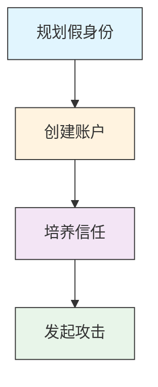

# 建立账户 (T1585)

## 一句话理解

> 攻击者注册假账号、建假身份，就像骗子先办一套假证件再出去行骗。

## 30秒速查卡

| 项目 | 内容 |
|------|------|
| 攻击目标 | 购买域名、服务器等攻击基础设施 |
| 典型手法 | 使用匿名支付和虚假注册信息购买网络资源 |
| 关键检测点 | 监控新注册域名、异常DNS查询和短生命周期域名 |
| 难度等级 | ⭐⭐ |


## 难度等级

⭐⭐（中级）— 技术门槛低，但需要耐心经营假身份。

## 技术描述

建立账户是指攻击者创建和培养可用于攻击行动的虚假账户和身份。这些假身份就像骗子的"假证件"，用于：

- **冒充招聘人员**：在LinkedIn上伪装成知名公司的HR，诱骗求职者下载恶意文件
- **建立可信形象**：在社交媒体上积累好友、发布内容，让假身份看起来像真人
- **注册钓鱼邮箱**：创建看起来像官方的邮箱地址，用于发送钓鱼邮件
- **注册云服务**：利用免费云服务试用期搭建攻击基础设施

攻击者为什么要费这么大劲建假身份？因为**信任是最好的武器**。如果目标收到一封来自"LinkedIn好友"的消息，警惕性会大大降低。这些假身份可能需要数周甚至数月来培养，但一旦建立起来，攻击效果远比直接发送钓鱼邮件好得多。

## 子技术列表

| 子技术 ID | 名称 | 一句话理解 |
|-----------|------|------------|
| T1585.001 | 社交媒体账户 | 在LinkedIn、Facebook等平台创建假账号，经营假身份 |
| T1585.002 | 电子邮件账户 | 注册Gmail、Outlook等邮箱，用于发送钓鱼邮件 |
| T1585.003 | 云账户 | 注册AWS、Azure等云服务，用于搭建攻击基础设施 |

## 攻击流程

### 典型攻击流程

```
规划假身份 --> 创建账户 --> 培养信任 --> 发起攻击
```



**步骤详解：**

1. **规划假身份**
   - 通俗描述：设计一个可信的虚假角色，决定冒充什么人
   - 技术细节：选择身份角色（招聘人员、行业专家、同事等），准备身份素材（AI生成或盗用的照片、虚构的工作经历）
   - 常用工具：ThisPersonDoesNotExist.com（AI生成人脸）、LinkedIn、GitHub

2. **创建账户**
   - 通俗描述：在各个平台上注册账号并完善个人资料
   - 技术细节：注册邮箱和社交媒体账号，填写详细的个人资料，上传头像照片
   - 常用工具：Gmail、Outlook、LinkedIn、Twitter、GitHub

3. **培养信任**
   - 通俗描述：花时间经营假身份，让它看起来像真人
   - 技术细节：添加行业内真实人士为好友，发布正常行业内容，参与讨论互动
   - 常用工具：社交媒体平台、自动化互动工具

4. **发起攻击**
   - 通俗描述：利用已建立的信任关系向目标发送恶意内容
   - 技术细节：发送定制化的钓鱼消息，诱导下载恶意文件或点击钓鱼链接
   - 常用工具：钓鱼工具包、恶意软件投递器

## 真实案例

### 案例1：Lazarus集团"Operation Phantom Circuit"——冒充招聘人员窃取1500+开发者凭证
- **时间**：2024年11月-2025年1月
- **目标**：全球开发者（欧洲、印度等地的技术热点）
- **手法**：朝鲜Lazarus集团创建了冒充知名公司招聘人员的虚假LinkedIn资料，包括被盗的真实开发者照片、虚构的工作经历和人脉网络。攻击者使用这些资料联系开发者，提供虚假的工作机会，要求目标提供个人简历或GitHub仓库链接。一旦目标参与，攻击者引导他们下载和运行伪装成编码挑战的恶意软件，窃取开发凭证、身份验证令牌和浏览器存储的密码。该行动共感染了超过1,500个系统。
- **链接**：[CSO Online：朝鲜黑客冒充招聘人员窃取开发者凭证](https://www.csoonline.com/article/3813642/north-korean-hackers-impersonated-recruiters-to-steal-credentials-from-over-1500-developer-systems.html)

### 案例2：Lazarus集团针对西班牙航空航天公司的LinkedIn攻击
- **时间**：2024年
- **目标**：西班牙一家航空航天公司
- **手法**：ESET研究人员发现Lazarus集团创建了冒充Meta招聘人员的虚假LinkedIn资料，通过LinkedIn消息向特定员工发送工作机会。消息看似合法，提供远程工作、弹性工作时间和有竞争力的薪酬。当目标表达兴趣时，攻击者发送伪装成编码挑战的恶意可执行文件（显示"Hello, World!"或斐波那契序列）。执行后安装名为LightlessCan的未公开后门，该后门能阻碍安全监控软件和分析。
- **链接**：[WeLiveSecurity：Lazarus利用木马化编码挑战针对西班牙航空航天公司](https://www.welivesecurity.com/en/eset-research/lazarus-luring-employees-trojanized-coding-challenges-case-spanish-aerospace-company/)

### 案例3：Lazarus集团通过伪造美国公司定位加密货币开发者
- **时间**：2025年4月
- **目标**：全球加密货币开发者
- **手法**：Lazarus集团注册了虚假的美国公司，如新墨西哥州的Blocknovas LLC和纽约州的Softglide LLC，使用虚假身份和地址。这些公司维持着合法外观的在线存在，发布开发者职位，并进行看似标准的招聘流程。在LinkedIn和Upwork上创建可信资料，吸引加密货币开发者参与虚假面试。开发者被指示下载测试文件，实际上是携带恶意软件的可执行文件，安装后提供远程访问。这是朝鲜黑客首次已知设立合法注册的美国实体。
- **链接**：[Bankless Times：Lazarus Group建立虚假美国公司](https://www.banklesstimes.com/articles/2025/04/25/north-koreas-lazarus-group-sets-up-fake-us-companies-to-target-crypto-devs/)

### 案例4：Lazarus集团通过LinkedIn求职诈骗针对Bitdefender研究人员
- **时间**：2025年2月
- **目标**：Bitdefender安全研究人员
- **手法**：Lazarus集团通过LinkedIn消息联系Bitdefender安全分析师，伪装为去中心化加密货币交易所的招聘人员。攻击者共享了包含MVP的仓库和反馈表，打开后导致从第三方端点下载跨平台信息窃取恶意软件。该恶意软件包含多层Python脚本、JavaScript信息窃取器和.NET暂存器，能禁用安全工具、配置Tor代理和启动加密货币矿工。
- **链接**：[Infosecurity Magazine：Lazarus Group通过LinkedIn求职诈骗针对Bitdefender研究人员](https://www.infosecurity-magazine.com/news/lazarus-bitdefender-linkedin-scam/)

## 红队视角

> ⚠️ **免责声明**：以下内容仅用于合法的安全测试、渗透测试和教育目的。未经授权对他人系统进行测试是违法行为。

作为红队成员，建立虚假身份是社工攻击的基础：

- **身份经营**：不要创建账号后立即发起攻击，花几周时间发布正常内容、添加好友、建立信任
- **照片来源**：使用AI生成的人脸照片（如ThisPersonDoesNotExist.com），避免盗用真实照片被反向搜索发现
- **多平台联动**：在LinkedIn、GitHub、Twitter等多个平台创建一致的身份，增加可信度
- **目标研究**：在发起攻击前，深入了解目标的兴趣、工作内容和社交关系
- **消息定制**：根据目标的背景定制消息内容，避免千篇一律的模板

## 蓝队视角

蓝队应该关注以下防御要点：

- **社交媒体监控**：监控冒充组织或员工的可疑账户，特别是声称是招聘人员的账户
- **员工培训**：教育员工识别虚假招聘资料和社会工程攻击
- **邮件认证**：实施SPF、DKIM和DMARC防止邮件欺骗
- **域名监控**：监控与组织相似的新注册域名

## 检测建议

### 网络层检测

**检测方法：** 监控注册流程中的异常IP模式，如短时间内从同一IP批量注册多个账户，或使用已知代理/VPN IP注册。

**具体规则/命令示例：**
```
# 检测同一IP批量账户注册
# 使用Web应用防火墙日志分析
tail -f /var/log/nginx/access.log | grep "POST /register" | awk '{print $1}' | sort | uniq -c | sort -nr | head -10

# 检测代理/VPN IP的注册行为
geoip-check --ip-list registration_ips.txt --flag-datacenter --flag-proxy
```

1. **社交媒体监控**：监控冒充组织或员工的可疑账户，特别注意最近创建、历史有限的账户
2. **邮件欺骗检测**：实施SPF、DKIM和DMARC协议，检测冒充组织域名的邮件
3. **账户创建异常**：监控身份提供者和云服务中的异常账户创建活动
4. **威胁情报集成**：利用威胁情报识别与招聘诈骗相关的已知恶意基础设施
5. **员工举报机制**：建立便捷的渠道让员工举报可疑的社交媒体联系


## 用人话说

> **检测解读**：攻击者创建假账号就像演员"体验生活"——他们花几周甚至几个月时间经营假身份，让这些账号看起来真实可信。检测重点是异常的账户创建模式：同一IP注册多个账号、新注册账号突然大量关注/添加好友、账号内容与声称的身份不符。
>
> **避坑指南**：不要因为一个LinkedIn账号有头像和简介就信任它。攻击者会用AI生成逼真的个人资料。关注账户的"年龄"和"行为模式"比看表面信息更重要。

### Sigma规则示例

```yaml
title: 社交媒体账户批量创建检测
id: c3d4e5f6-7a8b-9c0d-1e2f-3a4b5c6d7e8f
status: experimental
description: 检测短时间内从同一IP地址批量创建社交媒体账户的行为，可能指示虚假身份培育活动
logsource:
  category: application
  product: web
detection:
  selection:
    EventID: 'ACCOUNT_CREATE'
    SrcIp|condition: 'count_unique() by SrcIp > 3'
    Timeframe: '1h'
    AccountAge|lt: '1d'
  condition: selection
falsepositives:
  - 企业批量创建员工账户
  - 社交媒体运营团队的正常操作
level: medium
```

```yaml
title: 新创建邮箱账户发送异常邮件检测
id: d4e5f6a7-8b9c-0d1e-2f3a-4b5c6d7e8f9a
status: experimental
description: 检测新注册的邮箱账户(<24小时)在短时间内发送大量邮件的异常行为，可能指示钓鱼邮件活动
logsource:
  category: application
  product: email
detection:
  selection:
    EventID: 'SEND_MAIL'
    AccountAge|lt: '24h'
    MailCount|gt: 50
    Timeframe: '1h'
  condition: selection
falsepositives:
  - 新员工入职后的邮件营销活动
  - 合法的批量邮件发送服务
level: high
```

## 缓解措施

### 优先级1：关键措施

**措施名称：** 员工安全意识培训

**具体实施步骤：**
1. 定期培训员工识别虚假招聘资料和社会工程攻击
2. 模拟虚假LinkedIn联系人的测试，检验员工的识别能力
3. 建立便捷的举报机制，鼓励员工报告可疑的社交媒体联系

### 优先级2：重要措施

**措施名称：** 社交媒体监控与品牌保护

**具体实施步骤：**
1. 监控冒充组织或员工的可疑社交媒体账户
2. 使用品牌监控服务发现假冒账号
3. 与社交媒体平台合作快速下架假冒账号

**措施名称：** 邮件安全加固

**具体实施步骤：**
1. 部署SPF、DKIM和DMARC防止邮件欺骗
2. 使用高级威胁防护的邮件安全网关
3. 配置异常邮件检测规则

### 优先级3：建议措施

**措施名称：** 信息泄露监控

**具体实施步骤：**
1. 监控暗网和社交媒体上的组织信息泄露
2. 定期审计员工在社交媒体上分享的信息
3. 制定社交媒体使用政策

### MITRE ATT&CK 缓解措施映射

| 缓解措施ID | 缓解措施名称 | 适用性 | 说明 |
|------------|-------------|:------:|------|
| M1017 | 用户培训 | 适用 | 培训员工识别社会工程攻击和虚假身份 |
| M1032 | 多因素认证 | 适用 | 在所有账户上启用MFA防止凭证窃取 |
| M1031 | 网络信息隔离 | 部分适用 | 限制员工在社交媒体上暴露过多信息 |
| M1018 | 用户账户管理 | 适用 | 监控和审计账户创建活动 |

## 动手实验

> ⚠️ **重要提示**：所有实验必须在隔离的实验室环境中进行，禁止对未授权的真实系统进行测试。

### 实验1：识别虚假LinkedIn账户
1. 搜索声称是某知名公司招聘人员的LinkedIn账户
2. 检查以下指标：
   - 账户创建时间
   - 好友数量和质量
   - 发布内容的历史
   - 头像是否为AI生成（使用反向图片搜索）
   - 工作经历是否一致

### 实验2：搭建钓鱼邮件测试（仅供授权测试）
1. 使用GoPhish等开源工具搭建钓鱼邮件测试平台
2. 创建一个模拟的招聘邮件模板
3. 在授权范围内对内部员工进行测试
4. 统计点击率和凭证提交率

## 术语解释

| 术语 | 英文原名 | 通俗解释 |
|------|----------|----------|
| 社会工程 | Social Engineering | 通过心理操纵而非技术手段获取信息或访问权限，就像骗子冒充客服套取你的密码 |
| 鱼叉式网络钓鱼 | Spear Phishing | 针对特定个人或组织的定制化钓鱼攻击，不像群发垃圾邮件那样广撒网 |
| 邮件认证协议 | SPF/DKIM/DMARC | 一套防止邮件欺骗的技术协议，就像信封上的防伪标识 |
| 人物形象 | Persona | 攻击者创建和维护的虚假身份，就像小说中的虚构角色 |
| 深度伪造 | Deepfake | 使用AI生成的虚假音频或视频内容，让人看到或听到从未发生的事 |
| 反向图片搜索 | Reverse Image Search | 通过上传图片搜索其来源和使用位置，检查头像是否为盗用 |

## 参考资料

- [MITRE ATT&CK 建立账户](https://attack.mitre.org/techniques/T1585/)
- [MITRE ATT&CK 建立社交媒体账户](https://attack.mitre.org/techniques/T1585/001/)
- [MITRE ATT&CK 建立电子邮件账户](https://attack.mitre.org/techniques/T1585/002/)
- [MITRE ATT&CK 建立云账户](https://attack.mitre.org/techniques/T1585/003/)
- [CSO Online：朝鲜黑客冒充招聘人员](https://www.csoonline.com/article/3813642/north-korean-hackers-impersonated-recruiters-to-steal-credentials-from-over-1500-developer-systems.html)
- [WeLiveSecurity：Lazarus利用木马化编码挑战](https://www.welivesecurity.com/en/eset-research/lazarus-luring-employees-trojanized-coding-challenges-case-spanish-aerospace-company/)
- [Infosecurity Magazine：Lazarus Group LinkedIn诈骗](https://www.infosecurity-magazine.com/news/lazarus-bitdefender-linkedin-scam/)
- [Bankless Times：Lazarus Group建立虚假美国公司](https://www.banklesstimes.com/articles/2025/04/25/north-koreas-lazarus-group-sets-up-fake-us-companies-to-target-crypto-devs/)
