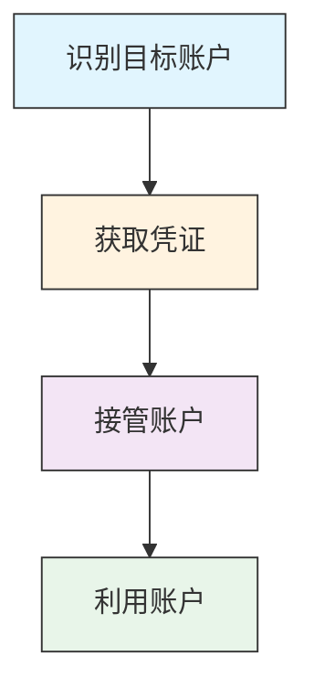

# 破坏账户 (T1586)

## 一句话理解

> 攻击者不自己建假身份，而是直接盗用别人的真账号——因为真账号自带信任关系，更好用。

## 难度等级

⭐⭐⭐（高级）— 需要一定的凭证获取能力，但利用已有信任关系效果更好。

## 技术描述

破坏账户是指攻击者未经授权地获取对现有账户的控制权，用于支持攻击行动。与"建立账户"（T1585，自己注册假账号）不同，"破坏账户"是直接盗用别人的真账号。

为什么要盗用而不是自己建？因为：

- **自带信任**：被盗账号的好友、同事不知道账号已被盗，会信任来自该账号的消息
- **历史记录**：被盗账号有正常的历史记录，看起来不像新注册的假账号
- **人脉网络**：被盗账号已经建立了社交网络，可以直接联系目标
- **访问权限**：被盗账号可能有组织内部系统的访问权限

攻击者获取账户控制权的方法包括：
- 钓鱼攻击获取凭证
- 从暗网购买泄露的凭证
- 暴力破解弱密码
- 利用密码重用（撞库攻击）
- 社会工程攻击

## 子技术列表

| 子技术 ID | 名称 | 一句话理解 |
|-----------|------|------------|
| T1586.001 | 社交媒体账户 | 盗用LinkedIn、Facebook等社交媒体账号 |
| T1586.002 | 电子邮件账户 | 盗用邮箱账号，用于发送钓鱼邮件或接管邮件对话 |
| T1586.003 | 云账户 | 盗用AWS、Azure等云服务账号，用于数据外泄或托管恶意内容 |

## 攻击流程

### 典型攻击流程

```
识别目标 --> 获取凭证 --> 接管账户 --> 利用账户
```



**步骤详解：**

1. **识别目标账户**
   - 通俗描述：确定要盗取的账号，选择有利用价值的
   - 技术细节：选择有广泛社交网络、内部系统访问权限或高信任度的账号
   - 常用工具：社交媒体分析工具、OSINT工具

2. **获取凭证**
   - 通俗描述：通过钓鱼或购买方式获取账号密码
   - 技术细节：发送钓鱼邮件窃取凭证，从暗网购买泄露的凭证数据库
   - 常用工具：钓鱼工具包、凭证填充工具、暗网市场

3. **接管账户**
   - 通俗描述：控制账号后修改密码和恢复选项，防止原主人找回
   - 技术细节：修改密码和恢复邮箱，设置邮件转发规则，授权恶意OAuth应用
   - 常用工具：OAuth授权工具、邮件规则管理

4. **利用账户**
   - 通俗描述：利用接管账号的信任关系发起进一步攻击
   - 技术细节：从被盗邮箱回复已有邮件对话（邮件线路劫持），附带恶意附件
   - 常用工具：邮件客户端、社交媒体平台

## 真实案例

### 案例1：Meta AI支持机器人被利用劫持Instagram账户
- **时间**：2026年6月
- **目标**：高知名度Instagram账户（包括奥巴马白宫和美国空间军队首席军士长）
- **手法**：威胁行为者利用Meta的AI支持机器人中的逻辑漏洞（"混乱副手"问题），诱骗机器人将攻击者控制的电子邮件地址链接到目标Instagram账户。机器人随后发送了一次性重置代码到该新电子邮件地址，攻击者使用该代码重置密码并锁定合法所有者。攻击者使用VPN伪装位置以绕过Meta的欺诈检测。值得注意的是，启用了MFA的账户（包括短信验证码）未受此攻击影响。
- **链接**：[Hackers Used Meta's AI Support Bot to Seize Instagram Accounts - Krebs on Security](https://krebsonsecurity.com/2026/06/hackers-used-metas-ai-support-bot-to-seize-instagram-accounts/)

### 案例2：APT28利用被盗邮箱发送钓鱼邮件
- **时间**：持续进行中
- **目标**：欧洲政府和军事机构
- **手法**：APT28（Fancy Bear）使用被破坏的电子邮件账户发送凭证钓鱼电子邮件。由于这些邮件来自真实的、被信任的邮箱，收件人更容易相信邮件内容的真实性。攻击者利用被盗邮箱的已有信任关系，绕过传统的邮件安全检测。
- **链接**：[MITRE ATT&CK 破坏账户：电子邮件账户](https://attack.mitre.org/techniques/T1586/002/)

### 案例3：APT29利用被破坏的Google Workspace账户进行C2
- **时间**：持续进行中
- **目标**：政府机构和智库
- **手法**：APT29（Cozy Bear）使用被破坏的Google Workspace账户进行命令与控制。攻击者还使用住宅代理（包括Azure虚拟机）掩盖其对受害者环境的访问。这种利用合法云服务进行C2通信的方式使恶意流量与正常的云服务使用混合在一起，极难被检测。
- **链接**：[MITRE ATT&CK 破坏账户：云账户](https://attack.mitre.org/techniques/T1586/003/)

### 案例4：X（Twitter）大规模OAuth钓鱼账户劫持活动
- **时间**：2024-2025年
- **目标**：高知名度X账户（美国政治人物、知名记者、加密货币组织）
- **手法**：攻击者发送伪装成DMCA版权通知或登录警报的钓鱼邮件，诱导目标点击恶意链接。在高级变种中，攻击者使用OAuth授权钓鱼——用户被重定向到真实的X.com授权页面，授权恶意应用获取tweet.read、tweet.write、offline.access等权限。攻击者利用多级重定向链（包括Google AMP缓存、Meetup等合法服务）隐藏最终目标。成功劫持后，攻击者迅速锁定合法所有者，发布加密货币诈骗内容。该活动自2024年中持续活跃，曾成功劫持Linus Tech Tips（180万粉丝）等知名账号。
- **链接**：[SentinelOne: X Phishing Campaign Targeting High Profile Accounts](https://www.sentinelone.com/labs/phishing-on-x-high-profile-account-targeting-campaign-returns/)

## 红队视角

> ⚠️ **免责声明**：以下内容仅用于合法的安全测试、渗透测试和教育目的。未经授权对他人系统进行测试是违法行为。

作为红队成员，利用被盗账户是一种高效的社工手段：

- **邮件线路劫持**：接管目标邮箱后，回复已有的邮件对话，附带恶意附件或链接，收件人很难察觉异常
- **利用已有信任**：从被盗账户发送的消息比从新账户发送的更容易被信任
- **OAuth授权**：通过授权恶意应用获取持续访问权限，即使密码被修改也能保持访问
- **多账户联动**：同时接管多个相关账户，增加攻击的可信度

## 蓝队视角

蓝队应该关注以下防御要点：

- **异常登录检测**：监控从不寻常位置或时间的登录尝试
- **邮件规则监控**：监控邮箱中的异常转发规则和过滤器设置
- **OAuth应用审查**：定期审查已授权的第三方应用
- **凭证泄露监控**：监控暗网上的凭证泄露

## 检测建议

### 网络层检测

**检测方法：** 监控异常认证流量中的地理不可能旅行模式、已知恶意IP的登录尝试，以及短时间内大量登录失败后的成功登录。

**具体规则/命令示例：**
```
# 检测同一账户在多地理位置短时间内登录
# 使用身份验证日志分析
grep "LOGIN_SUCCESS" auth.log | awk '{print $1, $3, $NF}' | sort -k2 | while read line; do
  check_geo_impossible_travel $line
done

# 检测来自已知恶意IP段的登录
ipset test malicious_ips $LOGIN_IP && alert "Compromised account login from malicious IP"
```

1. **异常登录检测**：监控从不熟悉的IP地址、地理位置或用户代理的登录，实施不可能旅行检测
2. **休眠账户监控**：监控长时间不活动后突然活跃的账户
3. **邮件线路劫持检测**：监控邮件回复中突然出现的恶意链接或附件
4. **OAuth应用审查**：监控邮箱中新增的OAuth授权和应用密码
5. **凭证泄露监控**：使用Have I Been Pwned等服务监控组织凭证泄露

### Sigma规则示例

```yaml
title: 邮箱异常登录地理不可能旅行检测
id: e5f6a7b8-9c0d-1e2f-3a4b-5c6d7e8f9a0b
status: experimental
description: 检测同一邮箱账户在短时间内从地理上距离很远的位置登录的异常行为，可能指示账户被破坏
logsource:
  category: application
  product: web
detection:
  selection:
    EventID: 'LOGIN_SUCCESS'
    Account|re: '.+@.+\..+'
    LoginLocation1: 'GeoPosition'
    LoginLocation2: 'GeoPosition'
  condition: selection and (LoginLocation1 distance LoginLocation2 > 1000km) within 1h
falsepositives:
  - 用户使用VPN或代理服务
  - 合法的国际旅行
level: high
```

```yaml
title: 邮箱自动转发规则创建检测
id: f6a7b8c9-0d1e-2f3a-4b5c-6d7e8f9a0b1c
status: experimental
description: 检测邮箱中新增的自动转发或邮件规则，可能指示攻击者接管账户后设置数据窃取通道
logsource:
  category: application
  product: office365
detection:
  selection:
    EventID: 'New-InboxRule'
    OperationType: 'New-InboxRule'
    Parameters|contains:
      - 'ForwardTo'
      - 'RedirectTo'
      - 'ForwardAsAttachmentTo'
    RuleType: 'InboxRule'
  condition: selection
falsepositives:
  - 用户主动设置邮件转发
  - 合法的邮件归档配置
level: medium
```

## 缓解措施

### 优先级1：关键措施

**措施名称：** 多因素认证（MFA）

**具体实施步骤：**
1. 在所有账户上强制启用MFA，优先使用硬件安全密钥（如YubiKey）或认证器应用
2. 禁用短信验证码等较弱的MFA方式
3. 对高风险操作（如修改恢复选项）要求额外验证

### 优先级2：重要措施

**措施名称：** 异常登录检测

**具体实施步骤：**
1. 启用不可能旅行检测——分析从地理位置上不可能短时间内到达的连续登录
2. 监控从不熟悉的IP地址、用户代理的登录尝试
3. 配置条件访问策略，基于位置、设备合规性限制访问

**措施名称：** 邮件安全加固

**具体实施步骤：**
1. 部署邮件安全解决方案（Proofpoint、Mimecast等）
2. 定期扫描邮箱中的异常转发规则
3. 监控OAuth授权申请的异常增加

### 优先级3：建议措施

**措施名称：** 凭证泄露监控

**具体实施步骤：**
1. 使用Have I Been Pwned等服务监控组织凭证泄露
2. 定期轮换特权账户凭证
3. 实施密码管理器，避免密码重用

### MITRE ATT&CK 缓解措施映射

| 缓解措施ID | 缓解措施名称 | 适用性 | 说明 |
|------------|-------------|:------:|------|
| M1032 | 多因素认证 | 适用 | 防止凭证被窃取后登录账户 |
| M1017 | 用户培训 | 适用 | 培训员工识别钓鱼攻击 |
| M1027 | 操作系统/应用加固 | 部分适用 | 限制OAuth授权范围 |
| M1018 | 用户账户管理 | 适用 | 监控账户的异常使用模式 |

## 动手实验

> ⚠️ **重要提示**：所有实验必须在隔离的实验室环境中进行，禁止对未授权的真实系统进行测试。

### 实验1：检测邮箱中的异常转发规则
```powershell
# Exchange Online - 查看所有邮箱的转发规则
Get-Mailbox -ResultSize Unlimited | Get-InboxRule | Where-Object { $_.ForwardTo -or $_.RedirectTo } | Select-Object MailboxOwnerIdentity, Name, ForwardTo, RedirectTo

# 检查邮件流规则
Get-TransportRule | Where-Object { $_.RedirectMessageTo -or $_.BlindCopyTo }
```

### 实验2：模拟邮件线路劫持
1. 在授权测试环境中，获取测试邮箱的访问权限
2. 查看已有的邮件对话
3. 回复一封已有邮件，附带无害的测试附件
4. 观察收件人的反应，评估检测能力

## 术语解释

| 术语 | 英文原名 | 通俗解释 |
|------|----------|----------|
| 邮件线路劫持 | Email Thread Hijacking | 使用被盗邮箱回复已有邮件对话，附带恶意内容，收件人很难察觉异常 |
| 撞库攻击 | Credential Stuffing | 使用其他网站泄露的账号密码批量尝试登录目标网站 |
| OAuth授权 | OAuth Authorization | 第三方应用通过授权获取对用户账户的部分访问权限，像把家门钥匙配了一把给外人 |
| 不可能旅行检测 | Impossible Travel Detection | 检测从地理位置上不可能在短时间内到达的连续登录，如5分钟前在北京登录，现在在纽约 |
| 凭证填充 | Credential Spraying | 使用少量常见密码批量尝试大量账户，避免账号被锁定 |
| 会话劫持 | Session Hijacking | 窃取用户的会话令牌（登录凭证），冒充已登录的用户 |

## 参考资料

- [MITRE ATT&CK 破坏账户](https://attack.mitre.org/techniques/T1586/)
- [MITRE ATT&CK 破坏账户：社交媒体账户](https://attack.mitre.org/techniques/T1586/001/)
- [MITRE ATT&CK 破坏账户：电子邮件账户](https://attack.mitre.org/techniques/T1586/002/)
- [MITRE ATT&CK 破坏账户：云账户](https://attack.mitre.org/techniques/T1586/003/)
- [Hackers Used Meta's AI Support Bot to Seize Instagram Accounts](https://krebsonsecurity.com/2026/06/hackers-used-metas-ai-support-bot-to-seize-instagram-accounts/)
- [MITRE ATT&CK APT28](https://attack.mitre.org/groups/G0007/)
- [MITRE ATT&CK APT29](https://attack.mitre.org/groups/G0016/)
