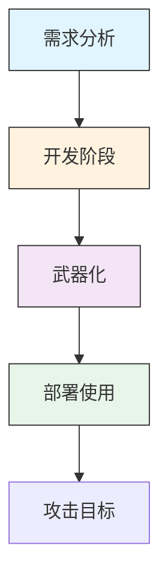

# 开发能力 (T1587)

## 一句话理解

> 攻击者自己动手造"武器"——编写木马、挖掘漏洞、伪造证书，量身定制最适合目标的攻击工具。

## 30秒速查卡

| 项目 | 内容 |
|------|------|
| 攻击目标 | 购买域名、服务器等攻击基础设施 |
| 典型手法 | 使用匿名支付和虚假注册信息购买网络资源 |
| 关键检测点 | 监控新注册域名、异常DNS查询和短生命周期域名 |
| 难度等级 | ⭐⭐⭐ |


## 难度等级

⭐⭐⭐（高级）— 需要较强的编程和安全研究能力，通常是APT组织和高级威胁行为者的能力。

## 技术描述

开发能力是指攻击者自行开发攻击工具和能力，而不是购买或窃取现成的。这就像一个特种部队自己研发武器，而不是使用通用装备。

为什么要自己造？因为：

- **量身定制**：针对特定目标的环境和防御措施优化工具
- **规避检测**：自定义恶意软件不会被已有的杀毒软件特征库识别
- **功能可控**：完全控制工具的功能和行为
- **保持隐蔽**：使用自定义工具不会与其他攻击者产生关联
- **持续更新**：可以根据目标防御的变化快速调整

开发能力包括：
- **恶意软件**：木马、后门、勒索软件、信息窃取器等
- **代码签名证书**：伪造或获取代码签名证书，让恶意软件看起来像合法软件
- **数字证书**：创建SSL/TLS证书用于加密C2通信
- **漏洞利用**：开发针对特定漏洞的利用代码

## 子技术列表

| 子技术 ID | 名称 | 一句话理解 |
|-----------|------|------------|
| T1587.001 | 恶意软件 | 编写木马、后门、勒索软件等恶意程序 |
| T1587.002 | 代码签名证书 | 伪造代码签名证书，让恶意软件看起来合法 |
| T1587.003 | 数字证书 | 创建SSL/TLS证书用于加密通信 |
| T1587.004 | 漏洞利用 | 挖掘和利用软件漏洞的代码 |

## 攻击流程

### 典型攻击流程

```
需求分析 --> 开发阶段 --> 武器化 --> 部署使用
```



**步骤详解：**

1. **需求分析**
   - 通俗描述：确定需要什么类型的恶意软件，设计功能需求
   - 技术细节：分析目标环境（操作系统版本、安全产品、网络架构），确定攻击目标
   - 常用工具：情报分析工具、目标信息数据库

2. **开发阶段**
   - 通俗描述：编写恶意软件代码，实现所需功能
   - 技术细节：编写恶意代码，实现反沙箱、反调试、混淆等规避技术
   - 常用工具：Visual Studio、GCC、Python、IDA Pro、x64dbg

3. **武器化**
   - 通俗描述：将恶意代码打包成可投递的攻击武器
   - 技术细节：编译恶意软件，创建投递载体（Office文档、PDF等），配置C2服务器
   - 常用工具：Cobalt Strike、MSFvenom、打包工具

4. **部署使用**
   - 通俗描述：将武器投递到目标系统上执行
   - 技术细节：通过钓鱼邮件分发恶意附件，通过水坑攻击投递
   - 常用工具：钓鱼工具包、水坑攻击框架

## 真实案例

### 案例1：Slow Pisces开发定制Python恶意软件针对加密货币开发者
- **时间**：2024-2025年
- **目标**：全球加密货币行业开发者
- **攻击组织**：Slow Pisces（又称Jade Sleet、TraderTraitor）
- **手法**：朝鲜国家赞助的威胁组织Slow Pisces冒充LinkedIn上的招聘人员，向加密货币开发者发送伪装成编码挑战的恶意软件。该组织创建了包含恶意代码的GitHub仓库，当开发者运行项目时，会感染名为RN Loader和RN Stealer的自定义Python恶意软件。该组织使用YAML反序列化和EJS escapeFunction等技术来隐藏恶意代码的执行，以规避检测。
- **影响**：大量加密货币开发者的凭证和系统被窃取
- **参考链接**：[Unit 42：Slow Pisces针对开发者的新定制Python恶意软件](https://unit42.paloaltonetworks.com/slow-pisces-new-custom-malware/)

### 案例2：APT28开发BeardShell和Covenant定制恶意软件
- **时间**：2024-2025年
- **目标**：乌克兰政府机构和军事组织
- **攻击组织**：APT28（Fancy Bear、Sednit）
- **手法**：APT28开发了多种定制恶意软件：BeardShell（C++后门，使用Icedrive云存储作为C2通道）和SlimAgent（间谍软件，具备截图、键盘记录、剪贴板监控功能）。攻击者还整合了开源Covenant框架的自定义C2Bridge，利用Koofr云存储API进行通信。恶意载荷被嵌入PNG图片文件中，这是一种APT28从未使用过的隐蔽技术。攻击链始于利用CVE-2026-21509漏洞的鱼叉钓鱼活动。
- **影响**：乌克兰政府网络被长期渗透，敏感数据持续外泄
- **参考链接**：[ESET: Sednit reloaded: Back in the trenches](https://www.welivesecurity.com/en/eset-research/sednit-reloaded-back-trenches/)

### 案例3：朝鲜Andariel组织开发定制恶意软件
- **时间**：2024年（持续活跃）
- **目标**：全球国防、航空航天和医疗机构
- **攻击组织**：Andariel（朝鲜APT组织，Lazarus分支）
- **手法**：根据FBI和CISA的联合报告，Andariel组织开发和使用了超过10种定制恶意软件，包括Atharvan、MagicRAT、TigerRAT、NukeSped、AndarLoader等。这些恶意软件具备执行命令、键盘记录、截屏、文件操作、浏览器历史窃取等丰富功能。此外，该组织还定制化使用了开源工具如3Proxy、Impacket、Mimikatz。这些定制恶意软件使攻击者能够保持对目标系统的长期访问。
- **影响**：全球多行业组织的数据和系统被长期渗透
- **参考链接**：[CISA: DPRK Cyber Group Global Espionage Campaign](https://www.cisa.gov/sites/default/files/2024-08/aa24-207a-dprk-cyber-group-conducts-global-espionage-campaign_0.pdf)

### 案例4：APT28开发SpyPress webmail框架
- **时间**：2024-2025年
- **目标**：全球政府和军事机构的webmail系统
- **攻击组织**：APT28（Fancy Bear）
- **手法**：APT28开发了名为SpyPress的JavaScript框架，用于针对webmail系统。该框架有四个变种：SpyPress.HORDE、SpyPress.MDAEMON、SpyPress.ROUNDCUBE和SpyPress.ZIMBRA，分别针对不同的webmail平台。该定制开发能力使APT28能够根据目标邮件系统的不同选择合适的工具，大大提高了攻击成功率。
- **影响**：大量政府邮件系统的通信内容被窃取
- **参考链接**：[Picus Security: APT28 Cyber Threat Profile](https://www.picussecurity.com/resource/blog/apt28-cyber-threat-profile-and-detailed-ttps)

## 红队视角

> ⚠️ **免责声明**：以下内容仅用于合法的安全测试、渗透测试和教育目的。未经授权对他人系统进行测试是违法行为。

作为红队成员，开发能力是高级红队的核心竞争力：

- **恶意软件开发**：使用C/C++、Rust、Go等语言编写自定义恶意软件，避免使用公开的工具
- **规避技术**：实现反沙箱、反调试、进程注入等规避技术，绕过安全产品检测
- **漏洞利用开发**：针对目标环境中的已知漏洞开发利用代码，特别是N-day漏洞
- **代码签名**：获取或伪造代码签名证书，让恶意软件通过签名验证
- **C2框架开发**：开发自定义C2通信协议，使用DNS、HTTPS、WebSocket等多种通信方式

## 蓝队视角

蓝队应该关注以下防御要点：

- **行为检测**：基于恶意软件行为（而非特征）进行检测
- **代码签名验证**：验证所有可执行文件的数字签名
- **漏洞管理**：及时修补已知漏洞，减少可被利用的攻击面
- **沙箱分析**：使用沙箱分析可疑文件的行为

## 检测建议

### 网络层检测

**检测方法：** 监控向代码仓库（GitHub、GitLab）的异常推送、证书透明日志中的可疑证书签发，以及非开发环境中的编译工具网络连接。

**具体规则/命令示例：**
```
# 检测非工作时间向组织Git仓库的推送
grep "git push" access.log | grep -v "09:00-18:00" | alert

# 检测非开发主机上的编译工具网络活动
suricata -r dev_traffic.pcap --rule "alert tcp $HOME_NET any -> $EXTERNAL_NET 443 (msg:\"Non-dev host compiling\"; flow:to_server; content:\"cl.exe\"; sid:1000001;)"
```

1. **行为监控**：监控异常的进程行为，如敏感文件访问、注册表修改、异常网络连接
2. **代码签名验证**：验证所有可执行文件和驱动程序的数字签名，标记未知签名
3. **证书透明日志**：监控证书透明日志中针对组织域名的异常证书颁发
4. **漏洞利用检测**：部署IDS/IPS检测已知漏洞利用特征和行为
5. **软件供应链安全**：实施代码签名、完整性验证和构建过程监控


## 用人话说

> **检测解读**：自研恶意软件意味着攻击者在"量身定制"武器。检测重点是发现编译环境的异常活动、调试器的使用、以及代码混淆工具的运行。如果在开发人员的机器上发现不常见的编译器或反调试工具，或者在非开发时段有编译活动，需要警惕。
>
> **避坑指南**：不要以为只有运行中的恶意软件才危险，开发阶段的代码同样能泄露攻击意图。监控开发工具的使用模式和代码仓库的异常提交比只扫描最终产物更有效。

### Sigma规则示例

```yaml
title: 可疑编译工具执行检测
id: a7b8c9d0-1e2f-3a4b-5c6d-7e8f9a0b1c2d
status: experimental
description: 检测非开发环境中执行可疑编译工具（如未签名的Visual Studio编译器、MinGW、PyInstaller）的行为，可能指示恶意软件开发活动
logsource:
  category: process_creation
  product: windows
detection:
  selection:
    Image|endswith:
      - '\cl.exe'
      - '\gcc.exe'
      - '\g++.exe'
      - '\mingw32-make.exe'
      - '\pyinstaller.exe'
      - '\upx.exe'
    CommandLine|contains:
      - '-o'
      - '--onefile'
      - '--noconsole'
      - '--encrypt'
  filter:
    Image|startswith:
      - 'C:\Program Files\'
      - 'C:\Program Files (x86)\'
      - 'C:\Windows\'
  condition: selection and not filter
falsepositives:
  - 开发人员在非标准路径安装的合法开发工具
  - 安全研究人员的恶意软件分析环境
level: medium
```

```yaml
title: 代码签名证书异常使用检测
id: b8c9d0e1-2f3a-4b5c-6d7e-8f9a0b1c2d3e
status: experimental
description: 检测使用自签名证书或可疑颁发者签名的可执行文件的执行行为，可能指示恶意软件使用伪造证书
logsource:
  category: process_creation
  product: windows
detection:
  selection:
    EventID: 1
    Signed: 'false'
    Image|endswith:
      - '.exe'
      - '.dll'
      - '.sys'
  filter:
    Image|startswith:
      - 'C:\Windows\'
      - 'C:\Program Files\'
  condition: selection and not filter
falsepositives:
  - 内部开发的未签名应用程序
  - 开源项目的未签名二进制文件
level: medium
```

## 缓解措施

### 优先级1：关键措施

**措施名称：** 端点检测与响应（EDR）部署

**具体实施步骤：**
1. 在所有端点部署EDR解决方案（如Microsoft Defender for Endpoint、CrowdStrike、SentinelOne）
2. 配置行为检测规则，监控异常的进程行为和代码执行
3. 启用云-delivered保护，及时获取最新的检测特征

### 优先级2：重要措施

**措施名称：** 应用控制（Application Control）

**具体实施步骤：**
1. 使用Windows Defender Application Control（WDAC）或AppLocker限制只能执行授权的应用程序
2. 配置允许执行的白名单策略
3. 定期审计应用控制日志，发现绕过尝试

**措施名称：** 补丁管理

**具体实施步骤：**
1. 实施自动化补丁管理流程
2. 及时修补所有系统和应用程序的已知漏洞
3. 优先修补已知被用作零日漏洞利用的漏洞

### 优先级3：建议措施

**措施名称：** 软件供应链安全

**具体实施步骤：**
1. 实施代码签名要求
2. 建立软件物料清单（SBOM）管理
3. 定期审计第三方和开源组件的安全性

### MITRE ATT&CK 缓解措施映射

| 缓解措施ID | 缓解措施名称 | 适用性 | 说明 |
|------------|-------------|:------:|------|
| M1038 | 执行预防 | 适用 | 使用WDAC/AppLocker限制代码执行 |
| M1040 | 端点行为监控 | 适用 | EDR监控恶意软件行为 |
| M1051 | 软件更新 | 适用 | 及时修补已知漏洞 |
| M1045 | 代码签名 | 部分适用 | 验证代码签名，防止未签名恶意软件执行 |

## 动手实验

> ⚠️ **重要提示**：所有实验必须在隔离的实验室环境中进行，禁止对未授权的真实系统进行测试。

### 实验1：分析恶意软件行为
```bash
# 使用YARA规则扫描恶意文件
yara -r malware_rules.yar /path/to/scan

# 使用PEstudio分析可执行文件
# 查看导入表、字符串、节信息等

# 使用Process Monitor监控恶意软件行为
# 过滤进程名称，观察文件、注册表、网络活动
```

### 实验2：代码签名检查
```powershell
# 检查可执行文件的数字签名
Get-AuthenticodeSignature "C:\path\to\file.exe"

# 使用Sigcheck工具（Sysinternals）
sigcheck -v "C:\path\to\file.exe"
```

## 术语解释

| 术语 | 英文原名 | 通俗解释 |
|------|----------|----------|
| 代码签名 | Code Signing | 使用数字证书对软件签名，证明软件来源和未被篡改，像防伪标签 |
| 零日漏洞 | Zero-day Vulnerability | 尚未被软件厂商知晓或修补的安全漏洞，厂商有"0天"时间准备补丁 |
| 模糊测试 | Fuzzing | 通过向软件输入随机或异常数据来发现漏洞的测试方法 |
| 反沙箱技术 | Anti-Sandbox | 恶意软件检测自己是否在隔离环境中运行，以逃避安全分析 |
| 反调试技术 | Anti-Debugging | 恶意软件检测自己是否被调试器附加，阻止安全研究人员分析 |
| 进程注入 | Process Injection | 将恶意代码注入到合法进程的内存空间中执行，像躲进别人的影子里 |
| 概念验证 | Proof of Concept (PoC) | 证明漏洞可被利用的最小化代码示例 |

## 参考资料

- [MITRE ATT&CK 开发能力](https://attack.mitre.org/techniques/T1587/)
- [MITRE ATT&CK 开发恶意软件](https://attack.mitre.org/techniques/T1587/001/)
- [MITRE ATT&CK 开发代码签名证书](https://attack.mitre.org/techniques/T1587/002/)
- [MITRE ATT&CK 开发数字证书](https://attack.mitre.org/techniques/T1587/003/)
- [MITRE ATT&CK 开发漏洞利用](https://attack.mitre.org/techniques/T1587/004/)
- [Unit 42：Slow Pisces针对开发者的新定制Python恶意软件](https://unit42.paloaltonetworks.com/slow-pisces-new-custom-malware/)
- [Mandiant博客：调查SolarWinds供应链攻击](https://www.mandiant.com/resources/blog/solarwinds-supply-chain-compromise)
- [Startup Defense：T1587开发获取能力](https://www.startupdefense.io/mitre-attack-techniques/t1587-develop-capabilities)
