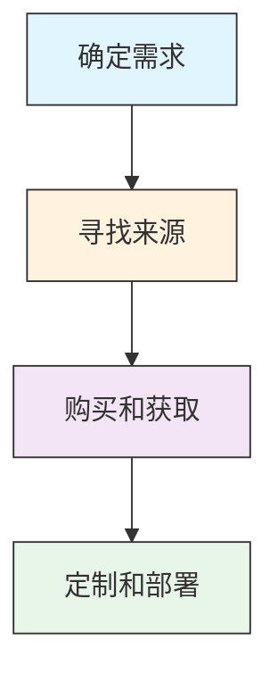

# 获取能力 (T1588)

## 一句话理解

> 攻击者不自己造武器，而是从暗网市场购买现成的木马、漏洞和工具——"拿来主义"省时省力。

## 难度等级

⭐⭐（中级）— 技术门槛低，只要有钱就能买到攻击工具。

## 技术描述

获取能力是指攻击者通过购买、免费下载或窃取的方式获得攻击工具和能力。与"开发能力"（T1587，自己造）不同，"获取能力"是直接买现成的。

为什么要买而不是自己造？

- **省时间**：开发一个高质量的恶意软件可能需要数月，买一个只需要几分钟
- **技术门槛低**：不需要高级编程能力，任何人都可以购买和使用
- **种类丰富**：暗网市场上有各种各样的攻击工具，从简单的钓鱼工具包到复杂的APT框架
- **持续更新**：卖家通常会提供更新和技术支持
- **成本低廉**：很多工具的价格远低于开发成本

获取能力的来源包括：
- **暗网市场**：如AlphaBay、Hydra等犯罪市场
- **黑客论坛**：如XSS、Exploit、RAMP等俄语黑客论坛
- **开源工具**：合法的安全测试工具被恶意使用
- **泄露工具**：从其他攻击者或安全厂商泄露的工具
- **商业产品**：合法的监控和安全测试工具被滥用

## 子技术列表

| 子技术 ID | 名称 | 一句话理解 |
|-----------|------|------------|
| T1588.001 | 恶意软件 | 从暗网购买木马、勒索软件、信息窃取器等 |
| T1588.002 | 工具 | 购买Cobalt Strike、Metasploit等渗透测试工具 |
| T1588.003 | 代码签名证书 | 购买或窃取代码签名证书，让恶意软件看起来合法 |
| T1588.004 | 数字证书 | 购买SSL/TLS证书用于加密C2通信 |
| T1588.005 | 漏洞利用 | 购买漏洞利用代码或漏洞利用工具包 |
| T1588.006 | 漏洞信息 | 购买未公开的漏洞信息（零日漏洞） |
| T1588.007 | 人工智能 | 购买或利用AI模型用于恶意目的 |

## 攻击流程

### 典型攻击流程

```
确定需求 --> 寻找来源 --> 购买获取 --> 定制部署
```



**步骤详解：**

1. **确定需求**
   - 通俗描述：想清楚要买什么类型的攻击工具
   - 技术细节：根据攻击目标和环境评估需求（勒索软件、木马、漏洞利用等）
   - 常用工具：暗网市场索引、黑客论坛

2. **寻找来源**
   - 通俗描述：在暗网或黑客论坛上寻找合适的卖家
   - 技术细节：搜索暗网市场（如AlphaBay、Hydra），在黑客论坛（如XSS、Exploit、RAMP）询价
   - 常用工具：Tor浏览器、暗网搜索引擎

3. **购买和获取**
   - 通俗描述：用加密货币购买并下载工具
   - 技术细节：使用比特币或门罗币支付，下载工具包和文档，测试功能
   - 常用工具：加密货币钱包、VPN

4. **定制和部署**
   - 通俗描述：根据目标环境修改配置后使用
   - 技术细节：修改默认设置避免基于特征的检测，测试攻击链
   - 常用工具：十六进制编辑器、混淆工具、打包工具

## 真实案例

### 案例1：Lazarus集团利用零日漏洞部署Rootkit
- **时间**：2024-2025年
- **目标**：加密货币交易所和金融机构
- **手法**：Lazarus集团被观察到利用多个零日漏洞，包括Windows AFD.sys驱动中的CVE-2024-38193来部署Rootkit，以及在针对加密货币交易所的钓鱼活动中利用CVE-2025-48384。这些漏洞利用代码可能是通过暗网市场购买或从安全研究社区窃取的。
- **链接**：[Lazarus Group exploits Windows driver zero-day](https://blackswan-cybersecurity.com/lazarus-group-exploits-windows-driver-zero-day-to-deploy-rootkit/)

### 案例2：Cobalt Strike在犯罪市场的泛滥
- **时间**：持续进行中
- **目标**：全球各行业组织
- **手法**：Cobalt Strike原本是一款合法的商业渗透测试工具，但其破解版本在暗网市场和黑客论坛上广泛流传。从APT组织到勒索软件团伙，各种威胁行为者都在使用破解版Cobalt Strike作为主要的C2框架。由于其强大的功能和广泛的使用，安全厂商对Cobalt Strike的检测能力也在不断提升。
- **链接**：[MITRE ATT&CK 获取能力：工具](https://attack.mitre.org/techniques/T1588/002/)

### 案例3：APT28购买和使用SSL/TLS证书
- **时间**：持续进行中
- **目标**：政府和军事机构
- **手法**：APT28（Fancy Bear）被观察到购买和使用SSL/TLS证书用于其C2基础设施，以及从被入侵的组织窃取合法证书以启用加密通信和中间人攻击。这些证书使恶意流量看起来像合法的加密通信，增加了检测难度。
- **链接**：[MITRE ATT&CK 获取能力：数字证书](https://attack.mitre.org/techniques/T1588/004/)

### 案例4：Lumma信息窃取器在暗网的大规模交易
- **时间**：2024-2025年
- **目标**：全球Windows用户（超过39.4万台电脑被感染）
- **攻击组织**：Lumma Stealer运营组织
- **手法**：Lumma信息窃取器（Infostealer）通过恶意软件即服务（MaaS）模式在暗网市场上广泛销售。买家每月支付订阅费即可使用该恶意软件窃取浏览器凭证、加密货币钱包、会话Cookie等敏感数据。2025年，Europol和微软联合执法行动"Endgame"摧毁了Lumma的基础设施，发现该恶意软件已感染全球超过39.4万台Windows电脑。被盗数据被汇总后在暗网市场上批量出售。
- **影响**：超过39.4万台设备被感染，海量凭证和敏感数据被窃取并出售
- **参考链接**：[Europol: IOCTA 2025 - Steal, Deal and Repeat](https://www.europol.europa.eu/cms/sites/default/files/documents/Steal-deal-repeat-IOCTA_2025.pdf)

## 红队视角

> ⚠️ **免责声明**：以下内容仅用于合法的安全测试、渗透测试和教育目的。未经授权对他人系统进行测试是违法行为。

作为红队成员，获取能力是快速建立攻击能力的捷径：

- **工具选择**：根据目标环境选择合适的工具，不要盲目使用最复杂的工具
- **版本管理**：使用最新版本的工具，避免使用已被广泛检测的旧版本
- **定制修改**：购买工具后进行定制修改，避免与其他使用者产生相同的特征
- **来源验证**：从可信的来源获取工具，避免使用被植入后门的版本
- **成本控制**：很多优秀的开源工具是免费的，不需要购买昂贵的商业工具

## 蓝队视角

蓝队应该关注以下防御要点：

- **威胁情报**：订阅威胁情报源，获取最新泄露工具的检测特征
- **行为检测**：基于工具行为（而非特征）进行检测，适应工具的不断更新
- **应用控制**：限制只能执行授权的应用程序
- **网络监控**：监控与已知恶意工具C2基础设施的通信

## 检测建议

### 网络层检测

**检测方法：** 监控与已知恶意工具分发站点、暗网论坛或地下市场的网络通信，检测用户下载已知恶意工具（Cobalt Strike、Mimikatz等）的流量特征。

**具体规则/命令示例：**
```
# 检测已知恶意工具的下载流量
suricata -r traffic.pcap --rule "alert tcp $HOME_NET any -> $EXTERNAL_NET $HTTP_PORTS (msg:\"Known Malware Tool Download\"; flow:to_server; content:\"/cobaltstrike\"; sid:1000002;)"

# 检测访问已知恶意软件分发站点
zeek -r traffic.pcap | grep -f known_malware_domains.txt
```

1. **威胁情报集成**：将威胁情报馈入SIEM系统，自动关联已知恶意工具的指标
2. **行为检测**：使用EDR解决方案检测恶意工具的行为模式，如进程注入、凭证窃取等
3. **网络流量分析**：检测与已知C2框架（如Cobalt Strike）的通信特征
4. **应用控制**：使用WDAC或AppLocker限制只能执行授权的应用程序
5. **代码签名验证**：验证所有可执行文件的数字签名

### Sigma规则示例

```yaml
title: 已知恶意工具下载检测
id: c9d0e1f2-3a4b-5c6d-7e8f-9a0b1c2d3e4f
status: experimental
description: 检测用户从外部URL下载已知与恶意工具相关的文件，如Cobalt Strike、Mimikatz等
logsource:
  category: network_connection
  product: windows
detection:
  selection:
    DestinationUrl|contains:
      - '/cobaltstrike'
      - '/mimikatz'
      - '/metasploit'
      - '/payload'
      - '/beacon'
      - '/shellcode'
      - 'cobaltstrike'
      - 'mimikatz'
    Initiated: 'true'
  condition: selection
falsepositives:
  - 安全研究人员下载用于分析的工具
  - 授权渗透测试活动
level: high
```

```yaml
title: 暗网论坛访问检测
id: d0e1f2a3-4b5c-6d7e-8f9a-0b1c2d3e4f5a
status: experimental
description: 检测通过Tor浏览器访问已知暗网交易论坛的行为，可能指示攻击工具获取活动
logsource:
  category: process_creation
  product: windows
detection:
  selection:
    Image|endswith: '\tor.exe'
    ParentImage|endswith: '\firefox.exe'
  or
  selection2:
    Image|endswith: '\torbrowser.exe'
  condition: 1 of selection*
falsepositives:
  - 隐私意识用户正常使用Tor
  - 记者或研究人员访问暗网
level: low
```

## 缓解措施

### 优先级1：关键措施

**措施名称：** 端点检测与响应（EDR）

**具体实施步骤：**
1. 部署EDR解决方案，配置行为检测规则识别常见恶意工具的行为模式
2. 配置针对已知恶意工具（如Cobalt Strike、Metasploit）的检测规则
3. 启用云-delivered保护，及时获取最新工具的检测特征

### 优先级2：重要措施

**措施名称：** 应用控制（Application Control）

**具体实施步骤：**
1. 使用WDAC或AppLocker限制只能执行授权的应用程序
2. 配置针对PowerShell、WMI等脚本执行策略
3. 阻止从临时目录和下载目录执行代码

**措施名称：** 威胁情报集成

**具体实施步骤：**
1. 订阅商业威胁情报源，获取最新恶意工具的检测特征
2. 将威胁情报馈入SIEM和EDR系统
3. 定期更新IP黑名单和域名黑名单

### 优先级3：建议措施

**措施名称：** Web过滤与网络分段

**具体实施步骤：**
1. 阻止访问已知的恶意软件仓库和暗网论坛
2. 实施网络分段，限制横向移动
3. 部署DNS过滤服务，阻止已知恶意域名解析

### MITRE ATT&CK 缓解措施映射

| 缓解措施ID | 缓解措施名称 | 适用性 | 说明 |
|------------|-------------|:------:|------|
| M1038 | 执行预防 | 适用 | 阻止未授权的恶意工具执行 |
| M1040 | 端点行为监控 | 适用 | EDR监控恶意工具的行为模式 |
| M1017 | 用户培训 | 适用 | 培训员工识别钓鱼和社会工程 |
| M1031 | 网络信息隔离 | 部分适用 | Web过滤限制对恶意站点的访问 |

## 动手实验

> ⚠️ **重要提示**：所有实验必须在隔离的实验室环境中进行，禁止对未授权的真实系统进行测试。

### 实验1：分析Cobalt Strike流量特征
```bash
# 使用Wireshark过滤Cobalt Strike的默认流量特征
# 默认URI路径: /submit.php?id=
# 默认User-Agent: Mozilla/5.0 (compatible; MSIE 9.0; Windows NT 6.1; Trident/5.0)

# 使用Snort/Suricata规则检测Cobalt Strike
# 规则示例: alert http any any -> $HOME_NET any (msg:"Cobalt Strike Beacon"; content:"/submit.php?id="; sid:1000001;)
```

### 实验2：暗网市场调研（仅供研究）
1. 使用Tor浏览器访问暗网市场的公开索引
2. 观察攻击工具的价格和种类
3. 了解犯罪市场的运作模式
4. 记录发现的工具名称和特征用于防御

## 术语解释

| 术语 | 英文原名 | 通俗解释 |
|------|----------|----------|
| 暗网 | Dark Web | 需要特殊软件（如Tor）才能访问的互联网隐藏部分 |
| 漏洞利用工具包 | Exploit Kit | 自动化利用网站访问者浏览器漏洞的工具集合，像能自动开锁的万能钥匙包 |
| 零日漏洞 | Zero-day | 尚未被软件厂商知晓或修补的安全漏洞 |
| Cobalt Strike | Cobalt Strike | 合法的商业渗透测试工具，被攻击者广泛滥用 |
| 初始访问经纪人 | Initial Access Broker (IAB) | 专门入侵网络并出售访问权限的犯罪分子 |
| 破解版 | Cracked Version | 被非法修改以绕过许可证验证的软件版本 |
| 勒索软件即服务 | Ransomware as a Service (RaaS) | 提供完整勒索软件运营平台的犯罪商业模式 |

## 参考资料

- [MITRE ATT&CK 获取能力](https://attack.mitre.org/techniques/T1588/)
- [MITRE ATT&CK 获取能力：恶意软件](https://attack.mitre.org/techniques/T1588/001/)
- [MITRE ATT&CK 获取能力：工具](https://attack.mitre.org/techniques/T1588/002/)
- [MITRE ATT&CK 获取能力：漏洞利用](https://attack.mitre.org/techniques/T1588/005/)
- [Lazarus Group exploits Windows driver zero-day](https://blackswan-cybersecurity.com/lazarus-group-exploits-windows-driver-zero-day-to-deploy-rootkit/)
- [Initial Access Brokers Are Key to Rise in Ransomware Attacks](https://www.recordedfuture.com/research/initial-access-brokers-key-to-rise-in-ransomware-attacks)
