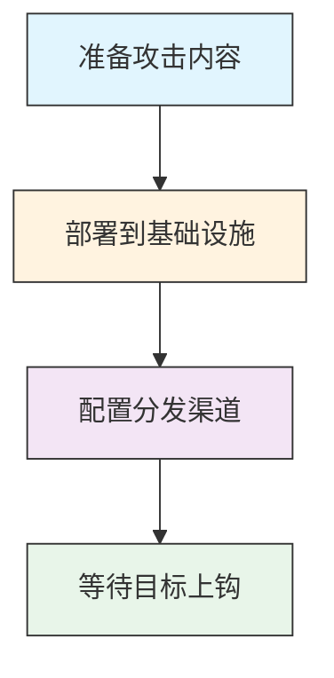

# 暂存能力 (T1608)

## 一句话理解

> 攻击者把"弹药"（恶意软件、钓鱼页面）部署到服务器上，随时准备对目标"开火"。

## 30秒速查卡

| 项目 | 内容 |
|------|------|
| 攻击目标 | 购买域名、服务器等攻击基础设施 |
| 典型手法 | 使用匿名支付和虚假注册信息购买网络资源 |
| 关键检测点 | 监控新注册域名、异常DNS查询和短生命周期域名 |
| 难度等级 | ⭐⭐⭐ |


## 难度等级

⭐⭐⭐（高级）— 需要一定的服务器管理和部署能力。

## 技术描述

暂存能力是指攻击者将开发或获取的攻击工具上传、安装或部署到他们控制的基础设施上，为后续攻击做好准备。这就像军队在前线部署弹药和装备——武器已经造好了，现在需要放到合适的位置，随时可以使用。

暂存能力的作用包括：
- **托管钓鱼页面**：在服务器上部署伪造的登录页面，等待受害者访问
- **分发恶意软件**：将木马上传到服务器或云存储，通过钓鱼邮件分发下载链接
- **部署C2工具**：在服务器上安装C2框架，等待被控机器回连
- **SEO投毒**：创建恶意网页并通过SEO技术使其出现在搜索结果中
- **水坑攻击**：在合法网站上植入恶意代码，等待目标访问

暂存能力的关键在于**隐蔽性**——恶意内容需要与正常内容混合，避免被安全产品发现。

## 子技术列表

| 子技术 ID | 名称 | 一句话理解 |
|-----------|------|------------|
| T1608.001 | 上传恶意软件 | 把木马上传到服务器上等待分发 |
| T1608.002 | 上传工具 | 把渗透工具上传到服务器上等待使用 |
| T1608.003 | 安装数字证书 | 在服务器上安装SSL证书，让恶意网站看起来安全 |
| T1608.004 | 驱动式目标 | 创建恶意网页，用户访问即中招 |
| T1608.005 | 链接目标 | 创建钓鱼链接，诱导用户点击 |
| T1608.006 | SEO中毒 | 操纵搜索结果，让恶意网站排在前面 |

## 攻击流程

### 典型攻击流程

```
准备内容 --> 部署到基础设施 --> 配置分发渠道 --> 等待目标上钩
```



**步骤详解：**

1. **准备攻击内容**
   - 通俗描述：把要投放的恶意内容准备好
   - 技术细节：编译恶意软件、创建钓鱼页面、配置C2工具
   - 常用工具：编译器、HTML编辑器、C2框架

2. **部署到基础设施**
   - 通俗描述：把恶意内容上传到服务器或云平台上
   - 技术细节：上传到自有/被入侵的服务器，或利用GitHub、Pastebin、云存储等合法平台
   - 常用工具：FTP/SFTP客户端、云存储API、Git

3. **配置分发渠道**
   - 通俗描述：设置好分发恶意内容的通道
   - 技术细节：配置钓鱼邮件模板、SEO优化使恶意网页出现在搜索结果前列
   - 常用工具：钓鱼工具包、SEO工具、社交媒体管理工具

4. **等待目标上钩**
   - 通俗描述：监控恶意内容的访问情况，等待受害者上钩
   - 技术细节：监控钓鱼页面访问日志、跟踪恶意软件下载情况
   - 常用工具：Web分析工具、访问日志监控

## 真实案例

### 案例1：GoldMelody利用GitHub和云存储暂存恶意载荷
- **时间**：2024-2025年
- **目标**：欧洲和美国的金融、制造、科技行业组织
- **攻击组织**：GoldMelody（UNC961、Prophet Spider）
- **手法**：Unit 42研究人员发现GoldMelody（一个初始访问经纪人）利用GitHub和云存储服务暂存恶意载荷。攻击者入侵ASP.NET Web服务器后，在内存中执行恶意.NET程序集，下载额外的后渗透工具（如端口扫描器TxPortMap、提权工具updf）到被控服务器上。这些工具在磁盘上几乎没有痕迹，完全在内存中运行。该IAB通过ASP.NET ViewState反序列化漏洞利用泄露的Machine Key获取初始访问权限。
- **影响**：约12家欧美组织被入侵，金融和制造业数据面临泄漏风险
- **参考链接**：[Unit 42: GoldMelody's Hidden Chords - IAB In-Memory IIS Modules](https://unit42.paloaltonetworks.com/initial-access-broker-exploits-leaked-machine-keys/)

### 案例2：APT TA-SC-31利用合法网站暂存恶意软件
- **时间**：2025年
- **目标**：亚洲（特别是东亚和南亚）的企业和组织
- **攻击组织**：TA-SC-31
- **手法**：Viettel Threat Intelligence发现的APT组织TA-SC-31，利用可信任的知名网站上传恶意工具进行分发。攻击者在入侵目标系统后，利用合法网站作为跳板，上传AnyDesk和SoftEtherVPN等远程管理工具到被控服务器上，然后再下载到目标内网的其他机器。这种利用可信网站暂存工具的方法，使其能够绕过传统的域名黑名单检测，因为流量来自被信任的域名。
- **影响**：多个亚洲组织被成功入侵，数据面临外泄风险
- **参考链接**：[Viettel Cyber Security: APT TA-SC-31](https://viettelsecurity.com/apt-ta-sc-31-exploiting-reputable-websites-as-a-launchpad-for-targeted-attack-campaigns/)

### 案例3：Medusa Group利用文件托管服务暂存RMM工具
- **时间**：持续进行中
- **目标**：各行业组织
- **手法**：Medusa Group利用文件托管服务filemail[.]com来暂存包含远程监控和管理（RMM）工具如ConnectWise的zip文件。通过将工具托管在合法且广泛使用的文件共享平台上，下载URL不太可能被网络代理或URL过滤解决方案阻止。
- **链接**：[MITRE ATT&CK 上传工具](https://attack.mitre.org/techniques/T1608/002/)

### 案例4：Emotet在被入侵服务器上暂存次级有效载荷
- **时间**：持续进行中
- **目标**：全球各行业组织
- **手法**：Emotet恶意软件运营商在被入侵的网络服务器或合法云服务上暂存次级有效载荷（如Trickbot或Ryuk勒索软件），实现模块化和灵活的交付机制。他们使用编码的脚本和合法的系统工具来检索和执行暂存的有效载荷。
- **链接**：[MITRE ATT&CK 暂存能力](https://attack.mitre.org/techniques/T1608/)

## 红队视角

> ⚠️ **免责声明**：以下内容仅用于合法的安全测试、渗透测试和教育目的。未经授权对他人系统进行测试是违法行为。

作为红队成员，暂存能力是攻击准备的关键环节：

- **选择托管平台**：优先使用合法的云服务（GitHub、Pastebin、Google Drive），这些平台的域名通常不会被防火墙拦截
- **混淆处理**：对上传的恶意软件进行加密、编码或压缩，避免被安全产品检测
- **多层暂存**：使用多层下载链，每一层都进行不同的混淆处理
- **监控有效性**：监控暂存内容的访问日志，了解钓鱼攻击的效果
- **快速更换**：准备好多个暂存位置，一旦被发现可以快速切换

## 蓝队视角

蓝队应该关注以下防御要点：

- **云服务监控**：监控组织网络中对已知文件共享和代码托管服务的异常访问
- **文件完整性监控**：监控关键网站和系统中的文件变更
- **URL过滤**：阻止访问已知的恶意暂存域名
- **沙箱分析**：对从互联网下载的文件进行沙箱分析

## 检测建议

### 网络层检测

**检测方法：** 监控向文件共享服务、匿名Paste站点或云存储的上传流量，特别是来自非浏览器进程的大文件上传或编码载荷上传。

**具体规则/命令示例：**
```
# 检测PowerShell等脚本工具向Pastebin上传数据
suricata -r traffic.pcap --rule "alert tcp $HOME_NET any -> $EXTERNAL_NET $HTTP_PORTS (msg:\"Suspicious Upload to Pastebin\"; content:\"pastebin.com\"; http_header; content:\"POST\"; http_method; sid:1000003;)"

# 检测向云存储上传的可执行文件
tcpdump -i eth0 -A port 443 | grep -E "drive.google.com|dropbox.com" -A 10 | grep -E ".exe|.dll|.ps1"
```

1. **网络流量监控**：监控指向文件共享服务（Dropbox、Google Drive、Pastebin）的异常流量
2. **文件完整性监控**：监控网站和系统中关键文件的意外创建或修改
3. **进程行为监控**：监控使用PowerShell、bitsadmin等工具从网络位置下载文件的行为
4. **云服务日志分析**：分析云服务日志，识别异常的大量下载或非常规时间的访问
5. **威胁情报集成**：利用威胁情报识别与暂存能力相关的已知恶意基础设施


## 用人话说

> **检测解读**：暂存能力就像在"前线部署弹药"——恶意内容已经就位，随时可以发起攻击。检测重点是服务器上的异常文件部署和Web服务配置变更。如果发现Web服务器上突然出现陌生的PHP文件、SSL证书来源可疑、或者服务器开始响应异常的URL路径，说明"弹药"已经上膛。
>
> **避坑指南**：不要只扫描文件本身，要关注文件的"来源"和"部署方式"。通过SSH/SCP上传的文件、通过Web管理界面部署的脚本、以及通过API创建的云资源，检测方式都不一样。

### Sigma规则示例

```yaml
title: 文件共享服务异常上传检测
id: e1f2a3b4-5c6d-7e8f-9a0b-1c2d3e4f5a6b
status: experimental
description: 检测向文件共享服务（如Pastebin、GitHub Gist、Google Drive）上传可疑载荷的行为，可能指示攻击者暂存恶意内容
logsource:
  category: network_connection
  product: windows
detection:
  selection:
    DestinationUrl|contains:
      - 'pastebin.com'
      - 'gist.github.com'
      - 'drive.google.com'
      - 'dropbox.com'
    UploadSize|gt: 102400  # >100KB
    Image|endswith:
      - '\powershell.exe'
      - '\curl.exe'
      - '\wget.exe'
      - '\bitsadmin.exe'
      - '\certutil.exe'
  condition: selection
falsepositives:
  - 备份工具向云存储上传合法文件
  - 开发人员上传代码片段
level: medium
```

```yaml
title: PowerShell远程下载执行检测
id: f2a3b4c5-6d7e-8f9a-0b1c-2d3e4f5a6b7c
status: experimental
description: 检测PowerShell从远程URL下载并执行代码的行为，常见于恶意软件暂存和加载
logsource:
  category: process_creation
  product: windows
detection:
  selection:
    Image|endswith: '\powershell.exe'
    CommandLine|contains|all:
      - 'DownloadString'
      - 'Invoke-Expression'
      - 'IEX'
    CommandLine|contains:
      - 'http://'
      - 'https://'
  condition: selection
falsepositives:
  - 系统管理员使用远程脚本进行自动化管理
  - 合法的软件部署工具
level: high
```

## 缓解措施

### 优先级1：关键措施

**措施名称：** 沙箱分析与文件检测

**具体实施步骤：**
1. 对从互联网下载的所有文件进行沙箱分析
2. 部署恶意软件检测网关，在文件进入网络前进行扫描
3. 配置邮件安全网关检测恶意附件和下载链接

### 优先级2：重要措施

**措施名称：** URL过滤与DNS保护

**具体实施步骤：**
1. 部署Web代理和URL过滤，阻止已知恶意暂存域名
2. 使用DNS过滤服务（如Cisco Umbrella、Cloudflare Gateway）
3. 配置防火墙规则限制对文件共享服务的异常访问

**措施名称：** 云访问安全代理（CASB）

**具体实施步骤：**
1. 部署CASB解决方案监控对云服务的访问
2. 配置策略阻止将敏感数据上传到个人云存储
3. 监控异常的大量下载行为

### 优先级3：建议措施

**措施名称：** 进程行为监控

**具体实施步骤：**
1. 监控PowerShell、bitsadmin等工具从网络位置下载文件的行为
2. 配置Sysmon监控网络连接和文件创建
3. 检测异常的出站连接模式

### MITRE ATT&CK 缓解措施映射

| 缓解措施ID | 缓解措施名称 | 适用性 | 说明 |
|------------|-------------|:------:|------|
| M1038 | 执行预防 | 适用 | 沙箱分析和应用控制阻止恶意软件执行 |
| M1031 | 网络信息隔离 | 适用 | URL过滤和DNS保护阻止对恶意站点的访问 |
| M1021 | 限制基于Web的内容 | 适用 | Web代理和安全网关过滤恶意内容 |
| M1040 | 端点行为监控 | 适用 | 监控异常的文件下载和进程启动 |

## 动手实验

> ⚠️ **重要提示**：所有实验必须在隔离的实验室环境中进行，禁止对未授权的真实系统进行测试。

### 实验1：检测PowerShell下载行为
```powershell
# 查看PowerShell的下载历史（如果启用了脚本块日志）
Get-WinEvent -LogName "Microsoft-Windows-PowerShell/Operational" | Where-Object { $_.Message -like "*DownloadString*" -or $_.Message -like "*DownloadFile*" } | Select-Object -First 10

# 使用Sysmon监控网络连接
# Event ID 3: Network connection
# 关注powershell.exe、cmd.exe等进程的出站连接
```

### 实验2：搭建钓鱼页面检测环境
1. 使用GoPhish搭建钓鱼模拟平台
2. 在内部服务器上部署测试钓鱼页面
3. 配置邮件安全网关检测钓鱼链接
4. 统计检测率和用户点击率

## 术语解释

| 术语 | 英文原名 | 通俗解释 |
|------|----------|----------|
| 暂存 | Staging | 将攻击工具部署到服务器上等待使用的过程 |
| 水坑攻击 | Watering Hole | 入侵目标经常访问的网站，在上面植入恶意代码，像在水源地投毒 |
| SEO投毒 | SEO Poisoning | 操纵搜索引擎排名，使恶意网站出现在搜索结果前列 |
| 驱动式下载 | Drive-by Download | 用户访问被感染网站时自动下载恶意软件，不需要用户点击 |
| 平台即服务 | Platform as a Service (PaaS) | 提供应用程序开发和部署的云平台，如Heroku |
| 远程监控管理 | Remote Monitoring and Management (RMM) | 合法的远程管理工具，常被攻击者滥用 |
| 信标 | Beacon | 恶意软件定期向C2服务器发送的通信信号，像定时发回的报告 |

## 参考资料

- [MITRE ATT&CK 暂存能力](https://attack.mitre.org/techniques/T1608/)
- [MITRE ATT&CK 上传恶意软件](https://attack.mitre.org/techniques/T1608/001/)
- [MITRE ATT&CK 上传工具](https://attack.mitre.org/techniques/T1608/002/)
- [MITRE ATT&CK 安装数字证书](https://attack.mitre.org/techniques/T1608/003/)
- [MITRE ATT&CK 驱动式目标](https://attack.mitre.org/techniques/T1608/004/)
- [MITRE ATT&CK 链接目标](https://attack.mitre.org/techniques/T1608/005/)
- [MITRE ATT&CK SEO中毒](https://attack.mitre.org/techniques/T1608/006/)
- [MITRE ATT&CK Group G0129: Mustang Panda](https://attack.mitre.org/groups/G0129/)
