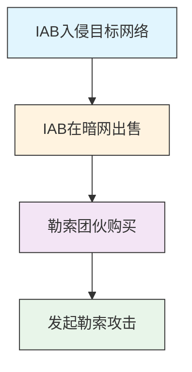

# 获取访问权限 (T1650)

## 一句话理解

> 攻击者直接花钱买别人的"钥匙"（网络访问权限），跳过入侵步骤直接进入目标网络。

## 30秒速查卡

| 项目 | 内容 |
|------|------|
| 攻击目标 | 购买域名、服务器等攻击基础设施 |
| 典型手法 | 使用匿名支付和虚假注册信息购买网络资源 |
| 关键检测点 | 监控新注册域名、异常DNS查询和短生命周期域名 |
| 难度等级 | ⭐⭐⭐ |


## 难度等级

⭐⭐⭐（高级）— 技术门槛低，但需要在暗网市场中找到可靠的卖家。

## 技术描述

获取访问权限是指攻击者通过购买或其他方式获得对目标网络的已有访问权限，而不是自己从头入侵。这就像小偷不自己撬锁，而是直接从别人手里买一把配好的钥匙。

在暗网市场上，有一类专门的犯罪分子叫**初始访问经纪人（Initial Access Broker, IAB）**。他们的"职业"就是入侵各种组织的网络，然后把访问权限卖给其他犯罪分子，特别是勒索软件团伙。

IAB出售的访问权限类型包括：
- **VPN凭证**：可以远程接入企业网络
- **RDP访问**：远程桌面协议访问权限
- **Web Shell**：已植入目标网站的后门
- **被入侵的邮箱**：可以访问企业邮件系统
- **域管理员凭证**：最高权限的网络访问

这种模式的出现使得网络犯罪变得更加"专业化"——IAB专注于入侵，勒索软件团伙专注于加密和勒索，各司其职。

## 攻击流程

### 典型攻击流程

```
IAB入侵 --> 出售访问权限 --> 买家购买 --> 发起攻击
```



**步骤详解：**

1. **IAB入侵目标网络**
   - 通俗描述：初始访问经纪人先黑进目标网络
   - 技术细节：利用VPN漏洞、RDP弱密码、Web应用漏洞获取访问权限
   - 常用工具：漏洞扫描器、暴力破解工具、钓鱼工具包

2. **IAB在暗网出售**
   - 通俗描述：IAB在黑客论坛发布广告出售访问权限
   - 技术细节：在RAMP、XSS论坛发布广告，描述目标行业、规模和访问级别
   - 常用工具：Tor浏览器、加密货币钱包

3. **买家购买**
   - 通俗描述：勒索软件团伙购买访问权限
   - 技术细节：验证访问有效性，支付费用（几百到数万美元），获取凭证
   - 常用工具：加密货币、远程访问工具

4. **发起攻击**
   - 通俗描述：利用购买的访问权限展开勒索攻击
   - 技术细节：横向移动扩大控制范围，窃取数据，部署勒索软件
   - 常用工具：Cobalt Strike、Mimikatz、勒索软件

## 真实案例

### 案例1：ToyMaker初始访问经纪人与Cactus勒索软件集团合作
- **时间**：2023年
- **目标**：关键基础设施企业
- **手法**：初始访问经纪人ToyMaker（UNC961）利用暴露在互联网上的易受攻击系统，部署自定义后门LAGTOY，在大约一周内完成初步侦察、凭证提取和后门部署。约三周后，ToyMaker将访问权限移交给双勒索勒索软件集团Cactus，后者使用被盗凭证通过eHorus、AnyDesk和OpenSSH在受害者网络中进行横向移动和持久化。
- **链接**：[Introducing ToyMaker, an initial access broker](https://blog.talosintelligence.com/introducing-toymaker-an-initial-access-broker/)

### 案例2：Global Group RaaS利用初始访问经纪人
- **时间**：2025年2月
- **目标**：美国律师事务所
- **手法**：俄语初始访问经纪人"HuanEbashes"在RAMP4u论坛上发布广告，出售对美国律师事务所的RDP访问权限，初始要价1000美元。Global Group RaaS管理员表达了兴趣，并讨论了直接购买或利润分成协议。这种访问权限使Global Group能够绕过传统的EDR解决方案，快速部署勒索软件。
- **链接**：[GLOBAL GROUP: Emerging Ransomware-as-a-Service](https://blog.eclecticiq.com/global-group-emerging-ransomware-as-a-service)

### 案例3：IAB市场分析——从出售到勒索仅需19天
- **时间**：2024年6月 - 2025年5月
- **目标**：全球各行业企业（特别是金融、制造、医疗行业）
- **攻击组织**：多个IAB（sandocan、Pirat-Networks、ProfessorKliq等）
- **手法**：根据Intel 471的研究，从2024年6月到2025年5月，安全研究人员观察到4,878条IAB出售访问权限的广告，至少70次与勒索软件攻击相关。访问权限从广告发布到被勒索的平均时间仅19天，最快仅2天。主要的IAB包括sandocan（与Cactus、Inc、Lynx、Medusa、RansomHub等相关联）、Pirat-Networks（与Play、Qilin、Everest等相关联）等。Play勒索软件团伙的IAB还利用SimpleHelp RMM工具的漏洞（CVE-2024-57726等）进行远程代码执行攻击。
- **影响**：数百家组织在IAB出售访问权限后数天内即遭受勒索攻击
- **参考链接**：[Intel 471: How initial access offers power intrusions](https://www.intel471.com/blog/how-initial-access-offers-power-intrusions-and-ransomware)

## 红队视角

> ⚠️ **免责声明**：以下内容仅用于合法的安全测试、渗透测试和教育目的。未经授权对他人系统进行测试是违法行为。

作为红队成员，了解IAB的运作模式有助于：

- **模拟真实威胁**：在红队演练中模拟IAB的攻击路径，测试组织的防御能力
- **评估暴露面**：检查组织的VPN、RDP等远程访问服务是否暴露在互联网上
- **凭证安全**：评估组织的凭证安全性，防止凭证被窃取后出售
- **暗网监控**：监控暗网上是否有组织的访问权限被出售

## 蓝队视角

蓝队应该关注以下防御要点：

- **远程访问加固**：确保VPN、RDP等远程访问服务使用强密码和MFA
- **暗网监控**：监控暗网论坛上是否有组织的凭证或访问权限被出售
- **异常访问检测**：检测来自不寻常位置或时间的远程访问登录
- **暴露面管理**：定期评估和减少面向互联网的攻击面

## 检测建议

### 网络层检测

**检测方法：** 监控来自暗网已知IAB（初始访问经纪人）IP段的连接、异常的VPN/RDP认证模式，以及短期内从新IP段出现的批量远程访问尝试。

**具体规则/命令示例：**
```
# 检测来自已知代理/跳板IP的RDP连接
zeek -r traffic.pcap | grep "rdp" | grep -f proxy_ip_list.txt

# 检测短期内新IP段的大量远程认证
tcpdump -i eth0 port 3389 or port 443 | awk '{print $3}' | cut -d. -f1-3 | sort | uniq -c | sort -nr | head
```

1. **异常远程访问检测**：监控来自非常规地理位置或异常时间的VPN/RDP登录
2. **暗网监控**：使用威胁情报服务监控暗网论坛上是否有组织凭证被出售
3. **凭证使用异常**：检测服务账户或特权账户的异常使用模式
4. **网络流量分析**：识别与已知C2基础设施的异常通信
5. **Web Shell检测**：定期扫描Web服务器上的异常文件


## 用人话说

> **检测解读**：这种攻击方式是"花钱买捷径"——攻击者不用自己入侵，直接从暗网市场购买VPN或RDP凭证。检测重点是发现异常的远程访问模式：从不常见的地理位置登录、非工作时间的VPN连接、同一凭证在多台设备上使用。
>
> **避坑指南**：不要以为VPN凭证被盗只是密码泄露问题。攻击者购买的凭证通常来自数据泄露，他们知道正确的用户名和密码，传统的登录检测可能不会触发告警。关注"登录行为"而非"登录凭证"。

### Sigma规则示例

```yaml
title: 异常远程桌面协议(RDP)登录检测
id: a3b4c5d6-7e8f-9a0b-1c2d-3e4f5a6b7c8d
status: experimental
description: 检测从异常地理位置或非工作时间发起的RDP登录成功事件，可能指示IAB出售的访问权限被使用
logsource:
  category: application
  product: windows
detection:
  selection:
    EventID: 4624  # Logon
    LogonType: 10  # RemoteInteractive
    TargetUserName|endswith:
      - 'admin'
      - 'administrator'
      - 'adm'
    WorkstationName|contains: '-'
  condition: selection and (LogonHour < 6 or LogonHour > 22)
falsepositives:
  - 系统管理员在非工作时间进行维护
  - 跨时区团队的正常远程工作
level: medium
```

```yaml
title: 初始访问经纪人(IAB)暗网广告关键词监控
id: b4c5d6e7-8f9a-0b1c-2d3e-4f5a6b7c8d9e
status: experimental
description: 检测暗网论坛上包含特定行业关键词和访问权限出售意图的帖子，可能指示IAB出售组织访问权限
logsource:
  category: application
  product: threat_intel
detection:
  selection:
    Source|contains:
      - 'exploit'
      - 'xss'
      - 'ramp'
      - 'breachforums'
    PostContent|contains|all:
      - 'access'
      - 'sell'
      - 'shell'
      - 'rdp'
    PostContent|contains:
      - 'vpn'
      - 'corporate'
      - 'network'
      - 'domain'
  condition: selection
falsepositives:
  - 安全研究人员发布的测试帖子
  - 合法渗透测试服务的广告
level: high
```

## 缓解措施

### 优先级1：关键措施

**措施名称：** 远程访问加固

**具体实施步骤：**
1. 对所有面向互联网的远程访问服务（VPN、RDP、RDWeb）强制启用MFA
2. 禁用默认管理端口，使用非标准端口
3. 实施条件访问策略，基于位置和设备合规性限制访问

**配置示例：**
```bash
# 检查面向互联网的RDP服务是否暴露
nmap -sS -p 3389 your-public-ip-range

# 使用Shodan搜索暴露的RDP服务（仅限授权测试）
# shodan search "port:3389 country:US"
```

### 优先级2：重要措施

**措施名称：** 暴露面管理

**具体实施步骤：**
1. 定期扫描和评估面向互联网的攻击面
2. 使用Censys、Shodan等服务发现暴露的服务
3. 减少不必要的互联网暴露服务

**措施名称：** 暗网监控

**具体实施步骤：**
1. 订阅威胁情报服务，监控暗网论坛上是否有组织凭证被出售
2. 配置自动告警，发现组织相关信息时立即通知安全团队
3. 建立IAB违规快速响应流程

### 优先级3：建议措施

**措施名称：** 零信任架构与网络分段

**具体实施步骤：**
1. 实施零信任网络架构，验证每个访问请求
2. 将关键系统与一般网络隔离
3. 监控内部网络中的异常横向移动

### MITRE ATT&CK 缓解措施映射

| 缓解措施ID | 缓解措施名称 | 适用性 | 说明 |
|------------|-------------|:------:|------|
| M1032 | 多因素认证 | 适用 | 防止凭证被窃取后远程访问 |
| M1030 | 网络分段 | 适用 | 限制初始访问后的横向移动 |
| M1036 | 账户使用策略 | 适用 | 监控账户的异常使用 |
| M1017 | 用户培训 | 适用 | 培训员工保护凭证 |

## 动手实验

> ⚠️ **重要提示**：所有实验必须在隔离的实验室环境中进行，禁止对未授权的真实系统进行测试。

### 实验1：评估远程访问暴露面
```bash
# 使用Shodan搜索暴露的RDP服务
# shodan search "port:3389 country:US"

# 使用Censys搜索暴露的VPN服务
# 搜索Fortinet、Pulse Secure等VPN设备

# 使用Nmap扫描内部网络的开放端口
nmap -sV -p 3389,22,443 192.168.1.0/24
```

### 实验2：模拟IAB攻击路径
1. 使用合法的渗透测试工具扫描暴露的远程访问服务
2. 尝试使用默认凭证或弱密码登录
3. 如果成功获取访问权限，评估可以访问的资源范围
4. 记录发现的问题并提出改进建议

## 术语解释

| 术语 | 英文原名 | 通俗解释 |
|------|----------|----------|
| 初始访问经纪人 | Initial Access Broker (IAB) | 专门入侵组织网络并在暗网出售访问权限的犯罪分子 |
| 远程桌面协议 | Remote Desktop Protocol (RDP) | 微软的远程桌面协议，像远程操作另一台电脑的窗口 |
| 虚拟专用网络 | Virtual Private Network (VPN) | 安全的远程访问通道，像在公共网络上拉了一条私人通道 |
| Web Shell | Web Shell | 植入Web服务器的后门脚本，可通过浏览器远程控制服务器 |
| RAMP论坛 | RAMP Forum | 俄语黑客论坛，常被用于交易访问权限和恶意工具 |
| 双勒索 | Double Extortion | 既加密数据又窃取数据，威胁公开泄露增加赎金压力 |
| 勒索软件即服务 | Ransomware as a Service (RaaS) | 提供完整勒索软件运营平台的犯罪商业模式 |

## 参考资料

- [MITRE ATT&CK 获取访问权限](https://attack.mitre.org/techniques/T1650/)
- [Introducing ToyMaker, an initial access broker](https://blog.talosintelligence.com/introducing-toymaker-an-initial-access-broker/)
- [GLOBAL GROUP: Emerging Ransomware-as-a-Service](https://blog.eclecticiq.com/global-group-emerging-ransomware-as-a-service)
- [Initial Access Brokers Are Key to Rise in Ransomware Attacks](https://www.recordedfuture.com/research/initial-access-brokers-key-to-rise-in-ransomware-attacks)
- [Inside the r1z Initial Access Broker Case | KELA](https://www.kelacyber.com/blog/the-high-price-of-poor-opsec-inside-the-r1z-initial-access-broker-case-/)
