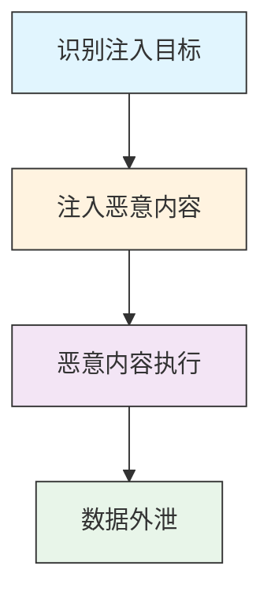

# 内容注入 (T1659)

## 一句话理解

> 攻击者在合法网站里偷偷塞入恶意代码，用户访问这些网站时不知不觉就中招了。

## 30秒速查卡

| 项目 | 内容 |
|------|------|
| 攻击目标 | 购买域名、服务器等攻击基础设施 |
| 典型手法 | 使用匿名支付和虚假注册信息购买网络资源 |
| 关键检测点 | 监控新注册域名、异常DNS查询和短生命周期域名 |
| 难度等级 | ⭐⭐⭐ |


## 难度等级

⭐⭐⭐（高级）— 需要Web安全知识和一定的漏洞利用能力。

## 技术描述

内容注入是指攻击者在受害者访问的合法网站或应用程序中注入恶意内容的技术。与直接攻击目标系统不同，内容注入攻击利用目标信任的第三方平台作为载体，将恶意内容分发给受害者。

想象一下，你经常去的超市突然在货架上放了有毒的商品——你信任这家超市，所以不会怀疑商品有问题。内容注入就是这个道理：攻击者在你信任的网站上植入恶意代码，你访问时不会有任何怀疑。

内容注入的常见方式包括：
- **网站篡改**：在合法网站的页面中注入恶意JavaScript
- **Web Skimming（信用卡盗刷）**：在电商网站的结账页面注入窃取支付信息的代码
- **广告注入**：通过恶意广告网络投放包含恶意代码的广告
- **评论/论坛注入**：在公共论坛中插入恶意链接
- **CMS漏洞利用**：利用WordPress等CMS的漏洞注入恶意内容
- **供应链注入**：入侵第三方JavaScript库或CDN服务

## 攻击流程

### 典型攻击流程

```
识别目标 --> 注入恶意内容 --> 恶意内容执行 --> 数据外泄
```



**步骤详解：**

1. **识别注入目标**
   - 通俗描述：找到存在漏洞、可以注入恶意内容的网站
   - 技术细节：扫描寻找存在Web漏洞的网站，识别使用的CMS或框架
   - 常用工具：Nmap、Burp Suite、WordPress扫描器

2. **注入恶意内容**
   - 通俗描述：在目标网站上植入恶意代码
   - 技术细节：利用SQL注入/XSS漏洞注入脚本，或入侵CMS后台修改模板
   - 常用工具：SQLMap、BeEF、自定义注入脚本

3. **恶意内容执行**
   - 通俗描述：用户访问网站时恶意代码在浏览器中运行
   - 技术细节：窃取表单数据、重定向到钓鱼网站、下载恶意软件
   - 常用工具：JavaScript信息窃取器、Web Skimming工具包

4. **数据外泄**
   - 通俗描述：将窃取的数据发送到攻击者控制的服务器
   - 技术细节：通过加密通道或合法服务（如Telegram API）外传数据
   - 常用工具：C2框架、Telegram Bot API、加密工具

## 真实案例

### 案例1：Polyfill.io供应链内容注入事件——影响10万+网站
- **时间**：2024年
- **目标**：超过10万个使用Polyfill.io CDN服务的网站
- **手法**：攻击者获得了Polyfill.io（一个广泛使用的JavaScript polyfill CDN服务）的控制权，修改了其提供的JavaScript文件，使其包含恶意代码。该恶意代码被注入到引用Polyfill.io CDN的网站中，用于将访问者重定向到恶意网站和赌博平台。这个事件影响了超过10万个网站，包括许多知名网站。这是典型的供应链内容注入攻击。
- **链接**：[Sansec: Polyfill.io Supply Chain Attack](https://sansec.io/research/polyfill-supply-chain-attack)

### 案例2：Magento电商平台大规模信用卡盗刷
- **时间**：2024年
- **目标**：全球Magento电商网站（数万个网站受影响）
- **手法**：攻击者利用Magento平台已知漏洞（包括CVE-2024-20720等）批量入侵电商网站，在结账页面和产品页面注入恶意JavaScript代码。这些注入的代码用于信用卡盗刷（web skimming），窃取用户输入的支付信息。攻击者在每个被入侵的网站上部署多层混淆JavaScript，使其难以被安全扫描器检测。
- **链接**：[Sucuri: Magento Credit Card Skimmer Campaign](https://blog.sucuri.net/2024/03/magento-credit-card-skimmer-campaign.html)

### 案例3：2025年CSS注入和Web字体操纵攻击
- **时间**：2025年
- **目标**：各行业电商网站
- **手法**：安全研究人员发现攻击者使用CSS注入和Web字体操纵作为替代的内容注入向量。与传统的JavaScript注入不同，这些技术利用CSS样式表和字体文件来执行恶意操作，更难被传统的安全扫描器检测。攻击者还使用DOM-based skimmers，不需要服务器端代码注入，直接在浏览器端窃取表单数据。
- **链接**：[Sansec Research](https://sansec.io/)

### 案例4：政府网站内容注入攻击
- **时间**：2022年
- **目标**：多个国家的政府网站
- **手法**：与俄罗斯有关联的威胁组织在多个国家政府网站上进行内容注入攻击。攻击者利用CMS漏洞，在政府网站页面中注入指向恶意域名的JavaScript。当用户访问被感染的页面时，浏览器自动加载远程恶意脚本，收集访问者的系统信息和地理位置数据。
- **链接**：[Recorded Future: Government Website Content Injection](https://www.recordedfuture.com/research/government-website-attacks-content-injection)

## 红队视角

> ⚠️ **免责声明**：以下内容仅用于合法的安全测试、渗透测试和教育目的。未经授权对他人系统进行测试是违法行为。

作为红队成员，内容注入是一种隐蔽的攻击手段：

- **XSS利用**：利用目标网站的XSS漏洞注入恶意脚本
- **CMS漏洞利用**：利用WordPress、Joomla等CMS的已知漏洞注入恶意内容
- **第三方组件**：寻找目标网站使用的存在漏洞的第三方JavaScript库
- **Web Skimming**：在电商网站的支付页面注入信用卡盗刷代码
- **隐蔽性**：使用混淆技术和最小化的注入代码，避免被发现

## 蓝队视角

蓝队应该关注以下防御要点：

- **内容完整性监控**：监控网站文件的完整性，及时发现异常变更
- **CSP部署**：实施内容安全策略，限制可以加载和执行的脚本来源
- **第三方审计**：定期审计网站使用的第三方脚本和CDN资源
- **WAF部署**：部署Web应用防火墙检测和阻止注入攻击

## 检测建议

### 网络层检测

**检测方法：** 监控Web页面中异常加载的外部JavaScript资源、CSP违规报告，以及信用卡表单页面的异常API调用。

**具体规则/命令示例：**
```
# 检测网页中突然出现的未知外部脚本
suricata -r web_traffic.pcap --rule "alert http $EXTERNAL_NET any -> $HOME_NET any (msg:\"New External Script Loaded\"; content:\"<script\"; nocase; content:\"src=\"; nocase; content:\"http\"; nocase; sid:1000004;)"

# CSP违规报告监控
tail -f /var/log/nginx/csp_reports.log | grep -v "trusted-cdn.com"
```

1. **内容完整性监控**：实施FIM系统，定期检查网站关键文件的哈希值
2. **WAF规则**：配置WAF检测已知的恶意JavaScript模式和混淆代码
3. **第三方内容审计**：定期审计网站上使用的第三方脚本和CDN资源
4. **CSP部署**：实施内容安全策略，限制脚本来源
5. **行为分析**：监控网站行为的异常变化，如突然出现的外部API调用


## 用人话说

> **检测解读**：这个技术的检测重点是识别异常行为模式。攻击者在准备阶段会留下很多线索，关键是要关联多个数据源来发现异常。
>
> **避坑指南**：不要只依赖单一检测手段，需要结合网络流量、主机日志、威胁情报等多个维度进行综合判断。

### Sigma规则示例

```yaml
title: 网页异常外部脚本加载检测
id: c5d6e7f8-9a0b-1c2d-3e4f-5a6b7c8d9e0f
status: experimental
description: 检测网页中突然出现的未知外部JavaScript资源加载，可能指示内容注入（Web Skimming/信用卡盗刷）攻击
logsource:
  category: web
  product: generic
detection:
  selection:
    EventID: 'SCRIPT_LOAD'
    SrcDomain|not_contains:
      - '.example.com'
      - '.googletagmanager.com'
      - '.google-analytics.com'
      - 'cdnjs.cloudflare.com'
      - 'cdn.example.com'
    ScriptContent|contains:
      - 'fetch('
      - 'XMLHttpRequest'
      - 'toDataURL'
      - 'encode'
      - 'credit'
      - 'card'
      - 'payment'
  condition: selection
falsepositives:
  - 网站新增的合法第三方分析脚本
  - 开发测试阶段加载的外部资源
level: high
```

```yaml
title: 信用卡盗刷常见API调用检测
id: d6e7f8a9-0b1c-2d3e-4f5a-6b7c8d9e0f1a
status: experimental
description: 检测Web页面中针对信用卡表单数据的异常JavaScript采集行为
logsource:
  category: web
  product: generic
detection:
  selection:
    EventID: 'FORM_SUBMIT'
    InputType: 'password'
    FormAction|contains:
      - '/checkout'
      - '/payment'
      - '/cart'
    InterceptedBy: 'skimmer'
  or
  selection2:
    EventID: 'NETWORK_REQUEST'
    DestinationDomain|not_contains: '.legitimate-payment.com'
    RequestContent|contains:
      - 'cc_number'
      - 'card_number'
      - 'cvv'
      - 'expiry'
      - 'cardholder'
  condition: 1 of selection*
falsepositives:
  - 合法的支付处理服务回调
  - 支付网关的API通信
level: critical
```

## 缓解措施

### 优先级1：关键措施

**措施名称：** 内容安全策略（CSP）部署

**具体实施步骤：**
1. 部署严格的CSP HTTP头，限制可以加载和执行的脚本来源
2. 使用nonce（一次性随机数）限制内联脚本的执行
3. 配置report-uri/report-to收集CSP违规报告

**配置示例：**
```nginx
# Nginx CSP配置示例
add_header Content-Security-Policy "default-src 'self'; script-src 'self' 'nonce-random123' https://trusted-cdn.com; style-src 'self' 'unsafe-inline'; img-src 'self' data:; object-src 'none'; frame-ancestors 'none';" always;
```

### 优先级2：重要措施

**措施名称：** 子资源完整性（SRI）验证

**具体实施步骤：**
1. 为所有从外部CDN加载的JavaScript和CSS文件添加SRI哈希
2. 建立自动化流程，在CDN资源更新时重新计算SRI哈希
3. 使用SRI检查工具验证所有外部资源的完整性

**措施名称：** 定期安全扫描与漏洞修补

**具体实施步骤：**
1. 定期使用Web漏洞扫描器检测XSS、SQL注入等漏洞
2. 保持CMS及其插件的最新状态
3. 部署WAF（Web应用防火墙）检测注入攻击

### 优先级3：建议措施

**措施名称：** 网站文件完整性监控

**具体实施步骤：**
1. 实施文件完整性监控（FIM）系统，监控关键文件的哈希值
2. 对网站后台管理界面实施最小权限原则
3. 定期审查第三方脚本和外部资源的使用情况

### MITRE ATT&CK 缓解措施映射

| 缓解措施ID | 缓解措施名称 | 适用性 | 说明 |
|------------|-------------|:------:|------|
| M1021 | 限制基于Web的内容 | 适用 | CSP和SRI限制内容注入的影响 |
| M1013 | 应用开发限制 | 适用 | 安全编码实践防止注入漏洞 |
| M1030 | 网络分段 | 部分适用 | WAF和代理过滤恶意流量 |
| M1019 | 威胁情报计划 | 部分适用 | 监控已知的供应链注入事件 |

## 动手实验

> ⚠️ **重要提示**：所有实验必须在隔离的实验室环境中进行，禁止对未授权的真实系统进行测试。

### 实验1：检测网站内容注入
```bash
# 使用curl获取网站页面并搜索可疑脚本
curl -s https://example.com | grep -i "script src" | grep -v "example.com"

# 检查外部脚本的完整性
# 使用SRI检查工具验证CDN脚本的哈希值

# 使用OWASP ZAP扫描网站
# 配置Active Scan检测XSS和其他注入漏洞
```

### 实验2：配置CSP策略
```nginx
# Nginx CSP配置示例
add_header Content-Security-Policy "default-src 'self'; script-src 'self' 'nonce-random123'; style-src 'self' 'unsafe-inline'; img-src 'self' data:; font-src 'self';" always;
```

## 术语解释

| 术语 | 英文原名 | 通俗解释 |
|------|----------|----------|
| 跨站脚本攻击 | Cross-Site Scripting (XSS) | 在网页中注入恶意脚本，在其他用户浏览器中执行 |
| Web盗刷 | Web Skimming | 在电商网站支付页面注入代码，窃取信用卡信息 |
| 内容安全策略 | Content Security Policy (CSP) | 限制网页可以加载的资源来源，像给网页设定了严格的访客名单 |
| 子资源完整性 | Subresource Integrity (SRI) | 验证CDN加载的文件未被篡改，像比对文件的指纹 |
| 内容管理系统 | Content Management System (CMS) | 用于创建和管理网站内容的软件平台，如WordPress |
| Magecart | Magecart | 专门针对电商网站进行信用卡盗刷的攻击组织名称 |
| DOM盗刷器 | DOM-based Skimmer | 在浏览器端直接窃取用户输入表单数据的恶意脚本 |
| 供应链攻击 | Supply Chain Attack | 通过入侵第三方组件来攻击所有使用该组件的目标 |

## 参考资料

- [MITRE ATT&CK 内容注入](https://attack.mitre.org/techniques/T1659/)
- [Sansec: Polyfill.io Supply Chain Attack](https://sansec.io/research/polyfill-supply-chain-attack)
- [Sucuri: Magento Credit Card Skimmer Campaign](https://blog.sucuri.net/2024/03/magento-credit-card-skimmer-campaign.html)
- [Recorded Future: Government Website Content Injection](https://www.recordedfuture.com/research/government-website-attacks-content-injection)
- [OWASP: Content Injection](https://owasp.org/www-community/attacks/Content_Injection)
- [Mozilla: Content Security Policy](https://developer.mozilla.org/en-US/docs/Web/HTTP/CSP)
