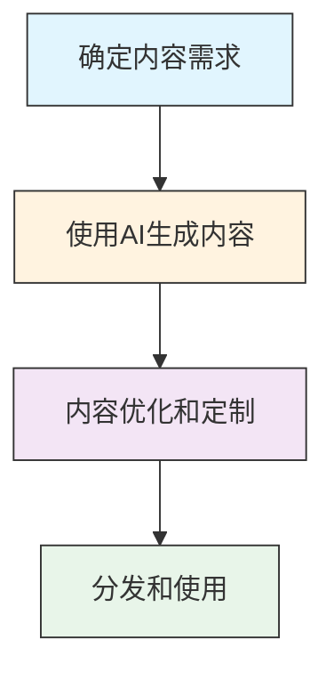

# 生成内容 (T1683)

## 一句话理解

> 攻击者用AI造假——生成钓鱼邮件、深度伪造视频、假新闻，用来欺骗目标上当。

## 30秒速查卡

| 项目 | 内容 |
|------|------|
| 攻击目标 | 购买域名、服务器等攻击基础设施 |
| 典型手法 | 使用匿名支付和虚假注册信息购买网络资源 |
| 关键检测点 | 监控新注册域名、异常DNS查询和短生命周期域名 |
| 难度等级 | ⭐⭐ |


## 难度等级

⭐⭐（中级）— AI工具的普及使得生成虚假内容变得非常容易。

## 技术描述

生成内容是指攻击者创建或生成用于支持攻击行动的内容，包括文字、图片、音频和视频。在AI时代，这项技术变得越来越容易和强大。

想象一下，以前要伪造一封看起来真实的钓鱼邮件需要一定的语言能力，要伪造一段视频更是需要专业的技术。但现在，只需要一个AI提示词，就能生成以假乱真的内容。

生成内容的类型包括：
- **钓鱼邮件**：使用AI生成语法正确、措辞专业的钓鱼邮件
- **社交媒体内容**：生成虚假的帖子、评论和私信
- **深度伪造视频**：伪造高管或名人的视频，用于欺诈
- **语音克隆**：伪造特定人物的声音，用于电话诈骗
- **虚假网站**：使用AI快速生成钓鱼网站
- **虚假新闻**：生成看似真实的新闻文章用于影响力操作

AI的出现使得：
- **成本大幅降低**：以前需要专业人员，现在AI可以自动完成
- **质量显著提高**：AI生成的内容很难被人类识别为虚假
- **规模空前扩大**：可以同时生成大量不同的虚假内容
- **多语言支持**：AI可以轻松生成多种语言的内容

## 子技术列表

| 子技术 ID | 名称 | 一句话理解 |
|-----------|------|------------|
| T1683.001 | 书面内容 | 用AI生成钓鱼邮件、假新闻、社交媒体帖子 |
| T1683.002 | 音视频内容 | 用AI生成深度伪造视频、语音克隆 |

## 攻击流程

### 典型攻击流程

```
确定需求 --> AI生成内容 --> 优化定制 --> 分发使用
```



**步骤详解：**

1. **确定内容需求**
   - 通俗描述：想清楚要生成什么类型的虚假内容
   - 技术细节：确定目标受众、攻击目的（钓鱼/欺诈/影响力操作）、内容类型（文字/图片/视频/音频）
   - 常用工具：情报收集工具、目标分析工具

2. **使用AI生成内容**
   - 通俗描述：用AI工具生成所需的虚假内容
   - 技术细节：编写提示词，使用LLM生成文本，使用图像/视频/音频生成工具
   - 常用工具：ChatGPT、Gemini、Midjourney、DALL-E、语音克隆工具、深度伪造工具

3. **内容优化和定制**
   - 通俗描述：调整内容使其更逼真，适配目标
   - 技术细节：调整语言风格匹配目标，添加个性化细节，绕过AI检测工具
   - 常用工具：AI检测器（用于测试）、提示词工程工具

4. **分发和使用**
   - 通俗描述：将虚假内容投递给目标
   - 技术细节：通过邮件发送钓鱼内容，在社交媒体发布，或在电话中使用语音克隆
   - 常用工具：邮件营销平台、社交媒体管理工具、VoIP工具

## 真实案例

### 案例1：爱国者诱饵运动——利用越狱的Google Gemini进行AI驱动的影响力和欺诈
- **时间**：2021-2026年（特别是2025年9月以后转向完全AI生成内容）
- **目标**：政治参与的美国观众和加密货币用户
- **手法**：一名俄语威胁行为者运营了一个为期五年的MAGA主题Telegram频道（约17,000名订阅者）。从2025年9月开始，该行为者转向使用越狱版本的Google Gemini自动化内容生成、基础设施管理、凭证盗窃和加密货币欺诈。使用AI生成Q风格的帖子，部署QAnon风格的聊天机器人（QFS 2.0 Terminal），分发假冒加密货币钱包安装程序（实际是远程管理工具）。该行为者还使用AI驱动的暴力破解工具针对WordPress站点，成功破解了29个WordPress管理员账户。
- **链接**：[Trend Micro：爱国者诱饵运动内部揭秘](https://www.trendmicro.com/en/research/26/e/inside-the-influence-and-fraud-patriot-bait-campaign.html)

### 案例2：杜拜秀骗局——AI生成的现实驱动的现代投资欺诈
- **时间**：2025年10月开始
- **目标**：通过短信和消息平台寻求投资机会的个人
- **手法**：OPCOPRO"杜拜秀"行动是一个完全合成的、由AI驱动的投资骗局，使用来自官方移动应用商店的合法应用，以及AI生成的社区来窃取受害者的金钱和身份数据。攻击者通过钓鱼短信将受害者拉入WhatsApp和Telegram群组，在群组中AI生成的"专家"和合成同龄人模拟了一个机构级交易社区。攻击者使用LLMs和生成工具来生成令人信服的人物、多语言对话和持续的群众活动。
- **链接**：[Check Point博客：杜拜秀骗局揭秘](https://blog.checkpoint.com/mobile/the-truman-show-scam-trapped-in-an-ai-generated-reality/)

### 案例3：网络犯罪分子滥用AI网站创建应用程序进行钓鱼
- **时间**：2025年4月起
- **目标**：各行业的个人和组织
- **手法**：网络犯罪分子越来越多地使用AI网站生成平台（如Lovable）来创建用于凭证钓鱼和恶意软件交付的欺诈网站。Proofpoint观察到众多利用Lovable服务的活动，分发MFA钓鱼工具包（如Tycoon）、恶意软件和针对信用卡信息的钓鱼工具包。使用仅一两个提示，研究人员就能创建完全功能的钓鱼网站——包括后端逻辑。在2025年2月的一个活动中，数十万条消息影响了超过5,000个组织。
- **链接**：[Proofpoint：网络犯罪分子滥用AI网站创建应用程序进行钓鱼](https://www.proofpoint.com/us/blog/threat-insight/cybercriminals-abuse-ai-website-creation-app-phishing)

### 案例4：Contagious Interview运动利用AI克隆视频会议和深度伪造
- **时间**：2022-2024年
- **目标**：JavaScript开发者
- **手法**：Contagious Interview威胁组织使用AI克隆视频会议应用程序以分发BeaverTail恶意软件，还使用AI创建深度伪造视频。这些音视频内容被用于冒充合法的技术面试官或公司代表，诱导目标下载和运行恶意软件。
- **链接**：[MITRE ATT&CK 生成音视频内容](https://attack.mitre.org/techniques/T1683/002/)

## 红队视角

> ⚠️ **免责声明**：以下内容仅用于合法的安全测试、渗透测试和教育目的。未经授权对他人系统进行测试是违法行为。

作为红队成员，利用AI生成内容可以大幅提升社工攻击的效果：

- **钓鱼邮件生成**：使用AI生成语法正确、措辞专业的钓鱼邮件，针对不同目标定制内容
- **深度伪造**：伪造高管的声音或视频，用于电话诈骗或视频会议欺诈
- **虚假身份**：使用AI生成的头像和简历创建更可信的虚假身份
- **内容本地化**：使用AI将钓鱼内容翻译成目标的母语
- **规模化生产**：同时生成大量不同的钓鱼内容，避免重复

## 蓝队视角

蓝队应该关注以下防御要点：

- **AI检测工具**：部署能够检测AI生成内容的工具
- **员工培训**：教育员工识别AI生成的钓鱼邮件和深度伪造
- **验证机制**：建立带外验证机制，确认敏感请求的真实性
- **内容过滤**：部署邮件和Web内容过滤解决方案

## 检测建议

### 网络层检测

**检测方法：** 监控指向AI生成服务（如LLM API、深度伪造平台）的异常API调用，以及利用AI生成的批量钓鱼邮件流量模式。

**具体规则/命令示例：**
```
# 检测内部系统对AI API的异常批量调用
grep "api.openai.com" /var/log/nginx/access.log | awk '{print $1, $4, $7}' | sort | uniq -c | sort -nr

# 检测AI生成钓鱼邮件的SMTP流量特征
tcpdump -i eth0 port 25 -A | grep -E "I hope this message|urgent action required" | head -20
```

1. **AI生成内容检测**：部署AI内容检测工具，分析语言模式和重复性特征
2. **深度伪造检测**：使用深度伪造检测解决方案分析视频和音频的真实性
3. **行为分析**：监控异常的内容传播模式，如大量相似内容的集中出现
4. **威胁情报集成**：利用威胁情报识别与AI驱动攻击相关的已知基础设施
5. **员工培训**：定期培训员工识别AI生成的虚假内容


## 用人话说

> **检测解读**：这个技术的检测重点是识别异常行为模式。攻击者在准备阶段会留下很多线索，关键是要关联多个数据源来发现异常。
>
> **避坑指南**：不要只依赖单一检测手段，需要结合网络流量、主机日志、威胁情报等多个维度进行综合判断。

### Sigma规则示例

```yaml
title: AI生成钓鱼邮件语言模式检测
id: e7f8a9b0-1c2d-3e4f-5a6b-7c8d9e0f1a2b
status: experimental
description: 检测邮件中常见的AI生成文本特征，如过度正式的语言、缺少个性化细节、重复句式结构，可能指示AI辅助的钓鱼邮件攻击
logsource:
  category: application
  product: email
detection:
  selection:
    EventID: 'MAIL_RECEIVE'
    Body|contains:
      - 'I hope this message finds you well'
      - 'I am writing to inform you'
      - 'Please find attached'
    Body|not_contains:
      - 'unsubscribe'
      - '[Company Name]'
    SenderDomain|re: '.+@(gmail|outlook|yahoo|protonmail)\.com'
  condition: selection | count() by SenderDomain > 50 within 1h
falsepositives:
  - 合法企业使用AI辅助撰写邮件模板
  - 营销自动化系统发送的批量邮件
level: medium
```

```yaml
title: 深度伪造视频/音频访问检测
id: f8a9b0c1-2d3e-4f5a-6b7c-8d9e0f1a2b3c
status: experimental
description: 检测用户访问已知AI深度伪造服务或工具的行为，可能指示攻击者生成虚假音视频内容用于欺诈
logsource:
  category: network_connection
  product: windows
detection:
  selection:
    DestinationUrl|contains:
      - 'deepfake'
      - 'face-swap'
      - 'voice-clone'
      - 'ai-voice'
      - 'synthesia'
      - 'd-id.com'
      - 'heygen'
  condition: selection
falsepositives:
  - 合法的视频内容创作
  - 教育和研究目的使用AI工具
level: low
```

## 缓解措施

### 优先级1：关键措施

**措施名称：** 员工安全意识培训（升级版）

**具体实施步骤：**
1. 培训员工识别AI生成的钓鱼邮件和深度伪造内容
2. 模拟AI驱动的钓鱼攻击进行实战演练
3. 教育员工注意以下AI生成内容的特征：过于完美的语法、缺乏个人风格、句式结构重复

### 优先级2：重要措施

**措施名称：** 带外验证机制

**具体实施步骤：**
1. 对敏感请求（如资金转账、密码重置、系统权限变更）建立强制性的带外验证流程
2. 使用电话或当面确认，不依赖邮件或消息中的指令
3. 对高管语音克隆攻击建立专门的验证流程

**措施名称：** AI生成内容检测

**具体实施步骤：**
1. 部署AI内容检测工具（如GPTZero、Originality.ai）分析可疑文本
2. 使用深度伪造检测工具分析视频和音频的真实性
3. 将AI检测结果纳入安全事件响应流程

### 优先级3：建议措施

**措施名称：** 事件响应计划升级

**具体实施步骤：**
1. 制定针对AI驱动攻击的专门的应急响应计划
2. 建立与AI安全厂商的合作关系
3. 定期进行AI安全场景的红蓝对抗演练

### MITRE ATT&CK 缓解措施映射

| 缓解措施ID | 缓解措施名称 | 适用性 | 说明 |
|------------|-------------|:------:|------|
| M1017 | 用户培训 | 适用 | 培训员工识别AI生成的虚假内容 |
| M1032 | 多因素认证 | 适用 | MFA防止凭证被窃取后滥用 |
| M1029 | 远程访问控制 | 部分适用 | 带外验证确保敏感操作的真实性 |
| M1018 | 用户账户管理 | 适用 | 监控异常的内容创建和分发行为 |

## 动手实验

> ⚠️ **重要提示**：所有实验必须在隔离的实验室环境中进行，禁止对未授权的真实系统进行测试。

### 实验1：识别AI生成的文本
1. 使用AI检测工具（如GPTZero、Originality.ai）分析文本
2. 注意以下AI生成文本的特征：
   - 过于完美的语法和措辞
   - 缺乏个人风格和情感
   - 重复的句式结构
   - 缺少具体的个人细节

### 实验2：检测深度伪造视频
1. 观察以下深度伪造的特征：
   - 眨眼频率异常
   - 面部边缘模糊
   - 光照不一致
   - 音频与口型不同步
2. 使用深度伪造检测工具进行分析

## 术语解释

| 术语 | 英文原名 | 通俗解释 |
|------|----------|----------|
| 深度伪造 | Deepfake | 使用AI生成的虚假音频或视频内容，让人看到或听到从未发生的事 |
| 语音克隆 | Voice Cloning | 使用AI技术复制特定人物的声音，让AI说出目标从未说过的话 |
| 大型语言模型 | Large Language Model (LLM) | 能够理解和生成人类语言的AI模型，如GPT、Gemini |
| 提示词 | Prompt | 输入给AI的指令或问题，决定了AI生成什么内容 |
| 越狱 | Jailbreak | 绕过AI系统的安全限制，使其违反原有规则生成受限内容 |
| 商业邮件欺诈 | Business Email Compromise (BEC) | 冒充高管发送欺诈邮件的攻击方式 |
| 深度伪造即服务 | Deepfake as a Service (DFaaS) | 暗网上按需提供深度伪造生成服务的犯罪商业模式 |
| AI生成内容检测 | AI Content Detection | 使用技术手段识别内容是否由AI生成的技术 |

## 参考资料

- [MITRE ATT&CK 生成内容](https://attack.mitre.org/techniques/T1683/)
- [MITRE ATT&CK 生成书面内容](https://attack.mitre.org/techniques/T1683/001/)
- [MITRE ATT&CK 生成音视频内容](https://attack.mitre.org/techniques/T1683/002/)
- [Trend Micro：爱国者诱饵运动内部揭秘](https://www.trendmicro.com/en/research/26/e/inside-the-influence-and-fraud-patriot-bait-campaign.html)
- [Check Point博客：杜拜秀骗局揭秘](https://blog.checkpoint.com/mobile/the-truman-show-scam-trapped-in-an-ai-generated-reality/)
- [Proofpoint：网络犯罪分子滥用AI网站创建应用程序进行钓鱼](https://www.proofpoint.com/us/blog/threat-insight/cybercriminals-abuse-ai-website-creation-app-phishing)
