# 初始访问 (TA0001)

## 一句话理解

> 初始访问就像小偷找到进入房子的第一个入口——攻击者想尽一切办法"进门"，无论是翻窗、骗钥匙，还是跟着快递员混进去。

## 战术概述

初始访问是MITRE ATT&CK框架中攻击实施阶段的战术，编号为TA0001。

**通俗解释：**
如果把整个攻击链比作一次入室盗窃，那么初始访问就是"进门"这个动作。攻击者可能会撬锁（利用软件漏洞）、骗你开门（钓鱼邮件）、翻窗户（利用远程服务）、跟着快递员混进小区（利用信任关系）、偷了你的钥匙直接开门（使用合法账户）、在你家装了窃听器（硬件植入）、通过你信得过的供应商动手脚（供应链攻击）、在你常去的网站设陷阱（水坑攻击）、感染U盘等移动设备（可移动介质）、蹭你的Wi-Fi（无线网络攻击）。一旦成功"进门"，攻击者就可以在你的网络里为所欲为——窃取数据、部署勒索软件、长期潜伏监控。因此，**守住入口是防御的第一道关卡**。

**在攻击中的作用：**
初始访问是攻击者从"外部"进入"内部"的转折点，位于侦察和资源开发之后。没有初始访问，攻击者永远无法触及目标系统内部的敏感数据和资源。这个阶段也是攻击者最容易暴露的阶段，因为他们需要与目标系统直接交互。

**包含的技术类型：**
- **凭据利用**：利用有效账户（[T1078](T1078-Valid-Accounts.md)）直接登录目标系统
- **社会工程**：通过钓鱼（[T1566](T1566-Phishing.md)）诱骗用户泄露信息或执行操作
- **漏洞利用**：利用面向公众的应用漏洞（[T1190](T1190-Exploit-Public-Facing-Application.md)）突破防线
- **远程服务利用**：利用VPN、RDP等外部远程服务（[T1133](T1133-External-Remote-Services.md)）的弱配置
- **信任滥用**：通过供应链妥协（[T1195](T1195-Supply-Chain-Compromise.md)）和信任关系（[T1199](T1199-Trusted-Relationship.md)）借道进入
- **物理手段**：通过硬件添加（[T1200](T1200-Hardware-Additions.md)）和可移动介质复制（[T1091](T1091-Replication-Through-Removable-Media.md)）物理接触
- **Web攻击**：通过水坑攻击（[T1189](T1189-Drive-by-Compromise.md)）在用户常访问的网站设伏
- **无线攻击**：利用Wi-Fi网络（[T1669](T1669-Wi-Fi-Networks.md)）漏洞接入内网

## 战术在攻击链中的位置

### 攻击链全景图

```mermaid
graph LR
    A["侦察<br/>TA0043"] --> B["资源开发<br/>TA0042"]
    B --> C["初始访问<br/>TA0001"]
    C --> D["执行<br/>TA0002"]
    D --> E["持久化<br/>TA0003"]
    E --> F["权限提升<br/>TA0004"]
    F --> G["隐蔽<br/>TA0005"]
    G --> H["防御削弱<br/>TA0112"]
    H --> I["凭证访问<br/>TA0006"]
    I --> J["发现<br/>TA0007"]
    J --> K["横向移动<br/>TA0008"]
    K --> L["收集<br/>TA0009"]
    L --> M["命令与控制<br/>TA0011"]
    M --> N["数据窃取<br/>TA0010"]
    N --> O["影响<br/>TA0040"]

    style C fill:#ff6b6b,stroke:#333,stroke-width:2px
```

### 当前战术的角色

初始访问是攻击者从"外部"进入"内部"的转折点。在侦察阶段，攻击者已经收集了目标的信息；一旦初始访问成功，攻击者就正式进入了目标环境，后续的所有恶意活动都建立在这个基础之上。这个阶段也是攻击者最容易暴露的阶段，因为他们需要与目标系统交互。

### 前置战术

- **侦察 (TA0043)**：攻击者在初始访问之前需要先收集目标信息，包括IP地址、域名、邮箱地址、技术栈等。没有侦察，初始访问就像蒙着眼睛找门。
- **资源开发 (TA0042)**：攻击者需要事先准备攻击基础设施，如钓鱼网站域名、恶意软件、漏洞利用工具等。没有资源准备，初始访问就没有"武器"。

### 后续战术

- **执行 (TA0002)**：一旦获得初始访问，攻击者需要执行恶意代码来建立立足点，如运行后门、安装远控木马。
- **持久化 (TA0003)**：攻击者会立即建立持久化机制，确保即使系统重启或密码更改后仍能保持访问。
- **权限提升 (TA0004)**：初始获得的权限通常较低，攻击者需要提升到管理员或系统权限才能执行更多操作。

## 技术索引表

| 技术ID | 中文名称 | 难度 | 子技术数 | 一句话理解 | 文档状态 |
|--------|----------|:----:|:--------:|------------|:--------:|
| [T1078](./T1078-Valid-Accounts.md) | 有效账户 | ⭐ | 4 | 偷到或猜到合法账户密码，直接登录 | ✅ 已完成 |
| [T1091](./T1091-Replication-Through-Removable-Media.md) | 通过可移动介质复制 | ⭐⭐ | 0 | 通过感染U盘等移动设备传播恶意软件 | ✅ 已完成 |
| [T1133](./T1133-External-Remote-Services.md) | 外部远程服务 | ⭐⭐ | 0 | 利用VPN、RDP等远程服务的漏洞或弱密码进入 | ✅ 已完成 |
| [T1189](./T1189-Drive-by-Compromise.md) | 水坑攻击 | ⭐⭐ | 0 | 在你常去的网站埋伏，等你一来就自动中招 | ✅ 已完成 |
| [T1190](./T1190-Exploit-Public-Facing-Application.md) | 利用面向公众的应用 | ⭐ | 0 | 直接攻击暴露在互联网上的系统漏洞 | ✅ 已完成 |
| [T1195](./T1195-Supply-Chain-Compromise.md) | 供应链妥协 | ⭐⭐⭐ | 3 | 在软件/硬件的生产或分发环节动手脚 | ✅ 已完成 |
| [T1199](./T1199-Trusted-Relationship.md) | 信任关系 | ⭐⭐ | 0 | 入侵目标信得过的供应商，借道进入 | ✅ 已完成 |
| [T1200](./T1200-Hardware-Additions.md) | 硬件添加 | ⭐⭐⭐ | 0 | 物理植入恶意设备到目标网络中 | ✅ 已完成 |
| [T1566](./T1566-Phishing.md) | 钓鱼 | ⭐ | 4 | 用欺骗性邮件/消息诱骗用户中招 | ✅ 已完成 |
| [T1669](./T1669-Wi-Fi-Networks.md) | Wi-Fi网络 | ⭐⭐ | 0 | 通过无线网络漏洞或欺骗接入目标内网 | ✅ 已完成 |

> **难度说明**：⭐ 初级（新手可学）| ⭐⭐ 中级（需要一定基础）| ⭐⭐⭐ 高级（需要深入技术知识）

### 统计信息

- **技术总数**：10 个
- **子技术总数**：11 个
- **已完成文档**：10 个
- **进行中文档**：0 个
- **待编写文档**：0 个

## 推荐阅读顺序

作为红队新手，建议按以下顺序学习初始访问技术：

### 入门阶段（第1-2周）

> 适合零基础的安全爱好者，从最简单、最直观的技术开始。

**前置知识：** 了解基本的网络概念（IP地址、域名、邮箱），会使用浏览器搜索。

**推荐阅读：**

1. **[T1566 钓鱼](./T1566-Phishing.md)** - 最常见的初始访问手段，成功率高，工具成熟，适合初学者理解攻击者思维
2. **[T1078 有效账户](./T1078-Valid-Accounts.md)** - 凭据是攻击的基础，概念简单，理解凭据如何被获取和利用
3. **[T1190 利用面向公众的应用](./T1190-Exploit-Public-Facing-Application.md)** - 直接利用漏洞，技术含量适中，理解互联网攻击面

**学习建议：**
- 先理解攻击者的思维模式，不要急于上手工具
- 每个技术阅读后，用自己的话复述一遍
- 建议搭建实验环境动手实践

### 进阶阶段（第3-4周）

> 适合有一定基础的学习者，开始接触更复杂的技术。

**前置知识：** 了解Web技术基础，知道什么是VPN、RDP，能看懂基本的攻击流程图。

**推荐阅读：**

1. **[T1133 外部远程服务](./T1133-External-Remote-Services.md)** - VPN/RDP是企业常见暴露面，理解远程服务攻击
2. **[T1189 水坑攻击](./T1189-Drive-by-Compromise.md)** - 理解Web端的攻击思路，结合社会工程学
3. **[T1091 通过可移动介质复制](./T1091-Replication-Through-Removable-Media.md)** - 经典的物理攻击手段，理解气隙网络攻击
4. **[T1669 Wi-Fi网络](./T1669-Wi-Fi-Networks.md)** - 无线攻击面，需要专门设备和知识

**学习建议：**
- 尝试在实验室复现简单的攻击场景
- 关注真实案例中的攻击链分析
- 开始练习红队工具的使用

### 高级阶段（第5-6周）

> 适合有较好技术基础的学习者，深入理解复杂技术原理。

**前置知识：** 了解软件开发生命周期、网络协议、供应链安全概念。

**推荐阅读：**

1. **[T1195 供应链妥协](./T1195-Supply-Chain-Compromise.md)** - 影响范围大但实施难度高，理解上游攻击
2. **[T1199 信任关系](./T1199-Trusted-Relationship.md)** - 理解第三方风险和MSP攻击
3. **[T1200 硬件添加](./T1200-Hardware-Additions.md)** - 需要物理接触，理解物理安全与网络安全的交叉点

**学习建议：**
- 深入研究每个技术的历史重大案例
- 尝试编写检测规则（Sigma规则）
- 思考如何将多个技术组合使用

## 参考资料

### 官方文档

- [MITRE ATT&CK - Initial Access](https://attack.mitre.org/tactics/TA0001/)
- [MITRE ATT&CK Enterprise Matrix](https://attack.mitre.org/matrices/enterprise/)
- [CISA 初始访问战术概述](https://www.cisa.gov/eviction-strategies-tool/info-attack/TA0001)

### 学习资源

- [Red Canary 2024 Threat Detection Report - Initial Access](https://redcanary.com/threat-detection-report/trends/initial-access/) - 2024年初始访问技术趋势分析
- [ReliaQuest 2025 Annual Cyber-Threat Report](https://resources.reliaquest.com/image/upload/v1740433607/Website/2025-ReliaQuest-Annual-Threat-Report.pdf) - 年度网络安全威胁报告
- [MITRE ATT&CK 框架官方文档](https://attack.mitre.org/)

### 相关工具

- [Shodan](https://www.shodan.io/) - 互联网暴露面搜索引擎，发现暴露的服务和设备
- [Nuclei](https://github.com/projectdiscovery/nuclei) - 基于模板的漏洞扫描工具
- [GoPhish](https://getgophish.com/) - 开源钓鱼演练框架
