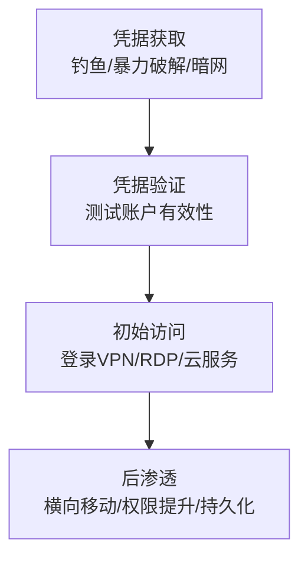

# 有效账户 (T1078) - Valid Accounts

## 一句话通俗理解

> 攻击者偷到了你家的钥匙（合法账户密码），直接开门进去——因为用的是真钥匙，所以谁也看不出是小偷。

## 难度等级

- ⭐ **初级**（新手可学）——概念简单，不需要编程基础，主要利用的是现有凭据

## 技术描述

有效账户（Valid Accounts）是一种初始访问技术，攻击者通过获取和滥用现有账户的凭据来获得对目标网络的未授权访问。这种技术利用了合法账户和凭据，使得恶意活动难以被区分为正常用户行为。

**打个比方**：有效账户攻击就像是小偷偷了你的钥匙直接开门——因为用的是你的真钥匙，所以邻居不会觉得有问题，保安也不会拦他。而且小偷进去后还可以复制你的钥匙，以后随时都能进来。

**为什么有效账户攻击如此危险**：
- **难以检测**：使用合法凭据的活动看起来像正常用户行为
- **绕过安全控制**：可以绕过MFA（如果会话令牌被窃取）
- **持久性**：凭据可以长期有效，特别是服务账户
- **广泛影响**：一个账户可能具有广泛的访问权限

**攻击者获取凭据的常见方式**：
1. **钓鱼攻击**：通过欺骗性邮件获取凭据
2. **凭据转储**：使用Mimikatz等工具从内存中提取凭据
3. **暴力破解**：尝试大量密码组合
4. **凭据填充**：使用之前泄露的用户名/密码组合
5. **暗网购买**：从暗网市场购买泄露的凭据
6. **默认凭据**：利用未更改的默认密码
7. **信息窃取器**：通过恶意软件窃取存储的凭据

## 子技术列表

**该技术共有 4 个子技术：**

| 子技术ID | 中文名称 | 通俗解释 |
|----------|----------|----------|
| T1078.001 | 默认账户 | 利用系统或设备出厂时自带的默认账户和密码（如admin/admin） |
| T1078.002 | 域账户 | 利用Active Directory域账户，可以访问整个企业网络 |
| T1078.003 | 本地账户 | 利用单台电脑上的本地账户，权限有限但可用于横向移动 |
| T1078.004 | 云账户 | 利用云服务账户（如Office 365、AWS）访问云端资源 |

<details>
<summary><strong>展开查看各子技术详细说明</strong></summary>

### T1078.001 - 默认账户

**通俗理解：** 很多设备和系统出厂时都有默认的管理员账户和密码（比如路由器admin/admin），很多人忘记更改。

**详细说明：**
默认账户是攻击者最容易利用的漏洞之一。许多网络设备（路由器、防火墙、打印机）、物联网设备和软件系统在出厂时都有预设的默认凭据。如果管理员没有更改这些默认凭据，攻击者可以轻松登录并控制这些设备。常见的默认账户包括：root/root、admin/admin、administrator/password等。

### T1078.002 - 域账户

**通俗理解：** 公司网络中的"万能钥匙"，一个账户可以访问公司里的许多电脑和系统。

**详细说明：**
域账户是Active Directory环境中的核心身份凭证，通常具有对企业网络中多个系统和资源的访问权限。攻击者一旦获得域账户的控制权，就可以在网络中自由移动、访问敏感数据、部署恶意软件。域管理员账户是攻击者的最高目标。

### T1078.003 - 本地账户

**通俗理解：** 单台电脑上的用户账户，只能访问这一台电脑。

**详细说明：**
本地账户存在于每台Windows电脑上，即使电脑不联网也可以使用。攻击者获取本地账户凭据后，可以登录该特定系统，并可能利用相同密码在其他系统上进行横向移动。

### T1078.004 - 云账户

**通俗理解：** 你在云服务（如阿里云、AWS、Office 365）上的登录账户。

**详细说明：**
随着企业上云，云账户成为攻击者的重要目标。云账户通常具有管理云资源（虚拟机、存储、数据库）的权限。攻击者通过钓鱼、凭据泄露等方式获取云账户凭据后，可以直接访问云端数据和服务。

</details>

## 攻击流程

### 典型攻击流程



**步骤详解：**

1. **凭据获取**
   - 通俗描述：攻击者通过各种方式"偷"到用户名和密码
   - 技术细节：通过钓鱼邮件、凭据转储工具（Mimikatz）、暴力破解（Hydra）、暗网购买等方式获取凭据
   - 常用工具：Mimikatz、Hydra、Evilginx2

2. **凭据验证**
   - 通俗描述：测试偷来的"钥匙"能不能打开门
   - 技术细节：使用CrackMapExec等工具批量测试凭据有效性，确定凭据的权限范围和可访问的系统
   - 常用工具：CrackMapExec、Kerbrute

3. **初始访问**
   - 通俗描述：用合法的"钥匙"开门进入
   - 技术细节：使用有效凭据登录VPN、RDP、云服务控制台等远程服务，可能通过Pass-the-Cookie绕过MFA
   - 常用工具：RDP客户端、VPN客户端、Azure CLI

4. **后渗透**
   - 通俗描述：进门后四处查看，找值钱的东西
   - 技术细节：进行信息收集、横向移动到其他系统、提升到管理员权限、建立持久化机制
   - 常用工具：Cobalt Strike、BloodHound

## 真实案例

### 案例1：Snowflake数据泄露事件 - 被窃凭据的大规模利用（2024年）

- **时间**: 2024年中期
- **目标**: Snowflake云数据平台的多个大客户
- **攻击组织**: UNC5537
- **手法**: 威胁组织UNC5537使用通过信息窃取器恶意软件获取的有效登录凭据，访问了Snowflake客户账户。受影响的客户包括AT&T（几乎所有客户的通话和短信记录被泄露）、Ticketmaster/Live Nation（5.6亿客户记录被盗）、Santander银行等。关键问题是受影响的客户**没有启用多因素认证（MFA）**。26岁的加拿大人Alexander Moucka因与此案相关被逮捕。Snowflake强调其平台本身没有漏洞，攻击完全基于被窃凭据。
- **影响**: 数亿用户数据被泄露，成为2024年最大网络事件之一
- **参考链接**: [MITRE ATT&CK T1078](https://attack.mitre.org/techniques/T1078/)

### 案例2：APT29利用Office 365服务账户进行间谍活动（2020-2021年）

- **时间**: 2020年-2021年
- **目标**: 全球使用Microsoft Office 365的组织
- **攻击组织**: APT29（俄罗斯SVR）
- **手法**: 俄罗斯外情局（SVR）关联的APT29组织利用被破坏的Office 365服务账户收集电子邮件和其他敏感数据。攻击链包括：通过凭据盗窃或社会工程学获得服务账户访问权限；利用全局管理员权限访问用户邮箱；配置恶意邮件转发规则窃取敏感通信。APT29能够长期保持访问而不被发现，因为活动看起来像合法管理操作。被破坏的服务账户通常被排除在某些安全策略之外。
- **影响**: 多个组织的敏感通信被长期窃取
- **参考链接**: [Valid Accounts - Startup Defense](https://www.startupdefense.io/mitre-attack-techniques/t1078-valid-accounts)

### 案例3：信息窃取器恶意软件导致的凭据泄露浪潮（2024-2025年）

- **时间**: 2024年-2025年
- **目标**: 全球各行业组织
- **攻击组织**: 多个犯罪组织
- **手法**: 信息窃取器恶意软件家族（如Lumma、Vidar、Redline）持续成为凭据泄露的主要来源。这些恶意软件通过钓鱼邮件、恶意广告、破解软件等渠道传播，感染用户设备后窃取浏览器中存储的密码、Cookie、会话令牌等。窃取的凭据被上传到暗网市场出售，或直接用于攻击活动。2024-2025年，凭据窃取和利用的攻击链变得更加自动化和规模化，攻击者使用窃取的会话令牌进行Pass-the-Cookie攻击绕过MFA。
- **影响**: 大量凭据被泄露，导致后续的数据泄露和勒索软件攻击
- **参考链接**: [MITRE ATT&CK T1078](https://attack.mitre.org/techniques/T1078/)

### 案例4：BlackSuit勒索软件通过VPN凭据钓鱼入侵制造商（2025年）

- **时间**: 2025年
- **目标**: 全球某大型设备制造商
- **攻击组织**: Ignoble Scorpius（BlackSuit勒索软件团伙）
- **手法**: 攻击者通过语音钓鱼（Vishing）冒充IT帮助台，诱骗员工输入VPN凭据。获取凭据后攻击者立即提升权限，执行DCSync攻击窃取域控制器凭据，使用AnyDesk建立持久化，最终通过Ansible同时在约60台VMware ESXi主机上部署BlackSuit勒索软件，加密数百台虚拟机。
- **影响**: 整个IT基础设施被加密，业务中断，超过400GB数据被窃取
- **参考链接**: [Unit 42 BlackSuit Blitz Analysis](https://unit42.paloaltonetworks.com/anatomy-of-an-attack-blacksuit-ransomware-blitz/)

## 红队视角

> ⚠️ **免责声明**：以下内容仅用于合法的安全测试、渗透测试和教育目的。未经授权对他人系统进行测试是违法行为。

### 实战技巧

1. **OSINT信息收集**
   在攻击前充分收集目标信息。从LinkedIn、企业官网、招聘信息中提取员工邮箱和用户名命名规则。使用Hunter.io、theHarvester等工具批量收集邮箱地址。

2. **凭据填充攻击**
   利用从数据泄露中获得的用户名/密码组合，针对目标的VPN、邮件系统、云服务进行批量登录尝试。使用CrackMapExec自动化测试多个服务的凭据有效性。

3. **Pass-the-Cookie绕过MFA**
   当窃取到会话Cookie时，可以直接使用Cookie登录而无需通过MFA验证。这种方法在2024-2025年越来越常见，因为许多组织虽然部署了MFA但未充分保护会话令牌。

### 常用工具

| 工具名称 | 用途 | 平台 | 链接 |
|----------|------|------|------|
| Mimikatz | Windows凭据转储，从内存中提取明文密码和哈希 | Windows | [GitHub](https://github.com/gentilkiwi/mimikatz) |
| Hydra | 支持多协议的暴力破解工具 | 跨平台 | [GitHub](https://github.com/vanhauser-thc/thc-hydra) |
| CrackMapExec | 批量凭据验证和网络评估 | Linux | [GitHub](https://github.com/byt3bl33d3r/CrackMapExec) |
| Evilginx2 | 中间人钓鱼框架，窃取会话令牌 | Linux | [GitHub](https://github.com/kgretzky/evilginx2) |
| DeHashed | 凭据泄露搜索引擎 | Web | [DeHashed](https://dehashed.com/) |

### 注意事项

- 在进行凭据测试时，务必注意账户锁定策略，避免触发锁定导致业务中断
- 确保已获得目标组织的书面授权
- 记录所有测试使用的凭据和操作步骤，便于审计
- 测试完成后及时清理创建的账户和会话

## 蓝队视角

### 检测要点

1. **异常登录检测**
   - 日志来源：Windows安全事件日志（Event ID 4624登录成功、4625登录失败）
   - 关注字段：登录类型、源IP地址、账户名称、时间戳
   - 异常特征：同一账户短时间内从多个地理位置登录（不可能的旅行）、非工作时间的登录活动

2. **凭据使用监控**
   - 日志来源：Windows安全事件日志、VPN日志、云服务审计日志
   - 关注字段：登录频率、目标系统、使用的认证协议
   - 异常特征：凭据填充攻击的特征（大量失败后突然成功）、服务账户的异常使用模式

3. **MFA异常检测**
   - 日志来源：MFA系统的日志、Identity Provider（如Azure AD）日志
   - 关注字段：MFA验证方式、推送通知的接受/拒绝、设备信息
   - 异常特征：MFA推送疲劳攻击（多次发送MFA推送直到用户误点）、异常的MFA注册或更改

### 监控建议

- 实施UEBA（用户和实体行为分析）检测异常的凭据使用模式
- 监控和告警所有对特权账户的操作
- 定期审查和清理不再使用的账户和服务账户
- 订阅暗网凭据泄露监控服务

## 检测建议

### 网络层检测

**检测方法：** 监控异常的认证流量模式，特别是针对VPN、RDP、邮件服务器等面向公众的服务的认证尝试。

**具体规则/命令示例：**
```
# 检测短时间内大量认证失败后的成功认证（暴力破解成功特征）
# 使用Zeek/Bro日志分析
cat auth.log | grep "Failed password" | awk '{print $1" "$2" "$11}' | sort | uniq -c | sort -nr | head -20
```

### 主机层检测

**检测方法：** 监控凭据转储工具的执行和凭据访问事件。

**Windows事件ID：**
- 事件ID 4624：账户登录成功——记录成功的认证，关注异常的登录类型（如网络登录Type 3、远程交互登录Type 10）
- 事件ID 4625：账户登录失败——大量失败可能表示暴力破解或凭据填充
- 事件ID 4648：使用显式凭据登录——使用不同账户的凭据运行程序
- 事件ID 4672：分配特殊权限——管理员登录时的特权分配

**Linux日志：**
- 日志文件：/var/log/auth.log 或 /var/log/secure
- 关键字段：sshd认证记录、sudo执行记录、用户切换记录（su）

**具体命令示例：**
```bash
# 检测暴力破解（大量失败登录后成功）
grep "Failed password" /var/log/auth.log | awk '{print $1,$2,$11}' | sort | uniq -c | sort -nr | head -10

# 检测所有成功的SSH登录
grep "Accepted password" /var/log/auth.log
```

### 应用层检测

**检测方法：** 监控应用日志中的异常认证行为，特别是云服务和SaaS应用。

**Sigma规则示例：**
```yaml
title: 通过暴力破解获得的有效账户登录
status: experimental
description: 检测短时间内大量登录失败后出现成功登录的模式，表明可能通过暴力破解获得了有效凭据
logsource:
    category: authentication
    product: windows
detection:
    selection_failures:
        EventID: 4625
        TimeRange: 5分钟
        Count: >= 10
    selection_success:
        EventID: 4624
        AccountName: same as failure attempts
    condition: selection_failures followed by selection_success within 5 minutes
level: high
tags:
    - attack.t1078
```

## 缓解措施

### 优先级1：关键措施

**措施名称：** 为所有账户启用多因素认证（MFA）

**具体实施步骤：**
1. 评估所有面向外部的服务和系统，确保MFA可用
2. 优先为管理员账户、远程访问账户启用MFA
3. 使用硬件安全密钥（如YubiKey）或基于时间的OTP作为MFA方式
4. 配置条件访问策略，对高风险登录强制MFA

**配置示例：**
```powershell
# Azure AD条件访问策略 - 要求MFA
New-AzureADConditionalAccessPolicy `
    -DisplayName "要求所有用户使用MFA" `
    -State Enabled `
    -Conditions @{ 
        Users = @{ IncludeUsers = "All" }
        Applications = @{ IncludeApplications = "All" }
    } `
    -GrantControls @{ 
        BuiltInControls = "mfa" 
    }
```

### 优先级2：重要措施

**措施名称：** 实施强密码策略和凭据保护

**具体实施步骤：**
1. 配置密码策略要求至少12位长度，包含大小写字母、数字和特殊字符
2. 禁用常见弱密码（如password123、CompanyName2024）
3. 实施密码黑名单，阻止使用已知泄露的密码
4. 使用密码管理器管理复杂密码

**措施名称：** 监控凭据泄露

**具体实施步骤：**
1. 订阅暗网凭据泄露监控服务
2. 定期使用Have I Been Pwned等API检查企业邮箱是否泄露
3. 发现泄露后立即强制受影响账户重置密码
4. 监控凭据填充攻击的特征并及时响应

### 优先级3：建议措施

**措施名称：** 服务账户保护和监控

**具体实施步骤：**
1. 使用托管服务账户（gMSA）减少手动管理密码
2. 限制服务账户的权限到最低必需
3. 定期审计服务账户的使用和权限
4. 对服务账户启用异常行为告警

### MITRE ATT&CK 缓解措施映射

| 缓解措施ID | 缓解措施名称 | 适用性 | 说明 |
|------------|-------------|:------:|------|
| M1032 | 多因素认证 | 适用 | 为所有远程访问和特权账户启用MFA |
| M1027 | 密码策略 | 适用 | 实施强密码策略和密码黑名单 |
| M1018 | 用户账户管理 | 适用 | 定期审查和清理不需要的账户 |
| M1015 | 应用程序隔离和沙箱 | 部分适用 | 使用应用白名单限制凭据转储工具执行 |
| M1026 | 特权账户管理 | 适用 | 实施PAM解决方案管理特权账户 |
| M1017 | 用户培训 | 适用 | 培训用户识别钓鱼和社会工程学攻击 |

## 动手实验

> ⚠️ **重要提示**：所有实验必须在隔离的实验室环境中进行，禁止对未授权的真实系统进行测试。

### 实验环境准备

**推荐靶场/实验平台：**

| 平台名称 | 类型 | 难度 | 链接 |
|----------|------|:----:|------|
| Hack The Box | 虚拟靶场 | 初级-高级 | [HTB](https://www.hackthebox.com/) |
| TryHackMe | 虚拟靶场 | 初级 | [THM](https://tryhackme.com/) |
| Metasploitable | Docker/VM | 初级 | [Metasploitable](https://sourceforge.net/projects/metasploitable/) |

**所需工具：**
- Kali Linux：渗透测试操作系统，预装了大量工具
- Mimikatz：凭据转储工具（仅学习用途）
- Hydra：暴力破解工具

### 实验1：使用Mimikatz进行凭据转储（仅供学习）

**实验目标：** 了解凭据转储的原理和检测方法

**实验步骤：**
1. 在Windows测试虚拟机中安装Mimikatz
2. 以管理员身份运行Mimikatz
3. 执行 `privilege::debug` 启用调试权限
4. 执行 `sekurlsa::logonpasswords` 提取登录凭据
5. 观察提取到的明文密码和哈希值

**预期结果：** 成功从内存中提取到登录用户的凭据信息

**学习要点：** 理解为什么需要保护管理员权限，以及如何通过配置LSA保护来防御凭据转储

### 实验2：配置和测试MFA

**实验目标：** 学习MFA的配置和验证

**实验步骤：**
1. 在测试环境中配置Azure AD或类似的Identity Provider
2. 为用户账户启用MFA
3. 使用TOTP应用（如Google Authenticator）配置基于时间的一次性密码
4. 测试正常登录和MFA验证流程
5. 尝试使用窃取的凭据登录（验证MFA阻止效果）

**预期结果：** 即使使用正确密码，没有MFA验证也无法登录

**学习要点：** MFA是防止凭据滥用的最有效措施之一

### 实验3：凭据泄露监控

**实验目标：** 学习使用工具检测企业凭据泄露

**实验步骤：**
1. 使用DeHashed或类似工具查询测试域名的凭据泄露情况
2. 分析泄露凭据的来源和类型
3. 配置凭据泄露监控告警
4. 编写凭据泄露应急响应流程

**预期结果：** 发现并分析测试域名相关的泄露凭据

**学习要点：** 了解凭据泄露的规模和影响，建立泄露响应机制

## 术语解释

| 术语 | 英文原名 | 通俗解释 |
|------|----------|----------|
| 凭据填充 | Credential Stuffing | 使用从A网站泄露的用户名/密码组合，批量尝试登录B网站，就像小偷拿到你丢的一把钥匙后挨个试你家所有门 |
| 暴力破解 | Brute Force | 用计算机自动尝试大量密码组合来猜测正确密码，就像试密码锁时从0000试到9999 |
| 密码喷射 | Password Spraying | 用少数几个常见密码（如Password123）尝试登录大量账户，不走地毯式搜索，而是专挑最容易开的锁试 |
| Mimikatz | Mimikatz | 一款强大的凭据提取工具，可以从Windows电脑的内存中"偷"出登录密码 |
| Pass-the-Cookie | Pass-the-Cookie | 攻击者窃取浏览器中的登录会话Cookie后直接使用，就像偷到了你网吧的上机牌，不需要重新输入账号密码 |
| 信息窃取器 | Infostealer | 专门窃取浏览器中保存的密码、Cookie等敏感信息的恶意软件 |
| MFA | Multi-Factor Authentication | 多因素认证，登录时除了密码还需要第二种验证方式（如短信验证码、指纹），就像保险柜需要钥匙+密码同时使用 |
| PAM | Privileged Access Management | 特权访问管理，专门管理管理员账户和最高权限的系统 |

## 参考资料

### 官方文档

- [MITRE ATT&CK - Valid Accounts (T1078)](https://attack.mitre.org/techniques/T1078/)
- [CISA - Valid Accounts (T1078)](https://www.cisa.gov/eviction-strategies-tool/info-attack/T1078)

### 安全报告

- [Unit 42: Anatomy of a BlackSuit Ransomware Attack](https://unit42.paloaltonetworks.com/anatomy-of-an-attack-blacksuit-ransomware-blitz/) - 2025年BlackSuit勒索软件通过钓鱼窃取VPN凭据的完整攻击链分析
- [ReliaQuest 2025 Annual Cyber-Threat Report](https://resources.reliaquest.com/image/upload/v1740433607/Website/2025-ReliaQuest-Annual-Threat-Report.pdf) - 2025年年度威胁报告，详细分析了初始访问技术趋势

### 工具与资源

- [Mimikatz](https://github.com/gentilkiwi/mimikatz) - Windows凭据转储工具
- [CrackMapExec](https://github.com/byt3bl33d3r/CrackMapExec) - 网络评估和凭据验证工具
- [DeHashed](https://dehashed.com/) - 凭据泄露搜索引擎

### 学习资料

- [Valid Accounts - Startup Defense](https://www.startupdefense.io/mitre-attack-techniques/t1078-valid-accounts) - 有效账户技术详细分析
- [MITRE ATT&CK - Cloud Accounts (T1078.004)](https://attack.cloudfall.cn/techniques/T1078/004) - 云账户子技术详解
- [PT Security - T1078](https://mitre.ptsecurity.com/en-US/T1078) - 有效账户技术防护指南
