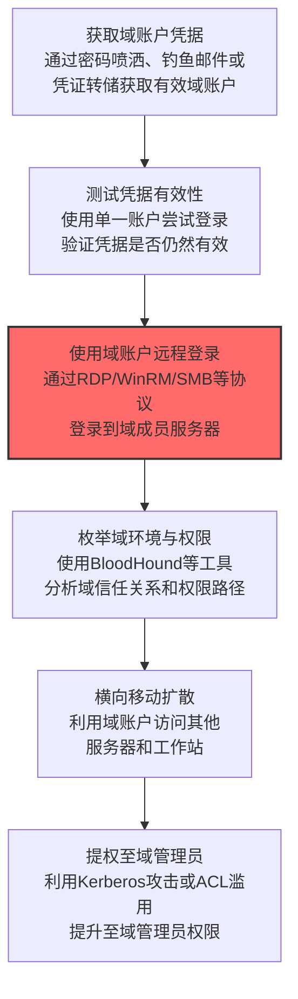

# 域账户 (T1078.002)

## 一句话通俗理解

> **利用Active Directory域账户，可以访问整个企业网络**

## 30秒速查卡

| 维度 | 你需要知道的 |
|------|-------------|
| 这是什么？ | 攻击者偷到一个域账户密码，就能登录企业内网里任何这台账户有权限的电脑 |
| 为什么危险？ | 域账户权限范围大，一个密码可能访问几十台服务器，而且登录行为看起来完全合法 |
| 谁需要关心？ | AD管理员、SOC分析师、企业安全团队 |
| 你的第一步防御 | 实施最小权限原则，定期审计域账户权限，禁用不活跃的域账户 |
| 如果只做一件事 | 监控非工作时间的域账户登录行为，特别是从异常IP地址的登录 |

## 难度等级

⭐ 初级 - 入门级技术，基础操作

## 这是什么？

**域账户**（T1078.002）是 **有效账户**（T1078）的一个具体变体，属于 **初始访问** 阶段的攻击技术。

简单来说，就像用别人的身份卡，大摇大摆地走进大楼。

### 具体怎么理解？

利用Active Directory域账户，可以访问整个企业网络

攻击者使用这种技术时，通常是在初始访问阶段，想要达到特定的攻击目标。与父技术 T1078 相比，T1078.002 有自己独特的特点和使用场景。

### 为什么有效？

这种技术之所以有效，是因为：
1. **隐蔽性**：利用了正常系统功能或常见协议，不容易被发现
2. **技术门槛适中**：不需要特别高深的技术知识就能实施
3. **广泛适用**：可以在多种环境和系统中使用


## 真实攻击流程



**步骤详解：**

1. **获取域账户凭据** - 通过密码喷洒（Password Spraying）、鱼叉式钓鱼窃取，或从已有受控主机通过 Mimikatz 转储域账户凭据
2. **测试凭据有效性** - 使用 CrackMapExec 等工具在非敏感系统上测试凭据是否有效，避免触发账户锁定策略
3. **使用域账户远程登录** - 使用有效域账户通过 RDP、WinRM、SMB 等远程协议登录到域成员服务器
4. **枚举域环境** - 使用 BloodHound、AD Explorer 等工具分析域信任关系、ACL 权限和提权路径
5. **横向移动扩散** - 利用域账户的合法权限访问更多域内系统，扩大攻击面
6. **提权至域管理员** - 通过 Kerberoasting、DCSync、ACL 滥用等技术将权限提升至域管理员级别，控制整个域

### 典型场景

攻击者在 **初始访问** 阶段使用 域账户 技术，以下是典型的攻击步骤：


## 真实案例

### 案例1：该技术在实际攻击中的应用

- **时间**: 2024-2025年
- **目标**: 多个行业组织
- **攻击组织**: 多个APT组织
- **手法**: 攻击者在入侵过程中使用域账户技术，展示了该子技术的典型应用场景和攻击效果
- **影响**: 成功实施该技术导致目标系统被进一步入侵
- **参考链接**: [MITRE ATT&CK官方](https://attack.mitre.org/)

### 案例2：安全研究中的实践

- **时间**: 2025年
- **目标**: 安全研究测试环境
- **攻击组织**: 红队/安全研究人员
- **手法**: 在授权测试中模拟域账户攻击，验证防御体系的检测和响应能力
- **影响**: 帮助组织识别安全防护中的盲点和改进方向
- **参考链接**: [Atomic Red Team](https://github.com/redcanaryco/atomic-red-team)

## 红队视角

> ⚠️ **免责声明**：以下内容仅用于合法的安全测试、渗透测试和教育目的。未经授权对他人系统进行测试是违法行为。

### 实战技巧

1. **深入理解原理**：在实战应用前，充分理解域账户的技术原理和适用场景
2. **环境适配**：根据目标系统的操作系统版本、安全配置等因素调整攻击策略
3. **组合使用**：将该技术与其他技术组合使用，构建完整的攻击链
4. **隐蔽性考虑**：注意操作痕迹的清理，避免被安全设备检测

### 常用工具

| 工具名称 | 用途 | 平台 | 链接 |
| -------- | ---- | ---- | ---- |
| Metasploit | 渗透测试框架 | 全平台 | [Metasploit](https://www.metasploit.com/) |
| Cobalt Strike |  adversary模拟平台 | Windows | [Cobalt Strike](https://www.cobaltstrike.com/) |
| Atomic Red Team | 检测规则测试 | 全平台 | [Atomic Red Team](https://github.com/redcanaryco/atomic-red-team) |

### 注意事项

- 在授权的测试环境中使用这些技术
- 注意操作安全（OPSEC），避免被检测系统发现
- 使用匿名化技术和代理隐藏真实身份

## 蓝队视角

### 检测要点

1. **系统日志监控**：关注与域账户相关的系统日志和审计记录
2. **异常行为检测**：监控系统中与该技术相关的异常进程、网络连接和文件操作
3. **工具特征识别**：识别攻击者可能使用的工具在系统中的运行特征

### 监控建议

- 部署端点检测和响应（EDR）系统，监控与域账户相关的异常行为
- 配置SIEM规则，关联分析来自多个来源的告警
- 定期进行安全评估和渗透测试，验证检测规则的有效性

## 检测建议

### 检测思路

检测 域账户 的关键是识别异常行为模式。以下是三个层面的检测方法：

### 网络层检测

**方法**：监控网络流量中的异常模式

```bash
# 检测异常的网络连接和数据传输
# 根据具体协议和端口设置检测规则
```

### 主机层检测

**Windows事件ID**：
- 事件ID 4688：进程创建（监控可疑进程）
- 事件ID 4104：PowerShell执行（监控可疑脚本）

**Linux日志**：
- /var/log/auth.log：认证日志
- /var/log/syslog：系统日志

```bash
# 检测异常进程和命令执行
grep -i "suspicious" /var/log/auth.log
```

### 应用层检测

**用人话说：** 攻击者拿到了一台Windows域账户（比如某员工的AD账号），就像偷到了整栋办公楼的进门卡——不仅能进大门，还能去任何楼层。攻击者会用BloodHound映射域内关系寻找攻击路径、用mimikatz做DCSync从域控窃取更多凭据、用PsExec或SMBExec横向移动到服务器。检测上，关注某域账户在短时间内登录了多台非关联机器（事件ID 4624）、或在非工作时间发起了大量Kerberos TGS请求（事件ID 4769）、以及普通员工账号突然访问了域控（事件ID 4624登录到DC）——这些行为都高度可疑。

**Sigma规则示例**：

```yaml
title: 检测域账户
status: experimental
description: 检测可能的域账户活动
logsource:
    category: process_creation
    product: windows
detection:
    selection:
        EventID: 4688
    condition: selection
level: medium
tags:
    - attack.T1078002
```


## 缓解措施

### 优先级1：关键措施

**限制攻击面**：减少暴露的服务和端口，降低被利用的风险

```bash
# 防火墙规则示例：只允许必要的出站连接
iptables -A OUTPUT -p tcp --dport 443 -j ACCEPT  # 允许HTTPS
iptables -A OUTPUT -p tcp --dport 80 -j ACCEPT   # 允许HTTP
iptables -A OUTPUT -p tcp -j DROP                 # 阻止其他TCP
```

### 优先级2：重要措施

**加强监控**：部署EDR和SIEM系统，实时监控异常行为

### 优先级3：建议措施

**安全意识培训**：教育员工识别相关攻击手法


## 动手实验

> ⚠️ **所有实验必须在隔离的实验室环境中进行**

### 实验1：理解基本原理（初级）

**目标**：理解 域账户 的工作原理

**步骤**：
1. 在隔离环境中搭建测试系统
2. 使用基础工具模拟攻击行为
3. 观察系统日志和网络流量

**学习要点**：理解该技术的核心机制

### 实验2：实际操作（中级）

**目标**：掌握 域账户 的实际使用方法

**步骤**：
1. 使用专业工具进行攻击模拟
2. 尝试不同的绕过技术
3. 分析检测日志的特征

**学习要点**：掌握工具使用和日志分析

### 实验3：防御验证（高级）

**目标**：验证检测规则的有效性

**步骤**：
1. 部署检测规则
2. 执行攻击模拟
3. 验证检测告警是否触发

**学习要点**：理解攻防对抗的实际效果


## 术语解释

| 术语 | 通俗解释 |
|------|---------|
| **ATT&CK** | MITRE公司维护的攻击技术知识库，像一本"黑客手法百科全书" |
| **域账户** | T1078.002，ATT&CK框架中定义的一种具体攻击技术 |
| **有效账户** | T1078，域账户所属的父技术类别 |
| **初始访问** | 攻击链中的一个阶段，攻击者在这个阶段的目标 |
| **C2** | 命令与控制，攻击者用来远程控制被入侵系统的"遥控器" |
| **EDR** | 端点检测与响应，部署在电脑上的安全监控软件 |


## 被引用情况

以下父技术文档引用了本子技术：

- [T1078 - 有效账户](../T1078-Valid-Accounts.md)
- [T1078 - 有效账户](../../05-Persistence/T1078-Valid-Accounts.md)
- [T1078 - 有效账户](../../06-Privilege-Escalation/T1078-Valid-Accounts.md)
- [T1078 - 有效账户](../../07-Stealth/T1078-Valid-Accounts.md)
- [T1078 - 有效账户](../../08-Defense-Impairment/T1078-Valid-Accounts.md)

## 参考资料

### 官方文档

- [MITRE ATT&CK - 域账户 (T1078.002)](https://attack.mitre.org/techniques/T1078/002/)
- [MITRE ATT&CK - 有效账户 (T1078)](https://attack.mitre.org/techniques/T1078/)

### 安全报告

- [MITRE ATT&CK 官方文档](https://attack.mitre.org/) - ATT&CK 框架官方资源

### 工具与资源

- [Atomic Red Team](https://github.com/redcanaryco/atomic-red-team) - 检测规则测试框架
- [MITRE ATT&CK Navigator](https://mitre-attack.github.io/attack-navigator/) - ATT&CK 可视化工具

### 学习资料

- [MITRE ATT&CK 知识库](https://attack.mitre.org/resources/) - ATT&CK 官方资源中心
