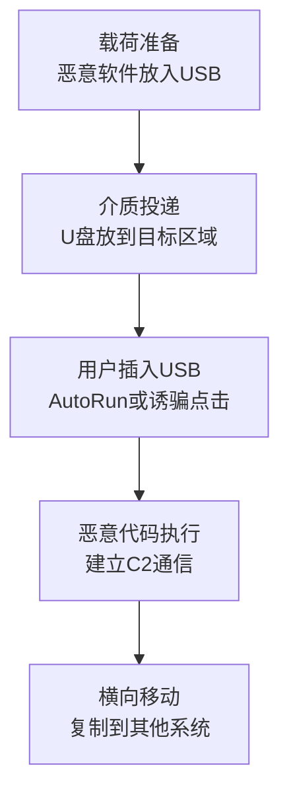

# 通过可移动介质复制 (T1091) - Replication Through Removable Media

## 一句话通俗理解

> 攻击者通过感染的U盘传播恶意软件——就像把带病毒的U盘扔在目标公司的停车场，等着有人捡起来插到电脑上。

## 难度等级

- ⭐⭐ **中级**（需要一定基础）——需要了解USB协议、AutoRun机制和社会工程学

## 技术描述

通过可移动介质复制（Replication Through Removable Media）是一种初始访问和横向移动技术，攻击者通过将恶意软件复制到可移动介质（如USB驱动器、外部硬盘、光学媒体）并利用自动运行功能或社会工程学诱使用户执行恶意内容来访问系统。

**打个比方**：这种攻击就像是在公共场所投放带病毒的U盘——攻击者把恶意软件放到U盘里，然后想办法让目标用户把U盘插到他们的电脑上。一旦插入，恶意软件就会自动运行或诱骗用户点击执行。

**攻击者的典型操作流程**：
1. **准备武器**：将恶意软件复制到USB驱动器
2. **投递介质**：将感染的U盘投放到目标区域（如停车场、前台）
3. **等待执行**：等待用户插入U盘并执行恶意内容
4. **获得控制**：恶意软件执行，攻击者获得系统访问权限

**常见的攻击方式**：
- **自动运行利用**：利用Windows的AutoRun功能自动执行恶意代码
- **恶意快捷方式**：创建伪装的LNK文件诱导用户点击
- **文件伪装**：将恶意文件伪装成正常文件（如文档、图片）
- **固件级感染**：在USB设备固件中嵌入恶意代码（BadUSB）
- **键盘注入**：使用伪装成键盘的USB设备注入命令（Rubber Ducky）

**为什么这种攻击仍然有效**：
- 许多组织对USB设备使用有宽松政策
- 用户倾向于在未考虑安全风险的情况下插入未知USB设备
- 可以绕过网络层面的安全控制
- 对气隙网络（不连接互联网的网络）特别有效

## 子技术列表

**该技术没有子技术。**

T1091 在MITRE ATT&CK框架中没有定义子技术。

## 攻击流程

### 典型攻击流程



**步骤详解：**

1. **载荷准备**
   - 通俗描述：把恶意软件"装进"U盘里
   - 技术细节：选择恶意软件（蠕虫、后门、勒索软件），复制到USB驱动器，配置自动运行或创建诱骗文件（如标记为"工资单"、"机密"）
   - 常用工具：Metasploit生成payload、自定义脚本

2. **介质投递**
   - 通俗描述：把准备好的"毒U盘"放到目标可能出现的地方
   - 技术细节：将感染的USB驱动器投放到目标区域（停车场、前台、会议室），或通过社会工程学让目标接受USB（如伪装成赠品、会议资料）
   - 常用工具：物理投递、社会工程学话术

3. **执行触发**
   - 通俗描述：目标插上U盘，恶意代码自动运行
   - 技术细节：用户插入USB驱动器后，AutoRun功能自动执行恶意代码，或用户被诱骗点击伪装的文件（LNK快捷方式、伪装的Office文档）
   - 常用工具：Rubber Ducky、Bash Bunny

4. **恶意软件活动**
   - 通俗描述：恶意软件开始在电脑上活动
   - 技术细节：建立C2通信，进行信息收集，将自身复制到其他可移动介质实现传播，为后续攻击做准备
   - 常用工具：Cobalt Strike、自定义后门

## 真实案例

### 案例1：Stuxnet蠕虫通过USB驱动器渗透伊朗核设施（2008-2010年）

- **时间**: 2008年-2010年
- **目标**: 伊朗纳坦兹铀浓缩厂
- **攻击组织**: 疑似美国和以色列联合开发
- **手法**: Stuxnet被广泛认为是第一个使用可移动介质作为主要传播向量来针对气隙网络的网络武器。该蠕虫通过感染的USB驱动器进入伊朗核设施的内部网络，利用Windows AutoRun功能和LNK文件漏洞（CVE-2010-2568）执行恶意代码。Stuxnet使用多个零日漏洞提升权限并在网络中横向移动，最终瞄准西门子工业控制系统破坏离心机。根据公开报告，Stuxnet成功损坏了伊朗大约五分之一的离心机。
- **影响**: 伊朗核计划被显著延缓
- **参考链接**: [Stuxnet Analysis - SecurityScientist](https://www.securityscientist.net/blog/12-questions-and-answers-about-replication-through-removable-media-t1091/)

### 案例2：Raspberry Robin蠕虫利用USB驱动器传播（2021年至今）

- **时间**: 2021年-至今
- **目标**: 全球各行业组织
- **攻击组织**: 疑似与俄罗斯有关联
- **手法**: Raspberry Robin是一种广泛传播的蠕虫恶意软件，主要通过USB驱动器进行初始访问。当感染的USB驱动器插入系统时，恶意软件使用AutoRun功能或诱使用户打开恶意LNK文件来执行自身。它利用已知Windows漏洞提升权限并建立持久性，作为加载器下载和安装额外的恶意载荷（如勒索软件、信息窃取器）。Raspberry Robin使用多种持久性机制和逃避技术，特别难以检测和移除。
- **影响**: 被用作多种恶意活动的初始访问向量，包括勒索软件部署
- **参考链接**: [Raspberry Robin - Blackpoint Cyber](https://blackpointcyber.com/blog/mitre-attck-t1091-replication-through-removable-media-threat-digest-blackpoint-apg)

### 案例3：Lazarus Group通过USB驱动器攻击国防组织（2024-2025年）

- **时间**: 2024年-2025年
- **目标**: 国防和金融组织
- **攻击组织**: Lazarus Group（朝鲜）
- **手法**: 朝鲜关联的Lazarus Group持续使用USB驱动器作为攻击向量，特别是针对国防和金融组织。该组织使用USBCulprit等恶意软件专门针对气隙网络。攻击链包括：将感染的USB驱动器通过社会工程学或内部人员引入目标环境；恶意软件通过USB驱动器在系统间传播；在气隙网络中建立持久化机制。这种攻击方式对于无法通过互联网访问的高安全环境特别有效。
- **影响**: 多个国防和金融机构被入侵
- **参考链接**: [MITRE ATT&CK T1091](https://attack.mitre.org/techniques/T1091/)

## 红队视角

> ⚠️ **免责声明**：以下内容仅用于合法的安全测试、渗透测试和教育目的。未经授权对他人系统进行测试是违法行为。

### 实战技巧

1. **选择正确的USB攻击平台**
   根据测试场景选择合适的USB攻击工具：Rubber Ducky适合简单的键盘注入，Bash Bunny支持多阶段攻击，O.MG Cable可以远程控制且外观隐蔽。

2. **社会工程学配合**
   USB攻击的成功率很大程度上取决于社会工程学的质量。将U盘标记为"薪资调整明细"、"2026年度计划"等吸引人的标题，可以提高目标插入U盘的概率。

3. **绕过现代防护**
   现代Windows系统默认禁用了AutoRun功能，因此需要结合LNK漏洞利用或社会工程学诱骗用户手动执行。

### 常用工具

| 工具名称 | 用途 | 平台 | 链接 |
|----------|------|------|------|
| Rubber Ducky | USB键盘注入，自动输入预编程命令 | USB设备 | [Hak5](https://shop.hak5.org/products/usb-rubber-ducky) |
| Bash Bunny | 多阶段USB攻击平台 | USB设备 | [Hak5](https://shop.hak5.org/products/bash-bunny) |
| O.MG Cable | 恶意USB线缆，可远程控制 | USB线缆 | [O.MG](https://o.mg.lol/) |
| Metasploit | 生成payload和建立C2 | 跨平台 | [GitHub](https://github.com/rapid7/metasploit-framework) |

### 注意事项

- USB攻击需要物理接触或投递，法律风险极高，必须获得明确的书面授权
- 测试完成后务必回收所有投递的USB设备，防止造成实际损害
- 注意避免恶意软件意外传播到非目标系统

## 蓝队视角

### 检测要点

1. **USB设备插入监控**
   - 日志来源：Windows事件日志（Event ID 4663、4656、6420）、Sysmon事件ID 11
   - 关注字段：设备实例ID、设备描述、序列号、插入时间
   - 异常特征：新出现的未知USB设备、非工作时间的USB插入、高频率的USB插入/移除

2. **自动运行检测**
   - 日志来源：Windows事件日志、Sysmon
   - 关注字段：进程创建事件（Event ID 4688）、父进程
   - 异常特征：从可移动介质启动的进程（父进程为explorer.exe但路径在USB驱动器上）、可疑的LNK文件执行

3. **文件活动监控**
   - 日志来源：Sysmon事件ID 11（文件创建）
   - 关注字段：文件路径、文件类型、创建进程
   - 异常特征：在可移动介质上创建隐藏文件、复制可疑执行文件到USB

### 监控建议

- 使用组策略禁用所有可移动介质的AutoRun/AutoPlay功能
- 部署EDR解决方案监控USB设备的插入和文件活动
- 配置Sysmon记录所有USB设备的连接事件（Event ID 11）
- 实施USB设备白名单策略

## 检测建议

### 网络层检测

**检测方法：** 监控从可移动介质执行的程序产生的网络连接。

**具体规则/命令示例：**
```
# 检测从可移动介质启动的进程的网络连接（Sysmon事件ID 3）
# 在Sysmon配置中添加规则监控
```

### 主机层检测

**检测方法：** 监控USB设备插入事件和从可移动介质启动的进程。

**Windows事件ID：**
- 事件ID 4663：尝试访问某个对象（监控可移动介质的尝试访问）
- 事件ID 4688：进程创建——监控从可移动介质路径启动的进程
- Sysmon事件ID 11：文件创建——监控可移动介质上的文件创建
- Sysmon事件ID 1：进程创建——监控从USB路径执行的进程

**Linux日志：**
- 日志文件：/var/log/syslog 或 /var/log/messages
- 关键字段：USB插入消息、挂载事件

**具体命令示例：**
```bash
# 监控USB设备插入（Linux）
dmesg | grep -i "usb" | grep -i "new"

# 查看已挂载的USB设备
lsblk | grep -i "sd[b-z]"
```

### 应用层检测

**检测方法：** 监控AutoRun配置的更改和LNK文件的创建。

**Sigma规则示例：**
```yaml
title: 通过可移动介质执行的恶意LNK文件
status: experimental
description: 检测从可移动介质路径执行的LNK文件，可能表示USB传播的恶意软件
logsource:
    category: process_creation
    product: windows
detection:
    selection:
        Image|startswith:
            - 'D:\'
            - 'E:\'
            - 'F:\'
            - 'G:\'
        Image|endswith: '.lnk'
    condition: selection
level: high
tags:
    - attack.t1091
```

## 缓解措施

### 优先级1：关键措施

**措施名称：** 禁用AutoRun/AutoPlay功能

**具体实施步骤：**
1. 通过组策略（GPO）禁用所有驱动器的自动运行功能
2. 配置注册表 `HKLM\Software\Microsoft\Windows\CurrentVersion\Policies\Explorer\NoDriveTypeAutoRun`
3. 在域环境中统一分发策略

**配置示例：**
```powershell
# 通过注册表禁用AutoRun
Set-ItemProperty -Path "HKLM:\SOFTWARE\Microsoft\Windows\CurrentVersion\Policies\Explorer" -Name "NoDriveTypeAutoRun" -Value 0xFF

# 通过组策略配置（推荐）
# 计算机配置 -> 管理模板 -> Windows组件 -> 自动播放策略 -> 关闭自动播放
```

### 优先级2：重要措施

**措施名称：** 实施USB设备管控

**具体实施步骤：**
1. 使用组策略或第三方工具（如Device Guard）限制USB设备的使用
2. 实施USB设备白名单，只允许经过批准的设备连接
3. 在敏感系统上使用端口封堵器物理阻止USB连接

**措施名称：** 部署端点检测和响应（EDR）

**具体实施步骤：**
1. 在所有终端部署EDR解决方案（如CrowdStrike、SentinelOne、Microsoft Defender for Endpoint）
2. 配置针对USB相关活动的检测规则
3. 建立USB事件响应流程

### 优先级3：建议措施

**措施名称：** 用户安全意识培训

**具体实施步骤：**
1. 定期进行USB安全专项培训
2. 通过模拟USB Drop测试员工安全意识
3. 建立报告可疑USB设备的奖励机制

### MITRE ATT&CK 缓解措施映射

| 缓解措施ID | 缓解措施名称 | 适用性 | 说明 |
|------------|-------------|:------:|------|
| M1049 | 反病毒/反恶意软件 | 适用 | 扫描所有可移动介质中的恶意软件 |
| M1034 | 软件限制策略 | 适用 | 阻止从可移动介质执行未授权软件 |
| M1028 | 操作系统配置 | 适用 | 通过组策略禁用AutoRun功能 |
| M1038 | 执行预防 | 适用 | 使用AppLocker限制从USB执行程序 |
| M1017 | 用户培训 | 适用 | 培训员工不要插入未知USB设备 |

## 动手实验

> ⚠️ **重要提示**：所有实验必须在隔离的实验室环境中进行，禁止对未授权的真实系统进行测试。

### 实验环境准备

**推荐靶场/实验平台：**

| 平台名称 | 类型 | 难度 | 链接 |
|----------|------|:----:|------|
| TryHackMe - USB Ripper | CTF | 初级 | [THM](https://tryhackme.com/) |
| VulnHub | VM | 中级 | [VulnHub](https://www.vulnhub.com/) |

**所需工具：**
- Rubber Ducky或Bash Bunny（可选）
- Metasploit：生成恶意载荷
- Sysinternals工具集：检测和分析USB活动

### 实验1：模拟USB Drop攻击

**实验目标：** 理解USB Drop攻击的流程和效果

**实验步骤：**
1. 准备一个包含无害载荷的USB驱动器（如显示一个弹窗消息）
2. 在测试环境中"投递"USB驱动器
3. 观察是否有测试人员插入并执行
4. 分析攻击效果和当前检测能力

**预期结果：** 了解USB Drop攻击的成功率和组织的人员安全意识水平

**学习要点：** 物理安全与人员意识的重要性

### 实验2：配置USB设备管控策略

**实验目标：** 学习使用组策略配置USB设备管控

**实验步骤：**
1. 在测试域环境中打开组策略管理控制台
2. 配置USB设备安装限制策略
3. 测试USB设备白名单功能
4. 验证AutoRun禁用效果

**预期结果：** 未授权的USB设备被系统自动阻止

**学习要点：** 掌握组策略配置USB管控的方法

### 实验3：分析USB蠕虫传播机制

**实验目标：** 了解恶意软件如何通过USB传播

**实验步骤：**
1. 在隔离的沙箱环境中获取Raspberry Robin样本（从公开IOC库）
2. 分析其USB传播机制的代码和行为
3. 提取检测特征和IOC（入侵指标）
4. 编写自定义YARA检测规则

**预期结果：** 理解USB蠕虫的工作原理和检测方法

## 术语解释

| 术语 | 英文原名 | 通俗解释 |
|------|----------|----------|
| 自动运行 | AutoRun | Windows的一个功能，插入光盘或U盘时会自动运行上面指定的程序，就像插上光盘自动播放电影一样 |
| 气隙网络 | Air-gapped Network | 物理上完全与互联网隔离的网络安全环境，像与外界隔绝的"孤岛" |
| USB投递 | USB Drop | 一种攻击方式，把感染了恶意软件的U盘故意留在目标公司停车场或前台等人多的地方引诱人捡 |
| LNK文件 | LNK File | Windows的快捷方式文件（图标上带小箭头），双击它会打开另一个程序或文件 |
| 蠕虫 | Worm | 一种能自我复制并在网络中自动传播的恶意软件，像生物病毒一样蔓延 |
| BadUSB | BadUSB | 利用USB控制器芯片固件的漏洞，让U盘伪装成键盘自动输入攻击指令 |
| HID | Human Interface Device | 人机接口设备，包括键盘、鼠标等，电脑会自动信任这些设备 |

## 参考资料

### 官方文档

- [MITRE ATT&CK - Replication Through Removable Media (T1091)](https://attack.mitre.org/techniques/T1091/)
- [CISA - Replication Through Removable Media (T1091)](https://www.cisa.gov/eviction-strategies-tool/info-attack/T1091)

### 安全报告

- [Raspberry Robin Worm Analysis - Blackpoint Cyber](https://blackpointcyber.com/blog/mitre-attck-t1091-replication-through-removable-media-threat-digest-blackpoint-apg) - Raspberry Robin蠕虫通过USB传播的技术分析
- [Stuxnet Analysis - SecurityScientist](https://www.securityscientist.net/blog/12-questions-and-answers-about-replication-through-removable-media-t1091/) - Stuxnet蠕虫详细技术分析

### 工具与资源

- [Hak5 USB Rubber Ducky](https://shop.hak5.org/products/usb-rubber-ducky) - USB键盘注入攻击工具
- [O.MG Cable](https://o.mg.lol/) - 恶意USB线缆
- [Sysinternals](https://docs.microsoft.com/en-us/sysinternals/) - Windows系统工具集

### 学习资料

- [Agent.btz/ComRAT Analysis](https://www.securityscientist.net/blog/12-questions-and-answers-about-replication-through-removable-media-t1091/) - 通过USB传播的恶意软件分析
