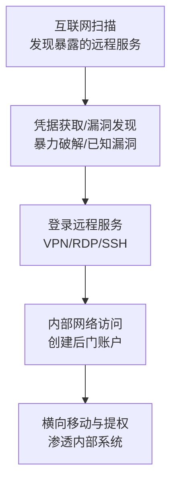

# 外部远程服务 (T1133) - External Remote Services

## 一句话通俗理解

> 攻击者通过你家的"远程门禁系统"（VPN、RDP、SSH等）入侵——要么偷了钥匙，要么找到了门锁的漏洞。

## 难度等级

- ⭐⭐ **中级**（需要一定基础）——需要了解网络协议、远程服务和身份认证机制

## 技术描述

外部远程服务（External Remote Services）是一种初始访问和持久化技术，攻击者通过利用面向外部的远程服务来获得对目标网络的未授权访问。这些服务包括VPN（虚拟专用网络）、RDP（远程桌面协议）、SSH（安全外壳协议）、Citrix等，它们被设计为允许用户从外部位置连接到内部企业网络。

**打个比方**：远程服务就像你家门口的智能门锁——它让你可以远程开门，但如果密码被偷了或者锁有漏洞，攻击者也能用同样的方式进来。

**攻击者的典型操作流程**：
1. **发现目标**：扫描互联网找到暴露的远程服务（如RDP端口3389、SSH端口22）
2. **获取凭据**：通过暴力破解、凭据填充或购买泄露的凭据
3. **利用漏洞**：利用远程服务软件中的已知漏洞
4. **登录系统**：使用偷来的凭据或漏洞进入系统
5. **建立持久化**：创建后门账户或配置持久化远程访问

**常见的攻击目标**：
- VPN设备（Fortinet、Ivanti、Citrix、Pulse Secure）
- 远程桌面服务（RDP、VNC）
- SSH服务
- 云远程访问服务
- 远程管理工具（TeamViewer、AnyDesk等）

**为什么这种攻击如此常见**：
- 远程服务被设计为允许外部访问，通常不会被防火墙阻止
- 使用合法凭据的活动难以与正常用户行为区分
- 暴露在互联网上的远程服务数量庞大
- 许多组织未能及时修补远程服务漏洞

## 子技术列表

**该技术没有子技术。**

T1133 在MITRE ATT&CK框架中没有定义子技术。

## 攻击流程

### 典型攻击流程



**步骤详解：**

1. **服务发现**
   - 通俗描述：在互联网上"敲门"找到目标暴露的远程服务
   - 技术细节：使用Shodan、Censys等搜索引擎扫描互联网上暴露的远程服务端口（RDP 3389、SSH 22、VPN等），识别目标运行的服务类型和版本
   - 常用工具：Shodan、Censys、Nmap

2. **凭据获取**
   - 通俗描述：尝试"猜密码"或"偷密码"
   - 技术细节：使用Hydra、Medusa等工具进行暴力破解；使用之前泄露的用户名/密码组合进行凭据填充；从暗网市场购买泄露的凭据；通过钓鱼获取员工凭据
   - 常用工具：Hydra、Medusa、CrackMapExec

3. **漏洞利用**
   - 通俗描述：找远程服务软件的"bug"来绕过登录
   - 技术细节：利用VPN设备中的已知漏洞（如Fortinet CVE-2024-55591、Ivanti CVE-2025-0282）；利用认证绕过漏洞直接获取管理权限
   - 常用工具：Metasploit、自定义exploit、Nuclei

4. **后渗透**
   - 通俗描述：进门后安顿下来，为长期潜伏做准备
   - 技术细节：创建后门账户方便下次进入；配置持久化远程访问（如Tor隐藏服务）；进行内部网络侦察；横向移动到其他系统
   - 常用工具：Cobalt Strike、PowerShell Empire

## 真实案例

### 案例1：Ivanti VPN零日漏洞攻击活动（2024-2025年）

- **时间**: 2024年-2025年
- **目标**: 使用Ivanti Connect Secure VPN的全球组织
- **攻击组织**: UNC5221（疑似中国关联）
- **手法**: 中国关联的威胁组织UNC5221持续利用Ivanti VPN设备中的多个漏洞。2024年利用了CVE-2023-46805和CVE-2024-21887，2025年又利用了CVE-2025-0282（CVSS 9.0，堆栈缓冲区溢出导致RCE）。攻击者在补丁发布前就利用这些零日漏洞，部署多种恶意软件家族，包括Spawn生态系统和多个后门。攻击者能够从VPN设备内存中窃取凭据，实现对内部网络的深度渗透。
- **影响**: 全球多个行业的组织受到影响，CISA发布紧急指令要求联邦机构断开受影响设备
- **参考链接**: [CVE-2025-0282 - NVD](https://nvd.nist.gov/vuln/detail/CVE-2025-0282)

### 案例2：勒索软件组织利用暴露的RDP服务（2024-2025年）

- **时间**: 2024年-2025年
- **目标**: 全球各行业组织，特别是暴露RDP服务的组织
- **攻击组织**: LockBit、BlackSuit、RansomHub等
- **手法**: LockBit残余势力、BlackSuit、RansomHub、Akira等勒索软件组织持续将暴露的RDP服务作为主要初始访问向量。他们的攻击模式包括：使用暴力破解或凭据填充攻击猜测弱RDP密码；利用之前数据泄露中获得的凭据；利用未打补丁的RDP服务中的已知漏洞。Shodan扫描显示仍有数百万RDP实例暴露在端口3389上。2025年第一季度，针对RDP的暴力破解和凭据填充攻击激增。
- **影响**: 多个组织被部署勒索软件，造成重大经济损失
- **参考链接**: [MITRE ATT&CK T1133](https://attack.mitre.org/techniques/T1133/)

### 案例3：BlackSuit勒索软件通过VPN钓鱼入侵制造商（2025年）

- **时间**: 2025年
- **目标**: 全球某大型设备制造商
- **攻击组织**: Ignoble Scorpius（BlackSuit）
- **手法**: Red Canary在2025年观察到Ignoble Scorpius（BlackSuit勒索软件团伙）通过语音钓鱼（Vishing）获取VPN凭据。攻击者冒充IT帮助台，诱骗员工在钓鱼网站上输入VPN凭据。获得初始访问后攻击者立即提升权限，执行DCSync攻击窃取域控制器凭据。整个攻击链从初始访问到部署勒索软件仅用了很短的时间。Unit 42也报告了类似的攻击模式，强调VPN凭据已成为勒索软件攻击的首要目标。
- **影响**: 数百台服务器被加密，超过400GB数据被窃取
- **参考链接**: [Unit 42 BlackSuit Blitz](https://unit42.paloaltonetworks.com/anatomy-of-an-attack-blacksuit-ransomware-blitz/)

## 红队视角

> ⚠️ **免责声明**：以下内容仅用于合法的安全测试、渗透测试和教育目的。未经授权对他人系统进行测试是违法行为。

### 实战技巧

1. **使用Shodan进行暴露面发现**
   使用Shodan搜索目标组织的IP范围和域名，识别所有暴露的远程服务。关注常用的VPN服务端口（如443的SSL VPN、8443的管理界面）和远程桌面端口。

2. **凭据喷洒（Password Spraying）**
   不要对单个账户进行大量密码尝试（会触发锁定），而是使用少量常见密码尝试大量账户。这种策略更隐蔽且有效。

3. **绕过账户锁定策略**
   使用慢速攻击模式，设置合理的尝试间隔（如每30秒一次），避免触发账户锁定机制。

### 常用工具

| 工具名称 | 用途 | 平台 | 链接 |
|----------|------|------|------|
| Shodan | 互联网资产暴露面搜索引擎 | Web | [Shodan](https://www.shodan.io/) |
| Hydra | 多协议暴力破解工具 | 跨平台 | [GitHub](https://github.com/vanhauser-thc/thc-hydra) |
| CrackMapExec | 批量凭据验证和网络评估 | Linux | [GitHub](https://github.com/byt3bl33d3r/CrackMapExec) |
| Nuclei | 基于模板的漏洞扫描器 | Linux | [GitHub](https://github.com/projectdiscovery/nuclei) |

### 注意事项

- 暴力破解可能触发账户锁定导致业务中断，务必谨慎
- 确保获得合法授权，记录所有操作
- 遵守目标组织的测试时间窗口

## 蓝队视角

### 检测要点

1. **登录异常检测**
   - 日志来源：VPN日志、Windows安全事件日志（Event ID 4624/4625）
   - 关注字段：登录来源IP、地理位置、登录时间、登录类型
   - 异常特征：不可能的旅行（短时间内从不同大陆登录）、非工作时间的登录、来自已知恶意IP的登录

2. **暴力破解检测**
   - 日志来源：认证系统日志、VPN日志
   - 关注字段：失败登录次数、来源IP、目标账户
   - 异常特征：同一来源IP的大量失败登录（暴力破解）、大量不同账户的少量失败登录（凭据喷洒）、失败后成功的模式

3. **持久化检测**
   - 日志来源：Windows安全事件日志、系统日志
   - 关注字段：新账户创建（Event ID 4720）、账户启用/禁用、组成员变更
   - 异常特征：非工作时间创建的新账户、从未见过的账户名、新账户被添加到特权组

### 监控建议

- 对所有远程访问启用MFA
- 部署UEBA检测异常的登录行为
- 使用地理位置限制，阻止来自非业务区域的登录
- 定期审计远程服务的访问日志

## 检测建议

### 网络层检测

**检测方法：** 监控针对远程服务的扫描和攻击流量。

**具体规则/命令示例：**
```
# Snort/Suricata规则 - 检测RDP暴力破解
alert tcp $EXTERNAL_NET any -> $HOME_NET 3389 (msg:"RDP暴力破解检测 - 大量连接"; flow:to_server; threshold:type both, track by_src, count 10, seconds 60; sid:1000001; rev:1;)
```

### 主机层检测

**检测方法：** 监控认证事件中的异常模式。

**Windows事件ID：**
- 事件ID 4624：账户登录成功——关注异常的远程登录类型（Type 10远程交互登录）
- 事件ID 4625：账户登录失败——大量失败表示暴力破解
- 事件ID 4776：凭据验证——域控制器上的凭据验证
- 事件ID 4720：创建新用户——可能表示攻击者创建后门账户

**Linux日志：**
- 日志文件：/var/log/auth.log 或 /var/log/secure
- 关键字段：sshd认证记录、失败的SSH登录尝试

**具体命令示例：**
```bash
# 检测SSH暴力破解
grep "Failed password" /var/log/auth.log | awk '{print $11}' | sort | uniq -c | sort -nr | head -10

# 检测来自同一IP的大量失败登录
grep "Failed password" /var/log/auth.log | awk '{print $(NF-3)}' | sort | uniq -c | sort -nr | head -10
```

### 应用层检测

**检测方法：** 监控VPN和远程访问应用日志中的异常。

**Sigma规则示例：**
```yaml
title: 远程服务的暴力破解成功
status: experimental
description: 检测短时间内从同一来源IP对远程服务的大量失败登录后出现成功登录
logsource:
    category: authentication
    product: windows
detection:
    selection:
        EventID:
            - 4625  # 登录失败
            - 4624  # 登录成功
    timeframe: 5m
    condition: selection
level: high
tags:
    - attack.t1133
```

## 缓解措施

### 优先级1：关键措施

**措施名称：** 为所有远程服务启用MFA

**具体实施步骤：**
1. 对所有面向外部的远程访问服务（VPN、RDP、SSH）强制启用MFA
2. 优先使用硬件安全密钥或基于时间的OTP，避免使用短信验证码
3. 配置条件访问策略，对高风险访问强制MFA

**配置示例：**
```powershell
# Azure AD条件访问策略 - 为VPN访问要求MFA
New-AzureADConditionalAccessPolicy `
    -DisplayName "VPN访问要求MFA" `
    -State Enabled `
    -Conditions @{
        Applications = @{ IncludeApplications = "VPN应用ID" }
        Users = @{ IncludeUsers = "All" }
        Locations = @{ IncludeLocations = "AllTrusted" }
    } `
    -GrantControls @{ BuiltInControls = "mfa" }
```

### 优先级2：重要措施

**措施名称：** 减少暴露面和及时修补

**具体实施步骤：**
1. 定期审计暴露在互联网上的远程服务，移除不必要的服务
2. 使用CISA KEV目录优先修补已知被利用的漏洞
3. 考虑使用ZTNA（零信任网络访问）替代传统VPN

### 优先级3：建议措施

**措施名称：** 配置登录限制和告警

**具体实施步骤：**
1. 配置登录尝试的速率限制（如5分钟内最多10次尝试）
2. 配置账户锁定策略（如10次失败后锁定30分钟）
3. 设置异地登录告警

### MITRE ATT&CK 缓解措施映射

| 缓解措施ID | 缓解措施名称 | 适用性 | 说明 |
|------------|-------------|:------:|------|
| M1032 | 多因素认证 | 适用 | 为所有远程服务启用MFA |
| M1051 | 更新软件 | 适用 | 及时修补远程服务软件漏洞 |
| M1030 | 网络分段 | 适用 | 将远程服务与内部网络隔离 |
| M1018 | 用户账户管理 | 适用 | 定期审查远程访问账户 |
| M1026 | 特权访问管理 | 适用 | 限制远程访问的管理员权限 |
| M1037 | 过滤网络流量 | 适用 | 限制来源IP对远程服务的访问 |

## 动手实验

> ⚠️ **重要提示**：所有实验必须在隔离的实验室环境中进行，禁止对未授权的真实系统进行测试。

### 实验环境准备

**推荐靶场/实验平台：**

| 平台名称 | 类型 | 难度 | 链接 |
|----------|------|:----:|------|
| Hack The Box | 虚拟靶场 | 中级 | [HTB](https://www.hackthebox.com/) |
| TryHackMe - RDP | CTF | 初级 | [THM](https://tryhackme.com/) |

**所需工具：**
- Kali Linux
- Hydra：暴力破解工具
- Nmap：端口扫描工具

### 实验1：使用Hydra进行RDP暴力破解（仅供学习）

**实验目标：** 了解暴力破解的原理和防御方法

**实验步骤：**
1. 搭建包含RDP服务的Windows测试虚拟机
2. 使用Nmap扫描确认RDP端口开放
3. 使用Hydra进行密码尝试 `hydra -l administrator -P /usr/share/wordlists/rockyou.txt rdp://192.168.1.100`
4. 观察暴力破解的特征（日志记录、网络流量）

**预期结果：** Hydra尝试破解RDP密码，记录所有尝试

**学习要点：** 理解为什么弱密码是最大的安全风险之一

### 实验2：配置账户锁定策略

**实验目标：** 学习配置Windows账户锁定策略

**实验步骤：**
1. 在Windows测试机上打开本地安全策略（secpol.msc）
2. 配置账户锁定阈值：10次无效登录
3. 配置锁定时间：30分钟
4. 测试锁定策略效果

**预期结果：** 多次输错密码后账户被临时锁定

**学习要点：** 掌握账户锁定策略的配置和效果

### 实验3：使用Shodan发现暴露服务

**实验目标：** 学习使用Shodan进行互联网暴露面分析

**实验步骤：**
1. 注册Shodan账号
2. 使用目标组织的IP范围搜索暴露的服务
3. 分析发现的远程服务类型和版本
4. 编写暴露面评估报告

**预期结果：** 发现目标组织的互联网暴露面

**学习要点：** 了解组织的互联网暴露面和攻击面

## 术语解释

| 术语 | 英文原名 | 通俗解释 |
|------|----------|----------|
| VPN | Virtual Private Network | 虚拟专用网络，通过互联网安全连接到公司内部网络的技术，就像挖了一条只有你能通行的秘密隧道通往公司 |
| RDP | Remote Desktop Protocol | 远程桌面协议，Windows系统自带的远程控制功能，可以远程操作另一台电脑的桌面 |
| SSH | Secure Shell | 安全外壳协议，用于远程安全地登录Linux服务器执行命令，像远程管理工具的"加密版本" |
| 凭据喷洒 | Password Spraying | 用少数几个常见密码尝试登录大量账户，不针对单个账户猛试，而是广撒网碰运气 |
| ZTNA | Zero Trust Network Access | 零信任网络访问，不自动信任任何用户或设备的远程访问方案，每次访问都要验证身份 |
| 暴力破解 | Brute Force | 用计算机自动尝试所有可能的密码组合来破解登录 |
| KEV | Known Exploited Vulnerabilities | CISA维护的已知被利用漏洞目录，标记了已经被黑客利用的漏洞清单 |

## 参考资料

### 官方文档

- [MITRE ATT&CK - External Remote Services (T1133)](https://attack.mitre.org/techniques/T1133/)
- [CISA - External Remote Services (T1133)](https://www.cisa.gov/eviction-strategies-tool/info-attack/T1133)

### 安全报告

- [Unit 42: BlackSuit Ransomware Blitz Analysis](https://unit42.paloaltonetworks.com/anatomy-of-an-attack-blacksuit-ransomware-blitz/) - 2025年通过VPN凭据钓鱼的完整攻击链分析
- [Red Canary 2024 Threat Detection Report](https://redcanary.com/threat-detection-report/trends/initial-access/) - 2024年初始访问技术趋势，VPN成为首要向量
- [ReliaQuest 2025 Annual Cyber-Threat Report](https://resources.reliaquest.com/image/upload/v1740433607/Website/2025-ReliaQuest-Annual-Threat-Report.pdf) - 2025年年度威胁报告

### 工具与资源

- [CVE-2025-0282 - NVD](https://nvd.nist.gov/vuln/detail/CVE-2025-0282) - Ivanti VPN零日漏洞详情
- [CISA Known Exploited Vulnerabilities Catalog](https://www.cisa.gov/known-exploited-vulnerabilities-catalog) - 已知被利用漏洞目录
- [GoSecure Threat Hunt Report](https://gosecure.ai/blog/2025/04/01/threat-hunt-of-the-month-external-remote-services-exploited-for-initial-access-and-persistence) - Tor隐藏服务在远程服务攻击中的使用

### 学习资料

- [Volt Typhoon - FortiGuard Labs](https://fortiguard.fortinet.com/threat-actor/5564/volt-typhoon) - 利用VPN漏洞的APT组织分析
- [CISA Network Devices Advisory](https://www.crn.com/news/security/2024/us-agencies-warn-about-network-devices-frequently-exploited-by-china-linked-hacking-group) - 网络设备安全公告
