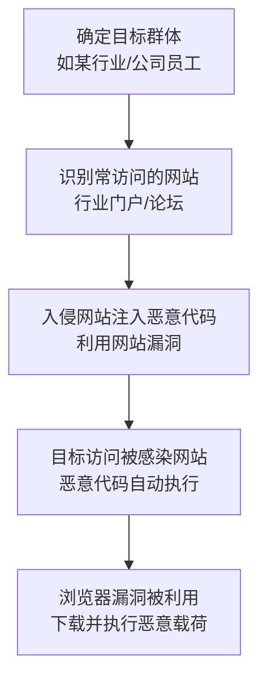

# 水坑攻击 (T1189) - Drive-by Compromise

## 一句话通俗理解

> 攻击者在你常去的网站上埋了"地雷"，你一踩上去（访问网站），恶意代码就自动在你电脑里爆炸执行了。

## 难度等级

- ⭐⭐ **中级**（需要一定基础）——需要了解Web漏洞、JavaScript和浏览器安全

## 技术描述

水坑攻击（Drive-by Compromise）是一种初始访问技术，攻击者通过在合法网站上托管恶意内容来利用访问这些网站的用户。当用户访问被感染的网站时，恶意代码会自动在其浏览器中执行，通常利用浏览器或插件的漏洞来获得系统访问权限。

这种技术被称为"水坑攻击"（Watering Hole Attack），就像狮子在水坑边埋伏等待猎物一样——攻击者会选择目标群体经常访问的网站进行感染，然后等待目标自己"送上门来"。

**与T1190（利用面向公众的应用）的区别**：
- T1190攻击的是服务器端的漏洞，攻击者直接攻击暴露在互联网上的系统
- T1189攻击的是客户端的漏洞，攻击者感染网站来攻击访问者的浏览器

**攻击者的典型操作流程**：
1. **选择目标**：确定目标群体（如某个行业、某个公司的员工）
2. **识别水坑**：找到目标群体经常访问的网站（行业门户、论坛、供应商网站等）
3. **感染网站**：入侵目标网站，注入恶意代码（iframe、JavaScript、恶意广告等）
4. **等待猎物**：目标用户访问被感染的网站
5. **自动执行**：恶意代码利用浏览器或插件漏洞自动执行
6. **获得控制**：攻击者获得目标系统的访问权限

**常见的注入方式**：
- 入侵合法网站后注入隐藏的iframe或JavaScript
- 修改网站引用的第三方脚本文件
- 通过恶意广告（Malvertising）投放恶意代码
- 利用XSS漏洞注入恶意脚本

## 子技术列表

**该技术没有子技术。**

T1189 在MITRE ATT&CK框架中没有定义子技术。

## 攻击流程

### 典型攻击流程



**步骤详解：**

1. **侦察阶段**
   - 通俗描述：研究目标群体平时喜欢上什么网站
   - 技术细节：通过分析目标群体的行业特征、工作习惯，确定他们经常访问的网站（如行业新闻门户、专业论坛、供应商网站）
   - 常用工具：SimilarWeb、Alexa、LinkedIn分析

2. **网站入侵**
   - 通俗描述：攻破这些网站，拿到管理员权限
   - 技术细节：利用网站CMS漏洞、SQL注入、已知框架漏洞等方式入侵目标网站，获得对网站内容的控制权
   - 常用工具：Burp Suite、SQLMap、WPScan

3. **代码注入**
   - 通俗描述：在网站里埋下"地雷"
   - 技术细节：在网站中植入恶意JavaScript代码或隐藏的iframe，添加恶意广告代码，利用第三方脚本加载恶意内容
   - 常用工具：BeEF、自定义JavaScript恶意代码

4. **漏洞利用和载荷投递**
   - 通俗描述：来访者浏览器触发"地雷"，自动下载恶意软件
   - 技术细节：恶意代码检测访问者的浏览器和插件版本，选择合适的漏洞利用（如浏览器RCE），下载并执行恶意载荷
   - 常用工具：Cobalt Strike、Metasploit浏览器漏洞利用模块

## 真实案例

### 案例1：3CX供应链攻击中的水坑攻击（2023年）

- **时间**: 2023年3月
- **目标**: 全球3CX VoIP客户端用户
- **攻击组织**: 疑似朝鲜关联
- **手法**: 攻击组织在合法网站www.tradingtechnologies[.]com上注入了隐藏的IFRAME。访问该网站的用户浏览器会自动加载恶意代码，两个月后才发现该网站正在分发被破坏的X_TRADER软件包。这次攻击结合了供应链妥协和水坑攻击技术。
- **影响**: 全球数千个组织受到影响，包括多家Fortune 500公司
- **参考链接**: [3CX Supply Chain Compromise - Google Cloud](https://cloud.google.com/blog/topics/threat-intelligence/3cx-software-supply-chain-compromise/)

### 案例2：朝鲜APT组织Andariel的水坑攻击活动（2022-2023年）

- **时间**: 2022年-2023年
- **目标**: 韩国政府机构、国防承包商和国际组织
- **攻击组织**: Andariel（朝鲜）
- **手法**: 朝鲜关联的APT组织Andariel多次使用水坑攻击作为初始访问向量。该组织入侵特定行业或地区经常访问的网站，通常结合零日漏洞利用来最大化成功率。攻击针对韩国政府机构、国防承包商和国际组织，通过被入侵的网站投放恶意代码来获得初始立足点。
- **影响**: 多个韩国政府和国防机构被入侵
- **参考链接**: [Andariel Watering Hole Attacks - AhnLab](https://web.archive.org/web/20230213154832/http://download.ahnlab.com/global/upload/threatinfo/202302/20230213_Andariel_Wateringhole.pdf)

### 案例3：APT组织针对政府网站的水坑攻击（2024年）

- **时间**: 2024年
- **目标**: 多个东欧和亚洲国家的政府机构
- **攻击组织**: 多个APT组织
- **手法**: 多个APT组织在2024年被观察到持续使用水坑攻击技术。攻击者入侵政府门户网站、行业论坛和学术网站，在其中注入恶意JavaScript代码。这些代码利用浏览器零日漏洞或已知漏洞来执行恶意载荷。攻击者使用多阶段加载器和混淆技术来逃避检测。水坑攻击在2024年仍然是针对高价值目标的有效初始访问手段。
- **影响**: 多个政府机构和智库被入侵
- **参考链接**: [MITRE ATT&CK T1189](https://attack.mitre.org/techniques/T1189/)

## 红队视角

> ⚠️ **免责声明**：以下内容仅用于合法的安全测试、渗透测试和教育目的。未经授权对他人系统进行测试是违法行为。

### 实战技巧

1. **使用BeEF进行浏览器利用**
   BeEF（Browser Exploitation Framework）是水坑攻击测试的核心工具。在测试环境中安装BeEF，生成Hook脚本，将其注入到测试页面中。当目标浏览器加载页面时，BeEF可以获取浏览器信息、执行命令。

2. **结合社会工程学提高成功率**
   水坑攻击的成功率取决于目标访问被感染网站的概率。结合社会工程学，如通过邮件推送"行业最新报告"链接到被感染的网站，可以显著提高成功率。

3. **使用Cobalt Strike的Web Drive-by功能**
   Cobalt Strike提供了完善的Web Drive-by攻击能力，包括浏览器漏洞利用、payload托管和自动化攻击链。

### 常用工具

| 工具名称 | 用途 | 平台 | 链接 |
|----------|------|------|------|
| BeEF | 浏览器利用框架，Hook浏览器后执行命令 | 跨平台 | [BeEF Project](https://beefproject.com/) |
| SET | 社会工程学工具包，创建恶意网页 | Kali Linux | [GitHub](https://github.com/trustedsec/social-engineer-toolkit) |
| Cobalt Strike | 商业红队工具，含Web Drive-by功能 | 跨平台 | [Cobalt Strike](https://www.cobaltstrike.com/) |
| Metasploit | 浏览器漏洞利用模块 | 跨平台 | [GitHub](https://github.com/rapid7/metasploit-framework) |

### 注意事项

- 水坑攻击可能影响大量无辜用户，必须严格控制范围
- 测试应在完全受控的隔离环境中进行
- 避免使用真实的零日漏洞（不符合红队评估伦理）

## 蓝队视角

### 检测要点

1. **网络流量监控**
   - 日志来源：Web代理日志、防火墙日志、IDS/IPS日志
   - 关注字段：出站连接的目标域名、URL路径、HTTP Referer头
   - 异常特征：访问正常网站时加载了可疑的JavaScript文件、隐藏的iframe引用外部域名

2. **终端行为监控**
   - 日志来源：EDR日志、Sysmon日志
   - 关注字段：浏览器进程的子进程创建（Event ID 4688）、PowerShell执行
   - 异常特征：浏览器启动cmd.exe、powershell.exe等子进程（正常浏览器不会这样做）

3. **Web服务器完整性监控**
   - 日志来源：Web服务器访问日志、文件完整性监控（FIM）
   - 关注字段：文件修改、新增文件、数据库更改
   - 异常特征：网站文件的未授权修改、数据库中的恶意内容、新增的隐藏文件

### 监控建议

- 部署Web代理和URL过滤，阻止访问已知恶意或新注册的域名
- 实施内容安全策略（CSP）限制网站可执行的脚本来源
- 使用浏览器隔离技术，将Web浏览与用户系统隔离
- 保持浏览器和插件及时更新

## 检测建议

### 网络层检测

**检测方法：** 监控异常的HTTP请求和响应，特别是隐藏的iframe和外部脚本加载。

**具体规则/命令示例：**
```
# Suricata规则 - 检测隐藏iframe注入
alert http $EXTERNAL_NET any -> $HOME_NET any (msg:"潜在的隐藏iframe注入"; flow:from_server; content:"<iframe"; nocase; content:"height="; distance:0; pcre:"/height=[""']0[""']/i"; sid:1000002; rev:1;)
```

### 主机层检测

**检测方法：** 监控浏览器进程的异常行为。

**Windows事件ID：**
- 事件ID 4688：进程创建——监控从浏览器进程创建的子进程（如cmd.exe、powershell.exe、wscript.exe）
- Sysmon事件ID 1：进程创建——更详细的子进程监控
- Sysmon事件ID 3：网络连接——监控浏览器进程的异常网络连接

**Linux日志：**
- 日志文件：/var/log/syslog
- 关键字段：浏览器相关的崩溃日志、异常进程

**具体命令示例：**
```bash
# 使用Sysmon日志检测浏览器启动可疑子进程
# 在PowerShell中查询
Get-WinEvent -FilterHashtable @{LogName='Microsoft-Windows-Sysmon/Operational'; ID=1} | Where-Object {$_.Properties[4].Value -like '*chrome.exe*' -and $_.Properties[5].Value -like '*cmd.exe*'}
```

### 应用层检测

**检测方法：** 监控Web应用中的异常代码注入。

**Sigma规则示例：**
```yaml
title: 浏览器进程启动可疑子进程
status: experimental
description: 检测浏览器进程（chrome.exe/edge.exe/firefox.exe）启动cmd.exe或powershell.exe，可能表示水坑攻击
logsource:
    category: process_creation
    product: windows
detection:
    selection_parent:
        ParentImage|endswith:
            - '\chrome.exe'
            - '\msedge.exe'
            - '\firefox.exe'
    selection_child:
        Image|endswith:
            - '\cmd.exe'
            - '\powershell.exe'
            - '\wscript.exe'
            - '\cscript.exe'
    condition: selection_parent and selection_child
level: high
tags:
    - attack.t1189
```

## 缓解措施

### 优先级1：关键措施

**措施名称：** 保持浏览器和插件及时更新

**具体实施步骤：**
1. 通过组策略或MDM配置自动更新浏览器
2. 定期检查浏览器插件版本，移除不再使用的插件
3. 禁用不安全的浏览器插件（如Adobe Flash、Java Applet）

### 优先级2：重要措施

**措施名称：** 部署Web安全网关

**具体实施步骤：**
1. 部署Web代理和URL过滤解决方案
2. 配置云端安全Web网关（如Zscaler、Netskope）
3. 启用对恶意网站和已知钓鱼网站的过滤

**措施名称：** 实施浏览器隔离

**具体实施步骤：**
1. 评估远程浏览器隔离（RBI）解决方案
2. 对高风险用户（如高管）优先实施浏览器隔离
3. 配置隔离策略，对访问外部网站时启用隔离模式

### 优先级3：建议措施

**措施名称：** 加强网站安全

**具体实施步骤：**
1. 对内部网站实施内容安全策略（CSP）
2. 定期扫描内部网站是否存在恶意代码
3. 监控网站文件的完整性

### MITRE ATT&CK 缓解措施映射

| 缓解措施ID | 缓解措施名称 | 适用性 | 说明 |
|------------|-------------|:------:|------|
| M1050 | 漏洞利用预防 | 适用 | 保持浏览器和插件更新，修补已知漏洞 |
| M1021 | Web过滤 | 适用 | 部署Web代理过滤恶意网站 |
| M1048 | 应用程序隔离和沙箱 | 适用 | 使用浏览器隔离技术 |
| M1017 | 用户培训 | 适用 | 培训用户识别可疑网站 |
| M1038 | 执行预防 | 适用 | 禁用从浏览器启动脚本引擎 |

## 动手实验

> ⚠️ **重要提示**：所有实验必须在隔离的实验室环境中进行，禁止对未授权的真实系统进行测试。

### 实验环境准备

**推荐靶场/实验平台：**

| 平台名称 | 类型 | 难度 | 链接 |
|----------|------|:----:|------|
| TryHackMe - Watering Hole | CTF | 中级 | [THM](https://tryhackme.com/) |
| Hack The Box | 虚拟靶场 | 中级 | [HTB](https://www.hackthebox.com/) |

**所需工具：**
- Kali Linux
- BeEF：浏览器利用框架
- Metasploit：浏览器漏洞利用模块

### 实验1：使用BeEF进行浏览器利用（仅供学习）

**实验目标：** 了解水坑攻击中浏览器利用的原理

**实验步骤：**
1. 安装Kali Linux并启动BeEF服务
2. 访问BeEF控制面板和管理界面
3. 在测试页面中嵌入BeEF Hook脚本
4. 使用测试浏览器访问该页面，观察BeEF如何检测浏览器信息
5. 使用BeEF模块执行简单的测试命令

**预期结果：** 浏览器被Hook，BeEF控制面板显示被Hook的浏览器信息

**学习要点：** 理解浏览器利用框架的工作原理

### 实验2：模拟水坑攻击流程

**实验目标：** 完整模拟水坑攻击的攻击链

**实验步骤：**
1. 在测试环境中搭建一个合法网站的副本
2. 使用SET创建恶意登录页面
3. 配置Metasploit的浏览器漏洞利用模块
4. 模拟攻击流程：用户访问页面 -> 恶意代码执行 -> payload下载

**预期结果：** 模拟攻击链成功执行

**学习要点：** 理解水坑攻击的完整攻击链

### 实验3：分析真实的水坑攻击样本

**实验目标：** 学习分析真实水坑攻击的技术指标

**实验步骤：**
1. 从威胁情报平台获取水坑攻击的IOC
2. 使用沙箱分析恶意网页的行为
3. 分析攻击中使用的混淆技术和漏洞
4. 编写YARA检测规则

**预期结果：** 提取到攻击的特征指标

**学习要点：** 掌握水坑攻击的分析和检测方法

## 术语解释

| 术语 | 英文原名 | 通俗解释 |
|------|----------|----------|
| 水坑攻击 | Watering Hole Attack | 攻击者在目标群体常去的网站上设伏，就像狮子守在水坑边等待来喝水的猎物 |
| 路过式下载 | Drive-by Download | 用户正常访问网站时不知不觉地自动下载了恶意软件，就像走路时被路边的钩子挂住了衣服 |
| 恶意广告 | Malvertising | 通过正规广告网络投放带毒的广告，正经网站上也可能出现恶意广告 |
| 漏洞利用工具包 | Exploit Kit | 自动化工具，检测浏览器漏洞并自动选择合适的利用方式，就像万能开锁工具箱 |
| iframe | Inline Frame | HTML中的"窗口中的窗口"，可以嵌入其他网页的内容（包括恶意内容） |
| 零日漏洞 | Zero-day | 厂商还不知道或还没来得及修补的漏洞，就像门锁还没被发现的设计缺陷 |
| 浏览器隔离 | Browser Isolation | 在远程容器中运行浏览器，网页内容不直接接触用户电脑，就像隔着防弹玻璃看危险物品 |

## 参考资料

### 官方文档

- [MITRE ATT&CK - Drive-by Compromise (T1189)](https://attack.mitre.org/techniques/T1189/)
- [CISA - Drive-by Compromise (T1189)](https://www.cisa.gov/eviction-strategies-tool/info-attack/T1189)

### 安全报告

- [3CX Supply Chain Compromise - Google Cloud](https://cloud.google.com/blog/topics/threat-intelligence/3cx-software-supply-chain-compromise/) - 结合供应链攻击和水坑攻击的典型案例分析
- [Andariel Watering Hole Attacks - AhnLab](https://www.ahnlab.com/global/warn/virusDetail.do?warningsno=23000003) - 朝鲜APT组织的水坑攻击分析

### 工具与资源

- [BeEF - Browser Exploitation Framework](https://beefproject.com/) - 浏览器利用框架
- [Social Engineering Toolkit](https://github.com/trustedsec/social-engineer-toolkit) - 社会工程学工具包

### 学习资料

- [Shadowserver Strategic Web Compromise](http://blog.shadowserver.org/2012/05/15/cyber-espionage-strategic-web-compromises-trusted-websites-serving-dangerous-results/) - 水坑攻击分析
- [Red Canary 2024 Initial Access Report](https://redcanary.com/threat-detection-report/trends/initial-access/) - 2024年初始访问技术趋势
