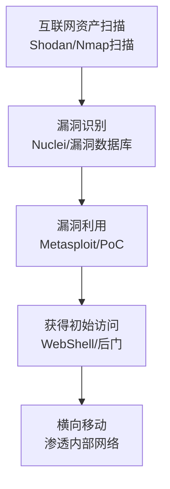

# 利用面向公众的应用 (T1190) - Exploit Public-Facing Application

## 一句话通俗理解

> 攻击者直接攻击你家大门的锁——那些暴露在互联网上的系统（网站、VPN、邮件服务器）如果存在漏洞，攻击者就能直接破门而入。

## 难度等级

- ⭐ **初级**（新手可学）——概念直观，使用现成工具即可利用已知漏洞

## 技术描述

利用面向公众的应用（Exploit Public-Facing Application）是一种初始访问技术，攻击者通过利用面向互联网的系统或应用程序中的漏洞来获得对目标网络的初始访问权限。

与需要用户交互的技术（如钓鱼）不同，T1190**完全基于技术利用，不需要任何用户参与**。攻击者只需要找到暴露在互联网上的系统，然后利用其中的漏洞即可。

**打个比方**：如果把目标网络比作一栋房子，那么面向公众的应用就是"大门上的锁"。攻击者会：
1. 先扫描找到你的大门（发现暴露的服务）
2. 然后检查锁的型号和缺陷（识别软件版本和漏洞）
3. 最后用工具开锁或撬锁（利用漏洞）

**攻击者的典型操作流程**：
1. **资产发现**：使用Shodan、Censys等工具扫描互联网，找到目标暴露的服务
2. **漏洞识别**：确定目标运行的软件版本，查找已知漏洞（CVE）
3. **漏洞利用**：使用公开的PoC（概念验证）或自定义exploit攻击漏洞
4. **获得控制**：在目标系统上执行任意代码，获得初始访问权限

**常见的攻击目标**：
- Web应用程序（SQL注入、XSS、命令注入）
- VPN设备（Fortinet、Ivanti、Citrix、Pulse Secure）
- 邮件服务器（Microsoft Exchange）
- 云服务和容器平台
- 网络设备管理接口
- 远程桌面服务

## 子技术列表

**该技术没有子技术。**

T1190 在MITRE ATT&CK框架中没有定义子技术。

## 攻击流程

### 典型攻击流程



**步骤详解：**

1. **资产发现**
   - 通俗描述：在互联网上搜索目标暴露了哪些系统
   - 技术细节：使用Shodan、Censys、FOFA等搜索引擎扫描互联网，找到目标组织的IP范围和域名，识别所有暴露的服务和端口
   - 常用工具：Shodan、Censys、FOFA、Amass

2. **漏洞识别**
   - 通俗描述：确定目标的系统版本，查找有没有已知的"bug"
   - 技术细节：使用Nuclei、Nessus等漏洞扫描工具检测系统版本，在CVE数据库、Exploit-DB中查找对应版本的已知漏洞
   - 常用工具：Nuclei、Nessus、OpenVAS

3. **漏洞利用**
   - 通俗描述：用公开的利用代码攻击漏洞
   - 技术细节：使用Metasploit、公开的PoC脚本或自定义逆向分析进行漏洞利用，绕过WAF等安全防护措施，获得远程代码执行权限
   - 常用工具：Metasploit、Burp Suite、SQLMap

4. **后渗透**
   - 通俗描述：在目标系统上"安家"
   - 技术细节：部署Web Shell或后门以维持访问，提升权限到管理员/root，进行内部网络侦察和横向移动
   - 常用工具：Cobalt Strike、中国菜刀/蚁剑

## 真实案例

### 案例1：Ivanti Connect Secure零日漏洞攻击（2025年1月）

- **时间**: 2025年1月
- **目标**: 使用Ivanti Connect Secure VPN的全球组织
- **攻击组织**: UNC5221（疑似中国关联）
- **手法**: 中国关联的威胁组织UNC5221利用Ivanti Connect Secure中的零日漏洞CVE-2025-0282（CVSS 9.0，栈缓冲区溢出）进行攻击。该漏洞允许未经身份验证的攻击者实现远程代码执行。攻击者在补丁发布前就已经开始利用该漏洞（零日利用），部署了多种恶意软件家族，包括Spawn恶意软件生态系统（SpawnAnt、SpawnMole、SpawnSnail）和Dryhook、Phasejam后门。攻击目标是边缘网络设备，以获得对企业网络的初始访问权限。
- **影响**: 多个行业的组织受到影响，Mandiant建议受影响组织在打补丁前先进行出厂重置
- **参考链接**: [CVE-2025-0282 - NVD](https://nvd.nist.gov/vuln/detail/CVE-2025-0282)

### 案例2：Palo Alto Networks PAN-OS认证绕过漏洞（2025年）

- **时间**: 2025年
- **目标**: 使用Palo Alto Networks防火墙的组织
- **攻击组织**: 未公开
- **手法**: 攻击者利用PAN-OS管理Web界面中的认证绕过漏洞CVE-2025-0108。该漏洞允许未经身份验证的攻击者绕过认证，访问防火墙的管理界面。攻击者利用此漏洞可以修改防火墙配置、禁用安全策略或获取敏感信息。该漏洞被CISA添加到已知被利用漏洞（KEV）目录中。
- **影响**: 多个组织的防火墙配置被篡改
- **参考链接**: [CISA KEV Catalog](https://www.cisa.gov/known-exploited-vulnerabilities-catalog)

### 案例3：Fortinet FortiGate VPN漏洞利用活动（2024-2025年）

- **时间**: 2024年-2025年
- **目标**: 使用Fortinet VPN设备的政府、关键基础设施组织
- **攻击组织**: Volt Typhoon等
- **手法**: Volt Typhoon等中国关联的APT组织持续利用Fortinet SSL VPN中的多个漏洞，包括CVE-2024-55591等零日漏洞。该漏洞允许攻击者绕过认证获得完全的管理权限。RansomHub勒索软件团伙也被观察到利用CVE-2024-55591作为初始访问向量，在成功利用后部署勒索软件。攻击者利用这些漏洞获取VPN设备的管理访问权限，然后进入内部网络。Volt Typhoon的特点是"生活离岸"（Living off the Land），尽量减少自定义恶意软件的使用，而是依赖合法的本地工具。
- **影响**: 美国、澳大利亚等多个国家的关键基础设施受到影响
- **参考链接**: [Volt Typhoon - FortiGuard Labs](https://fortiguard.fortinet.com/threat-actor/5564/volt-typhoon)

### 案例4：Cl0p勒索软件利用Cleo MFT漏洞（2025年Q1）

- **时间**: 2025年第一季度
- **目标**: 使用Cleo Managed File Transfer的组织
- **攻击组织**: Cl0p勒索软件团伙
- **手法**: Cl0p勒索软件团伙利用Cleo文件传输软件中的漏洞（CVE-2024-50623和CVE-2024-55956）进行初始访问。这些漏洞允许未经身份验证的远程代码执行。攻击者部署模块化的Java后门以维持访问和窃取数据。2025年第一季度Cl0p相关事件从2起飙升至154起，凸显了面向公众的文件传输系统成为高危攻击目标。
- **影响**: 全球大量组织受到影响，数据被窃取和勒索
- **参考链接**: [Dragos OT Ransomware Q1 2025](https://www.dragos.com/blog/dragos-industrial-ransomware-analysis-q1-2025)

## 红队视角

> ⚠️ **免责声明**：以下内容仅用于合法的安全测试、渗透测试和教育目的。未经授权对他人系统进行测试是违法行为。

### 实战技巧

1. **外部资产发现**
   使用Shodan搜索目标组织的ASN（自治系统号）和相关域名，生成完整的外部资产清单。注意发现影子资产（遗忘的测试系统、旧版本的软件）。

2. **漏洞扫描优先级**
   优先扫描CISA KEV目录中的漏洞，因为这些是被确认在野外被利用的漏洞。使用Nuclei的自动化模板快速扫描大量目标。

3. **WAF绕过技术**
   针对常见Web应用防火墙，可以使用编码、大小写变换、HTTP参数污染等绕过技术。

### 常用工具

| 工具名称 | 用途 | 平台 | 链接 |
|----------|------|------|------|
| Shodan | 互联网资产发现搜索引擎 | Web | [Shodan](https://www.shodan.io/) |
| Nuclei | 基于模板的快速漏洞扫描器 | Linux | [GitHub](https://github.com/projectdiscovery/nuclei) |
| Metasploit | 漏洞利用框架 | 跨平台 | [GitHub](https://github.com/rapid7/metasploit-framework) |
| Burp Suite | Web应用安全测试平台 | 跨平台 | [PortSwigger](https://portswigger.net/burp) |
| SQLMap | SQL注入自动化检测工具 | 跨平台 | [GitHub](https://github.com/sqlmapproject/sqlmap) |

### 注意事项

- 确保获得合法授权，避免对目标系统造成损害
- 在使用漏洞利用代码前，先在测试环境验证
- 记录所有操作步骤，保持测试的可追溯性

## 蓝队视角

### 检测要点

1. **资产清单管理**
   - 维护完整的外部资产清单，知道哪些系统暴露在互联网上
   - 使用ASM（攻击面管理）工具持续发现新资产
   - 定期审查和移除不必要的暴露面

2. **漏洞管理**
   - 建立快速补丁管理流程，优先修补面向公众的系统
   - 关注CISA KEV目录中的漏洞，24小时内修补
   - 使用虚拟补丁（WAF规则）作为临时缓解

3. **入侵检测**
   - 监控针对面向公众系统的异常扫描和利用尝试
   - 部署WAF检测和阻止常见攻击载荷
   - 监控系统文件的未授权更改和后门部署

### 监控建议

- 对所有面向公众的系统部署HIDS（主机入侵检测系统）
- 使用NIDS监控网络层的异常流量
- 建立面向公众系统的24/7监控机制
- 定期进行渗透测试和漏洞评估

## 检测建议

### 网络层检测

**检测方法：** 监控针对面向公众系统的漏洞扫描和利用尝试。

**具体规则/命令示例：**
```
# Suricata规则 - 检测常见的Web扫描工具
alert http $EXTERNAL_NET any -> $HOME_NET any (msg:"Nuclei扫描器检测"; http.user_agent; content:"nuclei"; nocase; sid:1000003; rev:1;)
```

### 主机层检测

**检测方法：** 监控系统文件和进程的异常变化。

**Windows事件ID：**
- 事件ID 4688：进程创建——监控异常的Web服务器子进程
- 事件ID 7045：服务安装——监控后门服务的安装
- Sysmon事件ID 3：网络连接——监控反弹Shell连接

**Linux日志：**
- 日志文件：/var/log/apache2/access.log、/var/log/messages
- 关键字段：异常的HTTP请求模式、WebShell的访问痕迹

**具体命令示例：**
```bash
# 检测WebShell访问特征（Linux）
grep -E "(cmd|exec|shell|passthru|system)\(" /var/log/apache2/access.log

# 查看近期被修改的可执行文件
find /usr/bin /usr/sbin /bin /sbin -mtime -1 -type f
```

### 应用层检测

**检测方法：** 监控Web应用日志中的异常请求。

**Sigma规则示例：**
```yaml
title: 面向公众应用漏洞利用尝试
status: experimental
description: 检测针对已知CVE漏洞的利用尝试，通过HTTP请求中的特征匹配
logsource:
    category: webserver
    product: apache
detection:
    selection:
        c-uri|contains:
            - '/cgi-bin/'
            - '/admin/'
            - '/manager/html'
            - '?cmd='
            - '?exec='
    condition: selection
level: medium
tags:
    - attack.t1190
```

## 缓解措施

### 优先级1：关键措施

**措施名称：** 建立快速补丁管理流程

**具体实施步骤：**
1. 识别所有面向公众的系统，建立优先修补清单
2. 关注CISA KEV目录，对列出的漏洞在24小时内完成修补
3. 建立自动化补丁管理工具链

**配置示例：**
```bash
# 使用Nuclei持续扫描已知漏洞
nuclei -l targets.txt -t cves/ -severity critical,high -o vulnerability_report.txt
```

### 优先级2：重要措施

**措施名称：** 部署WAF和网络防护

**具体实施步骤：**
1. 为所有面向公众的Web应用部署WAF
2. 配置网络分段，将面向公众系统与内部网络隔离
3. 使用虚拟补丁技术临时缓解已知漏洞

**措施名称：** 减少暴露面

**具体实施步骤：**
1. 移除不必要的面向公众服务
2. 对必要的服务使用访问控制列表限制来源IP
3. 对管理接口实施IP白名单

### 优先级3：建议措施

**措施名称：** 定期安全评估

**具体实施步骤：**
1. 定期进行外部渗透测试
2. 使用ASM工具持续发现新资产
3. 建立漏洞赏金计划

### MITRE ATT&CK 缓解措施映射

| 缓解措施ID | 缓解措施名称 | 适用性 | 说明 |
|------------|-------------|:------:|------|
| M1051 | 更新软件 | 适用 | 及时修补面向公众系统的漏洞 |
| M1016 | 漏洞扫描 | 适用 | 定期扫描已知漏洞 |
| M1030 | 网络分段 | 适用 | 隔离面向公众系统与内部网络 |
| M1013 | 应用开发指南 | 适用 | 在开发阶段避免引入漏洞 |
| M1031 | 网络入侵防御 | 适用 | 部署WAF和IPS |

## 动手实验

> ⚠️ **重要提示**：所有实验必须在隔离的实验室环境中进行，禁止对未授权的真实系统进行测试。

### 实验环境准备

**推荐靶场/实验平台：**

| 平台名称 | 类型 | 难度 | 链接 |
|----------|------|:----:|------|
| Metasploitable 2 | 虚拟机 | 初级 | [SourceForge](https://sourceforge.net/projects/metasploitable/) |
| Hack The Box | 虚拟靶场 | 初级-高级 | [HTB](https://www.hackthebox.com/) |
| TryHackMe | CTF | 初级 | [THM](https://tryhackme.com/) |

**所需工具：**
- Kali Linux
- Nmap：端口扫描
- Metasploit：漏洞利用框架

### 实验1：使用Nuclei进行漏洞扫描

**实验目标：** 学会使用自动化漏洞扫描工具

**实验步骤：**
1. 安装Nuclei并更新模板库 `nuclei -update-templates`
2. 对Metasploitable靶机进行扫描 `nuclei -u http://192.168.1.100 -severity critical,high`
3. 分析扫描结果
4. 验证部分漏洞

**预期结果：** 发现多个已知漏洞

**学习要点：** 掌握自动化漏洞扫描的方法

### 实验2：使用Metasploit利用已知漏洞

**实验目标：** 理解漏洞利用的完整流程

**实验步骤：**
1. 搜索Metasploit中针对目标系统的exploit模块
2. 配置exploit参数（RHOST、payload等）
3. 执行漏洞利用
4. 建立meterpreter会话

**预期结果：** 成功利用漏洞获得目标系统控制权

**学习要点：** 掌握Metasploit漏洞利用的基本流程

### 实验3：使用Burp Suite测试Web应用

**实验目标：** 学习手动Web应用安全测试

**实验步骤：**
1. 配置Burp Suite代理
2. 浏览目标Web应用，收集请求信息
3. 使用Repeater手动测试SQL注入
4. 使用Intruder进行参数枚举

**预期结果：** 发现Web应用中的安全漏洞

**学习要点：** 掌握手动Web安全测试方法

## 术语解释

| 术语 | 英文原名 | 通俗解释 |
|------|----------|----------|
| CVE | Common Vulnerabilities and Exposures | 通用漏洞披露编号，每个公开漏洞的唯一ID，就像每个公民的身份证号一样 |
| CVSS | Common Vulnerability Scoring System | 通用漏洞评分系统，用数字（0-10）表示漏洞的严重程度，分数越高越危险 |
| PoC | Proof of Concept | 概念验证代码，用来证明某个漏洞确实可以被利用的示例代码 |
| WAF | Web Application Firewall | Web应用防火墙，专门保护网站免受各种网络攻击的安全设备或软件 |
| RCE | Remote Code Execution | 远程代码执行，最严重的漏洞之一，攻击者可以在你的服务器上执行任何命令 |
| KEV | Known Exploited Vulnerabilities | CISA维护的已知已利用漏洞目录，标记了确实正在被黑客利用的漏洞 |
| 零日漏洞 | Zero-day Vulnerability | 软件厂商还没发现的漏洞，或者发现了但还没修复的漏洞，好比门锁的隐藏缺陷 |
| 攻击面 | Attack Surface | 系统暴露给攻击者的所有可能的入口点的总和，就像房子所有的门窗、通风口的总和 |

## 参考资料

### 官方文档

- [MITRE ATT&CK - Exploit Public-Facing Application (T1190)](https://attack.mitre.org/techniques/T1190/)
- [CISA - Exploit Public-Facing Application (T1190)](https://www.cisa.gov/eviction-strategies-tool/info-attack/T1190)

### 安全报告

- [CVE-2025-0282 - NVD](https://nvd.nist.gov/vuln/detail/CVE-2025-0282) - Ivanti VPN零日漏洞详情
- [Dragos OT Ransomware Q1 2025](https://www.dragos.com/blog/dragos-industrial-ransomware-analysis-q1-2025) - 2025年Q1勒索软件趋势，包括Cl0p利用Cleo漏洞的分析
- [Barracuda RansomHub FortiGate Case](https://blog.barracuda.com/2025/03/20/soc-case-files-ransomhub-fortigate-bug) - RansomHub利用FortiGate漏洞的实战案例

### 工具与资源

- [CISA Known Exploited Vulnerabilities Catalog](https://www.cisa.gov/known-exploited-vulnerabilities-catalog) - 已知被利用漏洞目录
- [Volt Typhoon - FortiGuard Labs](https://fortiguard.fortinet.com/threat-actor/5564/volt-typhoon) - 利用VPN漏洞的APT组织分析

### 学习资料

- [ProxyShell攻击链分析](https://blog.eclecticiq.com/multiple-apt-groups-exloit-exchange-server-vulnerabilities) - Exchange服务器漏洞利用分析
- [Red Canary 2024 Initial Access Report](https://redcanary.com/threat-detection-report/trends/initial-access/) - 2024年初始访问技术趋势
