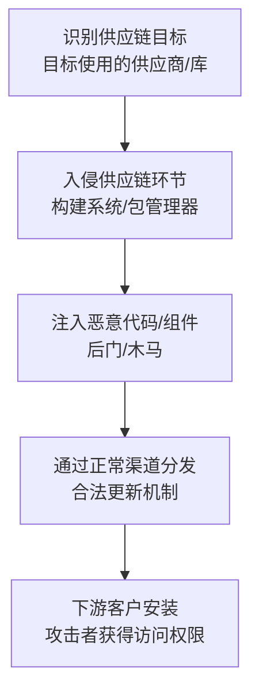

# 供应链妥协 (T1195) - Supply Chain Compromise

## 一句话通俗理解

> 攻击者不在你家门口动手，而是在你网购的商品到达你手上之前偷偷做了手脚——通过污染你信任的软件、硬件或服务来入侵你。

## 难度等级

- ⭐⭐⭐ **高级**（需要深入技术知识）——需要了解软件开发、供应链安全、社会工程学等多领域知识

## 技术描述

供应链妥协（Supply Chain Compromise）是一种初始访问技术，攻击者通过渗透组织的供应链来获得对目标网络的未授权访问。这种技术利用了组织对其供应商、供应链或第三方服务之间的隐式信任关系。

**打个比方**：供应链攻击就像是在你信任的餐厅的食物里下毒——你信任这家餐厅，所以不会怀疑食物有问题。同样，组织信任其供应商的软件和硬件，攻击者就在这个信任链中动手脚。

**供应链攻击的独特之处**：
- **利用信任**：组织信任供应商，不会对其产品进行同等安全审查
- **影响范围大**：一次攻击可以影响成千上万的下游客户
- **难以检测**：恶意代码被"合法"地分发，绕过安全控制
- **攻击成本高但回报大**：需要深入了解供应链，但一旦成功影响巨大

**供应链攻击的类型**：
1. **软件供应链**：在软件仓库、构建系统或库中注入恶意代码
2. **硬件供应链**：在制造过程中引入被破坏或假冒的硬件组件
3. **更新机制妥协**：劫持合法的软件更新渠道分发恶意软件
4. **服务提供商妥协**：入侵MSP或云服务提供商访问多个下游客户

## 子技术列表

**该技术共有 3 个子技术：**

| 子技术ID | 中文名称 | 通俗解释 |
|----------|----------|----------|
| T1195.001 | 破坏软件依赖和开发工具 | 在开源库、包管理器或开发工具中注入恶意代码，开发者下载使用就会中招 |
| T1195.002 | 破坏软件供应链 | 入侵软件构建或分发过程，在软件安装包中植入后门 |
| T1195.003 | 破坏硬件供应链 | 在硬件制造或分发过程中植入恶意芯片或固件 |

<details>
<summary><strong>展开查看各子技术详细说明</strong></summary>

### T1195.001 - 破坏软件依赖和开发工具

**通俗理解：** 攻击者污染了程序员用的"零件库"，程序员不知不觉用了带毒的零件。

**详细说明：**
攻击者在开源库、包管理器（npm、PyPI、Maven）中上传包含恶意代码的包，或通过域名抢注（Typosquatting）创建与知名库名称相似的恶意包。开发者在不知情的情况下下载和使用这些恶意依赖，恶意代码就进入了最终产品。

### T1195.002 - 破坏软件供应链

**通俗理解：** 攻击者入侵了软件工厂，在生产线上动了手脚。

**详细说明：**
攻击者入侵软件公司的构建服务器或分发渠道，在软件的构建过程中注入恶意代码。被篡改的软件通过正常的更新渠道分发给客户，由于有合法的数字签名，很难被发现。SolarWinds和Codecov攻击就是典型案例。

### T1195.003 - 破坏硬件供应链

**通俗理解：** 攻击者在硬件生产过程中植入了"后门芯片"。

**详细说明：**
攻击者与硬件制造商合作，在电路板中植入恶意芯片或修改固件。这些硬件在安装到目标网络后，为攻击者提供后门访问。这种攻击成本极高，通常由国家背景的攻击者实施。

</details>

## 攻击流程

### 典型攻击流程



**步骤详解：**

1. **目标选择**
   - 通俗描述：研究目标用了哪些供应商和软件
   - 技术细节：分析目标组织使用的软件产品、第三方库、云服务、IT供应商，评估各供应链环节的安全薄弱点
   - 常用工具：SBOM分析工具、社会工程学

2. **供应链入侵**
   - 通俗描述：攻击"上游"的供应商
   - 技术细节：入侵软件公司的构建环境、包管理器账户、更新服务器；通过社会工程学成为开源项目维护者
   - 常用工具：定制恶意软件、社会工程学

3. **恶意代码注入**
   - 通俗描述：在供应商的产品中"下毒"
   - 技术细节：在源代码中植入隐蔽后门，在构建过程中注入恶意代码（如修改编译器或构建脚本），替换合法的更新文件
   - 常用工具：隐蔽后门代码、Rootkit

4. **分发和执行**
   - 通俗描述：有毒产品通过正常渠道到达目标
   - 技术细节：被污染的版本通过正常的更新渠道分发（合法数字签名、正常下载链接），目标信任来源并安装，恶意代码执行
   - 常用工具：C2框架（等待回连）

## 真实案例

### 案例1：XZ Utils后门事件（2024年3月）

- **时间**: 2024年3月
- **目标**: 使用Linux系统的全球组织
- **攻击组织**: 疑似国家背景（"Jia Tan"假身份）
- **手法**: 一名攻击者使用"Jia Tan"的假名，花费大约两年时间在XZ Utils开源项目中建立信任，最终成为项目的维护者。然后在XZ Utils 5.6.0和5.6.1版本中插入了后门（CVE-2024-3094），该后门可以拦截和修改OpenSSH的认证行为，允许未经身份验证的远程代码执行。后门被Microsoft PostgreSQL开发者Andres Freund在调查异常SSH延迟时意外发现，此时受影响版本已被多个Linux发行版采用但尚未进入稳定版。攻击者还创建了多个假身份在社区中施压要求替换原维护者，被称为"最精妙的开源供应链攻击"。
- **影响**: 差点影响所有主流Linux发行版（Fedora、Debian、Ubuntu等）
- **参考链接**: [CVE-2024-3094 - NVD](https://nvd.nist.gov/vuln/detail/CVE-2024-3094)

### 案例2：Polyfill.io JavaScript供应链攻击（2024年6月）

- **时间**: 2024年6月
- **目标**: 使用Polyfill.io CDN的数十万个网站
- **攻击组织**: 最初认为与中国公司Funnull有关，后来发现涉及朝鲜黑客
- **手法**: 流行的JavaScript库服务Polyfill.io的域名和资产被中国公司Funnull收购后，新所有者在通过cdn.polyfill.io提供的polyfill脚本中注入了恶意代码。受影响的网站超过10万个，包括Google、Amazon、Apple等大公司的网站。恶意脚本可以将用户重定向到诈骗网站、钓鱼页面和恶意下载。2026年3月的调查发现，Funnull很可能是朝鲜黑客的"掩护公司"，目的是利用赌博网站洗钱。
- **影响**: 超过10万个网站受到影响
- **参考链接**: [Polyfill.io Attack Analysis - Sansec](https://sansec.io/research/polyfill-supply-chain-attack)

### 案例3：SolarWinds Orion供应链攻击（2020年，持续影响至今）

- **时间**: 2020年（持续影响至今）
- **目标**: 全球约18,000个使用SolarWinds Orion的组织
- **攻击组织**: APT29（俄罗斯SVR）
- **手法**: 俄罗斯外情局（SVR）关联的APT29组织入侵了SolarWinds的软件构建环境，在Orion软件的构建过程中注入了SUNBURST后门。被破坏的更新通过正常的软件更新机制分发给客户，后门被数字签名使其看起来合法。虽然约18,000个客户下载了受影响版本，但只有较小的有针对性子集表现出后续APT29活动。美国和英国政府将攻击归因于俄罗斯SVR。此次攻击导致了构建管道安全和供应链风险管理方面的多年转变。
- **影响**: 包括美国政府机构在内的多个高价值目标被入侵
- **参考链接**: [SolarWinds Compromise - CISA](https://www.cisa.gov/eviction-strategies-tool/dialog-content/TMPL0002)

## 红队视角

> ⚠️ **免责声明**：以下内容仅用于合法的安全测试、渗透测试和教育目的。未经授权对他人系统进行测试是违法行为。

### 实战技巧

1. **Typosquatting测试**
   在红队评估中，可以注册与目标使用的开源库名称相似的恶意包（如"requsts"代替"requests"），评估内部开发者是否会错误安装。注意：这需要在授权范围内进行。

2. **依赖漏洞分析**
   使用SCA工具分析目标应用的第三方依赖，识别存在已知漏洞的依赖，模拟攻击者如何利用这些漏洞。

3. **构建管道安全评估**
   评估目标组织的CI/CD管道安全配置，查找构建环境中的弱点和配置不当的权限。

### 常用工具

| 工具名称 | 用途 | 平台 | 链接 |
|----------|------|------|------|
| npm audit | npm包安全审计 | 跨平台 | 内置npm命令 |
| Syft | SBOM生成工具 | Linux | [GitHub](https://github.com/anchore/syft) |
| Grype | 漏洞扫描器，基于SBOM | Linux | [GitHub](https://github.com/anchore/grype) |
| pip-audit | Python依赖审计 | 跨平台 | [PyPI](https://pypi.org/project/pip-audit/) |

### 注意事项

- 供应链攻击在真实红队评估中很少使用，因为需要真实入侵第三方
- 通常作为概念验证或风险评估的一部分进行
- 确保获得所有相关方的授权

## 蓝队视角

### 检测要点

1. **软件完整性检测**
   - 日志来源：系统日志、软件更新日志
   - 关注字段：软件更新的哈希值、数字签名信息、发布说明
   - 异常特征：软件更新后出现了新的网络连接、不寻常的文件创建、系统行为异常

2. **构建环境监控**
   - 日志来源：CI/CD系统日志、源代码管理日志
   - 关注字段：代码提交者、构建触发器、构建产物
   - 异常特征：来自新贡献者的可疑代码提交、未记录的构建配置更改

3. **开源依赖监控**
   - 日志来源：SCA工具报告、npm/pip审计报告
   - 关注字段：依赖版本变化、新引入的依赖
   - 异常特征：依赖版本跳跃过大、新依赖下载量异常低

### 监控建议

- 维护完整的SBOM（软件物料清单）
- 验证所有软件更新的数字签名
- 使用SCA工具持续扫描依赖中的已知漏洞
- 监控新的开源库版本发布后的异常行为

## 检测建议

### 网络层检测

**检测方法：** 监控来自可信软件的异常网络通信。

**具体规则/命令示例：**
```
# 检测SolarWinds风格的C2通信
# 监控DNS查询中的异常域名
```

### 主机层检测

**检测方法：** 监控系统文件的异常更改和新进程。

**Windows事件ID：**
- 事件ID 4688：进程创建——监控新安装软件后的异常子进程
- 事件ID 7045：服务安装——监控后门服务安装
- Sysmon事件ID 11：文件创建——监控系统目录中的新文件

**Linux日志：**
- 日志文件：/var/log/audit/audit.log
- 关键字段：文件完整性监控（AIDE/Tripwire）告警

**具体命令示例：**
```bash
# 监控系统文件的异常变化
find /usr/bin /usr/sbin /bin /sbin /etc -mtime -7 -type f

# 检查最近安装的软件包
grep " install " /var/log/dpkg.log
```

### 应用层检测

**检测方法：** 监控软件构建和部署过程中的异常。

**Sigma规则示例：**
```yaml
title: 软件更新后出现异常网络连接
status: experimental
description: 检测软件更新后出现的异常网络连接，可能表示供应链攻击
logsource:
    category: network_connection
    product: windows
detection:
    selection:
        Image|endswith: '\svchost.exe'
        DestinationPort: 
            - 443
            - 80
    timeframe: 1h
    condition: selection
level: medium
tags:
    - attack.t1195
```

## 缓解措施

### 优先级1：关键措施

**措施名称：** 维护软件物料清单（SBOM）

**具体实施步骤：**
1. 对所有使用的软件生成SBOM
2. 使用SBOM管理工具跟踪软件组件变化
3. 在采购和开发流程中嵌入SBOM要求

**配置示例：**
```bash
# 使用Syft生成容器镜像的SBOM
syft nginx:latest -o spdx-json > nginx-sbom.json
```

### 优先级2：重要措施

**措施名称：** 验证软件完整性和签名

**具体实施步骤：**
1. 验证所有软件更新的数字签名
2. 使用哈希值校验下载的软件包
3. 实施Subresource Integrity（SRI）保护Web资源加载

**措施名称：** 供应商安全评估

**具体实施步骤：**
1. 对关键供应商进行安全评估
2. 在合同中包含安全要求和审计权
3. 监控供应商的安全事件和漏洞披露

### 优先级3：建议措施

**措施名称：** 构建管道安全加固

**具体实施步骤：**
1. 保护CI/CD构建环境
2. 实施多签名认证机制
3. 使用可重现构建技术

### MITRE ATT&CK 缓解措施映射

| 缓解措施ID | 缓解措施名称 | 适用性 | 说明 |
|------------|-------------|:------:|------|
| M1016 | 软件供应链安全 | 适用 | 维护SBOM和供应链可见性 |
| M1051 | 更新软件 | 适用 | 及时更新被污染的软件 |
| M1017 | 用户培训 | 部分适用 | 培训开发者识别可疑的依赖 |
| M1034 | 软件限制策略 | 部分适用 | 限制未授权软件的执行 |
| M1022 | 限制文件和目录权限 | 适用 | 保护构建环境和关键文件 |

## 动手实验

> ⚠️ **重要提示**：所有实验必须在隔离的实验室环境中进行，禁止对未授权的真实系统进行测试。

### 实验环境准备

**推荐靶场/实验平台：**

| 平台名称 | 类型 | 难度 | 链接 |
|----------|------|:----:|------|
| TryHackMe - Supply Chain | CTF | 中级 | [THM](https://tryhackme.com/) |
| OWASP Dependency Check | 工具 | - | [OWASP](https://owasp.org/www-project-dependency-check/) |

### 实验1：分析开源依赖中的已知漏洞

**实验目标：** 学习使用SCA工具分析依赖安全

**实验步骤：**
1. 选择一个包含第三方依赖的开源项目
2. 运行 `npm audit` 或 `pip-audit` 分析依赖漏洞
3. 分析扫描结果，了解漏洞的影响
4. 学习修复依赖漏洞的方法

**预期结果：** 发现并分析项目依赖中的已知漏洞

**学习要点：** 掌握依赖安全审计的方法

### 实验2：验证软件完整性

**实验目标：** 学习验证软件完整性的方法

**实验步骤：**
1. 从官方源下载一个知名软件
2. 验证PGP签名或校验和
3. 下载该软件的篡改版本（自制）
4. 比较签名验证失败的效果

**预期结果：** 了解数字签名验证的重要性和方法

**学习要点：** 掌握软件完整性验证技能

### 实验3：模拟供应链攻击（仅供学习）

**实验目标：** 理解供应链攻击的原理

**实验步骤：**
1. 创建一个包含无害模拟"后门"的测试npm包
2. 在测试环境中引入该依赖
3. 观察模拟"后门"的行为
4. 学习检测此类攻击的方法

**预期结果：** 了解恶意包的工作原理

**学习要点：** 深入理解供应链攻击机制

## 术语解释

| 术语 | 英文原名 | 通俗解释 |
|------|----------|----------|
| 供应链 | Supply Chain | 产品从原材料到最终用户的全过程，就像手机从零件组装到送到你手上的整个链条 |
| SBOM | Software Bill of Materials | 软件物料清单，就像服装上的成分标签，列出了软件中的所有组件和依赖 |
| SCA | Software Composition Analysis | 软件成分分析，自动检查软件中用了哪些开源组件及其安全风险 |
| Typosquatting | Typosquatting | 利用打字错误注册相似名称的恶意行为，比如注册"facebok.com"来欺骗用户 |
| 后门 | Backdoor | 软件或系统中隐藏的"暗门"，让攻击者可以秘密进入和使用系统 |
| 数字签名 | Digital Signature | 证明软件来源和完整性的"电子印章"，防止软件被篡改 |
| CI/CD | Continuous Integration/Continuous Deployment | 持续集成/持续部署，让代码自动编译、测试和发布的流水线 |

## 参考资料

### 官方文档

- [MITRE ATT&CK - Supply Chain Compromise (T1195)](https://attack.mitre.org/techniques/T1195/)
- [CISA - Supply Chain Compromise (T1195)](https://www.cisa.gov/eviction-strategies-tool/info-attack/T1195)

### 安全报告

- [CVE-2024-3094 - NVD](https://nvd.nist.gov/vuln/detail/CVE-2024-3094) - XZ Utils后门事件漏洞详情
- [Polyfill.io Attack Analysis - Sansec](https://sansec.io/research/polyfill-supply-chain-attack) - 2024年影响10万网站的供应链攻击分析
- [SecurityWeek: Polyfill Attack Linked to North Korea](https://www.securityweek.com/polyfill-supply-chain-attack-impacting-100k-sites-linked-to-north-korea/) - 2026年揭示的Polyfill攻击与朝鲜关联
- [XZ Utils Social Engineering Analysis - Securelist](https://securelist.com/xz-backdoor-story-part-2-social-engineering/112476/) - XZ后门的社会工程学分析

### 工具与资源

- [OWASP Dependency Check](https://owasp.org/www-project-dependency-check/) - SCA工具
- [Syft](https://github.com/anchore/syft) - SBOM生成工具
- [Grype](https://github.com/anchore/grype) - 漏洞扫描器

### 学习资料

- [SolarWinds Compromise - CISA](https://www.cisa.gov/eviction-strategies-tool/dialog-content/TMPL0002) - SolarWinds供应链攻击详细分析
- [Supply Chain Attack Examples - Oligo Security](https://www.oligo.security/academy/supply-chain-attack-how-it-works-and-5-recent-examples) - 供应链攻击案例汇总
- [XZ Utils One Year Later Analysis](https://www.osmondvanhemert.nl/posts/260409-xz-utils-supply-chain-anniversary/) - XZ后门事件一年后的反思和行业变化
