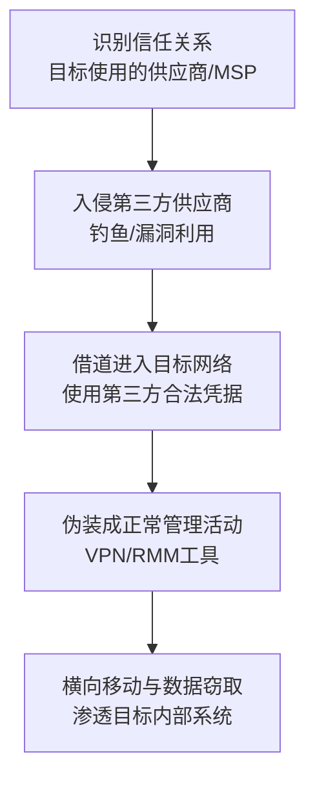

# 信任关系 (T1199) - Trusted Relationship

## 一句话通俗理解

> 攻击者不去直接攻击你，而是先入侵你信得过的"朋友"（供应商、IT服务商），然后借着朋友的身份堂而皇之地进入你的系统。

## 难度等级

- ⭐⭐ **中级**（需要一定基础）——需要了解第三方风险管理和供应链安全

## 技术描述

信任关系（Trusted Relationship）是一种初始访问技术，攻击者通过利用组织与其信任的第三方（如IT服务承包商、托管安全提供商、基础设施承包商等）之间的现有关系来获得对目标网络的未授权访问。

**打个比方**：这种攻击就像是小偷不直接撬你家门，而是先偷了你信任的物业公司的钥匙，然后穿着物业制服大摇大摆地走进你家。因为你信任物业公司，所以不会怀疑这个"工作人员"。

**为什么信任关系是高价值攻击目标**：
- 第三方通常具有**提升的访问权限**（如管理员权限）
- 第三方的访问被视为**合法**，不会触发安全警报
- 入侵一个供应商可以**同时访问多个下游客户**
- 第三方的安全审查可能**不如**目标组织严格

**常见的信任关系类型**：
- **托管服务提供商（MSP）**：管理客户IT基础设施
- **IT外包服务商**：提供技术支持和维护
- **云服务提供商**：托管客户数据和应用
- **软件供应商**：提供企业管理软件
- **合作伙伴/经销商**：具有委托管理权限

## 子技术列表

**该技术没有子技术。**

T1199 在MITRE ATT&CK框架中没有定义子技术。

## 攻击流程

### 典型攻击流程



**步骤详解：**

1. **关系识别**
   - 通俗描述：查清楚目标有哪些"朋友"（供应商）
   - 技术细节：通过OSINT、LinkedIn、企业官网等渠道识别目标的供应商和服务提供商；了解第三方拥有的访问权限类型（VPN接入、RMM工具、委托管理员等）
   - 常用工具：LinkedIn、企业网站分析、Shodan

2. **第三方入侵**
   - 通俗描述：先攻击目标的"朋友"
   - 技术细节：通过鱼叉式钓鱼、漏洞利用、凭据盗窃等手段入侵第三方供应商；获取第三方对目标网络的访问凭据和工具
   - 常用工具：钓鱼套件、Metasploit、Cobalt Strike

3. **借道访问**
   - 通俗描述：穿上"朋友"的外衣进入目标网络
   - 技术细节：使用第三方的合法凭据登录VPN、RMM工具或专用链路访问目标网络；伪装成正常的管理活动，触发更少的安全告警
   - 常用工具：VPN客户端、RMM工具（如ConnectWise）、委托管理员接口

4. **目标网络渗透**
   - 通俗描述：在目标网络里"安营扎寨"
   - 技术细节：在目标网络中进行侦察，定位高价值系统；横向移动到关键系统；窃取数据或部署恶意软件
   - 常用工具：Cobalt Strike、BloodHound、PowerShell Empire

## 真实案例

### 案例1：Salt Typhoon通过电信供应商信任关系攻击（2024-2025年）

- **时间**: 2024年-2025年
- **目标**: 美国政府官员、电信公司客户
- **攻击组织**: Salt Typhoon（中国关联）
- **手法**: 中国关联的Salt Typhoon组织入侵了至少9家美国主要电信公司（包括AT&T、Verizon、T-Mobile），利用电信供应商与其客户之间的信任关系。攻击者利用电信公司对客户通信的合法访问权限，监控了美国政府官员的通信、执法窃听系统和竞选团队的通信。攻击者还利用电信公司与其MSP/供应商之间的信任关系进行横向移动。CISA发布紧急指导，FBI建议使用端到端加密通信。
- **影响**: 被认为是近年来最重大的反情报威胁之一
- **参考链接**: [MITRE ATT&CK T1199](https://attack.mitre.org/techniques/T1199/)

### 案例2：Cloud Hopper行动 - APT10通过MSP攻击下游客户（2014-2017年）

- **时间**: 2014年-2017年
- **目标**: 全球多个行业的组织
- **攻击组织**: APT10（中国关联）
- **手法**: 中国关联的APT10组织实施了Cloud Hopper行动，针对全球托管服务提供商（MSP）。攻击链包括：通过鱼叉式钓鱼、凭据盗窃入侵MSP网络；获得对MSP内部系统和工具（包括RMM平台）的访问权限；利用MSP对客户网络的合法访问权限在客户环境中横向移动。APT10能够同时访问数十个MSP客户的网络，利用MSP的合法凭据和工具掩盖恶意活动。美国司法部在2018年对两名中国公民提出刑事指控。
- **影响**: 数十个MSP客户的网络被入侵
- **参考链接**: [Cloud Hopper - Justice.gov](https://www.justice.gov/opa/pr/two-chinese-hackers-associated-ministry-state-security-charged-global-computer-intrusion)

### 案例3：Office 365委托管理员滥用（持续进行中）

- **时间**: 持续进行中
- **目标**: 使用Microsoft Office 365的组织
- **攻击组织**: 多个威胁组织
- **手法**: 各种威胁组织利用Office 365中的委托管理员关系获得对客户租户的管理控制。攻击链包括：通过钓鱼或凭据盗窃入侵Microsoft合作伙伴或经销商的账户；利用被破坏的合作伙伴的委托管理员关系访问客户租户；配置恶意邮件转发规则、修改安全设置、导出敏感数据。这种攻击特别有效，因为委托管理员关系旨在允许合作伙伴代表客户执行管理任务，恶意活动可能被误认为是合法操作。
- **影响**: 多个组织的云资源被未授权访问
- **参考链接**: [MITRE ATT&CK T1199](https://attack.mitre.org/techniques/T1199/)

## 红队视角

> ⚠️ **免责声明**：以下内容仅用于合法的安全测试、渗透测试和教育目的。未经授权对他人系统进行测试是违法行为。

### 实战技巧

1. **供应商关系映射**
   通过LinkedIn搜索目标组织的IT员工和供应商信息，了解哪些第三方服务商拥有对目标网络的访问权限。关注MSP、IT外包商和云服务合作伙伴。

2. **模拟第三方访问**
   在获得授权的情况下，通过与目标组织的协调，模拟第三方供应商被入侵后的攻击路径。演示第三方访问权限是如何被滥用的。

3. **评估委托管理员风险**
   针对使用Office 365或Azure的组织，评估委托管理员关系的配置和安全状况。检查是否存在过度授权的第三方合作伙伴。

### 常用工具

| 工具名称 | 用途 | 平台 | 链接 |
|----------|------|------|------|
| LinkedIn | 供应商关系OSINT收集 | Web | [LinkedIn](https://www.linkedin.com/) |
| Shodan | 发现第三方暴露的服务 | Web | [Shodan](https://www.shodan.io/) |
| Azure AD PowerShell | 审查委托管理员关系 | 跨平台 | Microsoft文档 |
| BloodHound | Active Directory关系映射 | Windows | [GitHub](https://github.com/BloodHoundAD/BloodHound) |

### 注意事项

- 信任关系攻击通常需要跨组织协调，法律和授权复杂度高
- 确保获得所有相关方（目标组织及其供应商）的书面授权
- 测试过程中注意保护供应商的敏感信息

## 蓝队视角

### 检测要点

1. **第三方访问监控**
   - 日志来源：VPN日志、RMM工具日志、云服务审计日志
   - 关注字段：登录来源IP、账户名称、使用的凭据类型
   - 异常特征：来自第三方网络的访问、异常的登录时间、第三方账户访问了不相关的系统

2. **委托管理员监控**
   - 日志来源：Azure AD审计日志、Office 365统一审计日志
   - 关注字段：委托管理员操作、权限变更、委派关系修改
   - 异常特征：新的委托管理员添加、异常的权限提升、非工作时间的管理操作

3. **RMM工具监控**
   - 日志来源：RMM工具日志、EDR日志
   - 关注字段：远程会话的开始和结束、执行的命令、访问的文件
   - 异常特征：异常的远程会话持续时间、在敏感系统上执行的命令、大量的文件传输

### 监控建议

- 建立第三方风险管理计划，对供应商进行安全评估
- 实施最小权限原则，限制第三方的访问范围
- 使用PAM（特权访问管理）管理第三方访问
- 监控和告警所有的委托管理员活动

## 检测建议

### 网络层检测

**检测方法：** 监控来自第三方网络的异常访问。

**具体规则/命令示例：**
```
# 监控来自已知第三方IP范围的异常访问
# 在SIEM中配置第三方IP白名单并告警非工作时间的访问
```

### 主机层检测

**检测方法：** 监控远程管理工具和委托管理员操作。

**Windows事件ID：**
- 事件ID 4624：登录成功——关注来自第三方网络的登录
- 事件ID 4720：创建新用户——监控第三方账户的创建
- 事件ID 4732：添加到安全组——监控第三方账户被添加到特权组
- 事件ID 4672：分配特殊权限——监控特权登录

**Azure AD日志：**
- 日志类型：Azure AD审计日志
- 关键字段：委托管理员操作、目录角色分配更改

**具体命令示例：**
```powershell
# 查看Azure AD委托管理员关系
Get-AzureADMSAdministrativeUnit | Get-AzureADMSAdministrativeUnitMember

# 查看最近的管理员操作
Search-UnifiedAuditLog -StartDate (Get-Date).AddDays(-7) -Operations "Add delegated administrator"
```

### 应用层检测

**检测方法：** 监控云服务中的委托管理活动。

**Sigma规则示例：**
```yaml
title: 异常的第三方委托管理员活动
status: experimental
description: 检测非工作时间来自第三方委托管理员的异常管理操作
logsource:
    service: azure
    product: azure
detection:
    selection:
        Operation:
            - 'Add member to role'
            - 'Update user'
            - 'Add delegated administrator'
        Time: 'outside business hours'
    condition: selection
level: high
tags:
    - attack.t1199
```

## 缓解措施

### 优先级1：关键措施

**措施名称：** 建立第三方风险管理计划

**具体实施步骤：**
1. 识别所有拥有网络访问权限的第三方供应商
2. 对供应商进行安全评估和分级
3. 在合同中包含安全要求和审计权限

### 优先级2：重要措施

**措施名称：** 实施最小权限和访问控制

**具体实施步骤：**
1. 限制第三方的访问范围到最低必需
2. 为第三方访问实施MFA
3. 使用PAM管理第三方特权访问

**措施名称：** 加强监控和审计

**具体实施步骤：**
1. 记录和监控所有第三方访问活动
2. 定期审查委托管理员关系
3. 建立第三方访问异常告警

### 优先级3：建议措施

**措施名称：** 网络分段和隔离

**具体实施步骤：**
1. 将第三方访问流量与内部用户流量隔离
2. 实施网络分段限制第三方的横向移动
3. 使用跳板机（Jump Server）管理第三方访问

### MITRE ATT&CK 缓解措施映射

| 缓解措施ID | 缓解措施名称 | 适用性 | 说明 |
|------------|-------------|:------:|------|
| M1032 | 多因素认证 | 适用 | 为所有第三方远程访问启用MFA |
| M1026 | 特权访问管理 | 适用 | 使用PAM管理第三方特权访问 |
| M1018 | 用户账户管理 | 适用 | 定期审查第三方账户 |
| M1030 | 网络分段 | 适用 | 隔离第三方访问流量 |
| M1053 | 数据泄露防护 | 部分适用 | 监控第三方对敏感数据的访问 |

## 动手实验

> ⚠️ **重要提示**：所有实验必须在隔离的实验室环境中进行，禁止对未授权的真实系统进行测试。

### 实验环境准备

**推荐靶场/实验平台：**

| 平台名称 | 类型 | 难度 | 链接 |
|----------|------|:----:|------|
| TryHackMe | CTF | 中级 | [THM](https://tryhackme.com/) |
| Hack The Box | 虚拟靶场 | 中级 | [HTB](https://www.hackthebox.com/) |

### 实验1：评估第三方访问风险

**实验目标：** 学习识别和评估第三方访问风险

**实验步骤：**
1. 在测试环境中模拟供应商关系（如MSP管理客户网络）
2. 评估供应商拥有的访问权限范围
3. 分析如果供应商被入侵可能造成的风险
4. 编写第三方风险评估报告

**预期结果：** 完成一份第三方风险评估

**学习要点：** 理解第三方风险管理的流程

### 实验2：监控委托管理员活动

**实验目标：** 学习配置和监控委托管理员活动

**实验步骤：**
1. 在测试Office 365环境中配置委托管理员
2. 配置审计日志记录
3. 模拟委托管理员执行管理操作
4. 分析审计日志，检测潜在恶意活动

**预期结果：** 成功监控到委托管理员的异常活动

**学习要点：** 掌握委托管理员的监控方法

### 实验3：网络分段验证

**实验目标：** 验证网络分段是否能有效限制第三方横向移动

**实验步骤：**
1. 在测试环境中配置网络分段策略
2. 模拟来自第三方网络的访问
3. 测试能否从第三方访问段横向移动到内部系统
4. 评估不同分段策略的效果

**预期结果：** 验证网络分段的有效性

**学习要点：** 深入理解网络分段在防御信任关系攻击中的作用

## 术语解释

| 术语 | 英文原名 | 通俗解释 |
|------|----------|----------|
| MSP | Managed Service Provider | 托管服务提供商，帮你管理和维护IT系统的公司，就像你请的物业公司帮你管理小区设施 |
| RMM | Remote Monitoring and Management | 远程监控和管理工具，MSP用来远程管理客户电脑网络的工具 |
| 委托管理员 | Delegated Administrator | 允许第三方代表你管理部分云服务功能的权限设置，就像你给物业一把备用钥匙方便他们维修 |
| PAM | Privileged Access Management | 特权访问管理，专门管理管理员权限的系统，确保每个管理员只有必要的权限 |
| 第三方风险 | Third-party Risk | 因为信任的供应商或合作伙伴的安全问题而带来的风险 |
| 横向移动 | Lateral Movement | 攻击者在网络内部从一台电脑跳到另一台电脑的技术，就像小偷在房子里各个房间穿梭 |

## 参考资料

### 官方文档

- [MITRE ATT&CK - Trusted Relationship (T1199)](https://attack.mitre.org/techniques/T1199/)
- [CISA - Trusted Relationship (T1199)](https://www.cisa.gov/eviction-strategies-tool/info-attack/T1199)

### 安全报告

- [Cloud Hopper Operation - Justice.gov](https://www.justice.gov/opa/pr/two-chinese-hackers-associated-ministry-state-security-charged-global-computer-intrusion) - APT10通过MSP攻击的起诉文件
- [Salt Typhoon Telecom Hack Analysis](https://attack.mitre.org/techniques/T1199/) - 2024-2025年电信信任关系攻击

### 工具与资源

- [Trusted Relationship - Startup Defense](https://www.startupdefense.io/mitre-attack-techniques/t1199-trusted-relationship) - 信任关系技术详细分析
- [SolarWinds Compromise - CISA](https://www.cisa.gov/eviction-strategies-tool/dialog-content/TMPL0002) - 涉及信任关系的经典案例

### 学习资料

- [Zero Trust Security Model](https://www.nist.gov/publications/zero-trust-architecture) - NIST零信任架构标准
- [Third Party Security Assessment Guide](https://www.cisa.gov/eviction-strategies-tool/dialog-content/TMPL0002) - 第三方安全评估指南
