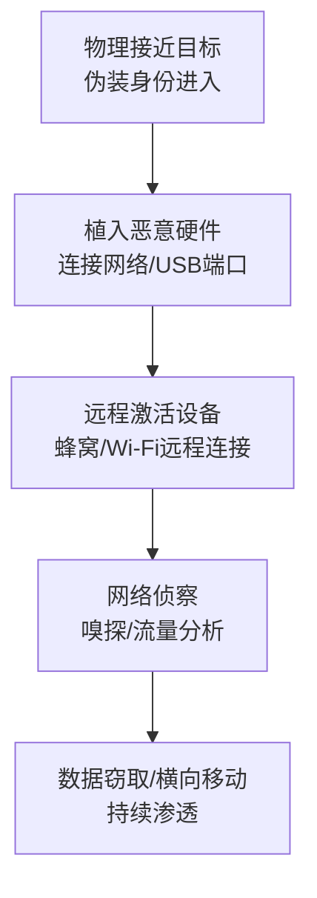

# 硬件添加 (T1200) - Hardware Additions

## 一句话通俗理解

> 攻击者偷偷在你家安装了一个窃听器或后门设备——通过物理方式将恶意硬件植入目标网络中。

## 难度等级

- ⭐⭐⭐ **高级**（需要深入技术知识）——需要物理接触能力、硬件知识和绕过物理安全的技能

## 技术描述

硬件添加（Hardware Additions）是一种初始访问技术，攻击者通过将恶意计算机外设、计算机或网络硬件引入目标系统或网络来获得访问权限。这种技术需要攻击者能够**物理接近目标环境**，无论是通过进入办公大楼、利用供应链还是其他方式。

**打个比方**：如果把网络攻击比作偷东西，硬件添加就像是小偷在你家装了一个隐藏的摄像头或窃听器——他不需要直接偷你的东西，而是通过植入的设备持续监控和访问你的信息。

**攻击者的典型操作流程**：
1. **物理接近**：进入目标办公区域（如伪装成维修人员、访客等）
2. **设备植入**：将恶意硬件设备连接到目标网络
3. **远程激活**：通过蜂窝网络、Wi-Fi或互联网远程激活设备
4. **持续访问**：利用植入设备进行网络侦察、数据窃取或作为跳板

**常见的恶意硬件设备**：
- **网络植入设备**：如Pwn Plug，可以捕获网络流量、建立VPN隧道
- **键盘注入设备**：如BadUSB、Rubber Ducky，自动注入恶意键盘输入
- **无线接入点**：创建隐蔽的无线网络入口
- **网络嗅探设备**：捕获网络流量中的敏感信息
- **恶意USB线缆**：如O.MG Cable，外观与普通线缆无异但内置恶意芯片

**为什么这种攻击需要高度警惕**：
- 绕过几乎所有基于网络的安全控制（防火墙、IDS等）
- 恶意流量从内部网络生成，看起来像正常流量
- 物理安全往往比网络安全更容易被忽视
- 设备可能长期不被发现

## 子技术列表

**该技术没有子技术。**

T1200 在MITRE ATT&CK框架中没有定义子技术。

## 攻击流程

### 典型攻击流程



**步骤详解：**

1. **侦察阶段**
   - 通俗描述：了解目标办公环境，找好"藏东西"的位置
   - 技术细节：了解目标的物理布局和安保措施（门禁、摄像头、保安巡逻路线）；确定最佳的植入位置（空闲的网络端口、USB端口、隐蔽角落）；准备恶意硬件设备
   - 常用工具：Google Maps街景、OSINT、物理踩点

2. **物理植入**
   - 通俗描述：趁人不注意把设备"藏"到目标位置
   - 技术细节：通过社会工程学进入目标区域（伪装成IT维修人员、清洁工、送货员等）；将设备连接到网络端口或USB端口；确保设备隐蔽（如藏在桌子下面、机柜中、天花板吊顶内）
   - 常用工具：Pwn Plug、Raspberry Pi、Bash Bunny

3. **远程激活**
   - 通俗描述：从远程激活植入的设备
   - 技术细节：通过蜂窝网络（3G/4G/5G）、Wi-Fi或互联网连接到植入设备；配置设备的网络参数和攻击载荷；测试设备的功能和隐蔽性
   - 常用工具：SSH、反向Shell、C2框架

4. **攻击执行**
   - 通俗描述：通过植入的设备执行攻击
   - 技术细节：进行网络嗅探和流量分析（捕获密码、邮件等）；注入键盘输入执行命令（如创建后门账户、修改配置）；建立到内部网络的隐蔽通道；作为横向移动的跳板
   - 常用工具：Wireshark、tcpdump、Metasploit

## 真实案例

### 案例1：DarkVishnya针对金融机构的硬件植入攻击（2018年）

- **时间**: 2018年
- **目标**: 东欧多家银行和金融机构
- **攻击组织**: DarkVishnya
- **手法**: DarkVishnya组织通过物理方式将恶意硬件设备连接到目标银行的内部网络。该组织使用了三类设备：Bash Bunny（USB攻击平台）、Raspberry Pi（单板计算机）和廉价笔记本电脑。这些设备配备蜂窝调制解调器，为攻击者提供了独立于组织互联网连接的内部网络远程访问途径。攻击者能够远程探索IT基础设施、拦截密码和敏感信息。
- **影响**: 多家东欧银行被入侵，造成重大经济损失
- **参考链接**: [DarkVishnya - Kaspersky](https://www.kaspersky.com/blog/dark-vishnya-attack/24867/)

### 案例2：恶意USB设备攻击活动（2022-2024年）

- **时间**: 2022年-2024年
- **目标**: 各种行业的组织
- **攻击组织**: 多个犯罪组织
- **手法**: 攻击者利用伪装成普通USB键盘的恶意设备进行攻击。这些设备内部包含可编程微控制器，插入计算机时会自动注入预编程的键盘输入序列。攻击链包括：在供应链中替换或改装USB设备；将恶意设备分发给目标组织；当用户插入设备时自动执行恶意命令（如启动命令提示符、下载恶意载荷、创建后门账户）。这种攻击特别危险，因为它完全绕过了许多安全意识培训和技术控制。
- **影响**: 多个企业环境被入侵
- **参考链接**: [MITRE ATT&CK T1200](https://attack.mitre.org/techniques/T1200/)

### 案例3：Flipper Zero等硬件攻击工具的普及（2024-2025年）

- **时间**: 2024年-2025年
- **目标**: 各种组织，特别是物理安全薄弱的组织
- **攻击组织**: 各类攻击者
- **手法**: Flipper Zero等便携式硬件攻击工具的普及使得硬件添加攻击变得更加容易和便宜。这些设备可以模拟各种无线协议（RFID、NFC、Sub-GHz等）和USB设备，用于注入键盘输入、克隆门禁卡、干扰无线信号等。虽然Flipper Zero有合法的安全测试用途，但也降低了恶意硬件攻击的门槛，使得更多攻击者能够利用物理手段入侵。
- **影响**: 物理安全威胁面显著扩大
- **参考链接**: [Flipper Zero Official](https://flipperzero.one/)

## 红队视角

> ⚠️ **免责声明**：以下内容仅用于合法的安全测试、渗透测试和教育目的。未经授权对他人系统进行测试是违法行为。

### 实战技巧

1. **选择合适的植入设备**
   根据测试场景选择合适的设备：Rubber Ducky适合键盘注入攻击，Bash Bunny支持多阶段攻击，Pwn Plug适合长期网络植入，Raspberry Pi Zero尺寸小巧适合隐蔽部署。

2. **社会工程学进入目标**
   硬件植入最难的部分是物理接触。可以伪装成IT维修人员、消防检查员、快递员等身份进入目标办公区域。提前准备制服、工牌和合理的话术。

3. **隐蔽部署技巧**
   将植入设备伪装成常见物品（如充电器、网络交换机、接线盒），放置在不起眼的位置（如机柜底部、吊顶上方、桌子下面）。

### 常用工具

| 工具名称 | 用途 | 平台 | 链接 |
|----------|------|------|------|
| Rubber Ducky | USB键盘注入攻击工具 | USB设备 | [Hak5](https://shop.hak5.org/products/usb-rubber-ducky) |
| Bash Bunny | 多载荷USB攻击平台 | USB设备 | [Hak5](https://shop.hak5.org/products/bash-bunny) |
| Pwn Plug | 网络植入设备，建立隐蔽通道 | 网络设备 | [Pwnie Express](https://pwnieexpress.com/) |
| Flipper Zero | 多功能便携式硬件攻击工具 | 手持设备 | [Flipper](https://flipperzero.one/) |
| O.MG Cable | 外观正常的恶意USB线缆 | USB线缆 | [O.MG](https://o.mg.lol/) |
| Raspberry Pi | 低成本网络植入平台 | 单板计算机 | [Raspberry Pi](https://www.raspberrypi.com/) |

### 注意事项

- 硬件攻击涉及物理侵入，法律风险极高，必须获得明确的书面授权
- 测试结束后必须回收所有植入设备，防止造成实际损害
- 注意不要损坏目标设备或网络设施
- 遵守测试时间窗口，避免在业务时间进行

## 蓝队视角

### 检测要点

1. **物理安全监控**
   - 日志来源：门禁系统日志、访客登记系统、监控摄像头
   - 关注字段：未授权区域的访问、非工作时间的访客、设备进出记录
   - 异常特征：频繁的访客进出、在非工作时间进入机房或弱电间

2. **网络设备监控**
   - 日志来源：网络设备日志、NAC（网络访问控制）系统
   - 关注字段：新MAC地址、新IP地址、DHCP请求
   - 异常特征：网络中突然出现未知设备、未通过802.1X认证的设备

3. **USB设备监控**
   - 日志来源：Windows事件日志、Sysmon日志
   - 关注字段：USB设备插入事件、设备ID、序列号
   - 异常特征：新出现的未知USB设备、HID设备的异常使用模式

### 监控建议

- 实施严格的物理访问控制和访客管理
- 使用802.1X网络访问控制，阻止未授权设备接入网络
- 部署无线入侵检测系统（WIDS）
- 定期进行物理安全审计

## 检测建议

### 网络层检测

**检测方法：** 监控网络中新出现的未知设备。

**具体规则/命令示例：**
```
# 检测新的MAC地址接入网络
# 使用DHCP日志或ARP表监控
```

### 主机层检测

**检测方法：** 监控USB设备插入和异常进程创建。

**Windows事件ID：**
- 事件ID 4663：尝试访问某个对象——监控USB设备访问
- Sysmon事件ID 11：文件创建——监控USB设备上的文件活动
- Sysmon事件ID 1：进程创建——监控异常的USB相关进程
- 事件ID 6420：设备枚举——新设备接入系统

**Linux日志：**
- 日志文件：/var/log/syslog 或 /var/log/messages
- 关键字段：USB插入消息、新设备枚举

**具体命令示例：**
```bash
# 监控USB设备插入（Linux）
dmesg | grep -i "usb" | grep "New USB device"

# 查看系统识别的USB设备
lsusb
```

### 应用层检测

**检测方法：** 监控异常的键盘输入和进程创建。

**Sigma规则示例：**
```yaml
title: 可疑的USB键盘注入攻击
status: experimental
description: 检测短时间内大量键盘输入后创建可疑进程，可能表示USB键盘注入攻击
logsource:
    category: process_creation
    product: windows
detection:
    selection:
        ParentImage|endswith: '\svchost.exe'
        CommandLine|contains:
            - 'powershell'
            - 'cmd'
            - 'bitsadmin'
    condition: selection
level: high
tags:
    - attack.t1200
```

## 缓解措施

### 优先级1：关键措施

**措施名称：** 实施严格的物理访问控制

**具体实施步骤：**
1. 使用门禁系统控制所有机房和网络设备区域的访问
2. 实施访客登记和陪同制度
3. 在关键区域部署监控摄像头

### 优先级2：重要措施

**措施名称：** 部署网络访问控制（NAC）

**具体实施步骤：**
1. 在全网部署802.1X认证
2. 配置DHCP snooping和动态ARP检测
3. 使用MAC地址白名单控制设备接入

**措施名称：** USB端口管控

**具体实施步骤：**
1. 使用组策略禁用不必要的USB端口
2. 对敏感系统的USB端口使用物理封堵
3. 实施USB设备白名单策略

### 优先级3：建议措施

**措施名称：** 定期物理安全审计

**具体实施步骤：**
1. 定期检查网络端口和USB端口是否有未经授权的设备
2. 使用网络发现工具扫描网络中未知设备
3. 进行物理安全渗透测试

### MITRE ATT&CK 缓解措施映射

| 缓解措施ID | 缓解措施名称 | 适用性 | 说明 |
|------------|-------------|:------:|------|
| M1034 | 软件限制策略 | 部分适用 | 限制从可移动介质执行程序 |
| M1028 | 操作系统配置 | 部分适用 | 禁用不必要的USB端口 |
| M1030 | 网络分段 | 适用 | 使用802.1X控制设备网络接入 |
| M1026 | 特权访问管理 | 部分适用 | 限制管理接口的访问 |
| M1017 | 用户培训 | 适用 | 培训员工识别可疑硬件设备 |

## 动手实验

> ⚠️ **重要提示**：所有实验必须在隔离的实验室环境中进行，禁止对未授权的真实系统进行测试。

### 实验环境准备

**推荐靶场/实验平台：**

| 平台名称 | 类型 | 难度 | 链接 |
|----------|------|:----:|------|
| TryHackMe - Physical | CTF | 中级 | [THM](https://tryhackme.com/) |
| VulnHub | VM | 中级 | [VulnHub](https://www.vulnhub.com/) |

**所需工具：**
- Kali Linux
- Flipper Zero（可选）
- Rubber Ducky（可选）
- Raspberry Pi（可选）

### 实验1：使用Rubber Ducky进行键盘注入（仅供学习）

**实验目标：** 理解USB键盘注入攻击的原理

**实验步骤：**
1. 准备一个Rubber Ducky或类似的HID攻击设备
2. 编写DuckyScript攻击脚本
3. 在测试Windows虚拟机上插入设备
4. 观察自动执行的命令

**预期结果：** USB设备自动执行预设的命令序列

**学习要点：** 理解HID设备攻击的工作原理

### 实验2：网络访问控制配置

**实验目标：** 学习配置802.1X网络访问控制

**实验步骤：**
1. 搭建支持802.1X的网络环境（如FreeRADIUS）
2. 配置认证策略
3. 测试未授权设备的网络接入
4. 验证NAC的控制效果

**预期结果：** 未授权的网络设备被阻止接入

**学习要点：** 掌握802.1X配置方法

### 实验3：物理安全评估

**实验目标：** 学习进行物理安全评估

**实验步骤：**
1. 对测试办公环境进行物理安全评估
2. 识别潜在的硬件植入风险点（未锁门的机柜、暴露的网络端口）
3. 提出物理安全改进建议
4. 编写物理安全评估报告

**预期结果：** 发现物理安全漏洞并提出改进方案

**学习要点：** 掌握物理安全评估的方法和流程

## 术语解释

| 术语 | 英文原名 | 通俗解释 |
|------|----------|----------|
| HID攻击 | HID Attack | 利用人机接口设备（如键盘）的信任关系进行攻击，电脑默认信任键鼠，攻击者就利用这个信任伪装成键盘输入恶意指令 |
| Rubber Ducky | Rubber Ducky | 一款伪装成普通U盘的键盘注入攻击工具，插上电脑后会自动"打字"执行预设的攻击命令 |
| 802.1X | IEEE 802.1X | 网络设备认证协议，设备想上网必须先"验明正身"，就像住酒店先要出示身份证 |
| NAC | Network Access Control | 网络访问控制，确保只有授权设备才能接入网络的系统 |
| DMA | Direct Memory Access | 直接内存访问，允许设备绕过CPU直接读写内存的技术，可以被利用来窃取内存中的密码 |
| 投递攻击 | Drop Attack | 将恶意硬件设备偷偷放置在目标网络中的攻击方式 |
| O.MG Cable | O.MG Cable | 外观正常的USB线缆，内部隐藏了恶意芯片，可以远程控制或注入攻击载荷 |

## 参考资料

### 官方文档

- [MITRE ATT&CK - Hardware Additions (T1200)](https://attack.mitre.org/techniques/T1200/)
- [CISA - Hardware Additions (T1200)](https://www.cisa.gov/eviction-strategies-tool/info-attack/T1200)

### 安全报告

- [DarkVishnya - Kaspersky](https://www.kaspersky.com/blog/dark-vishnya-attack/24867/) - 东欧银行硬件植入攻击详细分析
- [Pwn Plug - Ars Technica](https://arstechnica.com/information-technology/2012/03/the-pwn-plug-is-a-little-white-box-that-can-hack-your-network/) - Pwn Plug网络植入设备分析

### 工具与资源

- [Hak5 USB Rubber Ducky](https://shop.hak5.org/products/usb-rubber-ducky) - USB键盘注入工具
- [Flipper Zero Official](https://flipperzero.one/) - 多功能便携式硬件攻击工具
- [O.MG Cable](https://o.mg.lol/) - 恶意USB线缆
- [Raspberry Pi](https://www.raspberrypi.com/) - 低成本网络植入平台

### 学习资料

- [USB Attack Methods Guide](https://arstechnica.com/information-technology/2012/03/the-pwn-plug-is-a-little-white-box-that-can-hack-your-network/) - USB攻击技术指南
- [Physical Security Assessment Guide](https://www.kaspersky.com/blog/dark-vishnya-attack/24867/) - 物理安全评估指南
