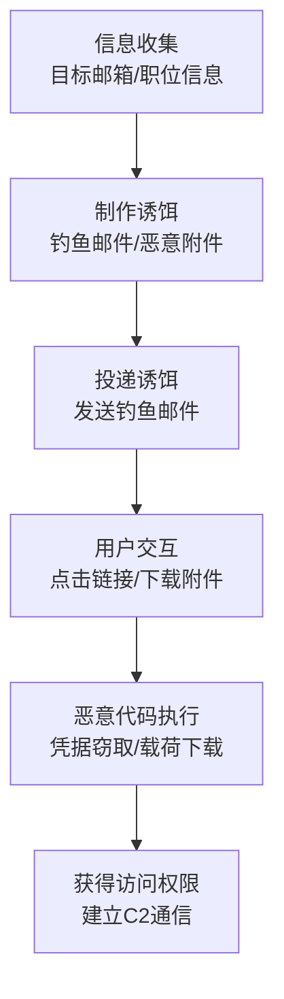

# 钓鱼 (T1566) - Phishing

## 一句话通俗理解

> 攻击者用"诱饵"骗你上钩——一封看起来很真的邮件、一个假装是老板的电话、一条紧急的短信，让你点击链接或下载附件，从而中招。

## 30秒速查卡

| 维度 | 你需要知道的 |
|------|-------------|
| 这是什么？ | 攻击者通过欺骗性邮件、短信、电话或社交媒体消息，冒充可信来源诱骗你点击恶意链接、下载恶意附件或泄露敏感信息 |
| 为什么危险？ | 成功率最高——不需要技术漏洞，利用的是人性弱点（好奇心、恐惧、紧迫感），每年数据泄露的头号原因 |
| 谁需要关心？ | 所有组织和个人——特别是财务人员、高管、IT管理员等高价值目标 |
| 你的第一步防御 | 部署邮件认证（SPF/DKIM/DMARC）和邮件安全网关，阻止假冒邮件进入收件箱 |
| 如果只做一件事 | 开展员工安全意识培训，让每个人记住"不点击不明链接、不打开陌生附件、不轻易透露信息" |

## 难度等级

- ⭐ **初级**（新手可学）——概念简单，工具成熟，不需要高深技术知识

## 前置知识检查

**读这个文件需要什么？**

- [ ] 邮件系统基础：知道什么是发件人地址、SPF/DKIM/DMARC认证（就像知道快递包裹上的"寄件人"可以被伪造）
- [ ] 社会工程学概念：理解攻击者如何利用人性弱点（权威、紧迫感、好奇心）操纵行为（就像知道骗子会冒充"银行客服"让你转账）
- [ ] 恶意附件识别：知道Office文档中的宏（Macro）可以执行代码（就像知道一个看似普通的"表格文件"可能藏着"定时炸弹"）

## 技术描述

**过渡段：** "假快递包裹"这个比喻抓住了钓鱼的核心——欺骗性投递，但现实中的钓鱼花样远不止于此。攻击者不会只在你家门口放一个假包裹，他们会研究你的作息、冒充你信任的人、利用你最忙碌的时刻精准出击。从批量群发的"广撒网"邮件到针对CEO的深度伪造语音电话，从冒充电商客服的短信到在LinkedIn上冒充猎头发消息，钓鱼的形式在不断演变。更重要的是，2025年的钓鱼攻击已经结合了AI深度伪造、OAuth同意欺骗和MFA绕过等技术手段，让传统的"看网址对不对"的防御方法失效。下面我们来深入分析。

钓鱼（Phishing）是一种初始访问技术，攻击者通过欺骗性的电子通信来诱使用户泄露敏感信息、下载恶意软件或授予未授权的访问权限。这是**最常见的初始访问技术**，也是成功率最高的攻击手段之一。

**打个比方**：钓鱼就像是骗子在你家门口放了一个假的快递包裹——你打开包裹，里面的东西就开始偷你的信息或者在你家装监控。

**钓鱼的主要形式**：
- **邮件钓鱼**：最常见，通过欺骗性邮件诱导点击链接或下载附件
- **语音钓鱼（Vishing）**：通过电话进行社会工程学攻击
- **短信钓鱼（Smishing）**：通过短信发送恶意链接
- **社交媒体钓鱼**：通过社交平台发送恶意消息
- **鱼叉式钓鱼**：针对特定个人或组织的精准钓鱼

**攻击者的典型操作流程**：
1. **信息收集**：收集目标的邮箱、职位、兴趣等信息
2. **制作诱饵**：编写看似合法的邮件、制作钓鱼网站
3. **投递诱饵**：发送钓鱼邮件/消息
4. **等待上钩**：等待目标点击链接或下载附件
5. **执行攻击**：利用恶意附件/链接执行攻击载荷
6. **获得控制**：获得目标系统的访问权限

**为什么钓鱼如此有效**：
- 利用人性的弱点（好奇心、恐惧、紧迫感）
- 技术门槛低，工具容易获取
- 可以绕过许多技术防护措施
- 攻击面广，可以针对任何人

## 子技术列表

**该技术共有 4 个子技术：**

| 子技术ID | 中文名称 | 通俗解释 |
|----------|----------|----------|
| T1566.001 | 鱼叉式钓鱼附件 | 通过恶意附件（如带宏的Office文档、PDF）投递恶意软件 |
| T1566.002 | 鱼叉式钓鱼链接 | 通过恶意链接诱导用户访问钓鱼网站或下载恶意软件 |
| T1566.003 | 通过服务进行鱼叉式钓鱼 | 利用第三方服务（如社交媒体、个人邮箱）发送钓鱼消息 |
| T1566.004 | 鱼叉式钓鱼语音（Vishing） | 通过语音电话进行社会工程学攻击 |

<details>
<summary><strong>展开查看各子技术详细说明</strong></summary>

各子技术详细说明请参阅独立文档：

- [T1566.001 - 鱼叉式钓鱼附件](./T1566/T1566.001-Spearphishing-Attachment.md) — 发一封带"毒"附件的邮件，你打开附件就中招了。
- [T1566.002 - 鱼叉式钓鱼链接](./T1566/T1566.002-Spearphishing-Link.md) — 发一条链接让你点，点进去要么是假网站偷你密码，要么自动下载病毒。
- [T1566.003 - 通过服务进行鱼叉式钓鱼](./T1566/T1566.003-Spearphishing-via-Service.md) — 通过你常用的社交平台（微信、LinkedIn）发钓鱼消息。
- [T1566.004 - 鱼叉式钓鱼语音（Vishing）](./T1566/T1566.004-Spearphishing-Voice.md) — 打电话冒充老板/IT支持，骗你透露密码或进行操作。

</details>

## 攻击流程

### 典型攻击流程



**步骤详解：**

1. **侦察阶段**
   - 通俗描述：了解目标是谁、做什么工作、用什么邮箱
   - 技术细节：收集目标的邮箱地址、职位、工作内容；了解目标组织的业务流程和常用工具；确定最佳的攻击时机和诱饵主题（如财务相关的月末、报税季）
   - 常用工具：theHarvester、Hunter.io、LinkedIn

2. **诱饵制作**
   - 通俗描述：制作"鱼饵"——看起来像真的邮件或网站
   - 技术细节：编写看似合法的邮件内容（模仿公司内部邮件风格）；制作恶意附件（如带宏的Office文档、HTA文件）；搭建钓鱼网站，注册相似的域名（如rnicrosoft.com代替microsoft.com）
   - 常用工具：GoPhish、SET、Evilginx2

3. **投递阶段**
   - 通俗描述：把"鱼饵"扔出去
   - 技术细节：发送钓鱼邮件；使用邮件欺骗技术（伪造发件人地址）绕过SPF/DKIM检测；可能使用被入侵的合法邮箱发送增加可信度
   - 常用工具：SMTP服务器、邮件群发工具

4. **利用阶段**
   - 通俗描述：目标"咬钩"了
   - 技术细节：用户打开恶意附件→宏执行→下载恶意软件；或点击链接→输入凭据→凭据被窃取；或点击链接→触发浏览器漏洞→下载恶意软件
   - 常用工具：Cobalt Strike、Metasploit

5. **后渗透**
   - 通俗描述：得手后进一步操作
   - 技术细节：建立C2通信；进行信息收集和横向移动；部署持久化机制
   - 常用工具：Cobalt Strike、PowerShell Empire

## 真实案例

### 案例1：AI深度伪造语音钓鱼攻击（2024-2025年）

- **时间**: 2024年-2025年
- **目标**: 全球各行业组织的高管和财务人员
- **攻击组织**: 多个犯罪组织
- **手法**: 攻击者使用AI深度伪造（Deepfake）技术生成高管的语音，进行语音钓鱼（Vishing）攻击。典型案例包括：冒充CEO打电话给CFO要求紧急转账；冒充IT支持人员获取员工凭据；在视频会议中使用实时深度伪造冒充高管。深度伪造欺诈尝试在2024-2025年同比增长了数百个百分点。这种攻击特别危险，因为语音和视频看起来/听起来完全真实。
- **影响**: 多家公司因深度伪造语音诈骗遭受重大财务损失
- **参考链接**: [MITRE ATT&CK T1566](https://attack.mitre.org/techniques/T1566/)

### 案例2：Black Basta利用Microsoft Teams的社会工程学攻击（2024年）

- **时间**: 2024年
- **目标**: 全球各行业组织
- **攻击组织**: Black Basta勒索软件团伙
- **手法**: Black Basta团伙采用了一种新型的社会工程学策略：先用数百封垃圾邮件"轰炸"目标用户，然后通过Microsoft Teams冒充IT帮助台联系目标。攻击者使用伪造的Microsoft Entra ID租户或入侵的租户，以"Help Desk"或"Support Team"的显示名称发起Teams聊天，诱骗用户安装Quick Assist或AnyDesk等远程管理工具，从而获得初始访问权限。这种攻击结合了邮件轰炸和语音/文字钓鱼，成功率很高。
- **影响**: 多个组织被Black Basta勒索软件加密
- **参考链接**: [ReliaQuest 2025 Annual Threat Report](https://resources.reliaquest.com/image/upload/v1740433607/Website/2025-ReliaQuest-Annual-Threat-Report.pdf)

### 案例3：思科语音钓鱼数据泄露事件（2025年）

- **时间**: 2025年8月
- **目标**: 思科客户
- **攻击组织**: 网络犯罪分子
- **手法**: 一名网络罪犯通过语音钓鱼攻击（Vishing）诱骗了一名思科代表授予其访问权限，从而窃取了思科.com用户的个人信息。被盗数据包括客户的姓名、组织名称、地址、思科分配的用户ID、电子邮件地址、电话号码以及与账户相关的元数据。此事件凸显了语音钓鱼作为初始访问向量日益增长的威胁。
- **影响**: 思科客户个人信息被泄露
- **参考链接**: [Cisco Vishing Attack - TechCrunch](https://techcrunch.com/2025/08/05/hacker-used-a-voice-phishing-attack-to-steal-cisco-customers-personal-information)

### 案例4：OAuth同意欺骗钓鱼攻击（2021-2025年，持续进行）

- **时间**: 2021年-2025年
- **目标**: 使用云服务的组织
- **攻击组织**: 多个威胁组织
- **手法**: 多个威胁组织利用鱼叉式钓鱼链接执行OAuth同意欺骗攻击。攻击者发送看似合法的电子邮件，包含指向恶意OAuth授权页面的链接。当受害者批准同意请求时，攻击者获得访问令牌，提供对受害者电子邮件、文件和其他云资源的API级访问权限。这种技术特别危险，因为它绕过了传统的凭据盗窃检测，并且在密码重置后仍然有效。
- **影响**: 多个组织的云资源被未授权访问
- **参考链接**: [Spearphishing Link - CISA](https://www.cisa.gov/eviction-strategies-tool/info-attack/T1566.002)

## 红队视角

> ⚠️ **免责声明**：以下内容仅用于合法的安全测试、渗透测试和教育目的。未经授权对他人系统进行测试是违法行为。

### 实战技巧

1. **使用GoPhish搭建钓鱼演练平台**
   GoPhish是开源钓鱼演练平台，支持创建邮件模板、配置发送设置、跟踪打开率和点击率。在红队评估中，可以使用GoPhish模拟钓鱼攻击测试员工安全意识。

2. **个性化邮件提高成功率**
   根据OSINT收集的目标信息（职位、兴趣爱好、当前项目）定制邮件内容。个性化程度越高，目标点击链接的概率越大。比如了解目标正在参与某个行业会议，可以伪装成会议邀请。

3. **使用Evilginx2绕过MFA**
   Evilginx2是一个中间人钓鱼框架，可以代理目标网站（如Office 365、Google Workspace），在用户输入凭据时实时窃取会话令牌。即使用户启用了MFA，攻击者也可以通过窃取的会话令牌绕过。

### 常用工具

| 工具名称 | 用途 | 平台 | 链接 |
|----------|------|------|------|
| GoPhish | 开源钓鱼演练平台 | 跨平台 | [GoPhish](https://getgophish.com/) |
| Evilginx2 | 中间人钓鱼框架，窃取会话令牌 | Linux | [GitHub](https://github.com/kgretzky/evilginx2) |
| SET | 社会工程学工具包 | Kali Linux | [GitHub](https://github.com/trustedsec/social-engineer-toolkit) |
| MacroPack | Office宏恶意文档生成器 | Windows | [GitHub](https://github.com/sevagas/macro_pack) |
| theHarvester | OSINT信息收集工具 | 跨平台 | [GitHub](https://github.com/laramies/theHarvester) |

### 注意事项

- 必须获得被测试组织的书面授权
- 避免使用可能造成实际损害的载荷
- 遵守隐私保护法规，不要收集或存储个人敏感信息
- 测试结束后彻底清理所有基础设施

## 蓝队视角

### 检测要点

1. **邮件认证检测**
   - 日志来源：邮件安全网关日志、邮件服务器日志
   - 关注字段：SPF/DKIM/DMARC验证结果、发件人地址、邮件头信息
   - 异常特征：SPF/DKIM验证失败的发件人、发件人显示名称与邮箱地址不匹配、Reply-To地址与发件人地址不同

2. **用户行为监控**
   - 日志来源：EDR日志、Web代理日志
   - 关注字段：异常的链接点击、文件下载、凭据输入
   - 异常特征：员工访问新注册域名、在高风险网站输入凭据、异常的附件打开行为

3. **终端行为检测**
   - 日志来源：EDR日志、Sysmon日志
   - 关注字段：Office进程启动脚本引擎、浏览器启动其他程序
   - 异常特征：winword.exe启动cmd.exe或powershell.exe、浏览器执行下载的文件

### 监控建议

- 部署邮件安全网关实施SPF/DKIM/DMARC验证
- 定期进行模拟钓鱼演练
- 建立快速报告钓鱼邮件的机制（如"报告钓鱼"按钮）
- 部署EDR监控终端行为

## 检测建议

### 网络层检测

**检测方法：** 监控邮件流量和用户网络访问行为。

**具体规则/命令示例：**
```
# Suricata规则 - 检测已知钓鱼域名访问
alert http $HOME_NET any -> $EXTERNAL_NET any (msg:"钓鱼网站访问检测"; flow:to_server; content:"login"; nocase; sid:1000005; rev:1;)
```

### 主机层检测

**检测方法：** 监控Office文档执行脚本引擎等可疑行为。

**Windows事件ID：**
- 事件ID 4688：进程创建——监控Office程序启动cmd.exe/powershell.exe
- Sysmon事件ID 1：进程创建——详细进程树监控
- Sysmon事件ID 13：注册表更改——监控Office安全设置更改
- 事件ID 11：文件创建——监控恶意文件下载

**Linux日志：**
- 日志文件：邮件服务器日志、Web代理日志
- 关键字段：收件人、发件人、附件类型、链接URL

**具体命令示例：**
```bash
# 检测Office进程启动可疑子进程
Get-WinEvent -FilterHashtable @{LogName='Microsoft-Windows-Sysmon/Operational'; ID=1} | 
Where-Object { $_.Properties[4].Value -like '*winword.exe' -and $_.Properties[5].Value -like '*powershell.exe' }
```

### 应用层检测

**检测方法：** 监控邮件安全网关的告警。

**Sigma规则示例：**
```yaml
title: 包含恶意附件的鱼叉式钓鱼邮件
status: experimental
description: 检测包含可疑附件的邮件，附件可能包含恶意宏或脚本
logsource:
    category: email
    product: generic
detection:
    selection:
        Attachments|endswith:
            - '.docm'
            - '.xlsm'
            - '.pptm'
            - '.hta'
            - '.js'
            - '.vbs'
    condition: selection
level: medium
tags:
    - attack.t1566
```

## 缓解措施

### 优先级1：关键措施

**措施名称：** 实施邮件认证协议

**具体实施步骤：**
1. 配置SPF记录，指定哪些服务器可以发送企业邮件
2. 配置DKIM签名，验证邮件内容完整性
3. 配置DMARC策略，定义未通过认证的邮件处理方式（隔离/拒收）

**配置示例：**
```dns
# SPF记录示例
example.com TXT "v=spf1 include:spf.protection.outlook.com -all"

# DMARC记录示例
_dmarc.example.com TXT "v=DMARC1; p=quarantine; rua=mailto:dmarc@example.com"
```

### 优先级2：重要措施

**措施名称：** 部署邮件安全网关

**具体实施步骤：**
1. 评估和选择邮件安全网关方案（如Proofpoint、Mimecast、Microsoft Defender for Office 365）
2. 配置附件过滤规则，阻止高风险附件类型
3. 启用URL保护功能，实时检查邮件中的链接

**措施名称：** 安全意识培训

**具体实施步骤：**
1. 定期进行钓鱼安全意识培训
2. 每季度开展模拟钓鱼演练
3. 将演练结果纳入员工安全考核

### 优先级3：建议措施

**措施名称：** 终端安全加固

**具体实施步骤：**
1. 配置Office宏安全设置，阻止默认启用宏
2. 使用应用白名单限制脚本执行
3. 部署EDR并配置钓鱼相关的检测规则

### MITRE ATT&CK 缓解措施映射

| 缓解措施ID | 缓解措施名称 | 适用性 | 说明 |
|------------|-------------|:------:|------|
| M1032 | 多因素认证 | 适用 | 即使凭据被钓鱼窃取，MFA可阻止账户被滥用 |
| M1017 | 用户培训 | 适用 | 培训用户识别钓鱼邮件 |
| M1021 | Web过滤 | 适用 | 阻止访问已知钓鱼网站 |
| M1042 | 禁用或移除功能 | 适用 | 禁用Office宏、移除不必要的脚本引擎 |
| M1031 | 网络入侵防御 | 适用 | 部署邮件安全网关 |

## 动手实验

> ⚠️ **重要提示**：所有实验必须在隔离的实验室环境中进行，禁止对未授权的真实系统进行测试。

### 实验环境准备

**推荐靶场/实验平台：**

| 平台名称 | 类型 | 难度 | 链接 |
|----------|------|:----:|------|
| GoPhish | 自建平台 | 初级 | [GoPhish](https://getgophish.com/) |
| TryHackMe - Phishing | CTF | 初级 | [THM](https://tryhackme.com/) |

**所需工具：**
- Kali Linux
- GoPhish：钓鱼演练平台
- SET：社会工程学工具包

### 实验1：使用GoPhish搭建钓鱼演练平台

**实验目标：** 学会搭建和管理钓鱼演练

**实验步骤：**
1. 安装GoPhish `wget https://github.com/gophish/gophish/releases/download/vX.X.X/gophish-vX.X.X-linux-64bit.zip`
2. 配置GoPhish管理界面和发送设置
3. 创建钓鱼邮件模板和登录页面
4. 创建用户组和目标列表
5. 启动钓鱼演练并监控结果

**预期结果：** 成功发送钓鱼邮件并跟踪打开率和点击率

**学习要点：** 掌握钓鱼演练的完整流程

### 实验2：制作恶意Office文档（仅供学习）

**实验目标：** 理解恶意宏的工作原理

**实验步骤：**
1. 使用MacroPack创建带宏的Office文档
2. 编写模拟的载荷（如弹窗消息，不含实际恶意代码）
3. 配置宏在新版Office中的绕过方法
4. 测试宏在禁用宏设置下的行为

**预期结果：** 创建并测试了包含宏的文档

**学习要点：** 理解Office宏攻击的原理和防御方法

### 实验3：搭建Evilginx2中间人钓鱼平台

**实验目标：** 了解中间人钓鱼和MFA绕过原理

**实验步骤：**
1. 在测试服务器上安装Evilginx2
2. 配置针对Office 365的钓鱼页面
3. 在测试环境中演示用户登录过程
4. 观察窃取的会话令牌
5. 学习如何检测此类攻击

**预期结果：** 成功演示MFA绕过

**学习要点：** 理解中间人钓鱼的攻击原理和防御方法

## 术语解释

| 术语 | 英文原名 | 通俗解释 |
|------|----------|----------|
| 钓鱼 | Phishing | 用假信息欺骗用户上当的攻击方式，就像钓鱼人用鱼饵骗鱼上钩 |
| 鱼叉式钓鱼 | Spear Phishing | 针对特定个人或组织的精准钓鱼，不是广撒网而是"盯准一个人" |
| 语音钓鱼 | Vishing | 通过电话实施的社会工程学攻击，骗子冒充银行客服等角色套取信息 |
| 短信钓鱼 | Smishing | 通过短信发送恶意链接的钓鱼攻击 |
| 深度伪造 | Deepfake | 用人工智能生成的逼真假视频或假声音，可以冒充任何人说话 |
| OAuth | Open Authorization | 开放授权协议，让第三方应用可以安全地访问你的资源（如用微信登录其他网站） |
| SPF/DKIM/DMARC | Email Authentication | 邮件认证技术，用来验证邮件是否真的来自声称的发件人，防止骗子假冒你的邮箱 |
| 宏 | Macro | Office文档中的自动化脚本，正常用来提高效率，但也常被攻击者用来执行恶意代码 |

## 参考资料

### 分类标注
| 类别 | 链接 |
|------|------|
| 📚 深入了解 | [MITRE ATT&CK - Phishing (T1566)](https://attack.mitre.org/techniques/T1566/) - 如果你想深入了解技术细节 |
| 📚 深入了解 | [CISA - Phishing (T1566)](https://www.cisa.gov/eviction-strategies-tool/info-attack/T1566) - CISA官方钓鱼技术分析 |
| 📰 真实攻击 | [ReliaQuest 2025 Annual Cyber-Threat Report](https://resources.reliaquest.com/image/upload/v1740433607/Website/2025-ReliaQuest-Annual-Threat-Report.pdf) - 2025年年度威胁报告中的钓鱼趋势分析 |
| 📰 真实攻击 | [Cisco Vishing Attack - TechCrunch](https://techcrunch.com/2025/08/05/hacker-used-a-voice-phishing-attack-to-steal-cisco-customers-personal-information) - 2025年思科语音钓鱼泄露事件 |
| 📰 真实攻击 | [Red Canary 2024 Initial Access Report](https://redcanary.com/threat-detection-report/trends/initial-access/) - 2024年初始访问技术趋势中的钓鱼分析 |
| 🔧 动手试试 | [GoPhish - Open Source Phishing Framework](https://getgophish.com/) - 如果你想动手搭建钓鱼演练平台 |
| 🔧 动手试试 | [Evilginx2](https://github.com/kgretzky/evilginx2) - 如果你想测试MFA绕过钓鱼框架 |
| 🔧 动手试试 | [Social Engineering Toolkit](https://github.com/trustedsec/social-engineer-toolkit) - 社会工程学工具包 |
| 📰 真实攻击 | [Gamaredon Phishing Campaign - EclecticIQ](https://blog.eclecticiq.com/exposed-web-panel-reveals-gamaredon-groups-automated-spear-phishing-campaigns) - 自动化鱼叉式钓鱼攻击分析 |
| 📰 真实攻击 | [Spearphishing Link - CISA](https://www.cisa.gov/eviction-strategies-tool/info-attack/T1566.002) - OAuth同意欺骗钓鱼攻击分析 |
| 📰 真实攻击 | [Black Basta Teams Social Engineering](https://resources.reliaquest.com/image/upload/v1740433607/Website/2025-ReliaQuest-Annual-Threat-Report.pdf) - Black Basta利用Microsoft Teams的钓鱼攻击 |
