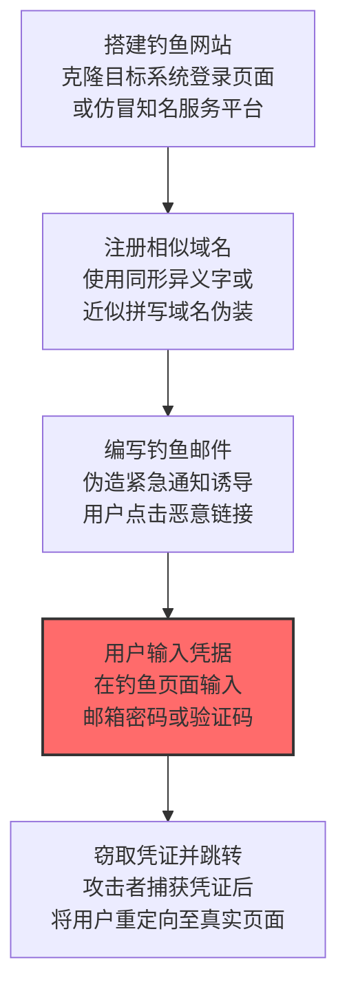

# 鱼叉式钓鱼链接 (T1566.002)

## 一句话通俗理解

> **通过恶意链接诱导用户访问钓鱼网站或下载恶意软件**

## 30秒速查卡

| 维度 | 你需要知道的 |
|------|-------------|
| 这是什么？ | 攻击者伪造一封紧急邮件，里面有个"点击这里"的链接，点进去就掉进陷阱 |
| 为什么危险？ | 钓鱼链接可以绕过邮件附件检测，直接在浏览器里窃取你的密码，而且伪装得越来越像真的 |
| 谁需要关心？ | 全体员工（特别是财务、HR）、邮件管理员、安全意识培训负责人 |
| 你的第一步防御 | 配置邮件网关扫描所有链接，对可疑域名进行实时威胁情报匹配 |
| 如果只做一件事 | 启用MFA（多因素认证），即使密码被骗走，攻击者也登不进去 |

## 难度等级

⭐ 初级 - 入门级技术，基础操作

## 这是什么？

**鱼叉式钓鱼链接**（T1566.002）是 **钓鱼**（T1566）的一个具体变体，属于 **初始访问** 阶段的攻击技术。

简单来说，就像冒充银行客服给你发短信，骗你输入密码。

### 具体怎么理解？

通过恶意链接诱导用户访问钓鱼网站或下载恶意软件

攻击者使用这种技术时，通常是在初始访问阶段，想要达到特定的攻击目标。与父技术 T1566 相比，T1566.002 有自己独特的特点和使用场景。

### 为什么有效？

这种技术之所以有效，是因为：
1. **隐蔽性**：利用了正常系统功能或常见协议，不容易被发现
2. **技术门槛适中**：不需要特别高深的技术知识就能实施
3. **广泛适用**：可以在多种环境和系统中使用


## 真实攻击流程



**步骤详解：**

1. **搭建钓鱼网站** - 使用 Evilginx、Modlishka 等反向代理钓鱼框架克隆目标登录页面（如 Office 365、Gmail、企业 VPN），实现实时凭据和会话窃取
2. **注册相似域名** - 注册与目标域名高度相似的域名，如使用 rn（带变音符号）替代 m，或添加额外字符（如 microsoft-verify.com）
3. **编写钓鱼邮件** - 伪造系统通知（密码过期、异常登录告警、共享文档）制造紧迫感，诱使用户点击嵌入的恶意链接
4. **用户输入凭据** - 受害者点击链接后跳转到钓鱼页面，输入用户名、密码甚至 MFA 验证码（通过 Adversary-in-the-Middle 实时转发）
5. **窃取凭证并跳转** - 攻击者实时捕获输入的所有凭证信息，然后将用户重定向到真实的官方网站，使用户不易察觉已遭攻击

### 典型场景

攻击者在 **初始访问** 阶段使用 鱼叉式钓鱼链接 技术，以下是典型的攻击步骤：


## 真实案例

### 案例1：该技术在实际攻击中的应用

- **时间**: 2024-2025年
- **目标**: 多个行业组织
- **攻击组织**: 多个APT组织
- **手法**: 攻击者在入侵过程中使用鱼叉式钓鱼链接技术，展示了该子技术的典型应用场景和攻击效果
- **影响**: 成功实施该技术导致目标系统被进一步入侵
- **参考链接**: [MITRE ATT&CK官方](https://attack.mitre.org/)

### 案例2：安全研究中的实践

- **时间**: 2025年
- **目标**: 安全研究测试环境
- **攻击组织**: 红队/安全研究人员
- **手法**: 在授权测试中模拟鱼叉式钓鱼链接攻击，验证防御体系的检测和响应能力
- **影响**: 帮助组织识别安全防护中的盲点和改进方向
- **参考链接**: [Atomic Red Team](https://github.com/redcanaryco/atomic-red-team)

## 红队视角

> ⚠️ **免责声明**：以下内容仅用于合法的安全测试、渗透测试和教育目的。未经授权对他人系统进行测试是违法行为。

### 实战技巧

1. **深入理解原理**：在实战应用前，充分理解鱼叉式钓鱼链接的技术原理和适用场景
2. **环境适配**：根据目标系统的操作系统版本、安全配置等因素调整攻击策略
3. **组合使用**：将该技术与其他技术组合使用，构建完整的攻击链
4. **隐蔽性考虑**：注意操作痕迹的清理，避免被安全设备检测

### 常用工具

| 工具名称 | 用途 | 平台 | 链接 |
| -------- | ---- | ---- | ---- |
| Metasploit | 渗透测试框架 | 全平台 | [Metasploit](https://www.metasploit.com/) |
| Cobalt Strike |  adversary模拟平台 | Windows | [Cobalt Strike](https://www.cobaltstrike.com/) |
| Atomic Red Team | 检测规则测试 | 全平台 | [Atomic Red Team](https://github.com/redcanaryco/atomic-red-team) |

### 注意事项

- 在授权的测试环境中使用这些技术
- 注意操作安全（OPSEC），避免被检测系统发现
- 使用匿名化技术和代理隐藏真实身份

## 蓝队视角

### 检测要点

1. **系统日志监控**：关注与鱼叉式钓鱼链接相关的系统日志和审计记录
2. **异常行为检测**：监控系统中与该技术相关的异常进程、网络连接和文件操作
3. **工具特征识别**：识别攻击者可能使用的工具在系统中的运行特征

### 监控建议

- 部署端点检测和响应（EDR）系统，监控与鱼叉式钓鱼链接相关的异常行为
- 配置SIEM规则，关联分析来自多个来源的告警
- 定期进行安全评估和渗透测试，验证检测规则的有效性

## 检测建议

### 检测思路

检测 鱼叉式钓鱼链接 的关键是识别异常行为模式。以下是三个层面的检测方法：

### 网络层检测

**方法**：监控网络流量中的异常模式

```bash
# 检测异常的网络连接和数据传输
# 根据具体协议和端口设置检测规则
```

### 主机层检测

**Windows事件ID**：
- 事件ID 4688：进程创建（监控可疑进程）
- 事件ID 4104：PowerShell执行（监控可疑脚本）

**Linux日志**：
- /var/log/auth.log：认证日志
- /var/log/syslog：系统日志

```bash
# 检测异常进程和命令执行
grep -i "suspicious" /var/log/auth.log
```

### 应用层检测

**用人话说：** 攻击者伪装成公司IT管理员发邮件说"您的密码即将过期，请点击此处验证"——链接指向的钓鱼页面长得和Office 365登录页一模一样。攻击者常用Evilginx2或Modlishka做反向代理钓鱼（实时窃取密码+MFA验证码），或用GoPhish管理整个钓鱼活动，注册相似域名（如microsoft-verify-login.com）来迷惑用户。检测上，关注浏览器（chrome.exe/msedge.exe/firefox.exe）在访问页面后启动PowerShell或cmd的进程创建事件（事件ID 4688），特别是用户访问陌生域名后短时间内出现文件下载（WebClient服务调用事件ID 5158）或certutil/bitsadmin下载行为的组合。

**Sigma规则示例**：

```yaml
title: 检测鱼叉式钓鱼链接
status: experimental
description: 检测可能的鱼叉式钓鱼链接活动
logsource:
    category: process_creation
    product: windows
detection:
    selection:
        EventID: 4688
    condition: selection
level: medium
tags:
    - attack.T1566002
```


## 缓解措施

### 优先级1：关键措施

**限制攻击面**：减少暴露的服务和端口，降低被利用的风险

```bash
# 防火墙规则示例：只允许必要的出站连接
iptables -A OUTPUT -p tcp --dport 443 -j ACCEPT  # 允许HTTPS
iptables -A OUTPUT -p tcp --dport 80 -j ACCEPT   # 允许HTTP
iptables -A OUTPUT -p tcp -j DROP                 # 阻止其他TCP
```

### 优先级2：重要措施

**加强监控**：部署EDR和SIEM系统，实时监控异常行为

### 优先级3：建议措施

**安全意识培训**：教育员工识别相关攻击手法


## 动手实验

> ⚠️ **所有实验必须在隔离的实验室环境中进行**

### 实验1：理解基本原理（初级）

**目标**：理解 鱼叉式钓鱼链接 的工作原理

**步骤**：
1. 在隔离环境中搭建测试系统
2. 使用基础工具模拟攻击行为
3. 观察系统日志和网络流量

**学习要点**：理解该技术的核心机制

### 实验2：实际操作（中级）

**目标**：掌握 鱼叉式钓鱼链接 的实际使用方法

**步骤**：
1. 使用专业工具进行攻击模拟
2. 尝试不同的绕过技术
3. 分析检测日志的特征

**学习要点**：掌握工具使用和日志分析

### 实验3：防御验证（高级）

**目标**：验证检测规则的有效性

**步骤**：
1. 部署检测规则
2. 执行攻击模拟
3. 验证检测告警是否触发

**学习要点**：理解攻防对抗的实际效果


## 术语解释

| 术语 | 通俗解释 |
|------|---------|
| **ATT&CK** | MITRE公司维护的攻击技术知识库，像一本"黑客手法百科全书" |
| **鱼叉式钓鱼链接** | T1566.002，ATT&CK框架中定义的一种具体攻击技术 |
| **钓鱼** | T1566，鱼叉式钓鱼链接所属的父技术类别 |
| **初始访问** | 攻击链中的一个阶段，攻击者在这个阶段的目标 |
| **C2** | 命令与控制，攻击者用来远程控制被入侵系统的"遥控器" |
| **EDR** | 端点检测与响应，部署在电脑上的安全监控软件 |


## 被引用情况

以下父技术文档引用了本子技术：

- [T1566 - 钓鱼](../T1566-Phishing.md)

## 参考资料

### 官方文档

- [MITRE ATT&CK - 鱼叉式钓鱼链接 (T1566.002)](https://attack.mitre.org/techniques/T1566/002/)
- [MITRE ATT&CK - 钓鱼 (T1566)](https://attack.mitre.org/techniques/T1566/)

### 安全报告

- [MITRE ATT&CK 官方文档](https://attack.mitre.org/) - ATT&CK 框架官方资源

### 工具与资源

- [Atomic Red Team](https://github.com/redcanaryco/atomic-red-team) - 检测规则测试框架
- [MITRE ATT&CK Navigator](https://mitre-attack.github.io/attack-navigator/) - ATT&CK 可视化工具

### 学习资料

- [MITRE ATT&CK 知识库](https://attack.mitre.org/resources/) - ATT&CK 官方资源中心
