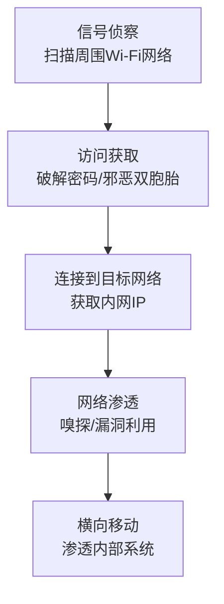

# Wi-Fi网络 (T1669) - Wi-Fi Networks

## 一句话通俗理解

> 攻击者通过蹭你家Wi-Fi或者伪造一个假的Wi-Fi热点来入侵你的网络——不需要撬门，只需要在你旁边就能连进来。

## 难度等级

- ⭐⭐ **中级**（需要一定基础）——需要了解无线网络协议、加密机制和专门的硬件工具

## 技术描述

Wi-Fi网络（Wi-Fi Networks）是一种初始访问技术，攻击者通过连接到目标组织的无线网络来获得对目标系统的初始访问权限。这种技术利用了组织的Wi-Fi网络作为攻击向量，无论是通过利用开放的Wi-Fi网络，还是通过获取凭据来访问受保护的Wi-Fi网络。

**打个比方**：Wi-Fi攻击就像是小偷不需要进你家门，只需要在你家隔壁或者楼下，就能通过你家的无线网络偷走你的信息。或者更狡猾的是，他在你家门口放了一个假的Wi-Fi热点，你以为连的是自己家的网络，其实连的是小偷的。

**Wi-Fi攻击的独特之处**：
- **不需要物理进入**：只需要在Wi-Fi信号范围内
- **绕过网络边界**：直接进入内部网络
- **难以追溯**：无线信号难以精确定位来源
- **隐蔽性强**：无线流量不易被有线网络安全设备监控

**常见的Wi-Fi攻击方式**：
1. **开放网络利用**：连接到未加密的Wi-Fi网络
2. **凭据获取**：通过暴力破解或社会工程学获取Wi-Fi密码
3. **邪恶双胞胎**：设置与合法网络相同的假热点
4. **最近邻居攻击**：通过入侵临近建筑的系统作为跳板
5. **协议漏洞利用**：利用WPA2/WPA3中的漏洞

## 子技术列表

**该技术没有子技术。**

T1669 在MITRE ATT&CK框架中没有定义子技术。

## 攻击流程

### 典型攻击流程



**步骤详解：**

1. **信号侦察**
   - 通俗描述：拿设备扫描目标周围的Wi-Fi信号
   - 技术细节：使用支持监听模式的无线网卡扫描周围的Wi-Fi网络；识别目标组织的SSID（网络名称）；分析网络的加密类型（WPA2/WPA3/WEP/开放）和信号强度
   - 常用工具：Aircrack-ng、Kismet、Wifite

2. **访问获取**
   - 通俗描述：想办法连上目标的Wi-Fi
   - 技术细节：如果是开放网络→直接连接；如果是加密网络→通过暴力破解或字典攻击猜测密码；设置邪恶双胞胎（Evil Twin）诱骗用户连接假热点获取凭据；利用"最近邻居"攻击，入侵临近建筑的系统作为跳板
   - 常用工具：Hashcat、Fluxion、Airgeddon

3. **网络渗透**
   - 通俗描述：连上Wi-Fi后开始在内网活动
   - 技术细节：连接到目标Wi-Fi网络（获得一个内部IP地址）；进行网络嗅探和流量分析（捕获未加密的凭据和数据）；扫描内部网络中的主机和服务
   - 常用工具：Wireshark、tcpdump、Nmap

4. **后渗透**
   - 通俗描述：在目标网络中安营扎寨
   - 技术细节：进行内部网络侦察，识别高价值系统；横向移动到其他系统；部署恶意软件或窃取数据
   - 常用工具：Cobalt Strike、Metasploit、BloodHound

## 真实案例

### 案例1：APT28"最近邻居"攻击（2024年2月发现）

- **时间**: 2024年2月发现（可能自2021年开始）
- **目标**: 具有战略情报价值的组织
- **攻击组织**: APT28（俄罗斯GRU）
- **手法**: 俄罗斯军方情报局（GRU）关联的APT28组织使用了一种创新的"最近邻居"（Nearest Neighbor）攻击技术。攻击链包括：识别目标组织临近的建筑；入侵临近建筑中的系统，特别是同时连接有线和无线网络的双宿主系统；利用被破坏的系统作为桥梁连接到目标Wi-Fi网络。这种攻击允许APT28在不需要物理进入目标建筑的情况下获得Wi-Fi访问权限。Volexity在2024年11月发布了详细报告。
- **影响**: 多个具有战略价值的组织被入侵
- **参考链接**: [Nearest Neighbor Attack - Volexity](https://www.volexity.com/blog/2024/11/22/the-nearest-neighbor-attack-how-a-russian-apt-weaponized-nearby-wi-fi-networks-for-covert-access/)

### 案例2：邪恶双胞胎攻击窃取Wi-Fi凭据（2022-2025年）

- **时间**: 2022年-2025年
- **目标**: 在公共场所或办公区域提供Wi-Fi的组织
- **攻击组织**: 多个威胁组织
- **手法**: 各种威胁组织使用邪恶双胞胎（Evil Twin）攻击窃取Wi-Fi凭据。攻击链包括：设置与目标组织合法Wi-Fi网络名称（SSID）相同或相似的恶意接入点；将恶意接入点配置为诱骗用户连接（通常通过提供更强的信号）；当用户连接时拦截通信窃取凭据；利用窃取的凭据访问合法Wi-Fi网络。邪恶双胞胎攻击特别有效，因为许多用户会自动连接到他们之前使用过的Wi-Fi网络。
- **影响**: 多个组织的Wi-Fi凭据被窃取
- **参考链接**: [Wi-Fi Networks Attack Analysis - SOC Journal](https://socjournal.com/wi-fi-networks-attack-analysis-t1669-rogue-access-point-evil-twin/)

### 案例3：KRACK攻击利用WPA2协议漏洞（2017年至今）

- **时间**: 2017年至今
- **目标**: 使用WPA2加密的所有Wi-Fi网络
- **攻击组织**: 学术研究（后被攻击者利用）
- **手法**: KRACK（Key Reinstallation Attack）攻击利用了WPA2协议中的漏洞，允许攻击者拦截和解密Wi-Fi流量。攻击者通过操纵WPA2的四次握手过程，强制重用加密密钥，从而解密流量。虽然补丁已经发布，但许多设备仍然容易受到此攻击。此漏洞影响了几乎所有支持Wi-Fi的设备，包括Android、iOS、Windows、Linux和各种IoT设备。
- **影响**: 全球几乎所有Wi-Fi网络都受到影响
- **参考链接**: [KRACK Attack](https://www.krackattacks.com/)

## 红队视角

> ⚠️ **免责声明**：以下内容仅用于合法的安全测试、渗透测试和教育目的。未经授权对他人系统进行测试是违法行为。

### 实战技巧

1. **选择合适的无线网卡**
   进行Wi-Fi攻击需要支持监听模式（Monitor Mode）和包注入（Packet Injection）的无线网卡。推荐芯片组：Atheros AR9271、Ralink RT3070、Realtek RTL8812AU。

2. **车辆侦察（Wardriving）**
   驾车经过目标建筑周围，使用Kismet或Wigle.net应用收集Wi-Fi网络信息，包括SSID、BSSID、加密类型、信号强度和GPS位置。

3. **邪恶双胞胎攻击实施**
   使用Fluxion或Airgeddon工具创建邪恶双胞胎AP。关键在于选择目标用户量大的时间段（如工作日上午），将恶意AP的信号强度调高，诱使用户自动连接。

### 常用工具

| 工具名称 | 用途 | 平台 | 链接 |
|----------|------|------|------|
| Aircrack-ng | Wi-Fi安全测试工具集，含破解和监听功能 | Linux | [Aircrack-ng](https://www.aircrack-ng.org/) |
| Wifite | 自动化Wi-Fi攻击脚本 | Linux | [GitHub](https://github.com/derv82/wifite2) |
| Fluxion | 邪恶双胞胎攻击工具 | Linux | [GitHub](https://github.com/FluxionNetwork/fluxion) |
| Hashcat | GPU加速的密码破解工具 | 跨平台 | [Hashcat](https://hashcat.net/hashcat/) |
| Kismet | 无线网络探测器和分析器 | 跨平台 | [Kismet](https://www.kismetwireless.net/) |

### 注意事项

- Wi-Fi攻击可能触犯无线电管理法规，注意合法性
- 确保获得明确的书面授权
- 避免干扰非目标的无线网络
- 使用定向天线减少信号泄漏

## 蓝队视角

### 检测要点

1. **接入点监控**
   - 日志来源：无线控制器日志、WIDS（无线入侵检测系统）
   - 关注字段：新的AP出现、SSID重复、信号强度异常
   - 异常特征：与合法SSID相同但信号来源不同（邪恶双胞胎）、新出现未授权的AP

2. **客户端行为监控**
   - 日志来源：无线控制器日志、DHCP日志
   - 关注字段：客户端关联的AP、关联/去关联事件
   - 异常特征：客户端频繁地关联和去关联（去认证攻击）、客户端连接到未授权的AP

3. **流量分析**
   - 日志来源：网络流量日志、IDS/IPS日志
   - 关注字段：ARP请求、DNS查询、协议分析
   - 异常特征：ARP欺骗攻击的特征、DNS劫持尝试、中间人攻击的流量模式

### 监控建议

- 部署WIDS/WIPS（无线入侵检测/防御系统）
- 使用WPA3或WPA2-Enterprise（而非WPA2-Personal）
- 实施802.1X认证和VLAN分段
- 定期进行无线安全评估（如使用Wigle.net检查覆盖范围）

## 检测建议

### 网络层检测

**检测方法：** 监控未授权AP和邪恶双胞胎攻击。

**具体规则/命令示例：**
```
# 使用WIDS监控新出现的AP
# 检测SSID重复但BSSID不同的AP
```

### 主机层检测

**检测方法：** 监控客户端的无线连接行为和异常流量。

**Windows事件ID：**
- 事件ID 6400/6401：无线网络连接事件
- 事件ID 1：Microsoft-Windows-WLAN-AutoConfig/Operational
- 关注新的无线网络连接和异常的连接断开

**Linux日志：**
- 日志文件：/var/log/syslog
- 关键字段：wpa_supplicant连接事件、DHCP获取

**具体命令示例：**
```bash
# 查看当前的Wi-Fi连接状态
iwconfig

# 扫描周围的Wi-Fi网络
sudo iwlist wlan0 scan

# 查看无线网卡的工作模式
iw dev wlan0 info
```

### 应用层检测

**检测方法：** 监控无线网络中的异常ARP和DNS活动。

**Sigma规则示例：**
```yaml
title: 检测未授权的无线接入点
status: experimental
description: 检测与合法Wi-Fi网络SSID相同但BSSID不同的AP，可能表示邪恶双胞胎攻击
logsource:
    category: network
    product: wids
detection:
    selection:
        SSID: 'Corp-WiFi'
        BSSID|notcontains: '00:11:22:33:44:55'  # 合法AP的MAC地址
    condition: selection
level: high
tags:
    - attack.t1669
```

## 缓解措施

### 优先级1：关键措施

**措施名称：** 使用企业级无线加密

**具体实施步骤：**
1. 使用WPA3-Enterprise或WPA2-Enterprise（而非Personal/PSK模式）
2. 部署802.1X认证，每个用户使用独立凭据
3. 禁用WPS等不安全的便捷功能

**配置示例：**
```
# WPA2-Enterprise配置参数
# - 使用EAP-TLS或PEAP-MSCHAPv2
# - 配置RADIUS服务器进行集中认证
# - 启用PMF（Protected Management Frames）
```

### 优先级2：重要措施

**措施名称：** 网络分段

**具体实施步骤：**
1. 将访客网络与内部网络完全隔离
2. 使用VLAN在无线控制器上实施网络分段
3. 限制无线网络的访问范围和权限

**措施名称：** 部署WIDS/WIPS

**具体实施步骤：**
1. 评估和选择WIDS解决方案
2. 部署无线传感器全覆盖办公区域
3. 配置检测规则和告警策略

### 优先级3：建议措施

**措施名称：** 物理安全措施

**具体实施步骤：**
1. 使用定向天线限制信号覆盖范围
2. 定期进行物理安全审计
3. 监控办公区域周围的异常活动

### MITRE ATT&CK 缓解措施映射

| 缓解措施ID | 缓解措施名称 | 适用性 | 说明 |
|------------|-------------|:------:|------|
| M1042 | 禁用或移除功能 | 适用 | 禁用WPS等不安全功能 |
| M1032 | 多因素认证 | 适用 | 使用802.1X实施设备认证 |
| M1030 | 网络分段 | 适用 | 隔离访客网络和内部网络 |
| M1037 | 过滤网络流量 | 适用 | 实施VLAN访问控制列表 |
| M1022 | 限制文件和目录权限 | 部分适用 | 限制无线网络对敏感系统的访问 |

## 动手实验

> ⚠️ **重要提示**：所有实验必须在隔离的实验室环境中进行，禁止对未授权的真实系统进行测试。

### 实验环境准备

**推荐靶场/实验平台：**

| 平台名称 | 类型 | 难度 | 链接 |
|----------|------|:----:|------|
| TryHackMe - Wi-Fi | CTF | 中级 | [THM](https://tryhackme.com/) |
| VulnHub - Wifu | VM | 中级 | [VulnHub](https://www.vulnhub.com/) |

**所需工具：**
- Kali Linux（带支持监听模式的无线网卡）
- Aircrack-ng：无线安全测试套件
- Wireshark：网络协议分析

### 实验1：使用Aircrack-ng进行无线安全测试（仅供学习）

**实验目标：** 理解Wi-Fi安全测试的基本流程

**实验步骤：**
1. 在隔离环境中配置一个WPA2加密的Wi-Fi网络
2. 使用airmon-ng启用无线网卡的监听模式
3. 使用airodump-ng捕获WPA2四次握手包
4. 使用aircrack-ng破解预共享密钥

**预期结果：** 成功捕获WPA2握手包并破解密码

**学习要点：** 理解WPA2-PSK的安全弱点和破解原理

### 实验2：搭建邪恶双胞胎攻击环境

**实验目标：** 了解邪恶双胞胎攻击的原理和检测方法

**实验步骤：**
1. 在隔离环境中设置一个合法Wi-Fi网络（如"TestWiFi"）
2. 使用Fluxion创建邪恶双胞胎AP
3. 设置一个假的Wi-Fi门户页面诱导用户输入密码
4. 演示凭据窃取过程

**预期结果：** 成功创建邪恶双胞胎并捕获用户输入的凭据

**学习要点：** 理解邪恶双胞胎攻击的原理和防御方法

### 实验3：配置无线入侵检测

**实验目标：** 学习配置WIDS检测无线攻击

**实验步骤：**
1. 部署Kismet作为无线IDS
2. 配置检测规则（未授权AP、去认证攻击）
3. 模拟各种无线攻击（邪恶双胞胎、去认证攻击）
4. 验证WIDS的检测能力

**预期结果：** WIDS成功检测到模拟的无线攻击

**学习要点：** 掌握WIDS的配置和使用方法

## 术语解释

| 术语 | 英文原名 | 通俗解释 |
|------|----------|----------|
| SSID | Service Set Identifier | Wi-Fi网络的名称，就像每家每户门牌号一样标识一个无线网络 |
| WPA2/WPA3 | Wi-Fi Protected Access | Wi-Fi安全加密协议，WPA2像老式门锁，WPA3像新型安全门锁 |
| 邪恶双胞胎 | Evil Twin | 攻击者设置的与合法Wi-Fi名称相同的假热点，就像骗子开了一家名字一模一样的假银行 |
| 未授权AP | Rogue Access Point | 未经允许私自接入公司网络的无线热点 |
| WIDS | Wireless Intrusion Detection System | 无线入侵检测系统，专门监控和检测无线网络攻击的安全系统 |
| KRACK | Key Reinstallation Attack | 利用WPA2协议缺陷的重放攻击，可以破解Wi-Fi加密通信 |
| Wardriving | Wardriving | 开车到处转悠搜索Wi-Fi网络的行为，像拿着渔网在河里捞鱼 |
| 802.1X | IEEE 802.1X | 端口访问控制协议，设备想上网必须先通过认证，像出示证件才能进小区 |

## 参考资料

### 官方文档

- [MITRE ATT&CK - Wi-Fi Networks (T1669)](https://attack.mitre.org/techniques/T1669/)
- [CISA - Wi-Fi Networks (T1669)](https://www.cisa.gov/eviction-strategies-tool/info-attack/T1669)

### 安全报告

- [Nearest Neighbor Attack - Volexity](https://www.volexity.com/blog/2024/11/22/the-nearest-neighbor-attack-how-a-russian-apt-weaponized-nearby-wi-fi-networks-for-covert-access/) - APT28利用"最近邻居"Wi-Fi攻击的详细分析（2024年）
- [Wi-Fi Networks Attack Analysis - SOC Journal](https://socjournal.com/wi-fi-networks-attack-analysis-t1669-rogue-access-point-evil-twin/) - 邪恶双胞胎攻击技术分析

### 工具与资源

- [Aircrack-ng](https://www.aircrack-ng.org/) - 完整的Wi-Fi安全测试工具集
- [KRACK Attack](https://www.krackattacks.com/) - KRACK漏洞官方页面
- [Fluxion](https://github.com/FluxionNetwork/fluxion) - 邪恶双胞胎攻击工具

### 学习资料

- [Wi-Fi Security Best Practices Guide](https://www.cisa.gov/eviction-strategies-tool/info-attack/T1669) - CISA Wi-Fi安全指南
- [Wi-Fi Networks - Startup Defense](https://www.startupdefense.io/mitre-attack-techniques/t1669-wi-fi-networks) - T1669技术详解
- [WPA3 Security Analysis](https://www.krackattacks.com/) - WPA3安全分析和KRACK防御
