# 执行 (TA0002)

## 一句话理解

> **执行就是攻击者想尽办法让恶意代码在你的电脑上"跑起来"——就像小偷撬开门锁之后，需要在屋里动手翻找东西一样。**

## 战术概述

用大白话说：攻击者入侵系统之后，光"进来"还不够，他得让自己的恶意程序真正运行起来，才能干坏事（比如偷数据、加密勒索、挖矿等）。**执行（Execution）** 就是攻击者用来让恶意代码在目标系统上跑起来的各种方法。

想象一下，你家的门被撬开了（初始访问），但小偷还得找到开关灯、打开保险柜的方法。执行战术就是攻击者的"开关灯和打开保险柜"——它决定了攻击者能不能真正动手。

执行战术涵盖的方法非常多：利用系统自带的命令行工具（PowerShell、cmd）、编写定时任务自动运行、通过漏洞让浏览器或Office崩溃后执行代码、欺骗用户自己点击运行、甚至劫持正常软件的加载过程。正因为执行手段五花八门，这个战术是整个ATT&CK框架中子技术最多、最复杂的战术之一，包含 **20个技术** 和 **46个子技术**。

## 战术在攻击链中的位置

### 攻击链全景图

```mermaid
graph LR
    A["侦察<br/>TA0043"] --> B["资源开发<br/>TA0042"]
    B --> C["初始访问<br/>TA0001"]
    C --> D["执行<br/>TA0002"]
    D --> E["持久化<br/>TA0003"]
    E --> F["权限提升<br/>TA0004"]
    F --> G["隐蔽<br/>TA0005"]
    G --> H["防御削弱<br/>TA0112"]
    H --> I["凭证访问<br/>TA0006"]
    I --> J["发现<br/>TA0007"]
    J --> K["横向移动<br/>TA0008"]
    K --> L["收集<br/>TA0009"]
    L --> M["命令与控制<br/>TA0011"]
    M --> N["数据窃取<br/>TA0010"]
    N --> O["影响<br/>TA0040"]

    style D fill:#ff6b6b,stroke:#333,stroke-width:4px
```

### 当前战术的角色

执行是攻击链中最关键的一环——它紧跟在**初始访问**之后，是攻击者从"进得来"到"干得了"的转折点。没有执行，之前的所有努力都是白费。执行战术也经常与**持久化**、**防御规避**、**横向移动**等战术配合使用，是整个攻击链的"发动机"。

### 前置战术

- **初始访问（TA0001）**：攻击者必须先获得对目标系统的基本访问权限（通过钓鱼、漏洞利用等），才能考虑如何执行恶意代码
- **资源开发（TA0042）**：攻击者可能需要准备恶意软件、购买漏洞利用工具等资源

### 后续战术

- **持久化（TA0003）**：执行恶意代码后，攻击者通常会建立持久化机制，确保下次还能进来
- **权限提升（TA0004）**：执行成功后可能发现权限不够，需要提升到管理员或SYSTEM权限
- **防御规避（TA0005）**：执行过程需要绕过安全软件的检测
- **横向移动（TA0008）**：在一台机器上执行成功后，攻击者会利用各种技术在网络上横向扩散

## 技术索引表

| 技术ID | 中文名称 | 难度 | 子技术数 | 一句话理解 | 文档状态 |
|--------|----------|------|----------|------------|----------|
| [T1059](./T1059-Command-and-Scripting-Interpreter.md) | 命令和脚本解释器 | ⭐ | 13 | 利用系统自带的PowerShell、cmd、Python等工具执行恶意命令 | ✅ 已完成 |
| [T1203](./T1203-Exploitation-for-Client-Execution.md) | 客户端漏洞利用执行 | ⭐⭐⭐ | 0 | 利用浏览器、Office等软件的漏洞，让恶意代码在用户打开文件时自动运行 | ✅ 已完成 |
| [T1204](./T1204-User-Execution.md) | 用户执行 | ⭐ | 5 | 骗用户自己点击链接、打开文件、复制粘贴恶意命令来执行代码 | ✅ 已完成 |
| [T1053](./T1053-Scheduled-Task-Job.md) | 计划任务/作业 | ⭐⭐ | 5 | 利用系统的定时任务功能，在特定时间或事件触发时自动运行恶意代码 | ✅ 已完成 |
| [T1047](./T1047-Windows-Management-Instrumentation.md) | Windows管理规范 | ⭐⭐ | 0 | 利用Windows内置的WMI管理工具执行命令、横向移动、持久化 | ✅ 已完成 |
| [T1106](./T1106-Native-API.md) | 原生API | ⭐⭐⭐ | 0 | 绕过高层API，直接调用操作系统底层函数来执行恶意代码，逃避安全检测 | ✅ 已完成 |
| [T1072](./T1072-Software-Deployment-Tools.md) | 软件部署工具 | ⭐⭐ | 0 | 劫持企业用的软件分发工具（如SCCM、Ansible），一次性向所有电脑推送恶意软件 | ✅ 已完成 |
| [T1127](./T1127-Trusted-Developer-Utilities-Proxy-Execution.md) | 受信任开发工具代理执行 | ⭐⭐ | 3 | 利用MSBuild等合法开发工具执行恶意代码，因为它们是"受信任的"程序 | ✅ 已完成 |
| [T1129](./T1129-Shared-Modules.md) | 共享模块 | ⭐⭐ | 0 | 通过替换或劫持DLL等共享库，让正常程序加载恶意代码 | ✅ 已完成 |
| [T1197](./T1197-BITS-Jobs.md) | BITS作业 | ⭐ | 0 | 利用Windows后台传输服务下载恶意文件，流量看起来像正常的系统更新 | ✅ 已完成 |
| [T1559](./T1559-Inter-Process-Communication.md) | 进程间通信 | ⭐⭐ | 3 | 利用COM、DDE等进程间通信机制在合法进程中执行恶意代码 | ✅ 已完成 |
| [T1569](./T1569-System-Services.md) | 系统服务 | ⭐⭐ | 3 | 创建或修改系统服务来执行恶意代码，服务通常开机自启且权限高 | ✅ 已完成 |
| [T1574](./T1574-Hijack-Execution-Flow.md) | 劫持执行流 | ⭐⭐⭐ | 14 | 利用DLL搜索顺序、环境变量等加载机制的漏洞，让程序"不小心"加载恶意代码 | ✅ 已完成 |
| [T1609](./T1609-Container-Administration-Command.md) | 容器管理命令 | ⭐⭐ | 0 | 利用kubectl、docker等容器管理工具执行恶意操作，甚至逃逸到宿主机 | ✅ 已完成 |
| [T1610](./T1610-Deploy-Container.md) | 部署容器 | ⭐⭐ | 0 | 向Kubernetes等环境部署恶意容器来运行挖矿、后门等恶意负载 | ✅ 已完成 |
| [T1648](./T1648-Serverless-Execution.md) | 无服务器执行 | ⭐⭐ | 0 | 利用AWS Lambda、Azure Functions等无服务器平台执行恶意代码 | ✅ 已完成 |
| [T1651](./T1651-Cloud-Administration-Command.md) | 云管理命令 | ⭐⭐ | 0 | 利用AWS CLI、Azure PowerShell等云管理工具执行恶意操作 | ✅ 已完成 |
| [T1674](./T1674-Input-Injection.md) | 输入注入 | ⭐⭐ | 0 | 伪造键盘鼠标输入来控制受害系统，比如用USB橡皮鸡自动输入恶意命令 | ✅ 已完成 |
| [T1675](./T1675-ESXi-Administration-Command.md) | ESXi管理命令 | ⭐⭐ | 0 | 利用VMware ESXi虚拟化管理命令控制虚拟机，甚至加密所有虚拟磁盘 | ✅ 已完成 |
| [T1677](./T1677-Poisoned-Pipeline-Execution.md) | 毒化流水线执行 | ⭐⭐⭐ | 0 | 破坏CI/CD构建流水线，在软件编译过程中注入恶意代码 | ✅ 已完成 |

### 统计信息

- **技术总数**：20 个
- **子技术总数**：46 个
- **已完成文档**：20 个
- **进行中文档**：0 个
- **待编写文档**：0 个

## 推荐阅读顺序

对于红队新手，建议按以下顺序学习执行战术：

### 入门阶段（第1-2周）

> 适合零基础的安全爱好者，从最简单、最直观的技术开始。

**前置知识：** 基本的操作系统概念（进程、文件、服务）、了解命令行是什么

**推荐阅读：**

1. **[T1059 命令和脚本解释器](./T1059-Command-and-Scripting-Interpreter.md)** - 红队的基本功，PowerShell和cmd是最常用的执行手段，几乎所有攻击都会用到
2. **[T1204 用户执行](./T1204-User-Execution.md)** - 社会工程学的核心，ClickFix等技术是2024-2025年最火爆的攻击手法，理解攻击者的"钓鱼"思路
3. **[T1053 计划任务/作业](./T1053-Scheduled-Task-Job.md)** - 持久化的经典方法，几乎每次渗透都会用到，Windows和Linux都有对应的实现
4. **[T1047 WMI](./T1047-Windows-Management-Instrumentation.md)** - Windows横向移动的瑞士军刀，理解"管理工具本身也是攻击工具"的核心思想

**学习建议：**
- 先在虚拟机中动手实践[T1059](T1059-Command-and-Scripting-Interpreter.md)的PowerShell命令执行
- 理解"就地取材"（Living off the Land）攻击哲学

### 进阶阶段（第3-4周）

> 适合有一定基础的学习者，开始接触更复杂的技术。

**前置知识：** 操作系统原理、进程内存模型、网络协议基础

**推荐阅读：**

1. **[T1203 客户端漏洞利用](./T1203-Exploitation-for-Client-Execution.md)** - 理解漏洞利用的基本原理，浏览器和Office是最常见的攻击入口
2. **[T1574 劫持执行流](./T1574-Hijack-Execution-Flow.md)** - DLL劫持是权限提升和防御规避的经典技术，14个子技术覆盖了各种变体
3. **[T1106 原生API](./T1106-Native-API.md)** - 直接系统调用是现代恶意软件逃避EDR的核心技术，理解EDR的盲区
4. **[T1197 BITS作业](./T1197-BITS-Jobs.md)** - 隐蔽下载的经典手法，理解"合法功能被滥用"的攻击模式
5. **[T1559 进程间通信](./T1559-Inter-Process-Communication.md)** - COM劫持和DDE攻击，理解Windows组件模型的攻防

**学习建议：**
- 使用ProcessMonitor和Sysmon观察进程行为和DLL加载
- 在实验室环境模拟[T1574](T1574-Hijack-Execution-Flow.md)的DLL劫持攻击

### 高级阶段（第5-6周）

> 适合有较好技术基础的学习者，深入理解复杂技术原理。

**前置知识：** 编程基础（C/C++、Python）、系统编程概念

**推荐阅读：**

1. **[T1127 受信任开发工具代理执行](./T1127-Trusted-Developer-Utilities-Proxy-Execution.md)** - MSBuild、ClickOnce滥用，理解"信任传递"攻击
2. **[T1569 系统服务](./T1569-System-Services.md)** - 服务持久化，Windows/Linux/macOS三大平台的持久化技术
3. **[T1072 软件部署工具](./T1072-Software-Deployment-Tools.md)** - 企业环境横向移动，理解IT管理工具的"双刃剑"特性
4. **[T1129 共享模块](./T1129-Shared-Modules.md)** - 供应链攻击基础，XZ Utils后门是最值得学习的案例

### 专项领域（面向云安全方向）

> 适合专注于云原生和容器安全的学习者。

**前置知识：** 云计算基础、Docker和Kubernetes基本操作、CI/CD概念

**推荐阅读：**

1. **[T1609 容器管理命令](./T1609-Container-Administration-Command.md)** - 容器安全入门
2. **[T1610 部署容器](./T1610-Deploy-Container.md)** - 容器逃逸与横向移动
3. **[T1648 无服务器执行](./T1648-Serverless-Execution.md)** - Serverless安全
4. **[T1651 云管理命令](./T1651-Cloud-Administration-Command.md)** - 云环境攻击
5. **[T1675 ESXi管理命令](./T1675-ESXi-Administration-Command.md)** - 虚拟化安全
6. **[T1677 毒化流水线执行](./T1677-Poisoned-Pipeline-Execution.md)** - CI/CD供应链安全
7. **[T1674 输入注入](./T1674-Input-Injection.md)** - 物理攻击与社会工程

## 参考资料

### 官方文档

- [MITRE ATT&CK - Execution](https://attack.mitre.org/tactics/TA0002/)
- [MITRE ATT&CK Enterprise Matrix](https://attack.mitre.org/matrices/enterprise/)
- [MITRE ATT&CK 框架中文版](https://attack.mitre.org/resources/translations/)

### 学习资源

- [ATT&CK 执行战术矩阵](https://attack.mitre.org/matrices/enterprise/execution/)
- [红队执行技术实战指南](https://www.pentestpartners.com/security-blog/)
- [CISA 执行战术防御指南](https://www.cisa.gov/news-events/cybersecurity-advisories)
- [Atomic Red Team 执行技术测试](https://www.atomicredteam.io/)

### 相关工具

- [Atomic Red Team](https://github.com/redcanaryco/atomic-red-team) - 检测规则测试框架
- [SysInternals Suite](https://docs.microsoft.com/en-us/sysinternals/) - Windows系统诊断工具集
- [LOLBAS Project](https://lolbas-project.github.io/) - 被攻击滥用的合法二进制文件清单
