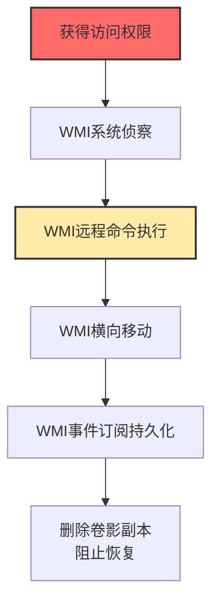

# Windows管理规范 (T1047)

## 一句话通俗理解

**WMI是Windows内置的"万能管理遥控器"，攻击者用它可以远程执行命令、收集信息、横向移动——而且几乎不留痕迹。**

## 难度等级

⭐️⭐️ 中级（需要一定基础）

需要了解WMI的架构和使用方法，但命令行操作相对简单。

## 技术描述

Windows管理规范（WMI）是Windows操作系统内置的管理框架，它允许管理员通过脚本或命令行来查询和控制系统。WMI可以做很多事情：查看进程列表、查询系统信息、执行命令、创建服务等。正因为功能如此强大，攻击者也非常喜欢用它。

**通俗解释：**
WMI就像你家的智能家居控制中心——你可以用它开灯、关空调、锁门、查看监控。如果你的"遥控器"被别人拿到了，他就可以远程操控你家里的一切。WMI就是Windows的"智能家居控制中心"，而攻击者就是那个偷到遥控器的人。

**技术原理：**
1. WMI通过**命名空间**组织管理信息，就像一个图书馆的书架分类
2. 每个管理对象（进程、服务、磁盘等）对应一个WMI**类**（Class）
3. 攻击者使用**WQL**（WMI查询语言）来查询或操作这些类
4. WMI支持**本地和远程**操作，通过DCOM（端口135）或WinRM（端口5985/5986）通信
5. WMI的**事件订阅**功能允许在特定事件发生时自动执行操作

**用途与影响：**
攻击者滥用WMI可以执行远程命令、收集系统信息、横向移动到其他机器、实现持久化（通过事件订阅），甚至删除卷影副本阻止数据恢复。由于WMI是Windows的核心组件，安全软件通常不会拦截WMI操作。

## 子技术列表

T1047目前没有定义子技术。

## 攻击流程

### 典型攻击流程

```
侦察目标 --> 使用WMI查询系统信息 --> 使用WMI执行命令 --> 横向移动到其他机器 --> WMI事件订阅持久化
```



**步骤详解：**

1. **获得目标系统的访问权限**
   - 通俗描述：先想办法进入目标系统（通过钓鱼、漏洞利用等）
   - 技术细节：至少需要普通用户权限，WMI的大部分功能需要管理员权限
   - 常用工具：Cobalt Strike、Metasploit

2. **WMI系统侦察**
   - 通俗描述：使用WMI查询目标系统的各种信息
   - 技术细节：`wmic os get caption,version`查看系统版本，`wmic process list brief`查看进程列表
   - 常用工具：wmic.exe、PowerShell Get-WmiObject

3. **WMI远程命令执行**
   - 通俗描述：在远程机器上执行恶意命令
   - 技术细节：`wmic /node:target process call create "powershell.exe -enc ..."`
   - 常用工具：wmic.exe、PowerShell Invoke-WmiMethod

4. **WMI横向移动**
   - 通俗描述：通过WMI在其他域内机器上部署恶意软件
   - 技术细节：使用WMI over DCOM（端口135）远程创建进程
   - 常用工具：wmic.exe、CrackMapExec

5. **WMI事件订阅持久化**
   - 通俗描述：设定WMI"闹钟"，在特定事件发生时自动执行恶意代码
   - 技术细节：创建__EventFilter和CommandLineEventConsumer
   - 常用工具：PowerShell Set-WmiInstance

6. **删除卷影副本阻止恢复**
   - 通俗描述：删除系统的备份文件，让受害者无法恢复数据
   - 技术细节：`wmic shadowcopy delete`
   - 常用工具：wmic.exe

## 真实案例

### 案例1：Black Basta勒索软件利用WMI进行横向移动（2024）

- **时间**: 2024年
- **目标**: 全球多个行业的企业
- **攻击组织**: Black Basta
- **手法**: Black Basta勒索软件组织在入侵企业网络后，大量使用WMI进行横向移动和远程命令执行。他们通过WMI查询目标系统的信息（如安装的软件、运行的进程、安全产品），然后通过WMI远程执行勒索软件载荷。WMI的使用使得他们的活动混在正常的管理流量中，难以被传统安全工具检测。
- **影响**: 数十家企业受影响，造成数亿美元损失
- **参考链接**: [CISA AA24-131A](https://www.cisa.gov/news-events/cybersecurity-advisories/aa24-131a)

### 案例2：APT41利用WMI进行侦察和持久化（2024）

- **时间**: 2024年
- **目标**: 全球多个行业的组织
- **攻击组织**: APT41
- **手法**: APT41组织使用WMI进行广泛的系统侦察，包括枚举安装的反病毒产品、查询系统配置、列出运行的进程等。他们还利用WMI事件订阅实现持久化：创建恶意的WMI事件过滤器和消费者，当特定系统事件发生时（如系统启动、用户登录）自动执行恶意代码。WMI事件订阅存储在WMI仓库中，不涉及传统的文件或注册表键值，使得检测更加困难。
- **影响**: 长期潜伏，持续窃取敏感数据
- **参考链接**: [Mandiant APT41分析](https://www.mandiant.com/resources/blog/apt41-dual-espionage-and-cyber-crime-operation)

### 案例3：Volt Typhoon使用WMI执行LOLBins攻击（2024-2025）

- **时间**: 2024-2025年
- **目标**: 美国关键基础设施
- **攻击组织**: Volt Typhoon
- **手法**: Volt Typhoon组织将WMI作为其"就地取材"（Living off the Land）攻击链的核心组件。他们使用WMI查询系统信息、执行命令、管理进程，整个攻击链几乎不使用自定义恶意软件。具体来说，他们通过`wmic process call create`执行PowerShell命令，使用WMI的Win32_Process类来创建远程进程，实现横向移动。
- **影响**: 美国通信、能源、水务等关键基础设施受到威胁
- **参考链接**: [Microsoft Volt Typhoon分析](https://www.microsoft.com/en-us/security/blog/2023/05/24/volt-typhoon-targets-us-critical-infrastructure-with-living-off-the-land-techniques/)

### 案例4：利用WMI删除卷影副本阻止恢复（2024）

- **时间**: 2024年
- **目标**: 被勒索软件攻击的企业
- **攻击组织**: 多种勒索软件家族
- **手法**: 多种勒索软件家族（包括Black Basta、LockBit等）在加密文件之前，使用WMI命令删除Windows卷影副本（Shadow Copies），以阻止受害者恢复数据。他们执行`wmic shadowcopy delete`命令来删除所有卷影副本，这是勒索软件攻击链中的标准步骤。
- **影响**: 受害者无法通过卷影副本恢复被加密的文件
- **参考链接**: [CISA AA23-075A](https://www.cisa.gov/news-events/cybersecurity-advisories/aa23-075a)

## 红队视角

> ⚠️ **免责声明**：以下内容仅用于合法的安全测试、渗透测试和教育目的。未经授权对他人系统进行测试是违法行为。

### 实战技巧

1. **使用WMI进行隐蔽远程执行**
   使用`wmic /node:target process call create`进行远程命令执行，避免使用常见的SMB或PsExec。WMI over DCOM使用端口135，流量看起来像正常的管理通信。

2. **利用WMI事件订阅实现隐蔽持久化**
   使用PowerShell创建WMI事件过滤器和消费者，在系统启动或特定事件触发时自动执行恶意代码。事件订阅存储在WMI仓库中，传统的文件扫描无法检测。

3. **通过WMI查询反病毒产品信息**
   使用`wmic /namespace:\\root\SecurityCenter2 path AntiVirusProduct get displayName,productState`查询目标安装的安全软件，选择合适的规避技术。

### 常用工具

| 工具名称 | 用途 | 平台 | 链接 |
|----------|------|------|------|
| wmic.exe | Windows自带的WMI命令行工具 | Windows | 系统自带 |
| PowerSploit | 包含多种WMI利用模块的PowerShell工具集 | Windows | https://github.com/PowerShellMafia/PowerSploit |
| Impacket | Python实现的WMI远程执行工具（wmiexec.py） | 跨平台 | https://github.com/fortra/impacket |
| CrackMapExec | 支持WMI执行模块的内网渗透测试工具 | Linux | https://github.com/byt3bl33d3r/CrackMapExec |
| WMIOps | 用于WMI攻击和后渗透的PowerShell脚本集 | Windows | https://github.com/ChrisTruncer/WMIOps |

### 注意事项

- WMI操作会创建wmiprvse.exe进程，注意不要过于频繁地调用
- WMI远程执行需要管理员权限（本地管理员或域管理员）
- WMI事件订阅可能在系统重启后失效（某些条件下）
- 使用WMI over DCOM时，防火墙可能会拦截端口135的连接

## 蓝队视角

### 检测要点

1. **监控wmic.exe的异常执行**
   - 日志来源：Windows安全事件日志、Sysmon Event ID 1（进程创建）
   - 关注字段：父进程、命令行参数
   - 异常特征：非管理员用户执行wmic.exe，或wmic.exe包含`process call create`、`/node:`参数

2. **监控WMI事件订阅创建**
   - 日志来源：Windows安全事件日志（Event ID 5861）
   - 关注字段：事件过滤器名称、消费者命令行
   - 异常特征：从非常用路径创建的事件订阅，或命令行包含Base64编码的PowerShell命令

3. **监控wmiprvse.exe的子进程**
   - 日志来源：Sysmon Event ID 1
   - 关注字段：父进程为wmiprvse.exe的子进程
   - 异常特征：wmiprvse.exe生成powershell.exe、cmd.exe、cscript.exe等

### 监控建议

- 启用WMI活动的事件日志记录（Microsoft-Windows-WMI-Activity/Operational）
- 配置Sysmon监控进程创建（Event ID 1）和网络连接（Event ID 3）
- 定期检查WMI事件订阅：`Get-WmiObject -Namespace root\subscription -Class __EventFilter`
- 使用WMI审计策略：启用"Audit Detailed Process Tracking"和"Audit WMI Event"

## 检测建议

### 网络层检测

**检测方法：** 监控WMI远程通信使用的端口（135/DCOM、5985/5986/WinRM）

**具体规则/命令示例：**
```
# 监控发往端口135的异常连接
netstat -an | findstr ":135"
```

**示例（Snort/Suricata规则）：**
```
alert tcp $HOME_NET any -> $EXTERNAL_NET 135 (msg:"Possible WMI Remote Connection - DCOM"; flow:to_server; sid:1000001; rev:1;)
```

### 主机层检测

**检测方法：** 监控WMI进程创建和事件订阅

**Windows事件ID：**
- 事件ID 4688：进程创建（监控wmic.exe执行）
- 事件ID 5861：WMI事件消费者筛选器绑定（监控事件订阅）
- 事件ID 5859：WMI活动消费者创建

**Sysmon事件ID：**
- Event ID 1：进程创建
- Event ID 7：DLL加载
- Event ID 15：文件创建流哈希

**具体命令示例：**
```powershell
# 查询WMI事件订阅
Get-WmiObject -Namespace root\subscription -Class __EventFilter
Get-WmiObject -Namespace root\subscription -Class CommandLineEventConsumer
Get-WmiObject -Namespace root\subscription -Class __FilterToConsumerBinding

# 查询WMI活动日志
Get-WinEvent -FilterHashtable @{LogName='Microsoft-Windows-WMI-Activity/Operational'; ID=5861}
```

### 应用层检测

**检测方法：** 监控PowerShell WMI调用

**Sigma规则示例：**
```yaml
title: WMI Process Call Create - Remote Execution
status: experimental
description: Detects remote WMI process creation via wmic.exe or PowerShell
logsource:
    category: process_creation
    product: windows
detection:
    selection_wmic:
        Image|endswith: '\wmic.exe'
        CommandLine|contains: 'process call create'
    selection_powershell:
        Image|endswith: '\powershell.exe'
        CommandLine|contains:
            - 'Invoke-WmiMethod'
            - 'Invoke-CimMethod'
            - 'Get-WmiObject'
    condition: selection_wmic or selection_powershell
level: high
tags:
    - attack.t1047
    - attack.execution
```

## 缓解措施

### 优先级1：关键措施

**措施名称：** 限制WMI访问权限

**具体实施步骤：**
1. 通过组策略限制谁可以远程连接到WMI服务
2. 配置Windows防火墙阻止未经授权的DCOM（端口135）访问
3. 限制对WMI命名空间的写入权限

**配置示例：**
```
# 通过防火墙阻止WMI远程访问
netsh advfirewall firewall add rule dir=in name="Block WMI" protocol=TCP localport=135 action=block
```

### 优先级2：重要措施

**措施名称：** 监控和审计WMI活动

**具体实施步骤：**
1. 启用WMI活动日志（Microsoft-Windows-WMI-Activity/Operational）
2. 配置Sysmon监控WMI相关的进程和网络活动
3. 定期审计WMI事件订阅，移除未授权的订阅

**措施名称：** 最小权限配置

**具体实施步骤：**
1. 确保非管理员用户不能远程使用WMI
2. 限制WMI服务（Winmgmt）的启动类型和权限
3. 使用AppLocker限制wmic.exe的执行

### 优先级3：建议措施

**措施名称：** 网络分段

**具体实施步骤：**
1. 将管理网络与用户网络隔离
2. 仅允许受信任的管理工作站使用WMI远程管理
3. 使用跳板机（Jump Box）进行WMI管理操作

### MITRE ATT&CK 缓解措施映射

| 缓解措施ID | 缓解措施名称 | 适用性 | 说明 |
|------------|-------------|--------|------|
| M1026 | 特权账户管理 | 适用 | 限制WMI管理账户的权限和使用范围 |
| M1030 | 网络分段 | 适用 | 隔离WMI管理网络与生产网络 |
| M1041 | 取消管理工具 | 适用 | 在不需要时禁用或限制wmic.exe的使用 |
| M1018 | 用户账户控制 | 部分适用 | 限制非管理员用户的WMI操作 |
| M1022 | 应用程序控制 | 适用 | 使用AppLocker限制WMI工具的调用 |

## 动手实验

> ⚠️ **重要提示**：所有实验必须在隔离的实验室环境中进行，禁止对未授权的真实系统进行测试。

### 实验环境准备

**推荐靶场/实验平台：**

| 平台名称 | 类型 | 难度 | 链接 |
|----------|------|------|------|
| Detection Lab | 虚拟靶场 | 初级 | https://github.com/clong/DetectionLab |
| Atomic Red Team | 测试框架 | 初级 | https://github.com/redcanaryco/atomic-red-team |
| Hack The Box - Windows | CTF | 中级 | https://www.hackthebox.com/ |

**所需工具：**
- Windows虚拟机（Windows 10/11或Windows Server）
- Sysmon + PowerShell
- Atomic Red Team

**环境搭建：**
```powershell
# 安装Atomic Red Team
Install-Module -Name invoke-atomicredteam -Scope CurrentUser -Force
Install-Module -Name powershell-yaml -Force
```

### 实验1：WMI系统侦察（初级）

**实验目标：** 了解WMI的基本查询功能，学习如何通过WMI获取系统信息

**实验步骤：**
1. 打开管理员PowerShell
2. 执行以下命令查询操作系统信息：
   ```cmd
   wmic os get caption,version,osarchitecture
   ```
3. 列出正在运行的进程：
   ```cmd
   wmic process list brief
   ```
4. 查询已安装的反病毒产品：
   ```cmd
   wmic /namespace:\\root\SecurityCenter2 path AntiVirusProduct get displayName
   ```

**预期结果：** 获得系统的详细配置信息，包括操作系统版本、运行进程和安全软件信息

**学习要点：** WMI是攻击者了解目标环境的第一站，通过这些简单的查询就能获得大量有价值的信息

### 实验2：WMI远程命令执行（中级）

**实验目标：** 学习使用WMI在远程系统上执行命令

**实验步骤：**
1. 准备两台Windows虚拟机
2. 在目标机器上启用WMI远程管理
3. 从源机器执行：
   ```cmd
   wmic /node:target_ip /user:domain\admin /password:pass process call create "cmd.exe /c whoami > C:\temp\output.txt"
   ```
4. 验证命令在目标机器上执行

**预期结果：** 在远程机器上成功执行命令并看到输出

**学习要点：** WMI远程执行是横向移动的核心技术，理解其工作原理对防御WMI滥用至关重要

### 实验3：WMI事件订阅检测（高级）

**实验目标：** 创建和检测WMI事件订阅

**实验步骤：**
1. 使用PowerShell创建WMI事件订阅（模拟攻击）
2. 然后使用Sysmon和WMI活动日志检测该事件订阅
3. 练习清理WMI事件订阅

## 术语解释

| 术语 | 英文原名 | 通俗解释 |
|------|----------|----------|
| WMI | Windows Management Instrumentation | Windows内置的"万能管理系统"，就像智能家居的控制中心 |
| wmiprvse.exe | WMI Provider Service | WMI的"后台服务员"，负责执行WMI的命令和查询 |
| WMI事件订阅 | WMI Event Subscription | 设定一个"闹钟"，当系统发生特定事件时自动执行操作 |
| DCOM | Distributed Component Object Model | 让不同电脑上的程序能互相通信的"电话系统" |
| WinRM | Windows Remote Management | Windows的"远程管理通道"，用于安全的远程管理通信 |
| 卷影副本 | Shadow Copy | Windows的"时光倒流"功能，可以恢复到之前的文件状态 |
| WQL | WMI Query Language | WMI的"查询语言"，类似SQL，用于查询管理信息 |
| 命名空间 | Namespace | WMI的"分类目录"，像图书馆的不同书架区域 |

## 参考资料

### 官方文档

- [MITRE ATT&CK T1047官方页面](https://attack.mitre.org/techniques/T1047/)
- [Microsoft WMI文档](https://learn.microsoft.com/en-us/windows/win32/wmisdk/wmi-start-page)

### 安全报告

- [CISA Black Basta勒索软件公告](https://www.cisa.gov/news-events/cybersecurity-advisories/aa24-131a)
- [Volt Typhoon攻击分析](https://www.microsoft.com/en-us/security/blog/2023/05/24/volt-typhoon-targets-us-critical-infrastructure-with-living-off-the-land-techniques/)
- [Mandiant APT41分析](https://www.mandiant.com/resources/blog/apt41-dual-espionage-and-cyber-crime-operation)

### 工具与资源

- [WMI滥用检测指南](https://redcanary.com/threat-detection-report/techniques/windows-management-instrumentation/)
- [WMI安全最佳实践](https://learn.microsoft.com/en-us/windows/win32/wmisdk/wmi-start-page)
- [Atomic Red Team T1047测试](https://www.atomicredteam.io/atomics/T1047/)

### 学习资料

- [WMI基础教程](https://docs.microsoft.com/en-us/powershell/scripting/learn/ps101/07-wmi-cim)
- [Sysmon WMI监控配置](https://github.com/SwiftOnSecurity/sysmon-config)
