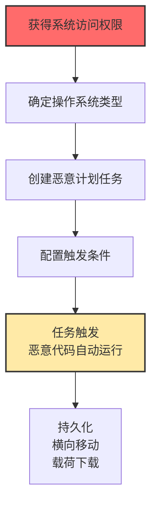

# 计划任务/作业 (T1053)

## 一句话通俗理解

**攻击者利用系统的"定时闹钟"功能，设定恶意程序在特定时间或开机时自动运行——就像在你家装了一个定时炸弹，到点就爆。**

## 难度等级

⭐️⭐️ 中级（需要一定基础）

需要了解不同操作系统的任务调度机制，但操作本身并不复杂。

## 技术描述

所有操作系统都有任务调度功能：Windows有任务计划程序（Task Scheduler），Linux有cron，macOS有launchd。这些功能本来是让管理员设定"每天凌晨3点备份数据库"、"每周五生成报告"之类的自动化任务用的。攻击者利用这些功能来实现持久化、权限提升和逃避检测。

**通俗解释：**
计划任务就像你家里的"定时闹钟"或"扫地机器人定时清扫"。你的初衷是让它在你不在家时自动工作，但如果坏人控制了你的"闹钟"，他就可以设定在凌晨3点——当你熟睡时——打开所有的门和窗户。攻击者就是利用系统的这些"定时器"来执行恶意操作。

**技术原理：**
1. 每个操作系统都有内置的任务调度服务（Windows Task Scheduler、Linux cron/systemd）
2. 任务可以配置触发条件（时间、系统启动、用户登录、特定事件等）
3. 任务可以指定运行的用户身份（包括高权限用户）
4. 攻击者创建任务时指向恶意程序，任务触发时恶意代码自动运行

**用途与影响：**
计划任务可以实现可靠的持久化（即使重启也不会丢失）、权限提升（以管理员/SYSTEM身份运行）、逃避检测（只在特定时间执行），甚至可以在远程系统上创建任务实现横向移动。

## 子技术列表

**该技术共有 5 个子技术：**

| 子技术ID | 中文名称 | 通俗解释 |
|----------|----------|----------|
| T1053.002 | At | Windows的at命令（已弃用），用于创建一次性计划任务 |
| T1053.003 | Cron | Linux/macOS的定时任务调度器，通过crontab配置 |
| T1053.005 | 计划任务 | Windows的任务计划程序（schtasks.exe），功能最强大 |
| T1053.006 | Systemd Timers | Linux systemd的定时器，现代Linux系统的cron替代品 |
| T1053.007 | 容器编排作业 | Kubernetes CronJob，云原生环境的定时任务 |

<details>
<summary><strong>展开查看各子技术详细说明</strong></summary>

### T1053.005 - 计划任务（最常用）

**通俗理解：** Windows的任务计划程序，像手机上的"提醒事项"应用，你可以设置任何程序在指定时间运行。

**详细说明：**
Windows Task Scheduler提供了最丰富的任务配置选项，包括触发器（启动时、登录时、空闲时、特定事件等）、操作（启动程序、发送邮件、显示消息）、条件（仅在交流电源下运行、仅在网络可用时运行）和设置（允许按需运行、如果运行超过X时间停止等）。攻击者使用`schtasks /create`命令来创建任务，`schtasks /run`来立即运行任务。

</details>

## 攻击流程

### 典型攻击流程

```
获得访问权限 --> 确定任务调度机制 --> 创建恶意计划任务 --> 任务触发执行恶意代码 --> 实现持久化或横向移动
```



**步骤详解：**

1. **获得访问权限**
   - 通俗描述：先获得执行命令的能力
   - 技术细节：通过钓鱼、漏洞利用或凭证窃取获得初始访问
   - 常用工具：Cobalt Strike、Metasploit

2. **确定任务调度机制**
   - 通俗描述：看目标系统是Windows、Linux还是macOS
   - 技术细节：Windows用schtasks，Linux用crontab或systemd，macOS用launchd
   - 常用工具：系统自带命令

3. **创建恶意计划任务**
   - 通俗描述：设定一个"定时器"，让恶意程序按时运行
   - 技术细节：Windows: `schtasks /create /tn "Update" /tr "malware.exe" /sc onlogon`
   - 常用工具：schtasks.exe、crontab

4. **任务触发执行**
   - 通俗描述：等到设定的时间或事件发生，恶意程序自动启动
   - 技术细节：任务以配置的用户权限运行，可以是高权限
   - 常用工具：无

## 真实案例

### 案例1：Black Basta勒索软件利用计划任务进行持久化和横向移动（2024）

- **时间**: 2024年
- **目标**: 全球多个行业的企业
- **攻击组织**: Black Basta
- **手法**: Black Basta勒索软件组织在入侵企业网络后，使用`schtasks.exe`创建恶意计划任务来维持持久化访问。他们创建名为"UpdateService"或"SystemCheck"等看似合法的任务，配置为在系统启动时或每隔特定时间执行恶意载荷。同时，他们还通过远程创建计划任务在域内其他系统上部署勒索软件，实现大规模横向移动。
- **影响**: 数十家企业被加密，造成数亿美元损失
- **参考链接**: [CISA AA24-131A](https://www.cisa.gov/news-events/cybersecurity-advisories/aa24-131a)

### 案例2：Lazarus Group利用计划任务和DLL侧加载实现持久化（2024）

- **时间**: 2024年
- **目标**: 加密货币交易所和金融科技公司
- **攻击组织**: Lazarus Group（朝鲜）
- **手法**: 朝鲜Lazarus组织在获得初始访问后，创建Windows计划任务来维持持久化。他们将恶意DLL侧加载到合法的系统工具中，然后通过计划任务定期执行这些工具。他们使用`schtasks /create`命令创建名称伪装为系统更新或安全扫描的任务，指向被劫持的合法可执行文件。
- **影响**: 加密货币交易所被窃取大量数字资产
- **参考链接**: [Mandiant Lazarus分析](https://www.mandiant.com/resources/blog/lazarus-job-opportunities)

### 案例3：加密货币挖矿恶意软件利用cron作业持久化（2024-2025）

- **时间**: 2024-2025年
- **目标**: 全球Linux云服务器
- **攻击组织**: Kinsing、TeamTNT
- **手法**: 多种加密货币挖矿恶意软件在入侵Linux服务器后，通过修改crontab文件实现持久化。他们添加cron条目，每几分钟从远程服务器下载并执行最新的挖矿脚本。即使管理员删除了挖矿进程，cron作业会在下次触发时重新下载并启动。攻击者还会使用隐藏技术，如将cron条目存储在非标准位置。
- **影响**: 数十万台云服务器被用于挖矿，造成巨额电费
- **参考链接**: [AquaSec Kinsing分析](https://www.aquasec.com/blog/kinsing-malware-container-vulnerability/)

### 案例4：Kubernetes CronJob滥用进行加密货币挖矿（2024-2025）

- **时间**: 2024-2025年
- **目标**: 使用Kubernetes的企业
- **攻击组织**: 多个挖矿团伙
- **手法**: 攻击者在获得Kubernetes集群访问权限后，创建恶意的CronJob来定期执行加密货币挖矿容器。由于CronJob是Kubernetes原生资源，通常不会被传统安全解决方案监控。攻击者将CronJob部署在不常见的命名空间中，使用看似合法的名称，并配置为在每个节点上运行挖矿工作负载。
- **影响**: 企业Kubernetes集群被滥用，产生巨额云费用
- **参考链接**: [Sysdig K8s挖矿分析](https://sysdig.com/blog/cryptojacking-kubernetes/)

## 红队视角

> ⚠️ **免责声明**：以下内容仅用于合法的安全测试、渗透测试和教育目的。未经授权对他人系统进行测试是违法行为。

### 实战技巧

1. **使用看似合法的任务名称**
   创建计划任务时使用看起来正常的名称，如"WindowsUpdate"、"SystemMaintenance"、"AdobeUpdater"等，避免引起管理员注意。

2. **使用XML直接创建任务绕过监测**
   Windows计划任务支持XML格式的导入导出。通过直接写入XML文件到任务目录（C:\Windows\System32\Tasks\），可以绕过一些基于schtasks命令行参数的检测。

3. **利用远程计划任务创建进行横向移动**
   使用`schtasks /create /s target_ip /u domain\user /p password /tn "TaskName" /tr "payload.exe" /sc onlogon`在远程系统上创建任务。

### 常用工具

| 工具名称 | 用途 | 平台 | 链接 |
|----------|------|------|------|
| schtasks.exe | Windows计划任务命令行工具 | Windows | 系统自带 |
| crontab | Linux定时任务管理工具 | Linux | 系统自带 |
| systemctl | Linux systemd服务管理工具 | Linux | 系统自带 |
| SharpPersist | Windows持久化工具，支持计划任务 | Windows | https://github.com/fireeye/SharPersist |
| PersistenceSniper | PowerShell持久化检测工具 | Windows | https://github.com/last-byte/PersistenceSniper |

### 注意事项

- 创建计划任务时，确保任务名与已有系统任务不冲突
- Windows计划任务默认以SYSTEM权限运行，但需要管理员权限才能创建
- Linux cron作业在当前用户上下文中运行，root用户的cron以root权限运行

## 蓝队视角

### 检测要点

1. **监控计划任务创建事件**
   - 日志来源：Windows安全事件日志 Event ID 4698
   - 关注字段：任务名称、任务内容、创建者账户
   - 异常特征：任务名称看起来可疑（如包含随机字符），或任务指向非系统目录的可执行文件

2. **监控schtasks.exe和at.exe的执行**
   - 日志来源：Sysmon Event ID 1、Windows Event ID 4688
   - 关注字段：命令行参数、父进程
   - 异常特征：从Office或浏览器进程创建的schtasks.exe，或包含可疑的任务名和路径

3. **监控Linux cron文件的修改**
   - 日志来源：Linux auditd、文件完整性监控
   - 关注字段：/etc/crontab、/var/spool/cron/ 的变更
   - 异常特征：非管理员用户或非正常工作时间的文件修改

### 监控建议

- 建立计划任务基线，记录正常的系统任务列表
- 定期通过`schtasks /query /v /fo csv`导出所有任务并与基线对比
- 监控Windows任务目录C:\Windows\System32\Tasks\的新增和修改
- 在Linux上使用auditd监控`/etc/crontab`和`/var/spool/cron/`的变更

## 检测建议

### 网络层检测

**检测方法：** 监控远程计划任务创建的网络流量

**具体规则/命令示例：**
```
# 监控发往远程135端口的异常连接（远程任务创建使用RPC）
netstat -an | findstr ":135"
```

**示例（Snort/Suricata规则）：**
```
alert tcp $HOME_NET any -> $HOME_NET 135 (msg:"Possible Remote Scheduled Task Creation"; flow:to_server; sid:1000002; rev:1;)
```

### 主机层检测

**Windows事件ID：**
- 事件ID 4698：计划任务创建
- 事件ID 4699：计划任务删除
- 事件ID 4700：计划任务启用
- 事件ID 4701：计划任务禁用
- 事件ID 4702：计划任务更新

**具体命令示例：**
```powershell
# 查询计划任务创建事件
Get-WinEvent -FilterHashtable @{LogName='Security'; ID=4698} | Select-Object -First 20

# 列出所有计划任务
Get-ScheduledTask | Where-Object {$_.State -ne 'Disabled'} | Select-Object TaskName, TaskPath, State
```

### 应用层检测

**Sigma规则示例：**
```yaml
title: Scheduled Task Creation - Suspicious Task Name
status: experimental
description: Detects creation of scheduled tasks with suspicious names
logsource:
    category: process_creation
    product: windows
detection:
    selection:
        Image|endswith: '\schtasks.exe'
        CommandLine|contains|all:
            - '/create'
            - '/tn'
            - 'UpdateService' or 'SystemMaintenance'
    condition: selection
level: medium
tags:
    - attack.t1053
    - attack.execution
```

## 缓解措施

### 优先级1：关键措施

**措施名称：** 限制计划任务创建权限

**具体实施步骤：**
1. 通过组策略限制谁可以创建或修改计划任务
2. 非管理员用户不应有创建计划任务的权限
3. 审查并移除不必要的计划任务创建权限

### 优先级2：重要措施

**措施名称：** 定期审计计划任务

**具体实施步骤：**
1. 每月导出所有计划任务清单
2. 对比最新清单与基线，检查新增或修改的任务
3. 对每个可疑任务进行调查

**措施名称：** 应用程序控制

**具体实施步骤：**
1. 使用AppLocker限制schtasks.exe只能由管理员执行
2. 在Windows Server Core上禁用不必要的任务计划功能

### 优先级3：建议措施

**措施名称：** 日志集中管理

**具体实施步骤：**
1. 将计划任务相关事件日志发送到SIEM
2. 设置告警：当检测到新的计划任务创建时自动通知安全团队

### MITRE ATT&CK 缓解措施映射

| 缓解措施ID | 缓解措施名称 | 适用性 | 说明 |
|------------|-------------|--------|------|
| M1018 | 用户账户控制 | 适用 | 限制非管理员用户创建计划任务的能力 |
| M1022 | 应用程序控制 | 适用 | 限制schtasks.exe的执行权限 |
| M1026 | 特权账户管理 | 适用 | 保护高权限账户不被用于创建恶意任务 |
| M1030 | 网络分段 | 部分适用 | 限制远程计划任务创建的网络访问 |
| M1045 | 软件更新 | 部分适用 | 保持系统最新，防止漏洞利用获得管理员权限 |

## 动手实验

> ⚠️ **重要提示**：所有实验必须在隔离的实验室环境中进行，禁止对未授权的真实系统进行测试。

### 实验环境准备

**推荐靶场/实验平台：**

| 平台名称 | 类型 | 难度 | 链接 |
|----------|------|------|------|
| Detection Lab | 虚拟靶场 | 初级 | https://github.com/clong/DetectionLab |
| Atomic Red Team | 测试框架 | 初级 | https://github.com/redcanaryco/atomic-red-team |
| Hack The Box | CTF | 中级 | https://www.hackthebox.com/ |

**所需工具：**
- Windows虚拟机 + Linux虚拟机
- PowerShell + Sysmon
- Atomic Red Team

### 实验1：创建Windows计划任务（初级）

**实验目标：** 学习使用schtasks.exe创建和管理计划任务

**实验步骤：**
1. 以管理员身份打开CMD
2. 创建一个在用户登录时执行的计划任务：
   ```cmd
   schtasks /create /tn "WindowsUpdate" /tr "C:\temp\test.bat" /sc onlogon /ru SYSTEM
   ```
3. 查看任务详情：`schtasks /query /tn "WindowsUpdate" /v /fo list`
4. 删除任务：`schtasks /delete /tn "WindowsUpdate" /f`

**预期结果：** 成功创建、查看和删除Windows计划任务

**学习要点：** 理解schtasks命令的语法和任务配置选项

### 实验2：创建Linux cron作业（初级）

**实验目标：** 学习使用crontab创建定时任务

**实验步骤：**
1. 打开终端
2. 添加一个每5分钟执行一次的cron作业：
   ```bash
   (crontab -l 2>/dev/null; echo "*/5 * * * * /tmp/backup.sh") | crontab -
   ```
3. 查看当前cron作业：`crontab -l`
4. 删除所有cron作业：`crontab -r`

### 实验3：检测计划任务创建（中级）

**实验目标：** 学习使用PowerShell和事件日志检测计划任务的创建

**实验步骤：**
1. 在创建计划任务前后，查询安全事件日志：
   ```powershell
   Get-WinEvent -FilterHashtable @{LogName='Security'; ID=4698} | Select-Object -First 10
   ```
2. 使用Sysmon Event ID 1监控schtasks.exe执行
3. 分析任务XML内容，识别异常任务

## 术语解释

| 术语 | 英文原名 | 通俗解释 |
|------|----------|----------|
| 计划任务 | Scheduled Task | 系统的"定时闹钟"，在指定时间自动运行指定程序 |
| crontab | Cron Table | Linux的"闹钟设置表"，写好了什么时间做什么事 |
| schtasks.exe | Scheduled Tasks | Windows的"闹钟管理工具"，用于创建和管理计划任务 |
| systemd timer | Systemd Timer | Linux新版"闹钟系统"，比cron更强大 |
| CronJob | Cron Job | Kubernetes上的"云端闹钟"，在容器环境中定时执行任务 |
| 持久化 | Persistence | 攻击者确保自己"走了还能再回来"的技术 |
| 触发器 | Trigger | 决定计划任务在"什么时候"或"什么情况下"执行的规则 |

## 参考资料

### 官方文档

- [MITRE ATT&CK T1053官方页面](https://attack.mitre.org/techniques/T1053/)
- [Windows任务计划程序文档](https://docs.microsoft.com/en-us/windows/win32/taskschd/task-scheduler-start-page)
- [Linux crontab文档](https://man7.org/linux/man-pages/man5/crontab.5.html)

### 安全报告

- [CISA Black Basta勒索软件公告](https://www.cisa.gov/news-events/cybersecurity-advisories/aa24-131a)
- [Mandiant Lazarus分析](https://www.mandiant.com/resources/blog/lazarus-job-opportunities)

### 工具与资源

- [Windows计划任务安全最佳实践](https://www.crowdstrike.com/blog/how-to-detect-and-prevent-scheduled-task-abuse/)
- [Kubernetes CronJob安全](https://kubernetes.io/docs/concepts/workloads/controllers/cron-jobs/)
- [Atomic Red Team T1053测试](https://www.atomicredteam.io/atomics/T1053/)

### 学习资料

- [Linux持久化技术](https://www.blackhat.com/docs/us-17/thursday/us-17-Kachalia-Linux-Persistence-Techniques.pdf)
- [Windows计划任务攻击与检测](https://posts.specterops.io/the-phantom-account-47795296c03a)
