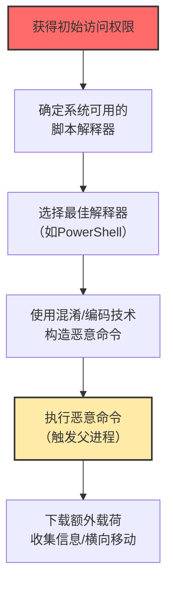

# 命令和脚本解释器 (T1059)

## 一句话通俗理解

**攻击者利用系统自带的命令行工具（PowerShell、cmd、Python等）来执行恶意命令——就像用你家的菜刀来做坏事，刀本身是合法的工具。**

## 难度等级

⭐️ 初级（新手可学）

大部分命令和脚本解释器系统自带，无需额外工具，入门门槛低。

## 技术描述

命令和脚本解释器是攻击者最常用的执行技术，没有之一。所有操作系统都自带命令行工具和脚本解释器：Windows有PowerShell和cmd.exe，Linux有bash/zsh，macOS有zsh，还有跨平台的Python、JavaScript等。攻击者直接利用这些"合法工具"来执行恶意命令，因为这些工具本身就是系统正常运行的一部分，安全软件很难把它们全部拦截。

**通俗解释：**
就像家里的菜刀——它本身是合法的厨房工具，但坏人可以用它来做坏事。系统自带的命令行工具也是合法的系统工具，攻击者"就地取材"，用这些工具来执行恶意操作。这就是所谓"Living off the Land"（就地取材）攻击策略。

**技术原理：**
1. 操作系统默认安装了各种脚本解释器（PowerShell、bash、Python等）
2. 这些解释器可以执行文件操作、网络通信、进程管理等各种操作
3. 攻击者将恶意命令编码或混淆（如Base64编码），绕过简单的字符串匹配检测
4. 恶意代码可以在内存中直接执行，不在磁盘上留下文件（无文件攻击）
5. 攻击者利用父进程关系（如Word启动PowerShell）来伪装操作

**用途与影响：**
命令和脚本解释器是90%以上攻击活动的基础组件。从初始访问（钓鱼邮件中的宏）到数据窃取（PowerShell下载敏感文件），几乎每个攻击阶段都会用到。它的普遍性和合法性使其成为攻击者最依赖的技术。

## 子技术列表

**该技术共有 13 个子技术：**

| 子技术ID | 中文名称 | 通俗解释 |
|----------|----------|----------|
| T1059.001 | PowerShell | Windows下最强大的脚本工具，红队的"瑞士军刀" |
| T1059.002 | AppleScript | macOS的自动化脚本语言，可以控制应用程序和系统操作 |
| T1059.003 | Windows命令行 | 经典的cmd.exe，虽然老但仍被广泛使用 |
| T1059.004 | Unix Shell | Linux/macOS的bash、zsh等shell，服务器渗透的必备工具 |
| T1059.005 | Visual Basic | VBA宏和VBScript，Office文档攻击的经典载体 |
| T1059.006 | Python | 跨平台脚本语言，丰富的库生态，常用于编写后门和工具 |
| T1059.007 | JavaScript | 浏览器端脚本，也通过Node.js在服务端运行 |
| T1059.008 | 网络设备CLI | 路由器、交换机等网络设备的命令行接口 |
| T1059.009 | 云API | 利用云平台的API和CLI工具执行恶意操作 |
| T1059.010 | AutoHotKey/AutoIT | Windows自动化脚本工具，常被恶意软件用来模拟用户操作 |
| T1059.011 | Lua | 轻量级脚本语言，常嵌入在游戏和应用中 |
| T1059.012 | 虚拟化管理CLI | ESXi、KVM等虚拟化平台的命令行工具 |
| T1059.013 | 容器CLI/API | Docker、kubectl等容器管理命令行工具 |

## 攻击流程

### 典型攻击流程

```
获得访问权限 --> 确定可用的脚本解释器 --> 构造混淆命令 --> 执行恶意代码 --> 下载载荷/窃取数据
```



**步骤详解：**

1. **获得初始访问权限**
   - 通俗描述：通过钓鱼邮件、漏洞利用等方式进入目标系统
   - 技术细节：获取可以执行命令的权限（如通过Office宏、浏览器漏洞）
   - 常用工具：钓鱼邮件套件、漏洞利用框架

2. **确定可用的脚本解释器**
   - 通俗描述：看看目标系统上有哪些"工具"可以用
   - 技术细节：Windows上通常有PowerShell和cmd，Linux上有bash
   - 常用工具：系统自带的命令行工具

3. **构造混淆命令**
   - 通俗描述：把恶意命令"包装"一下，让安全软件认不出来
   - 技术细节：Base64编码、变量替换、字符串拼接、反射加载
   - 常用工具：PowerShell编码工具、混淆框架

4. **执行恶意代码**
   - 通俗描述：让命令在目标系统上跑起来
   - 技术细节：使用父进程（如Word）触发PowerShell执行编码命令
   - 常用工具：Office宏、钓鱼附件

## 真实案例

### 案例1：Volt Typhoon利用PowerShell和LOLBins进行隐蔽渗透（2023-2025）

- **时间**: 2023-2025年
- **目标**: 美国关键基础设施（通信、能源、水务等）
- **攻击组织**: Volt Typhoon
- **手法**: 中国国家支持的黑客组织Volt Typhoon大量使用"就地取材"（Living off the Land）技术，包括PowerShell、cmd.exe、wmic.exe等系统自带工具来执行恶意操作。他们刻意避免使用自定义恶意软件，而是通过PowerShell执行系统发现命令、建立持久化、进行横向移动。整个攻击链几乎全部使用合法的系统工具完成，使得传统杀毒软件几乎无法检测。
- **影响**: 美国关键基础设施受到长期潜伏威胁
- **参考链接**: [Microsoft Volt Typhoon分析](https://www.microsoft.com/en-us/security/blog/2023/05/24/volt-typhoon-targets-us-critical-infrastructure-with-living-off-the-land-techniques/)

### 案例2：Scattered Spider利用社会工程结合PowerShell窃取凭证（2024-2025）

- **时间**: 2024-2025年
- **目标**: 博彩、零售、航空等行业
- **攻击组织**: Scattered Spider
- **手法**: Scattered Spider组织通过电话社工（Vishing）冒充IT帮助台获取初始访问后，使用PowerShell脚本部署远程管理工具（如AnyDesk、TeamViewer），执行凭证窃取脚本，并通过PowerShell Remoting在企业网络内横向移动。该组织特别擅长利用PowerShell的下载功能（`Invoke-WebRequest`）从外部服务器拉取后渗透工具包。
- **影响**: 多家大型企业数据泄露，经济损失严重
- **参考链接**: [CISA AA23-320A](https://www.cisa.gov/news-events/cybersecurity-advisories/aa23-320a)

### 案例3：ClickFix攻击利用PowerShell执行恶意载荷（2024-2025）

- **时间**: 2024-2025年
- **目标**: 全球互联网用户
- **攻击组织**: 多个犯罪团伙
- **手法**: ClickFix是2024-2025年最火爆的攻击手法之一。攻击者创建假的验证码页面或错误提示页面，诱导用户复制一段PowerShell命令并粘贴到运行对话框中执行。这些PowerShell命令通常会从远程服务器下载信息窃取木马（如Lumma Stealer、StealC）或远程控制工具（如AsyncRAT）。这种攻击之所以有效，是因为用户"自愿"执行了恶意命令，绕过了几乎所有的自动安全检测机制。
- **影响**: 数百万用户受影响，窃取大量凭证和加密货币
- **参考链接**: [Proofpoint ClickFix分析](https://www.proofpoint.com/us/blog/threat-insight/clickfix-social-engineering-lures-are-here-stay)

### 案例4：APT29利用PowerShell进行SUNBURST供应链攻击（持续影响）

- **时间**: 2020年（影响持续到2024年）
- **目标**: 美国政府机构和智库
- **攻击组织**: APT29（Cozy Bear）
- **手法**: APT29组织在SolarWinds供应链攻击中，利用PowerShell执行内存中的凭证收集工具。攻击者通过PowerShell的`Invoke-Expression`和`[Ref].Assembly`等技术将恶意脚本反射加载到内存中，避免写入磁盘。他们使用PowerShell远程处理在受感染系统之间横向移动，收集管理员凭证并访问敏感信息。
- **影响**: 18,000个组织受影响，包括多个美国政府机构
- **参考链接**: [FireEye SolarWinds分析](https://www.fireeye.com/blog/threat-research/2020/12/evasive-attacker-leverages-solarwinds-supply-chain-compromises-with-sunburst-backdoor.html)

## 红队视角

> ⚠️ **免责声明**：以下内容仅用于合法的安全测试、渗透测试和教育目的。未经授权对他人系统进行测试是违法行为。

### 实战技巧

1. **优先使用PowerShell**
   PowerShell是Windows环境下最强大的工具，几乎可以做任何事情（执行命令、网络通信、操作注册表、调用Windows API等）。熟练掌握PowerShell是红队的基本功。

2. **使用Base64编码命令**
   使用`-EncodedCommand`参数来混淆命令内容，绕过简单的命令行检测。解码后分析命令内容，关注下载和执行操作。

3. **利用AMSI绕过技术**
   AMSI（反恶意软件扫描接口）会扫描PowerShell脚本内容。使用反射加载、内存修补等技术绕过AMSI检测。

### 常用工具

| 工具名称 | 用途 | 平台 | 链接 |
|----------|------|------|------|
| PowerShell | Windows强大脚本工具 | Windows | 系统自带 |
| PowerSploit | PowerShell渗透测试框架 | Windows | https://github.com/PowerShellMafia/PowerSploit |
| Empire | PowerShell后渗透框架 | 跨平台 | https://github.com/BC-SECURITY/Empire |
| Nishang | PowerShell攻击和渗透脚本集 | Windows | https://github.com/samratashok/nishang |
| PSBits | PowerShell技巧和绕过脚本 | Windows | https://github.com/gtworek/PSBits |

### 注意事项

- PowerShell日志（脚本块日志Event ID 4104）会记录执行的脚本内容
- PowerShell v2不支持脚本块日志，但已在新版Windows中移除
- 在Linux环境下，bash脚本配合curl/wget是标准的"就地取材"组合

## 蓝队视角

### 检测要点

1. **监控可疑的PowerShell命令行参数**
   - 日志来源：Windows Event ID 4688、Sysmon Event ID 1
   - 关注字段：命令行参数中的`-EncodedCommand`、`-ExecutionPolicy Bypass`、`-WindowStyle Hidden`
   - 异常特征：Word/Excel/Outlook生成powershell.exe或cmd.exe是强烈可疑信号

2. **启用PowerShell日志记录**
   - 日志来源：PowerShell脚本块日志 Event ID 4104
   - 关注字段：脚本内容、用户身份
   - 异常特征：从外部URL下载内容并执行的脚本

3. **检测AMSI绕过尝试**
   - 日志来源：Windows Defender Event ID 1116、AMSI ETW日志
   - 关注字段：对AmsiUtils类的反射调用
   - 异常特征：尝试修补或绕过AMSI的代码

### 监控建议

- 启用PowerShell脚本块日志（Event ID 4104）、模块日志和转录日志
- 监控脚本解释器发起的到外部地址的HTTP/HTTPS连接
- 使用Sysmon监控进程创建（Event ID 1）和网络连接（Event ID 3）

## 检测建议

### 网络层检测

**检测方法：** 监控脚本解释器发起的异常网络连接

**具体规则/命令示例：**
```bash
# 监控PowerShell的异常网络连接
# 关注从powershell.exe或cmd.exe到外部IP的连接
```

**示例（Snort/Suricata规则）：**
```
alert tcp $HOME_NET any -> $EXTERNAL_NET $HTTP_PORTS (msg:"PowerShell Download from External"; flow:to_server; content:"powershell"; nocase; sid:1000003; rev:1;)
```

### 主机层检测

**Windows事件ID：**
- 事件ID 4103：PowerShell模块日志（命令执行详情）
- 事件ID 4104：PowerShell脚本块日志（记录实际脚本内容）
- 事件ID 4688：进程创建（监控powershell.exe启动）

**具体命令示例：**
```powershell
# 查询PowerShell脚本块日志
Get-WinEvent -FilterHashtable @{LogName='Microsoft-Windows-PowerShell/Operational'; ID=4104} | Select-Object -First 10

# 检查PowerShell日志级别设置
Get-ItemProperty -Path "HKLM:\SOFTWARE\Policies\Microsoft\Windows\PowerShell\ScriptBlockLogging"
```

### 应用层检测

**Sigma规则示例：**
```yaml
title: PowerShell EncodedCommand - Suspicious Execution
status: experimental
description: Detects PowerShell execution with encoded command
logsource:
    category: process_creation
    product: windows
detection:
    selection:
        Image|endswith: '\powershell.exe'
        CommandLine|contains: '-EncodedCommand'
    condition: selection
level: high
tags:
    - attack.t1059
    - attack.execution
```

## 缓解措施

### 优先级1：关键措施

**措施名称：** 启用PowerShell全面日志记录

**具体实施步骤：**
1. 通过组策略启用脚本块日志、模块日志和转录日志
2. 配置日志集中收集和分析
3. 设置日志告警规则

**配置示例：**
```
# 通过GPO设置PowerShell日志
计算机配置 > 管理模板 > Windows组件 > Windows PowerShell
打开"启用脚本块日志记录"和"启用模块日志记录"
```

### 优先级2：重要措施

**措施名称：** 实施PowerShell受限语言模式

**具体实施步骤：**
1. 在非管理终端上启用Constrained Language Mode
2. 限制可用的.NET类型和方法调用
3. 测试业务兼容性后逐步推广

**措施名称：** 应用程序控制

**具体实施步骤：**
1. 使用AppLocker或WDAC限制脚本解释器的使用范围
2. 在非开发系统上限制PowerShell的执行
3. 禁用不必要的脚本解释器（如WSH、VBScript）

### 优先级3：建议措施

**措施名称：** 安全意识培训

**具体实施步骤：**
1. 教育用户识别钓鱼和社会工程攻击
2. 培训用户不要从互联网复制粘贴命令执行
3. 定期进行钓鱼演练

### MITRE ATT&CK 缓解措施映射

| 缓解措施ID | 缓解措施名称 | 适用性 | 说明 |
|------------|-------------|--------|------|
| M1042 | 禁用功能或服务 | 适用 | 禁用不必要的脚本解释器（如VBScript） |
| M1022 | 应用程序控制 | 适用 | 限制脚本解释器的执行权限 |
| M1038 | 防止恶意软件 | 适用 | 使用防病毒和EDR检测恶意脚本 |
| M1047 | 审计 | 适用 | 启用脚本执行日志记录 |
| M1018 | 用户账户控制 | 适用 | 限制非管理员用户的脚本执行能力 |

## 动手实验

> ⚠️ **重要提示**：所有实验必须在隔离的实验室环境中进行，禁止对未授权的真实系统进行测试。

### 实验环境准备

**推荐靶场/实验平台：**

| 平台名称 | 类型 | 难度 | 链接 |
|----------|------|------|------|
| Detection Lab | 虚拟靶场 | 初级 | https://github.com/clong/DetectionLab |
| Atomic Red Team | 测试框架 | 初级 | https://github.com/redcanaryco/atomic-red-team |
| Hack The Box | CTF | 中级 | https://www.hackthebox.com/ |

### 实验1：PowerShell编码命令执行（初级）

**实验目标：** 学习PowerShell编码命令的使用和检测

**实验步骤：**
1. 创建一个简单的命令并编码：
   ```powershell
   $command = "Write-Host 'Hello from encoded command'"
   $bytes = [System.Text.Encoding]::Unicode.GetBytes($command)
   $encoded = [Convert]::ToBase64String($bytes)
   ```
2. 执行编码命令：`powershell -EncodedCommand $encoded`
3. 查看4104事件日志中的脚本内容

**预期结果：** 成功执行编码命令，并在日志中看到脚本内容

### 实验2：检测可疑的父子进程关系（中级）

**实验目标：** 学习使用Sysmon检测异常的进程启动

**实验步骤：**
1. 启动Sysmon并配置进程创建监控
2. 模拟从Word启动PowerShell的场景
3. 观察Sysmon Event ID 1中的父进程信息

### 实验3：使用Atomic Red Team测试T1059（中级）

**实验目标：** 使用Atomic Red Team测试框架检测T1059

**实验步骤：**
```bash
# 安装Atomic Red Team
Install-Module -Name invoke-atomicredteam -Scope CurrentUser
# 运行T1059检测测试
Invoke-AtomicTest T1059 -TestNumbers 1
```

## 术语解释

| 术语 | 英文原名 | 通俗解释 |
|------|----------|----------|
| LOLBins | Living off the Land Binaries | "就地取材"的合法程序，攻击者用系统自带的工具干坏事 |
| AMSI | Antimalware Scan Interface | Windows的"安检门"，在脚本执行前扫描是否包含恶意代码 |
| 脚本块日志 | Script Block Logging | PowerShell的"黑匣子"，记录所有执行过的脚本内容 |
| 反射加载 | Reflection Loading | 把代码直接加载到内存中执行，不在硬盘上留下文件 |
| 受约束语言模式 | Constrained Language Mode | PowerShell的"安全模式"，限制能使用的功能和API |
| 编码命令 | Encoded Command | 用Base64"加密"过的命令，用来绕过简单的关键字检测 |
| 无文件攻击 | Fileless Attack | 不写文件到硬盘的攻击方式，只在内存中执行，更难被发现 |

## 参考资料

### 官方文档

- [MITRE ATT&CK T1059官方页面](https://attack.mitre.org/techniques/T1059/)
- [PowerShell日志记录最佳实践](https://docs.microsoft.com/en-us/powershell/scripting/windows-powershell/wmf/overview)

### 安全报告

- [Volt Typhoon攻击分析](https://www.microsoft.com/en-us/security/blog/2023/05/24/volt-typhoon-targets-us-critical-infrastructure-with-living-off-the-land-techniques/)
- [ClickFix攻击技术分析](https://www.proofpoint.com/us/blog/threat-insight/clickfix-social-engineering-lures-are-here-stay)
- [CISA Scattered Spider公告](https://www.cisa.gov/news-events/cybersecurity-advisories/aa23-320a)

### 工具与资源

- [LOLBins项目](https://lolbas-project.github.io/)
- [Atomic Red Team T1059测试](https://www.atomicredteam.io/atomics/T1059/)
- [PowerShell安全最佳实践](https://docs.microsoft.com/en-us/powershell/scripting/learn/remoting/winrmsecurity)

### 学习资料

- [PowerShell攻击与防御系列](https://www.youtube.com/playlist?list=PL6XzfVJxv_Cj29M4FniBtRlP7OimhH3W2)
- [Living off the Land攻击哲学](https://www.elastic.co/blog/embracing-offensive-tools-in-your-defensive-arsenal)
