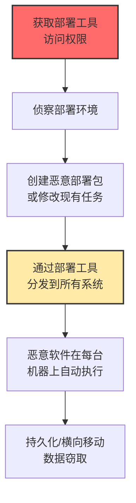

# 软件部署工具 (T1072)

## 一句话通俗理解

**攻击者劫持企业用来批量装软件的工具（如SCCM、Ansible），一次性向全公司电脑推送恶意软件——就像快递员被收买了，送的包裹里全是炸弹。**

## 难度等级

⭐️⭐️ 中级（需要一定基础）

需要了解企业IT管理工具的使用方式和配置。

## 技术描述

企业通常使用软件部署工具（如Microsoft SCCM、Ansible、Puppet、Jamf Pro等）来在成百上千台电脑上统一安装软件、更新补丁、配置系统。攻击者一旦获得了这些工具的控制权，就可以利用它们的合法分发渠道，将恶意软件推送到所有受管理的系统上。

**通俗解释：**
想象一下，一个快递公司每天给整栋楼送快递。如果坏人控制了快递公司，他就可以在每一个"包裹"里放上炸弹——整栋楼的人都会收到！软件部署工具就是这个"快递公司"，而攻击者就是那个控制快递公司的坏人。一次部署可以影响成千上万的电脑。

**技术原理：**
1. 部署工具通常使用客户端-服务器架构，服务器端管理部署策略
2. 客户端定期从服务器拉取部署任务并执行
3. 部署工具通常拥有在所有客户端上的管理员权限
4. 攻击者通过获得服务器权限，修改部署策略来分发恶意软件

**用途与影响：**
软件部署工具被滥用后可以实现大规模传播、高权限执行、持久化（部署策略修改后恶意软件会被自动重新安装），以及在全公司范围内一次性完成攻击。

## 子技术列表

T1072目前没有定义子技术。

## 攻击流程

### 典型攻击流程

```
获取部署工具访问权限 --> 侦察部署环境 --> 创建恶意部署包 --> 分发给所有受管理系统 --> 恶意软件在所有机器上执行
```



**步骤详解：**

1. **获取部署工具访问权限**
   - 通俗描述：偷到部署系统的管理员密码
   - 技术细节：通过凭证窃取、配置错误利用获得SCCM/Ansible控制台访问
   - 常用工具：Mimikatz、SharpSCCM

2. **侦察部署环境**
   - 通俗描述：看看有多少台电脑受你控制
   - 技术细节：枚举受管理的系统列表、现有部署包、用户权限
   - 常用工具：SCCM控制台、Ansible命令

3. **创建或修改部署包**
   - 通俗描述：做一个看起来正常的"软件更新"，里面藏着恶意软件
   - 技术细节：将恶意载荷嵌入到合法的部署任务中
   - 常用工具：SCCM的Application模型、Ansible Playbook

4. **分发恶意软件**
   - 通俗描述：让所有电脑都收到这个"更新"
   - 技术细节：部署工具将恶意软件分发到所有受管理的客户端
   - 常用工具：部署工具自带的分发功能

## 真实案例

### 案例1：利用SCCM/MECM进行企业级横向移动（2024）

- **时间**: 2024年
- **目标**: 使用Microsoft SCCM/MECM的企业
- **攻击组织**: 多个攻击团伙
- **手法**: 通过窃取SCCM站点服务器的凭证或利用配置错误，可以修改现有的软件部署任务或创建新的恶意应用程序。攻击者可以将恶意可执行文件打包为看似合法的软件更新，通过SCCM分发到域内所有加入的客户端。工具SharpSCCM被公开发布，使得这种攻击更加容易实施。
- **影响**: SCCM客户端可以快速被大规模感染
- **参考链接**: [SharpSCCM工具](https://github.com/Mayyhem/SharpSCCM)

### 案例2：利用Ansible Playbook进行后门植入（2024）

- **时间**: 2024年
- **目标**: 使用Ansible进行自动化运维的企业
- **攻击组织**: 多个攻击团伙
- **手法**: 攻击者获得了对Ansible控制节点或代码仓库的访问权限后，修改Playbook来植入后门。他们可以在Playbook中添加任务来创建后门用户、修改防火墙规则、安装远程控制工具或修改SSH配置。由于Ansible Playbook通常以root权限运行且会推送到所有受管理的服务器，这种攻击可以一次性影响整个服务器集群。
- **影响**: 整个服务器集群被植入后门
- **参考链接**: [Ansible安全最佳实践](https://www.redhat.com/en/blog/ansible-security-best-practices)

### 案例3：利用Intune/MDM进行移动设备管理滥用（2024）

- **时间**: 2024年
- **目标**: 使用Microsoft Intune等MDM解决方案的企业
- **攻击组织**: 多个攻击团伙
- **手法**: 攻击者获得了Intune管理员权限后，可以向所有受管理的设备推送恶意配置文件或应用。他们可以创建合规性策略来强制安装恶意应用，或者修改设备配置来禁用安全功能。由于MDM通常拥有对设备的完全控制权，这种攻击的影响范围极大。
- **影响**: 企业所有移动设备被远程控制
- **参考链接**: [Microsoft Intune安全](https://learn.microsoft.com/en-us/mem/intune/fundamentals/what-is-intune)

## 红队视角

> ⚠️ **免责声明**：以下内容仅用于合法的安全测试、渗透测试和教育目的。未经授权对他人系统进行测试是违法行为。

### 实战技巧

1. **优先侦察目标的IT管理工具栈**
   了解企业使用的是SCCM、Ansible还是其他工具，每种工具的利用方式不同。使用网络扫描和凭证收集来发现部署工具。

2. **使用SharpSCCM等公开工具**
   SharpSCCM是专门针对SCCM的攻击工具，可以执行客户端推送安装、应用程序部署、策略修改等操作。

3. **修改Ansible Playbook时保持原有结构**
   在Playbook中只添加少量恶意任务，保持大部分功能正常，避免触发变更管理告警。

### 常用工具

| 工具名称 | 用途 | 平台 | 链接 |
|----------|------|------|------|
| SharpSCCM | SCCM利用和横向移动工具 | Windows | https://github.com/Mayyhem/SharpSCCM |
| Ansible | IT自动化工具（双刃剑） | Linux | https://github.com/ansible/ansible |
| PowerSCCM | SCCM后渗透PowerShell模块 | Windows | https://github.com/PowerShellMafia/PowerSCCM |
| SCCMExec | SCCM命令执行工具 | Windows | https://github.com/cons0l3/SCCMExec |

### 注意事项

- 部署工具通常有审计日志，操作后需要清理痕迹
- SharpSCCM等工具的使用可能被EDR检测
- 部署工具的权限极大，操作时要极其小心

## 蓝队视角

### 检测要点

1. **监控异常的部署活动**
   - 日志来源：SCCM审计日志、Ansible Tower日志
   - 关注字段：部署包创建者、部署时间、目标范围
   - 异常特征：非工作时间的部署、来自非常用账户的部署、部署包包含可执行文件

2. **监控部署工具的服务账户**
   - 日志来源：Windows安全事件日志
   - 关注字段：服务账户登录事件、异常的时间或地点
   - 异常特征：服务账户在非工作时间登录、从异常IP地址登录

3. **审计部署包内容**
   - 日志来源：版本控制系统、文件完整性监控
   - 关注字段：Playbook或配置文件变更
   - 异常特征：新增可疑的任务或脚本

### 监控建议

- 对部署活动实施变更管理和审批流程
- 定期审查部署工具的管理员列表
- 监控部署工具服务账户的异常使用

## 检测建议

### 网络层检测

**检测方法：** 监控SCCM、PDQ、Ansible等软件部署工具的非计划外使用流量，以及部署客户端到非标准端口或未知C2服务器的出站连接。

**具体规则/命令示例：**
```
# 检测SCCM客户端到非标准端口的连接
zeek -r traffic.pcap | grep "SCCM\|ccm" | grep -v "80\|443"

# 检测非工作时间的大规模软件推送流量
tcpdump -i eth0 port 445 -A | grep "deploy\|install" | grep -v "scheduled"
```

### 主机层检测

**Windows事件ID：**
- 事件ID 4688：进程创建（监控SCCM客户端进程）
- 事件ID 4698：计划任务创建（部署工具可能创建任务）

**具体命令示例：**
```powershell
# 查看SCCM客户端信息
Get-WmiObject -Namespace "root\ccm" -Class SMS_Client

# 查看已部署的应用程序
Get-WmiObject -Namespace "root\ccm\clientsdk" -Class CCM_Application
```

### 应用层检测

**Sigma规则示例：**
```yaml
title: SharpSCCM Tool Execution
status: experimental
description: Detects execution of SharpSCCM - SCCM abuse tool
logsource:
    category: process_creation
    product: windows
detection:
    selection:
        Image|endswith: '\SharpSCCM.exe'
        CommandLine|contains:
            - 'execute'
            - 'deploy'
            - 'application'
    condition: selection
level: critical
tags:
    - attack.t1072
    - attack.execution
```

## 缓解措施

### 优先级1：关键措施

**措施名称：** 严格的身份管理

**具体实施步骤：**
1. 对部署工具实施MFA
2. 使用最小权限原则分配管理员角色
3. 定期审查管理员账户列表

**措施名称：** 变更管理

**具体实施步骤：**
1. 所有部署任务需要审批流程
2. 部署配置变更需要版本控制和审计

### 优先级2：重要措施

**措施名称：** 凭证轮换

**具体实施步骤：**
1. 定期轮换部署工具的服务账户凭证
2. 使用托管服务账户（gMSA）自动管理凭证

### MITRE ATT&CK 缓解措施映射

| 缓解措施ID | 缓解措施名称 | 适用性 | 说明 |
|------------|-------------|--------|------|
| M1026 | 特权账户管理 | 适用 | 保护部署工具的管理员账户 |
| M1037 | 云基础设施保护 | 适用 | 保护云部署工具的安全 |
| M1018 | 用户账户控制 | 部分适用 | 限制非管理员对部署工具的访问 |

## 动手实验

> ⚠️ **重要提示**：所有实验必须在隔离的实验室环境中进行，禁止对未授权的真实系统进行测试。

### 实验环境准备

| 平台名称 | 类型 | 难度 | 链接 |
|----------|------|------|------|
| SCCM Lab | 虚拟靶场 | 高级 | https://github.com/CyberDefense/SCM-Lab |
| Atomic Red Team | 测试框架 | 初级 | https://github.com/redcanaryco/atomic-red-team |

### 实验1：了解SCCM部署架构

```powershell
# 查看SCCM客户端信息
Get-WmiObject -Namespace "root\ccm" -Class SMS_Client
# 查看已部署的应用程序
Get-WmiObject -Namespace "root\ccm\clientsdk" -Class CCM_Application
```

### 实验2：审计Ansible Playbook变更

```bash
# 检查Playbook的Git历史
git log --oneline --all -- "*.yml" "*.yaml"
# 查看最近的Playbook变更
git diff HEAD~5 -- playbooks/
```

## 术语解释

| 术语 | 英文原名 | 通俗解释 |
|------|----------|----------|
| SCCM | System Center Configuration Manager | 微软的"企业软件派送员" |
| MECM | Microsoft Endpoint Configuration Manager | SCCM的"新名字" |
| Ansible | Ansible | 开源的"自动化运维机器人" |
| MDM | Mobile Device Management | 手机和电脑的"远程管家" |
| Intune | Microsoft Intune | 微软的"云端远程管家" |
| Playbook | Playbook | Ansible的"任务清单" |

## 参考资料

- [MITRE ATT&CK T1072官方页面](https://attack.mitre.org/techniques/T1072/)
- [SharpSCCM工具](https://github.com/Mayyhem/SharpSCCM)
- [Ansible安全最佳实践](https://www.redhat.com/en/blog/ansible-security-best-practices)
- [SCCM安全加固指南](https://learn.microsoft.com/en-us/mem/configmgr/protect/understand/security-fundamentals)
