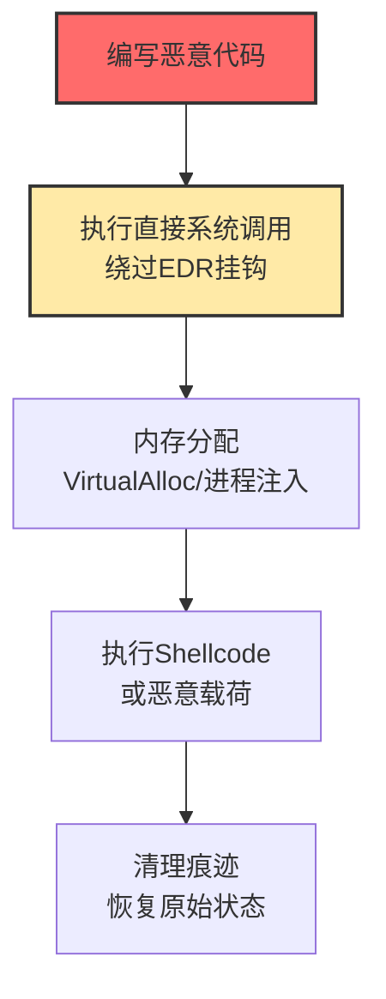

# 原生API (T1106)

## 一句话通俗理解

**攻击者绕过安全软件监控的"高楼层API"，直接调用操作系统底层的"地基函数"来执行恶意代码——就像小偷不走正门，而是从地下管道钻进来。**

## 难度等级

⭐️⭐️⭐️ 高级（需要深入技术知识）

需要深入了解操作系统内部机制和底层编程知识。

## 技术描述

原生API（Native API）是指操作系统提供的底层编程接口。在Windows中，这些API主要是NTDLL.DLL中导出的函数（以Nt或Zw开头）；在Linux中，这些是系统调用（syscalls）。正常情况下，应用程序通过Win32 API（如CreateFile、ReadFile）来操作系统，这些高层API最终会调用底层的原生API。

**通俗解释：**
小区有三个入口：大门（高层API）、侧门（正常原生API调用）、地下管道（直接系统调用）。安全软件（保安）在大门口检查每个人。攻击者发现可以从地下管道（直接执行syscall指令）进出，完全绕过保安。这就是原生API和直接系统调用的核心思想——绕过监控点。

**技术原理：**
1. 应用程序通常调用Win32 API（如kernel32.dll中的函数）
2. Win32 API内部调用NTDLL中的原生API（Nt*函数）
3. NTDLL函数通过syscall指令切换到内核模式
4. 安全软件通常在Win32 API或NTDLL层面设置钩子（Hook）
5. 攻击者直接执行syscall指令，绕过这些钩子

**用途与影响：**
使用原生API可以绕过大部分基于API挂钩的EDR/AV检测。直接系统调用（Direct Syscalls）是最有效的反检测技术之一，被高级恶意软件和勒索软件广泛使用。

## 子技术列表

该技术没有子技术。

## 攻击流程

### 典型攻击流程

```
编写恶意代码 --> 直接调用NTDLL函数/执行系统调用 --> 绕过EDR挂钩 --> 执行恶意操作 --> 不留用户模式痕迹
```



**步骤详解：**

1. **编写恶意代码**
   - 通俗描述：写代码时不用常规的Windows API，而是直接调用底层
   - 技术细节：使用SysWhispers等工具生成直接系统调用的汇编代码
   - 常用工具：SysWhispers2/3、Hell's Gate

2. **执行直接系统调用**
   - 通俗描述：直接执行CPU的syscall指令，绕过安全软件的监控
   - 技术细节：从NTDLL中获取系统调用号，在用户代码中执行syscall
   - 常用工具：自行编写的汇编代码、SysWhispers生成的stub

3. **分配内存和执行载荷**
   - 通俗描述：在目标进程的内存空间中做手脚
   - 技术细节：使用NtAllocateVirtualMemory、NtWriteVirtualMemory、NtCreateThreadEx
   - 常用工具：Cobalt Strike的反射DLL注入

## 真实案例

### 案例1：LockBit勒索软件使用直接系统调用逃避EDR检测（2024）

- **时间**: 2024年
- **目标**: 全球多个行业的企业
- **攻击组织**: LockBit
- **手法**: LockBit勒索软件的最新变种在其代码中实现了直接系统调用（Direct Syscalls）技术，用于逃避终端检测与响应（EDR）解决方案。勒索软件在进行进程注入、内存分配和文件加密时，不使用标准的Windows API，而是直接通过汇编指令执行系统调用。这种方式绕过了大多数EDR产品在NTDLL层面设置的API挂钩。
- **影响**: LockBit成为最活跃的勒索软件之一
- **参考链接**: [TrendMicro LockBit分析](https://www.trendmicro.com/en_us/research/24/a/lockbit-ransomware-analysis.html)

### 案例2：BlackCat/ALPHV勒索软件使用HellsGate技术（2024）

- **时间**: 2024年
- **目标**: 全球企业
- **攻击组织**: BlackCat/ALPHV
- **手法**: BlackCat勒索软件使用了HellsGate技术来动态解析系统调用号。该技术通过读取NTDLL.dll中函数的原始代码来获取系统调用号，然后直接执行syscall指令。这使得勒索软件能够在不同Windows版本上自动适配系统调用号，无需硬编码。同时，该技术还使用了"间接系统调用"来进一步逃避检测。
- **影响**: 全球多家大型企业被加密
- **参考链接**: [Mandiant BlackCat分析](https://www.mandiant.com/resources/blog/blackcat-alfv-ransomware)

### 案例3：SysWhispers框架被广泛用于恶意软件开发（2024-2025）

- **时间**: 2024-2025年
- **目标**: 各种目标
- **攻击组织**: 多个APT和勒索软件团伙
- **手法**: SysWhispers系列框架是开源的直接系统调用代码生成工具，被大量恶意软件和红队工具使用。该框架可以生成C/C++头文件，包含各种NTDLL函数的直接系统调用封装。多个APT组织和勒索软件团伙被发现使用该框架或其变种来逃避EDR检测。安全厂商开始通过内核模式遥测和调用栈分析来检测这种技术。
- **影响**: 直接系统调用技术被大规模普及
- **参考链接**: [SysWhispers GitHub](https://github.com/jthuraisamy/SysWhispers)

### 案例4：利用未记录的NTDLL函数进行进程隐藏（2024）

- **时间**: 2024年
- **目标**: Windows企业环境
- **攻击组织**: 多个高级威胁组织
- **手法**: 高级恶意软件利用未广泛记录的NTDLL函数（如NtSetInformationThread的ThreadHideFromDebugger功能）来隐藏自身。攻击者还使用NtCreateThreadEx来创建线程而不触发某些安全产品的回调，使用NtMapViewOfSection来进行进程间内存映射而不使用被监控的WriteProcessMemory。这些技术组合使用可以创建完全隐蔽的恶意进程。
- **影响**: 高级持续性威胁难以被检测
- **参考链接**: [MDSec 绕过用户模式挂钩](https://www.mdsec.co.uk/2020/06/bypassing-user-mode-hooks-and-direct-invocation-of-system-calls-for-red-teams/)

## 红队视角

> ⚠️ **免责声明**：以下内容仅用于合法的安全测试、渗透测试和教育目的。未经授权对他人系统进行测试是违法行为。

### 实战技巧

1. **使用SysWhispers3生成直接系统调用代码**
   SysWhispers3是当前最新的版本，支持x64和x86架构，可以生成多种系统调用风格的代码。结合Cobalt Strike的Artifact Kit使用效果最佳。

2. **使用间接系统调用（Indirect Syscalls）**
   间接系统调用从合法的NTDLL地址发起syscall指令，但实际执行的代码在其他位置。这种技术可以绕过基于调用栈检测的安全产品。

3. **动态解析系统调用号**
   不同Windows版本的系统调用号不同。使用Hell's Gate或Halos Gate等技术在运行时动态解析系统调用号，确保代码兼容多个Windows版本。

### 常用工具

| 工具名称 | 用途 | 平台 | 链接 |
|----------|------|------|------|
| SysWhispers2/3 | 直接系统调用代码生成框架 | Windows | https://github.com/jthuraisamy/SysWhispers |
| Hell's Gate | 动态系统调用号解析技术 | Windows | https://github.com/am0nt31/hells-gate |
| Parallels | 间接系统调用框架 | Windows | https://github.com/NtRaiseHardError/Parallels |
| Cobalt Strike | 红队框架（支持自定义Artifact Kit） | 跨平台 | https://www.cobaltstrike.com/ |

### 注意事项

- 直接系统调用技术可能会被内核模式监控（如ETW）检测
- 不同Windows版本的系统调用号不同，需要动态适配
- 使用直接系统调用开发的恶意软件更容易被沙箱检测

## 蓝队视角

### 检测要点

1. **内核模式遥测**
   - 日志来源：ETW（Event Tracing for Windows）内核模式提供程序
   - 关注字段：系统调用序列、调用栈信息
   - 异常特征：从非NTDLL地址发起的syscall指令

2. **调用栈分析**
   - 日志来源：EDR的高级检测引擎
   - 关注字段：调用栈中的返回地址
   - 异常特征：syscall指令的返回地址在非NTDLL范围内

3. **监控异常的内存分配**
   - 日志来源：Sysmon Event ID 7（DLL加载）、Event ID 10（进程访问）
   - 关注字段：具有PAGE_EXECUTE_READWRITE权限的内存区域
   - 异常特征：从非标准位置执行代码

### 监控建议

- 部署支持内核模式监控的EDR解决方案
- 启用ETW内核模式提供程序
- 使用HVCI（基于虚拟化的代码完整性保护）

## 检测建议

### 网络层检测

**检测方法：** 监控由直接系统调用进程产生的异常网络行为模式

**EDR遥测检测模式：**
- 监控由调用栈异常（非NTDLL源）进程发起的出站连接，这些进程可能在执行直接系统调用绕过网络API监控
- 检测"静默"进程的网络行为：无明显Win32 API调用（如WinSock、WinHTTP）但仍产生网络流量的进程
- 关联分析：将EDR的调用栈检测结果与网络流量元数据进行关联，标记由疑似直接系统调用进程产生的beaconing行为
- 监控进程创建网络连接时的底层系统调用序列，异常序列可能指示恶意载荷正在使用直接系统调用来建立C2通信

**具体规则/命令示例：**
```bash
# 使用网络取证工具捕获可疑进程的流量
# 关注执行直接系统调用的进程（通过调用栈检测识别）产生的加密隧道流量
# 结合Zeek/Bro日志分析异常的用户代理和协议指纹
```

**示例（Snort/Suricata规则）：**
```
alert tcp $HOME_NET any -> $EXTERNAL_NET $HTTP_PORTS (msg:"T1106 - Suspicious Beaconing from Potential Direct Syscall Process"; flow:to_server,established; content:"|16 03|"; depth:2; threshold:type both, track by_src, count 8, seconds 60; sid:1011061; rev:1;)
```

### 主机层检测

**检测方法：** 监控异常的syscall调用模式

**Windows事件ID：**
- Sysmon Event ID 7：DLL加载（监控NTDLL的异常加载）
- Sysmon Event ID 10：进程访问（监控跨进程操作）

**具体命令示例：**
```bash
# 使用Moneta检测异常的代码执行
moneta.exe hunt --silent
```

### 应用层检测

**Sigma规则示例：**
```yaml
title: Potential Direct Syscall - Non-NTDLL Call Stack
status: experimental
description: Detects potential direct syscall by monitoring call stacks where return addresses are outside of ntdll.dll or known Windows modules
logsource:
    category: process_creation
    product: windows
detection:
    selection:
        # 监控调用栈中返回地址不在NTDLL已知模块范围内的情况
        # 直接系统调用的典型特征是syscall指令返回地址不在ntdll.dll中
        CallStack|contains: 'UNKNOWN'
    filter:
        # 过滤WOW64等已知的合法模糊调用栈
        CallStack|contains:
            - 'wow64.dll'
            - 'wow64cpu.dll'
            - 'wow64win.dll'
    condition: selection and not filter
falsepositives:
    - WOW64（Windows 32位在64位系统上）兼容层调用
    - 某些底层系统工具和性能监控软件
    - 合法的自定义系统调用实现
level: high
tags:
    - attack.t1106
    - attack.defense_evasion
```

## 缓解措施

### 优先级1：关键措施

**措施名称：** 部署高级EDR

**具体实施步骤：**
1. 选择支持内核模式监控的EDR解决方案
2. 启用调用栈分析功能
3. 配置内核模式ETW提供程序

**措施名称：** 启用HVCI

**具体实施步骤：**
1. 在Windows 10/11和Windows Server上启用基于虚拟化的代码完整性保护
2. HVCI可以防止内核代码注入和修改

### 优先级2：重要措施

**措施名称：** 应用程序白名单控制（WDAC/AppLocker）

**具体实施步骤：**
1. 配置Windows Defender Application Control（WDAC）策略，仅允许经过签名的可执行文件运行
2. 使用AppLocker规则限制从 Temp、Downloads、AppData 等用户可写目录执行代码
3. 特别限制未经签名的 DLL 加载和脚本执行（PowerShell、WSH、MSHTA）
4. 定期审计 Application Control 事件日志（Event ID 8023、8028），识别被阻止的异常执行尝试

**措施名称：** 强化代码完整性策略

**具体实施步骤：**
1. 启用强制代码完整性检查（Code Integrity），确保所有加载的驱动程序和库经过数字签名
2. 配置统一写入过滤器（UWF）保护关键系统分区不被修改
3. 部署基于虚拟化的安全（VBS）隔离高安全性进程

### 优先级3：建议措施

**措施名称：** 增强日志审计与威胁狩猎

**具体实施步骤：**
1. 启用Sysmon详细配置，重点监控 Event ID 7（DLL加载）、Event ID 8（远程线程创建）、Event ID 10（进程访问）、Event ID 11（文件创建）
2. 启用PowerShell Script Block Logging（脚本块日志）和 Module Logging（模块日志）
3. 配置ETW内核模式提供程序，捕获系统调用级别的行为数据
4. 建立威胁狩猎例行流程：定期分析异常调用栈事件，识别潜在的直接系统调用活动

**措施名称：** 员工安全意识培训

**具体实施步骤：**
1. 向开发和安全运维人员培训直接系统调用威胁的原理和检测方法
2. 建立报告机制，鼓励发现可疑进程行为时及时上报

### MITRE ATT&CK 缓解措施映射

| 缓解措施ID | 缓解措施名称 | 适用性 | 说明 |
|------------|-------------|--------|------|
| M1045 | 软件更新 | 适用 | 保持系统最新以获得最新安全缓解技术 |
| M1022 | 应用程序控制 | 部分适用 | 使用WDAC/AppLocker限制未经授权的代码执行，对直接系统调用载荷有部分缓解效果 |
| M1038 | 防止恶意软件 | 部分适用 | 使用支持内核模式监控和调用栈分析的EDR |
| M1047 | 审计 | 适用 | 启用Sysmon和ETW内核模式日志，监控系统调用异常行为 |
| M1018 | 用户账户管理 | 部分适用 | 限制非管理员用户权限，降低恶意代码以高完整性级别执行的风险 |

## 动手实验

> ⚠️ **重要提示**：所有实验必须在隔离的实验室环境中进行，禁止对未授权的真实系统进行测试。

### 实验环境准备

| 平台名称 | 类型 | 难度 | 链接 |
|----------|------|------|------|
| Windows Lab | 虚拟靶场 | 中级 | 本地虚拟机 |
| Atomic Red Team | 测试框架 | 初级 | https://github.com/redcanaryco/atomic-red-team |

### 实验1：理解系统调用层次

```
应用程序 (user.exe)
    |
Win32 API (kernel32.dll)  <-- EDR挂钩在这里
    |
Native API (ntdll.dll)    <-- 直接系统调用绕过上面的挂钩
    |
Kernel (ntoskrnl.exe)
```

### 实验2：使用SysWhispers生成直接系统调用

```bash
# 克隆SysWhispers
git clone https://github.com/jthuraisamy/SysWhispers.git
cd SysWhispers
# 生成直接系统调用代码
python syswhispers.py -a x64 -o syscalls -f NtAllocateVirtualMemory,NtWriteVirtualMemory,NtCreateThreadEx
```

## 术语解释

| 术语 | 英文原名 | 通俗解释 |
|------|----------|----------|
| 原生API | Native API | 操作系统的"地基函数"，最底层的编程接口 |
| 系统调用 | System Call | 用户程序请求操作系统"帮忙做事"的机制 |
| 直接系统调用 | Direct Syscall | 跳过中间人，直接找操作系统"办事" |
| 间接系统调用 | Indirect Syscall | 假装从合法位置发起的系统调用 |
| API挂钩 | API Hooking | 安全软件在API函数上安装的"监控摄像头" |
| ETW | Event Tracing for Windows | Windows的"全局监控系统" |
| HVCI | Hypervisor-protected Code Integrity | 基于虚拟化的"代码防伪"保护 |

## 参考资料

- [MITRE ATT&CK T1106官方页面](https://attack.mitre.org/techniques/T1106/)
- [SysWhispers直接系统调用框架](https://github.com/jthuraisamy/SysWhispers)
- [绕过用户模式挂钩](https://www.mdsec.co.uk/2020/06/bypassing-user-mode-hooks-and-direct-invocation-of-system-calls-for-red-teams/)
- [LockBit勒索软件分析](https://www.trendmicro.com/en_us/research/24/a/lockbit-ransomware-analysis.html)
- [Windows系统调用表](https://j00ru.vexillium.org/syscalls/nt/64/)
