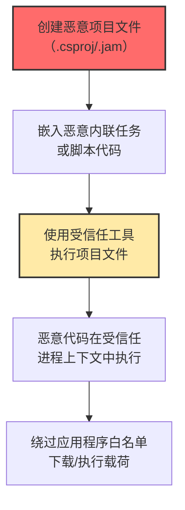

# 受信任开发工具代理执行 (T1127)

## 一句话通俗理解

**攻击者利用微软签名的开发工具（如MSBuild）来执行恶意代码——因为这些工具是"受信任的"程序，安全软件不会拦截它们。**

## 难度等级

⭐️⭐️ 中级（需要一定基础）

需要了解开发工具的工作原理和项目文件格式。

## 技术描述

受信任开发工具代理执行是一种"借刀杀人"的攻击技术。攻击者利用合法的软件开发工具（如MSBuild、ClickOnce、JamPlus）来执行恶意代码。这些工具是微软签名的合法程序，通常被应用程序控制策略（如AppLocker、WDAC）信任，允许运行。

**通俗解释：**
就像坏人穿了一件警察的制服（开发工具的受信任签名），门卫（安全软件）看到是"自己人"就放行了。开发工具本身是合法的，但它们的功能可以被用来执行恶意代码——这就是"代理执行"的意思。

**技术原理：**
1. MSBuild等开发工具是微软签名的，被AppLocker/WDAC等白名单机制信任
2. MSBuild支持"内联任务"（Inline Task）功能，可以在项目文件中直接嵌入C#/VB代码
3. 当MSBuild编译和执行项目文件时，内联任务中的代码也会被执行
4. 代码在MSBuild的受信任进程中运行，安全软件不加拦截

**用途与影响：**
主要用于绕过应用程序白名单。在企业环境中，开发工具通常被列为白名单，攻击者利用这些信任关系来执行任意代码。这种技术可以绕过AppLocker、WDAC、Smart App Control等安全机制。

## 子技术列表

**该技术共有 3 个子技术：**

| 子技术ID | 中文名称 | 通俗解释 |
|----------|----------|----------|
| T1127.001 | MSBuild | 利用微软构建引擎的内联任务功能执行C#/VB代码 |
| T1127.002 | ClickOnce | 利用微软的ClickOnce部署技术通过受信任进程执行代码 |
| T1127.003 | JamPlus | 利用JamPlus构建工具的脚本功能执行恶意命令 |

## 攻击流程



## 真实案例

### 案例1：PureLogs信息窃取木马利用MSBuild进行进程空洞化（2024）

- **时间**: 2024年
- **目标**: 全球Windows用户
- **攻击组织**: PureLogs
- **手法**: Fortinet发现PureLogs信息窃取木马的新变种使用MSBuild.exe进行进程空洞化攻击。攻击链始于采购订单主题的钓鱼邮件，附件中包含恶意JavaScript文件。JavaScript执行后下载恶意的.csproj文件，然后调用MSBuild.exe来编译和执行其中的内联C#代码。由于MSBuild是微软签名的程序，有效绕过了应用程序白名单。
- **影响**: 窃取浏览器凭证和加密货币钱包
- **参考链接**: [Fortinet PureLogs分析](https://vpncentral.com/new-purelogs-variant-uses-msbuild-exe-process-hollowing-to-steal-windows-data/)

### 案例2：APT组织利用ClickOnce部署恶意软件（2024）

- **时间**: 2024年
- **目标**: 能源和基础设施行业
- **手法**: 名为"OneClik"的攻击活动中，APT组织利用Microsoft ClickOnce技术部署恶意软件。攻击者创建恶意的ClickOnce应用程序清单，通过伪造的硬件分析网站诱导用户下载。当用户运行ClickOnce应用程序时，恶意代码通过Dfsvc.exe这个受信任的Windows进程执行，隐蔽性很高。
- **影响**: 能源行业数据泄露
- **参考链接**: [网络安全新闻 OneClik分析](https://cybersecuritynews.com/apt-hackers-abuse-microsoft-clickonce/)

### 案例3：Cobalt Strike利用MSBuild执行信标（2024）

- **时间**: 2024年
- **目标**: 全球企业
- **手法**: 多个攻击组织被观察到使用MSBuild来执行Cobalt Strike信标。攻击者将Cobalt Strike的shellcode嵌入到MSBuild项目文件的内联任务中，然后通过MSBuild.exe执行。由于MSBuild是合法的开发工具且具有微软签名，这种技术有效绕过了应用程序白名单。
- **影响**: 企业内网被渗透
- **参考链接**: [SANS ISC MSBuild滥用](https://isc.sans.edu/diary/28180)

### 案例4：利用JamPlus绕过Smart App Control（2024）

- **时间**: 2024年
- **目标**: 启用了Smart App Control的Windows 11系统
- **手法**: 攻击者利用JamPlus构建工具绕过Windows 11的Smart App Control。JamPlus使用.jam文件描述构建过程，攻击者创建恶意的.jam文件，包含执行恶意代码的脚本。由于JamPlus是受信任的开发工具，Smart App Control允许其执行，从而绕过安全防护。
- **影响**: Windows 11安全功能被绕过
- **参考链接**: [Cyble JamPlus分析](https://cyble.com/blog/reputation-hijacking-with-jamplus-a-maneuver-to-bypass-smart-app-control-sac/)

## 红队视角

> ⚠️ **免责声明**：以下内容仅用于合法的安全测试、渗透测试和教育目的。未经授权对他人系统进行测试是违法行为。

### 常用工具

| 工具名称 | 用途 | 平台 | 链接 |
|----------|------|------|------|
| MSBuild.exe | 微软构建工具（签名受信任） | Windows | 系统自带 |
| Framework\v4.0.30319\MSBuild.exe | .NET Framework下的MSBuild | Windows | 系统自带 |
| Cobalt Strike | 红队框架，支持MSBuild载荷 | 跨平台 | https://www.cobaltstrike.com/ |

## 蓝队视角

### 检测要点

1. 监控MSBuild.exe执行，特别是在非开发系统上
2. 检查.csproj文件中是否包含`&lt;CodeTaskFactory&gt;`或内联任务
3. 在非开发工作站上限制开发工具的执行

### 常用监控命令

```powershell
# 检查.csproj文件中的内联任务
Get-ChildItem -Path C:\ -Recurse -Include *.csproj -ErrorAction SilentlyContinue | Select-String -Pattern "CodeTaskFactory|InlineTask" -List
```

## 缓解措施

### 优先级1：关键措施

在非开发系统上限制MSBuild.exe、JamPlus.exe等开发工具的执行。

### MITRE ATT&CK 缓解措施映射

| 缓解措施ID | 缓解措施名称 | 适用性 | 说明 |
|------------|-------------|--------|------|
| M1022 | 应用程序控制 | 适用 | 在非开发系统上限制开发工具执行 |
| M1038 | 防止恶意软件 | 部分适用 | 检测包含内联任务的项目文件 |

## 检测建议

### 网络层检测

**检测方法：** 监控MSBuild、csc.exe等开发工具发起的外部网络连接，特别是从非开发主机通过这些工具下载载荷或建立C2通信。

**具体规则/命令示例：**
```
# 检测MSBuild从远程URL下载项目文件
suricata -r traffic.pcap --rule "alert tcp $HOME_NET any -> $EXTERNAL_NET $HTTP_PORTS (msg:\"MSBuild Remote Download\"; content:\"MSBuild.exe\"; nocase; sid:1000020;)"

# 检测开发工具异常外连
zeek -r traffic.pcap | grep -E "MSBuild|csc|cl.exe" | grep "443"
```

### 检测点

- 监控非开发设备上MSBuild.exe、csc.exe等开发工具的执行
- 检测项目文件（.csproj/.targets）中的内联任务和可疑编译指令
- 监控ClickOnce部署清单（.appref-ms/.application）的执行

### Sigma规则示例

```yaml
title: MSBuild Execution on Non-Developer Systems
status: experimental
description: Detects MSBuild execution outside of developer workstations
logsource:
    category: process_creation
    product: windows
detection:
    selection:
        Image|endswith: '\MSBuild.exe'
    filter:
        - ComputerName|startswith: 'DEV-'
        - ComputerName|startswith: 'BUILD-'
    condition: selection and not filter
level: high
tags:
    - attack.t1127
```

## 动手实验

> ⚠️ **重要提示**：所有实验必须在隔离的实验室环境中进行，禁止对未授权的真实系统进行测试。

### 实验1：MSBuild内联任务执行（攻击模拟）

```xml
<!-- malicious.csproj -->
<Project ToolsVersion="4.0" xmlns="http://schemas.microsoft.com/developer/msbuild/2003">
  <Target Name="Hello">
    <ClassExample />
  </Target>
  <UsingTask TaskName="ClassExample" TaskFactory="CodeTaskFactory" AssemblyFile="$(MSBuildToolsPath)\Microsoft.Build.Tasks.v4.0.dll">
    <Task>
      <Code Type="Class" Language="cs">
<![CDATA[
using System;
using Microsoft.Build.Framework;
using Microsoft.Build.Utilities;
public class ClassExample : Task {
    public override bool Execute() {
        Console.WriteLine("Hello from MSBuild inline task!");
        return true;
    }
}
]]>
      </Code>
    </Task>
  </UsingTask>
</Project>
```
```cmd
C:\Windows\Microsoft.NET\Framework\v4.0.30319\MSBuild.exe malicious.csproj
```

## 术语解释

| 术语 | 英文原名 | 通俗解释 |
|------|----------|----------|
| MSBuild | Microsoft Build Engine | 微软的"建筑工"，用来编译C#/VB代码 |
| 内联任务 | Inline Task | 在项目文件中直接写的C#代码 |
| ClickOnce | ClickOnce | 微软的"一键安装"技术 |
| Smart App Control | Smart App Control | Windows 11的"应用信誉检查" |

## 参考资料

- [MITRE ATT&CK T1127官方页面](https://attack.mitre.org/techniques/T1127/)
- [MSBuild内联任务文档](https://docs.microsoft.com/visualstudio/msbuild/msbuild-inline-tasks)
- [Atomic Red Team T1127测试](https://www.atomicredteam.io/docs/atomics/T1127.001/)
- [LOLBins项目](https://lolbas-project.github.io/)
