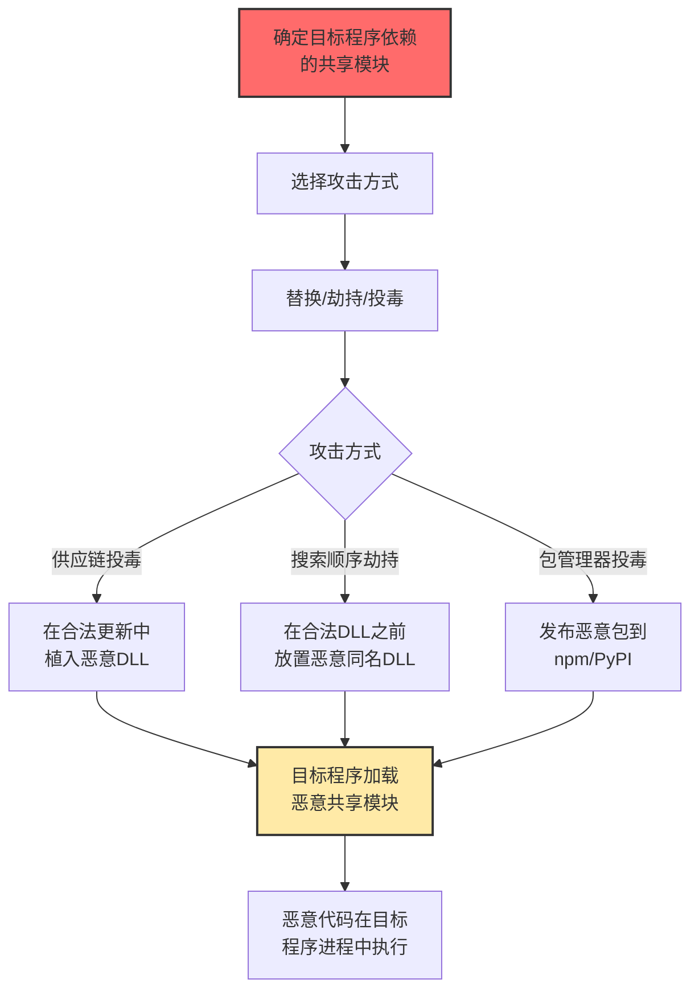

# 共享模块 (T1129)

## 一句话通俗理解

**攻击者替换或劫持程序依赖的共享库（DLL、.so等），让正常程序"不小心"加载恶意代码——就像在药房里把药换成了毒药。**

## 难度等级

⭐️⭐️ 中级（需要一定基础）

需要了解操作系统的模块加载机制和共享库的工作原理。

## 技术描述

共享模块是操作系统和应用程序使用的共享库文件（Windows的DLL、Linux的.so、macOS的.dylib）。多个程序可以同时使用同一个共享模块，这是一种高效的代码复用机制。攻击者利用这一点，通过替换、劫持或注入恶意的共享模块来执行代码。

**通俗解释：**
就像小区的水管系统——所有住户都从同一个管道取水。如果坏人在总水管里下毒，所有住户都会中毒。共享模块就像这个总水管，多个程序都依赖同一个DLL/so文件。攻击者替换了这个共享模块，所有使用它的程序都会"中毒"。

**技术原理：**
1. 程序在启动或运行时，从特定路径加载所需的DLL/so/dylib
2. 操作系统按照预定义的搜索顺序查找这些共享模块
3. 攻击者在搜索顺序中优先的位置放置恶意同名模块
4. 程序"误加载"恶意模块，恶意代码在程序进程中执行
5. 恶意模块可以转发原始函数调用，保持程序正常运行

**用途与影响：**
共享模块滥用可以实现供应链攻击（一次影响大量用户）、权限提升（在合法进程中执行）、防御规避（恶意代码在受信任进程中运行）。XZ Utils后门事件是2024年最严重的共享模块供应链攻击。

## 子技术列表

T1129目前没有定义子技术。

## 攻击流程



## 真实案例

### 案例1：恶意npm包大规模供应链攻击（2024-2025）

- **时间**: 2024-2025年
- **目标**: JavaScript/Node.js开发者
- **手法**: 攻击者使用typosquatting技术，注册与流行包相似的名称。当开发者安装这些恶意包时，postinstall脚本自动执行，窃取环境变量中的API密钥、云凭证、数据库密码等敏感信息。
- **影响**: 数千个恶意包被发现，影响大量开发者
- **参考链接**: [Phylum恶意包分析](https://blog.phylum.io/phylum-discovers-dozens-more-pypi-packages-attempting-to-deliver-w4sp-stealer-in-ongoing-supply-chain-attack/)

### 案例2：XZ Utils后门事件（CVE-2024-3094）（2024）

- **时间**: 2024年
- **目标**: 全球Linux系统
- **手法**: 攻击者花费数年渗透到XZ Utils项目维护团队，在xz/liblzma库中植入后门。该后门修改SSH服务器认证逻辑，允许攻击者绕过认证远程访问。这是近年来最严重的供应链攻击，差点影响全球数百万台服务器。
- **影响**: 差点导致全球Linux系统大规模沦陷
- **参考链接**: [OpenWall XZ后门披露](https://www.openwall.com/lists/oss-security/2024/03/29/4)

### 案例3：PyPI恶意包窃取云凭证（2024）

- **时间**: 2024年
- **目标**: Python开发者和企业
- **手法**: 攻击者在PyPI发布模仿流行库名称的恶意包。安装时，恶意代码扫描云配置文件、环境变量和SSH密钥，窃取的数据发送到攻击者控制的服务器。
- **影响**: 众多企业云凭证被盗
- **参考链接**: [Socket PyPI恶意包分析](https://socket.dev/blog/pypi-malware-cloud-credentials)

## 红队视角

> ⚠️ **免责声明**：以下内容仅用于合法的安全测试、渗透测试和教育目的。未经授权对他人系统进行测试是违法行为。

### 常用工具

| 工具名称 | 用途 | 平台 | 链接 |
|----------|------|------|------|
| npm/dotnet | 依赖管理工具（可被劫持） | 跨平台 | 系统自带 |
| LD_PRELOAD | Linux共享库劫持 | Linux | 系统自带 |
| Process Monitor | DLL加载监控分析 | Windows | https://docs.microsoft.com/en-us/sysinternals/downloads/procmon |

### 实战技巧

- 劫持搜索路径中的共享库，利用程序加载顺序漏洞
- 通过替换系统目录中的DLL/so文件实现持久化
- 利用环境变量LD_PRELOAD/LD_LIBRARY_PATH加载恶意共享库

## 蓝队视角

### 检测方法

- 监控DLL加载事件，特别关注从非标准路径加载的DLL
- 使用ldconfig检查Linux共享库缓存变化
- 定期审计第三方依赖的完整性

## 缓解措施

### 优先级1：关键措施

锁定依赖版本，使用lock file固定所有依赖的具体版本。

### MITRE ATT&CK 缓解措施映射

| 缓解措施ID | 缓解措施名称 | 适用性 | 说明 |
|------------|-------------|--------|------|
| M1016 | 供应链安全 | 适用 | 审查和锁定第三方依赖 |
| M1022 | 应用程序控制 | 部分适用 | 限制DLL/so的加载来源 |

## 检测建议

### 网络层检测

**检测方法：** 监控DLL/so文件从网络共享或远程URL加载的行为，以及进程通过WebDAV或SMB加载共享模块的流量。

**具体规则/命令示例：**
```
# 检测从远程WebDAV加载DLL
suricata -r traffic.pcap --rule "alert tcp $HOME_NET any -> $EXTERNAL_NET 445 (msg:\"Remote DLL Load via SMB\"; content:\".dll\"; nocase; sid:1000021;)"

# 检测HTTP下载DLL
zeek -r traffic.pcap http.log | grep ".dll" | grep -v "microsoft.com"
```

### 检测点

- 监控DLL/so文件的非标准加载路径
- 检测命令行工具（ldconfig, pip）对共享库目录的非授权修改
- 监控LOAD_LIBRARY_AS_IMAGE_RESOURCE和LoadLibrary异常调用

### Sigma规则示例

```yaml
title: Suspicious Shared Library Load
status: experimental
description: Detects DLL loaded from suspicious non-system paths
logsource:
    category: image_load
    product: windows
detection:
    selection:
        ImageLoaded|contains:
            - '\Temp\'
            - '\Downloads\'
            - '\AppData\Local\'
    condition: selection
level: medium
tags:
    - attack.t1129
```

## 动手实验

> ⚠️ **重要提示**：所有实验必须在隔离的实验室环境中进行，禁止对未授权的真实系统进行测试。

### 实验1：检查npm包的安全性

```bash
npm audit
npx socket analyze
npm ls --all
```

## 术语解释

| 术语 | 英文原名 | 通俗解释 |
|------|----------|----------|
| DLL | Dynamic Link Library | Windows的"共享工具箱" |
| .so | Shared Object | Linux的"共享模块" |
| Typosquatting | Typosquatting | 注册"长得像"流行包的恶意包名 |
| postinstall | Post Install Script | 安装包的"自动运行脚本" |
| Lock file | Lock File | 记录所有依赖精确版本的"清单" |

## 参考资料

- [MITRE ATT&CK T1129官方页面](https://attack.mitre.org/techniques/T1129/)
- [XZ Utils后门分析](https://www.openwall.com/lists/oss-security/2024/03/29/4)
- [PyPI恶意包分析](https://socket.dev/blog/pypi-malware-cloud-credentials)
- [npm安全最佳实践](https://docs.npmjs.com/third-party-security)
- [供应链安全指南](https://slsa.dev/)
