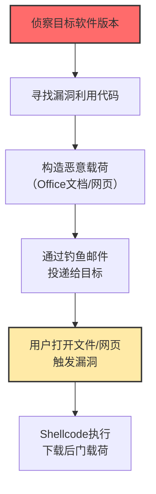

# 客户端漏洞利用执行 (T1203)

## 一句话通俗理解

**攻击者利用浏览器、Office、PDF阅读器等常用软件的漏洞，让你在正常打开文件或网页时，恶意代码悄悄在后台跑起来。**

## 难度等级

⭐️⭐️⭐️ 高级（需要深入技术知识）

需要掌握漏洞挖掘和利用技术，通常需要找到零日漏洞或未打补丁的漏洞。

## 技术描述

客户端漏洞利用是指攻击者利用用户端软件中的安全漏洞来执行恶意代码。攻击者将恶意载荷嵌入到看似正常的文件或网页中，当用户打开这些文件或访问网页时，软件中的漏洞被触发，恶意代码在用户不知情的情况下执行。

**通俗解释：**
就像你打开一本看似正常的书（Office文档），但书中有一页被做了手脚——当你翻到那一页时，书里弹出一个小机关（漏洞利用代码），这个机关悄悄地打开了你的保险柜（执行恶意代码）。整个过程你完全不知道发生了什么。

**技术原理：**
1. 软件（浏览器、Office等）在处理特定格式的数据时存在编码错误
2. 攻击者构造特殊的数据，利用这些错误覆盖内存中的关键数据
3. 通过控制程序的执行流程，让程序跳转到攻击者指定的代码
4. 攻击代码（shellcode）在软件的进程中执行，获得系统控制权

**用途与影响：**
客户端漏洞利用是初始访问的重要手段。一个零日漏洞可以让攻击者在目标完全不知情的情况下获得系统访问。浏览器和Office是每台电脑都有的软件，攻击面极大。

## 攻击流程



## 真实案例

### 案例1：APT28利用Microsoft Outlook零日漏洞CVE-2023-23397（2023）

- **时间**: 2023年
- **目标**: 欧洲政府、军事和能源部门
- **攻击组织**: APT28（俄罗斯）
- **手法**: 利用Microsoft Outlook零日漏洞（CVE-2023-23397，CVSS 9.8），用户无需打开邮件即可被窃取NTLMv2哈希。攻击者发送特制的邮件，当Outlook处理时自动向攻击者控制的SMB服务器发起NTLM认证。
- **影响**: 多个北约国家机构被入侵
- **参考链接**: [MSRC CVE-2023-23397](https://msrc.microsoft.com/update-guide/vulnerability/CVE-2023-23397)

### 案例2：利用Chrome V8引擎漏洞进行浏览器攻击（2024）

- **时间**: 2024年
- **目标**: 全球Chrome用户
- **手法**: 2024年多个Chrome零日漏洞被在野利用（CVE-2024-0519、CVE-2024-4947等），存在于V8 JavaScript引擎中。攻击者创建恶意网页，配合沙箱逃逸漏洞获得完整系统访问权限。
- **影响**: 定向间谍活动
- **参考链接**: [Chrome发布公告](https://chromereleases.googleblog.com/2024/)

### 案例3：Volt Typhoon利用网络设备漏洞进行初始入侵（2024-2025）

- **时间**: 2024-2025年
- **目标**: 美国关键基础设施
- **攻击组织**: Volt Typhoon
- **手法**: 利用路由器、防火墙、VPN设备漏洞（如Ivanti CVE-2023-46805和CVE-2024-21887）作为初始入口，部署webshell和后门，然后在内网中横向移动。
- **影响**: 美国关键基础设施长期受威胁
- **参考链接**: [CISA AA24-038A](https://www.cisa.gov/news-events/cybersecurity-advisories/aa24-038a)

## 红队视角

> ⚠️ **免责声明**：以下内容仅用于合法的安全测试、渗透测试和教育目的。未经授权对他人系统进行测试是违法行为。

### 常用工具

| 工具名称 | 用途 | 平台 | 链接 |
|----------|------|------|------|
| Metasploit | 漏洞利用框架 | 跨平台 | https://www.metasploit.com/ |
| Cobalt Strike | 红队框架 | 跨平台 | https://www.cobaltstrike.com/ |
| Office Exploit Kit | Office漏洞利用工具集 | Windows | 商业工具 |

## 蓝队视角

### 检测方法

- 监控Office进程创建子进程的异常行为
- 检测MotW标记缺失的文件或从互联网下载的文件
- 使用EDR监控漏洞利用工具包的行为特征

## 缓解措施

### 优先级1：关键措施

及时打补丁，定期更新所有软件，特别是浏览器、Office、Adobe产品。

### MITRE ATT&CK 缓解措施映射

| 缓解措施ID | 缓解措施名称 | 适用性 | 说明 |
|------------|-------------|--------|------|
| M1051 | 软件更新 | 适用 | 定期更新客户端软件 |
| M1042 | 禁用功能或服务 | 适用 | 禁用Office宏、Flash等 |
| M1013 | 应用程序隔离和沙箱 | 适用 | 使用浏览器隔离技术 |

## 检测建议

### 网络层检测

**检测方法：** 监控Office进程或浏览器漏洞利用后的回调连接，特别是Office子进程（cmd.exe、powershell.exe）发起的HTTP/S或DNS隧道通信。

**具体规则/命令示例：**
```
# 检测Office应用启动后的异常外连
suricata -r traffic.pcap --rule "alert tcp $HOME_NET any -> $EXTERNAL_NET $HTTP_PORTS (msg:\"Office Spawned Network Connection\"; content:\"powershell\"; nocase; sid:1000023;)"

# 检测浏览器漏洞利用后的beacon
zeek -r traffic.pcap | grep -E "chrome|firefox|iexplore" -A 5 | grep "POST"
```

### 检测点

- 监控Office进程（winword.exe, excel.exe）启动子进程（cmd.exe, powershell.exe）
- 检测浏览器进程崩溃后的异常行为
- 监控压缩包的解压行为，特别是包含脚本文件的异常解压

### Sigma规则示例

```yaml
title: Office Process Spawning Command Shell
status: experimental
description: Detects Office applications spawning a command shell
logsource:
    category: process_creation
    product: windows
detection:
    selection:
        ParentImage|endswith:
            - '\WINWORD.EXE'
            - '\EXCEL.EXE'
            - '\POWERPNT.EXE'
            - '\OUTLOOK.EXE'
        Image|endswith:
            - '\cmd.exe'
            - '\powershell.exe'
            - '\wscript.exe'
            - '\cscript.exe'
    condition: selection
level: high
tags:
    - attack.t1203
```

## 动手实验

> ⚠️ **重要提示**：所有实验必须在隔离的实验室环境中进行，禁止对未授权的真实系统进行测试。

### 实验1：Office宏安全设置检查

```powershell
Get-ItemProperty -Path "HKCU:\Software\Microsoft\Office\16.0\Word\Security" -Name "VBAWarnings" -ErrorAction SilentlyContinue
```

## 术语解释

| 术语 | 英文原名 | 通俗解释 |
|------|----------|----------|
| 零日漏洞 | Zero-day | 厂商还不知道的"秘密漏洞" |
| N日漏洞 | N-day | 已经知道但还没修补的漏洞 |
| 漏洞利用 | Exploit | 利用漏洞做坏事的"操作手册" |
| DEP | Data Execution Prevention | 防止在数据区域"藏代码"运行 |
| ASLR | Address Space Layout Randomization | 把程序位置"随机打乱"让攻击者找不到 |
| 沙箱 | Sandbox | 浏览器的"隔离房间" |

## 参考资料

- [MITRE ATT&CK T1203官方页面](https://attack.mitre.org/techniques/T1203/)
- [Microsoft CVE-2023-23397安全公告](https://msrc.microsoft.com/update-guide/vulnerability/CVE-2023-23397)
- [Chrome零日漏洞公告](https://chromereleases.googleblog.com/)
- [CISA Volt Typhoon公告](https://www.cisa.gov/news-events/cybersecurity-advisories/aa24-038a)
