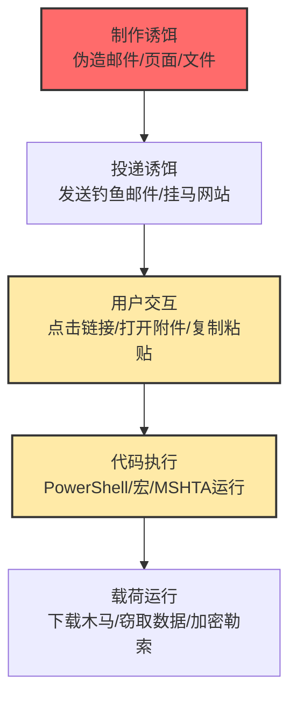

# 用户执行 (T1204)

## 一句话通俗理解

**攻击者骗你自己点击链接、打开文件、复制粘贴命令——让你亲手执行恶意代码，连安全软件都拦不住。**

## 难度等级

⭐ 初级（新手可学）

不需要技术漏洞，只需要社会工程学技巧来欺骗用户。

## 技术描述

用户执行是一种完全依赖"人"的攻击技术。攻击者不靠技术漏洞，而是通过精心设计的骗局，诱导用户自己执行恶意操作。用户可能被欺骗点击恶意链接、打开恶意文件、查看恶意图片、复制粘贴恶意代码，甚至使用恶意的软件库。

**通俗解释：**
攻击者不撬锁（技术漏洞）、不翻墙（网络攻击），而是直接敲门对你说："我是物业的，麻烦您开一下门"（社会工程）。你自己把门打开了，保安（安全软件）也没办法——因为是你"自愿"的。用户执行就是这个道理——攻击者让你自己运行恶意代码。

**技术原理：**
1. 攻击者创建看似合法的诱饵（假验证码、假错误提示、钓鱼邮件等）
2. 使用社会工程技巧增加可信度（冒充IT部门、使用紧急话术等）
3. 用户按照指示操作（点击、打开、复制粘贴）
4. 恶意代码在用户的权限上下文中执行
5. 因为是用户自己执行的，安全软件通常不会拦截

**用途与影响：**
用户执行是最简单但最有效的攻击技术之一。从经典的钓鱼邮件到2024-2025年爆火的ClickFix攻击，都依赖用户自己执行恶意操作。这种技术可以绕过几乎所有自动化的安全检测。2024-2025年间，ClickFix攻击被TA571、ClearFake等多个威胁团伙使用，甚至被APT28、MuddyWater等国家级攻击组织采用，影响全球数百万用户。

## 子技术列表

**该技术共有 5 个子技术：**

| 子技术ID | 中文名称 | 通俗解释 |
|----------|----------|----------|
| T1204.001 | 恶意链接 | 骗用户点击链接，跳转到恶意网站或触发下载 |
| T1204.002 | 恶意文件 | 骗用户打开恶意附件或下载的文件 |
| T1204.003 | 恶意图片/镜像 | 利用恶意的Docker镜像、云镜像等 |
| T1204.004 | 恶意复制粘贴 | ClickFix攻击，骗用户复制粘贴恶意命令 |
| T1204.005 | 恶意库 | 利用恶意的软件包/库 |

## 攻击流程

### 典型攻击流程

```
制作诱饵 --> 投递诱饵 --> 用户交互 --> 代码执行 --> 载荷运行
```



**步骤详解：**

1. **制作诱饵**
   - 通俗描述：攻击者制作一个看起来合法的诱饵文件或页面
   - 技术细节：创建钓鱼邮件（伪装成银行、快递、IT部门通知）、伪造CAPTCHA验证页面（ClickFix）、制作含恶意宏的Office文档、打包带有恶意脚本的压缩文件。攻击者使用社会工程技巧（紧迫感、恐惧、好奇心）增加可信度
   - 常用工具：GoPhish、Social Engineering Toolkit、恶意Office文档生成器（宏）、reCAPTCHA Phish（开源ClickFix工具包）

2. **投递诱饵**
   - 通俗描述：将诱饵发送给目标用户
   - 技术细节：通过电子邮件发送钓鱼邮件（附件或链接）、通过恶意广告（Malvertising）重定向用户、通过搜索引擎优化（SEO）提高恶意页面排名、通过社交媒体消息传播、通过植入恶意代码的合法网站（如ClearFake攻击链）分发
   - 常用工具：钓鱼邮件模板、恶意广告系统、SEO投毒工具、受感染网站的Web Shell

3. **用户交互**
   - 通俗描述：用户按照攻击者的指示进行操作
   - 技术细节：用户点击恶意链接（T1204.001）、打开恶意附件（T1204.002）、按下Win+R打开运行对话框→Ctrl+V粘贴命令（ClickFix/T1204.004）、在Office中点击"启用内容"启用宏、通过npm/pip安装恶意包（T1204.005）
   - 常用工具：无需特殊工具，攻击者完全依赖用户的手动操作

4. **代码执行**
   - 通俗描述：用户的操作触发了恶意代码的运行
   - 技术细节：PowerShell执行Base64编码的恶意命令（ClickFix典型手法）、VBA宏通过`Shell()`函数执行命令、MSHTA运行恶意HTML应用程序、WScript/CScript执行JavaScript/VBScript脚本。这些代码通常使用`-w hidden`（隐藏窗口）、`-ExecutionPolicy Bypass`（绕过执行策略）等参数规避检测
   - 常用工具：PowerShell、MSHTA.exe、WScript.exe、CScript.exe、Rundll32.exe

5. **载荷运行**
   - 通俗描述：恶意代码下载并运行最终的恶意软件
   - 技术细节：从远程C2服务器下载第二阶段载荷（使用`Invoke-WebRequest`、`certutil`、`BitsTransfer`等LOLBins），在内存中直接执行（无文件落地，绕过后端检测），安装信息窃取木马（Lumma Stealer、XWorm）、远程访问木马（AsyncRAT、NetSupport RAT）或勒索软件
   - 常用工具：PowerShell（iwr/irm/iex）、certutil、BitsAdmin、mshta.exe

## 真实案例

### 案例1：ClickFix假验证码攻击大规模爆发（2024-2025）

- **时间**: 2024-2025年
- **目标**: 全球互联网用户
- **攻击组织**: TA571、ClearFake等多个威胁团伙
- **手法**: ClickFix是2024-2025年增长最快的攻击手法。攻击者创建假的CAPTCHA验证码页面，指示用户按下Win+R打开运行对话框，Ctrl+V粘贴"验证命令"执行。实际上这是恶意的PowerShell代码，会下载信息窃取木马。由于是用户"自愿"执行的命令，几乎所有自动安全检测机制都被绕过。该方法已从最初的Windows攻击扩展到macOS平台，其开源工具包reCAPTCHA Phish在2024年9月发布后立即被多个威胁团伙采用。
- **影响**: 数百万用户受影响，全球医疗、政府、金融行业均受波及
- **参考链接**: [Proofpoint ClickFix分析](https://www.proofpoint.com/us/blog/threat-insight/clickfix-social-engineering-lures-are-here-stay)

### 案例2：Lazarus Group利用求职主题钓鱼邮件传播恶意文档（2024）

- **时间**: 2024年
- **目标**: 加密货币和金融科技行业
- **攻击组织**: Lazarus Group（朝鲜）
- **手法**: 发送伪装成求职申请的钓鱼邮件，附件包含恶意Word文档。当受害者打开文档并启用宏时，恶意代码被执行为后续后门程序部署铺路。
- **影响**: 加密货币交易所被窃取大量资产
- **参考链接**: [Mandiant Lazarus分析](https://www.mandiant.com/resources/blog/lazarus-job-opportunities)

### 案例3：恶意npm/PyPI包供应链攻击（2024-2025）

- **时间**: 2024-2025年
- **目标**: 软件开发者和企业
- **手法**: 攻击者将恶意软件包发布到npm、PyPI等注册表，使用typosquatting技术。当开发者安装这些恶意包时，postinstall脚本自动执行，窃取环境变量中的凭证。
- **影响**: 数万个开发者和项目受影响
- **参考链接**: [Phylum恶意包分析](https://blog.phylum.io/phylum-discovers-dozens-more-pypi-packages-attempting-to-deliver-w4sp-stealer-in-ongoing-supply-chain-attack/)

### 案例4：Emotet利用恶意Excel附件大规模传播（2024）

- **时间**: 2024年
- **目标**: 全球企业和个人用户
- **攻击组织**: Emotet
- **手法**: Emotet通过钓鱼邮件传播，附件为Excel文件包含恶意宏。当用户点击"启用内容"时，宏代码执行PowerShell命令下载Emotet恶意软件。
- **影响**: Emotet持续活跃，为勒索软件铺路
- **参考链接**: [CISA AA21-076A](https://www.cisa.gov/news-events/cybersecurity-advisories/aa21-076a)

### 案例5：APT28利用ClickFix攻击乌克兰政府机构（2025）

- **时间**: 2025年
- **目标**: 乌克兰政府机构
- **攻击组织**: APT28（俄罗斯）
- **手法**: APT28（又称Fancy Bear）使用ClickFix技术针对乌克兰政府机构发起攻击。攻击者通过钓鱼邮件引导目标访问伪造的验证页面，页面要求用户执行"浏览器安全检查"——实际是复制粘贴恶意的PowerShell命令。执行后下载Cobalt Strike Beacon实现对受感染系统的长期控制。这一案例标志着国家级APT组织开始采用原本由网络犯罪团伙推广的ClickFix技术。
- **影响**: 乌克兰政府机构敏感信息被窃取
- **参考链接**: [Microsoft ClickFix分析](https://www.microsoft.com/en-us/security/blog/2025/08/21/think-before-you-clickfix-analyzing-the-clickfix-social-engineering-technique/)

### 案例6：MuddyWater使用ClickFix攻击中东电信行业（2025-2026）

- **时间**: 2025-2026年
- **目标**: 中东地区电信和医疗行业
- **攻击组织**: MuddyWater（伊朗）
- **手法**: MuddyWater组织在鱼叉式钓鱼活动中嵌入ClickFix诱饵，目标为中东电信和医疗行业。攻击者发送伪装成IT部门通知的邮件，声称需要用户执行"系统安全检查"。邮件中附带的HTML附件打开后显示伪造的错误页面，引导用户点击"Fix It"按钮复制并运行PowerShell命令，最终部署Danabot和NetSupport RAT。
- **影响**: 中东地区多个电信和医疗机构数据泄露
- **参考链接**: [Darktrace ClickFix分析](https://www.darktrace.com/blog/unpacking-clickfix-darktraces-detection-of-a-prolific-social-engineering-tactic)

## 红队视角

> ⚠️ **免责声明**：以下内容仅用于合法的安全测试、渗透测试和教育目的。未经授权对他人系统进行测试是违法行为。

### 实战技巧

1. **ClickFix攻击链搭建**
   使用开源的reCAPTCHA Phish工具包快速搭建假CAPTCHA页面。将恶意PowerShell命令编码为Base64后嵌入页面JavaScript，利用`document.execCommand('copy')`将恶意命令写入用户剪贴板。关键点：在命令后附加无害的验证码文本，用户粘贴时只看到"正常"部分。适用于内部钓鱼演练中的用户意识测试。

2. **恶意宏文档制作与混淆**
   使用VBA宏作为初始执行载体，通过将宏代码拆分为多个函数并加入大量垃圾代码（dead code）来逃避防病毒扫描。使用`Auto_Open()`或`Document_Open()`事件自动触发宏执行。宏中使用`Shell()`函数调用PowerShell下载后续载荷。注意：OLE对象嵌入比直接写入宏更隐蔽。

3. **利用LOLBins做无文件执行**
   在用户执行阶段，只使用系统自带的合法工具（LOLBins）完成攻击链。例如：用`mshta.exe`执行远程HTA脚本、用`rundll32.exe`执行JavaScript、用`regsvr32.exe`执行Squiblydoo攻击。这些工具都是微软签名程序，EDR对它们的拦截阈值较高。

### 常用工具

| 工具名称 | 用途 | 平台 | 链接 |
|----------|------|------|------|
| GoPhish | 开源钓鱼框架，支持邮件模板和跟踪 | 跨平台 | https://github.com/gophish/gophish |
| Evilginx | 中间人钓鱼框架，可绕过MFA | Linux | https://github.com/kgretzky/evilginx2 |
| Social Engineering Toolkit | 社工工具集，含多种攻击向量 | Linux | https://github.com/trustedsec/social-engineer-toolkit |
| reCAPTCHA Phish | ClickFix假CAPTCHA生成工具包 | Web | https://github.com/（搜索reCAPTCHA Phish） |
| Luckystrike | 恶意宏文档生成器 | Windows | https://github.com/curi0usJack/luckystrike |
| MacroPack | Office宏混淆和免杀工具 | Windows | https://github.com/sevagas/macro_pack |

### 注意事项

- 在合法的渗透测试中，必须事先获得目标组织的书面授权
- 内部钓鱼演练应制定清晰的规则：哪些用户被包含、演练频率、数据收集范围
- ClickFix攻击可能被终端EDR检测到PowerShell的异常行为（如`-w hidden -enc`参数组合）
- 使用公司内部域名和证书进行演练以避免邮件网关拦截
- 演练后必须向所有参与者进行安全意识教育和结果反馈

## 蓝队视角

### 检测要点

1. **监控PowerShell的异常执行参数**
   - 日志来源：Windows安全事件日志（Event ID 4688/进程创建）、Sysmon Event ID 1
   - 关注字段：命令行参数、父进程、用户账户
   - 异常特征：PowerShell以`-w hidden`（隐藏窗口）、`-enc`（Base64编码命令）、`-ExecutionPolicy Bypass`（绕过执行策略）参数执行；非管理员用户频繁调用PowerShell下载远程内容

2. **监控Mark of the Web（MotW）标记的移除行为**
   - 日志来源：Sysmon Event ID 15（文件创建流哈希）、Windows Defender日志
   - 关注字段：Zone.Identifier流、文件来源URL
   - 异常特征：从互联网下载的文件（带Zone.Identifier的MotW标记）被移除标记后执行；压缩包内的文件在解压后MotW标记丢失

3. **监控浏览器下载后的即时文件执行**
   - 日志来源：Sysmon Event ID 1（进程创建）、浏览器日志
   - 关注字段：进程创建链（浏览器→下载目录→执行）、时间间隔
   - 异常特征：浏览器下载文件后数秒内该文件被执行；Office文档（Word/Excel/PPT）打开后立即生成PowerShell子进程

4. **监控Office宏的异常活动**
   - 日志来源：Microsoft Office安全日志、Sysmon Event ID 1
   - 关注字段：Office应用的子进程、COM对象创建
   - 异常特征：WinWord.exe或EXCEL.exe生成cmd.exe、powershell.exe、cscript.exe等子进程；Office进程调用`Shell()`函数执行命令

5. **监控ClickFix相关的RunMRU注册表项**
   - 日志来源：Sysmon Event ID 12/13（注册表操作）
   - 关注字段：`HKCU\Software\Microsoft\Windows\CurrentVersion\Explorer\RunMRU`键值
   - 异常特征：RunMRU中出现以LOLBins开头的命令（powershell、mshta、rundll32、wscript、curl、wget）

### 监控建议

- 启用PowerShell深度日志记录（ScriptBlock Logging、Module Logging、Transcription）
- 部署Sysmon并配置详细的进程创建和网络连接监控规则
- 启用Windows Defender for Office 365的ClickFix行为签名检测
- 配置安全信息和事件管理（SIEM）系统关联浏览器下载日志和进程创建日志，建立"文件下载→执行"的事件链告警
- 定期审计WMI事件订阅和设备上的计划任务，排查可疑的持久化机制

## 检测建议

### 网络层检测

**检测方法：** 监控用户设备向已知恶意域名的DNS请求和HTTP连接，特别是PowerShell下载命令的特征流量

**具体规则/命令示例：**

```
# 监控PowerShell的HTTP下载流量（用户代理特征）
# PowerShell默认用户代理包含"WindowsPowerShell"或"PowerShell"
tcpdump -i eth0 -A 'tcp[((tcp[12:1] & 0xf0) >> 2):4] = 0x504f5354' and dst port 80 2>/dev/null | grep -i "powershell\|invoke-webrequest\|iwr"
```

**示例（Snort/Suricata规则）：**
```
alert tcp $HOME_NET any -> $EXTERNAL_NET $HTTP_PORTS (msg:"T1204 - PowerShell Download from User Execution"; flow:to_server,established; content:"User-Agent|3a| WindowsPowerShell"; http_header; classtype:trojan-activity; sid:1204001; rev:1;)

alert tcp $HOME_NET any -> $EXTERNAL_NET $HTTP_PORTS (msg:"T1204 - Suspicious iwr/iex PowerShell Pattern"; flow:to_server,established; content:"iwr"; http_uri; content:"iex"; http_uri; classtype:trojan-activity; sid:1204002; rev:1;)
```

### 主机层检测

**检测方法：** 监控用户执行阶段的进程创建链和行为模式

**Windows事件ID：**
- 事件ID 4688：进程创建（监控浏览器→下载文件→执行的链条）
- 事件ID 4657：注册表值修改（监控RunMRU注册表项）
- 事件ID 5859/5861：WMI消费者创建（监控后续持久化）
- 事件ID 4104：PowerShell ScriptBlock日志（监控编码命令）

**Sysmon事件ID：**
- Event ID 1：进程创建（关键！监控父子进程关系）
- Event ID 11：文件创建（监控下载到临时目录的文件）
- Event ID 15：文件创建流哈希（监控MotW标记）
- Event ID 12/13：注册表操作（监控RunMRU和自启动项）

**具体命令示例：**
```powershell
# 检查RunMRU中的可疑命令
Get-ItemProperty -Path "HKCU:\Software\Microsoft\Windows\CurrentVersion\Explorer\RunMRU" | Select-Object -ExpandProperty MRUListEx

# 检查最近下载的文件（过去24小时内创建的可执行文件）
Get-ChildItem -Path "$env:USERPROFILE\Downloads" -Recurse -Include *.exe,*.ps1,*.vbs,*.js,*.hta,*.bat,*.cmd | Where-Object { $_.CreationTime -gt (Get-Date).AddHours(-24) }

# 检查Mark of the Web标记
Get-ChildItem -Path "$env:USERPROFILE\Downloads" -Recurse | ForEach-Object { $zone = Get-Item -Path $_.FullName -Stream Zone.Identifier -ErrorAction SilentlyContinue; if ($zone) { Write-Output "$($_.Name): Downloaded from internet" } }

# 查看PowerShell深度日志中的编码命令
Get-WinEvent -FilterHashtable @{LogName='Microsoft-Windows-PowerShell/Operational'; ID=4104} | Where-Object { $_.Message -match '-enc|-EncodedCommand' } | Select-Object TimeCreated, Message -First 10
```

### 应用层检测

**检测方法：** 通过Sigma规则检测用户执行相关的事件模式

**Sigma规则示例1：检测ClickFix/PowerShell隐藏执行**
```yaml
title: ClickFix Style PowerShell Execution with Hidden Window
status: experimental
description: Detects PowerShell execution with hidden window and encoded command, typical of ClickFix user execution attacks
logsource:
    category: process_creation
    product: windows
detection:
    selection:
        Image|endswith: '\powershell.exe'
        CommandLine|contains|all:
            - '-w hidden'
            - '-enc'
    condition: selection
level: high
tags:
    - attack.t1204
    - attack.t1204.004
    - attack.execution
```

**Sigma规则示例2：检测Office宏生成子进程**
```yaml
title: Office Application Spawning Suspicious Child Process
status: experimental
description: Detects Office applications (Word, Excel, PowerPoint) spawning command shells or scripting interpreters
logsource:
    category: process_creation
    product: windows
detection:
    selection:
        ParentImage|endswith:
            - '\WINWORD.EXE'
            - '\EXCEL.EXE'
            - '\POWERPNT.EXE'
        Image|endswith:
            - '\cmd.exe'
            - '\powershell.exe'
            - '\cscript.exe'
            - '\wscript.exe'
            - '\mshta.exe'
    condition: selection
level: high
tags:
    - attack.t1204
    - attack.t1204.002
    - attack.execution
```

**Sigma规则示例3：检测浏览器下载后的文件立即执行**
```yaml
title: Browser Download Followed by File Execution
status: experimental
description: Detects process executions that occur shortly after browser download events
logsource:
    category: process_creation
    product: windows
detection:
    selection:
        Image|contains:
            - '\Downloads\'
            - '\Temp\'
        CommandLine|contains:
            - 'Zone.Identifier'
    condition: selection
level: medium
tags:
    - attack.t1204
```

## 缓解措施

### 优先级1：关键措施

**措施名称：** 用户安全意识培训与模拟钓鱼演练

**具体实施步骤：**
1. 设计并实施季度性安全意识培训课程，涵盖钓鱼邮件识别、社会工程攻击手法、ClickFix攻击原理
2. 使用GoPhish等工具定期进行内部模拟钓鱼演练（每月最少1次）
3. 演练后分析结果，针对高危用户进行定向强化培训
4. 建立举报机制，鼓励用户主动报告可疑邮件和链接

**配置示例：**
```yaml
# 模拟钓鱼演练计划模板（年度）
Q1: ClickFix假CAPTCHA攻击模拟
Q2: 恶意Office文档附件模拟
Q3: 供应链包安装钓鱼模拟
Q4: 综合型鱼叉式钓鱼模拟
```

### 优先级2：重要措施

**措施名称：** 限制PowerShell和脚本执行环境

**具体实施步骤：**
1. 通过组策略启用PowerShell执行策略为"Restricted"或"AllSigned"
2. 启用PowerShell深度日志记录（ScriptBlock Logging、Protected Event Logging）
3. 使用AppLocker或Windows Defender Application Control限制未经签名的脚本执行
4. 配置Windows Defender Attack Surface Reduction（ASR）规则，阻止Office进程生成子进程

**配置示例：**
```powershell
# 通过组策略启用PowerShell ScriptBlock日志记录
# 路径：计算机配置 > 管理模板 > Windows组件 > Windows PowerShell
# 启用"打开 PowerShell 脚本块日志记录"
# 启用"打开 PowerShell 模块日志记录"

# ASR规则：阻止Office生成子进程
Set-MpPreference -EnableControlledFolderAccess Enabled
Add-MpPreference -AttackSurfaceReductionRules_Ids "D4F940AB-401B-4EFC-AADC-AD5F3C50688A" -AttackSurfaceReductionRules_Actions Enabled
```

**措施名称：** 文件与附件安全策略

**具体实施步骤：**
1. 在邮件网关上阻止带有宏的Office文档（.docm、.xlsm、.pptm），或在沙箱中检测后放行
2. 配置Windows阻止从互联网下载的文件运行（MotW策略）
3. 限制用户在Downloads和Temp目录中运行可执行文件
4. 部署EDR解决方案并启用文件行为分析

### 优先级3：建议措施

**措施名称：** 网络层面防护

**具体实施步骤：**
1. 在防火墙和代理服务器上阻止已知恶意域名和IP
2. 对出站HTTP/HTTPS流量进行SSL解密和检测
3. 部署DNS安全解决方案，阻止对已知恶意域名的解析请求
4. 在邮件网关上启用DMARC、DKIM、SPF验证，过滤假冒域名邮件

**措施名称：** 应用白名单与最小权限

**具体实施步骤：**
1. 使用AppLocker仅允许经过批准的应用程序运行
2. 限制用户使用管理员权限账户进行日常办公
3. 禁用不需要的Office功能（如宏、DDE、OLE对象嵌入）
4. 配置Windows Defender实时保护，启用云保护

### MITRE ATT&CK 缓解措施映射

| 缓解措施ID | 缓解措施名称 | 适用性 | 说明 |
|------------|-------------|--------|------|
| M1017 | 用户培训 | 适用 | 教育用户识别钓鱼和社会工程攻击，是最关键的缓解措施 |
| M1038 | 防止恶意软件 | 部分适用 | 使用防病毒和EDR扫描附件和下载文件，但无法阻止用户主动执行 |
| M1047 | 审计 | 适用 | 监控文件的Mark of the Web标记和进程创建链 |
| M1037 | 用户账户控制 | 适用 | 限制用户以管理员权限运行，降低恶意代码的破坏力 |
| M1040 | 端点防护 | 适用 | 部署EDR监控异常进程行为（如Office生成PowerShell） |
| M1022 | 应用程序控制 | 适用 | 使用AppLocker限制脚本执行环境和未签名程序运行 |
| M1041 | 取消管理工具 | 部分适用 | 在不需要时禁用PowerShell、WScript等脚本工具 |
| M1021 | 限制Web内容 | 部分适用 | 在浏览器中阻止ActiveX、Java等插件自动执行 |
| M1031 | 网络隔离 | 适用 | 隔离用户网络和管理网络，限制钓鱼横向扩散 |

## 动手实验

> ⚠️ **重要提示**：所有实验必须在隔离的实验室环境中进行，禁止对未授权的真实系统进行测试。

### 实验环境准备

**推荐靶场/实验平台：**

| 平台名称 | 类型 | 难度 | 链接 |
|----------|------|------|------|
| Detection Lab | 虚拟靶场 | 初级 | https://github.com/clong/DetectionLab |
| Atomic Red Team | 检测测试框架 | 初级 | https://github.com/redcanaryco/atomic-red-team |
| Let's Defend | 在线SOC模拟 | 初级 | https://letsdefend.io/ |
| TryHackMe - Phishing | CTF | 初级 | https://tryhackme.com/ |

**所需工具：**
- Windows虚拟机（Windows 10/11）：作为攻击目标和检测环境
- Kali Linux虚拟机（可选）：运行GoPhish等攻击工具
- Sysmon + PowerShell：监控和分析攻击行为
- Atomic Red Team：自动化执行ATT&CK技术模拟

**环境搭建：**
```powershell
# 安装Atomic Red Team（在Windows实验机上运行）
Install-Module -Name invoke-atomicredteam -Scope CurrentUser -Force
Install-Module -Name powershell-yaml -Force

# 部署Sysmon（使用SwiftOnSecurity配置）
# 下载Sysmon和配置: https://github.com/SwiftOnSecurity/sysmon-config
# 安装: sysmon64.exe -accepteula -i sysmon-config.xml
```

### 实验1：模拟ClickFix攻击与检测（初级）

**实验目标：** 理解ClickFix攻击的完整流程，学习在模拟环境中检测该攻击

**实验步骤：**
1. 在Windows虚拟机中打开PowerShell（管理员模式），运行以下模拟ClickFix的攻击命令（注意：这是一个无害的演示，仅创建演示文件）：
   ```powershell
   # 模拟ClickFix的PowerShell命令（仅演示，不下载恶意软件）
   $fakeClickFix = "powershell.exe -w hidden -enc RQBjAGgAbwAgACIASABlAGwAbABvACwAIABDAGwAaQBjAGsARgBpAHgAIABTAHUAYwBjAGUAcwBzAGYAdQBsACEAIgA="
   Write-Host "ClickFix攻击模拟：以下命令会在真实攻击中下载恶意软件"
   Write-Host "命令: $fakeClickFix"
   ```
2. 使用Sysmon Event ID 1监控PowerShell进程创建，观察命令行参数中的`-w hidden`和`-enc`标记
3. 检查Windows事件日志中的PowerShell ScriptBlock日志（Event ID 4104）
4. 验证检测：运行以下命令确认日志已生成：
   ```powershell
   Get-WinEvent -FilterHashtable @{LogName='Microsoft-Windows-PowerShell/Operational'; ID=4104} | Select-Object -First 5
   ```

**预期结果：** 能够看到PowerShell的隐藏窗口执行记录，理解`-w hidden`和`-enc`参数的检测方法

**学习要点：** ClickFix攻击尽管依赖用户交互，但其核心特征（隐藏窗口PowerShell、Base64编码命令、从远程URL下载载荷）是可检测的

### 实验2：模拟钓鱼附件投递恶意宏（初级）

**实验目标：** 学习创建基本的恶意宏概念，掌握Office宏攻击的检测方法

**实验步骤：**
1. 在安全隔离环境中的Windows虚拟机上创建一个测试Word文档
2. 打开Word → 视图 → 宏 → 创建名为"AutoOpen"的宏，写入以下演示代码（仅用于学习，无害）：
   ```vba
   Sub AutoOpen()
       ' 模拟恶意行为：此代码仅在测试机上运行！
       ' 真实攻击中会使用 Shell() 函数执行 PowerShell
       Dim testPath As String
       testPath = "C:\temp\test.txt"
       Open testPath For Output As #1
       Print #1, "Macro execution detected - " & Now
       Close #1
   End Sub
   ```
3. 保存文档为"启用宏的Word文档"（.docm格式）
4. 关闭Word后重新打开该文档，观察是否弹出安全警告（黄色栏提示"启用内容"）
5. 点击"启用内容"，检查C:\temp\test.txt文件是否被创建
6. 使用Sysmon观察WINWORD.EXE的进程创建日志，检查是否有异常的子进程创建

**预期结果：** Word文档打开时显示安全警告，点击启用内容后宏自动执行并创建测试文件，Sysmon记录了WINWORD.EXE的进程活动

**学习要点：** Office宏攻击是T1204中最经典的子技术（T1204.002），理解其原理是防御此类攻击的第一步。重点观察"启用内容"按钮用户交互在攻击链中的关键作用

### 实验3：完整的用户执行事件链分析（中级）

**实验目标：** 使用Atomic Red Team自动化模拟T1204技术，学习从浏览器下载到恶意文件执行的完整事件链分析

**实验步骤：**
1. 在Windows虚拟机中以管理员身份运行PowerShell
2. 使用Atomic Red Team模拟T1204.002（恶意文件）攻击：
   ```powershell
   # 执行Atomic Red Team T1204.002测试
   Invoke-AtomicTest T1204.002 -TestNumbers 1
   ```
3. 攻击模拟完成后，收集以下日志：
   ```powershell
   # 查看进程创建日志
   Get-WinEvent -FilterHashtable @{LogName='Security'; ID=4688} | Where-Object { $_.TimeCreated -gt (Get-Date).AddMinutes(-5) } | Format-Table TimeCreated, Message -Wrap

   # 查看Sysmon进程创建日志
   Get-WinEvent -FilterHashtable @{LogName='Microsoft-Windows-Sysmon/Operational'; ID=1} | Where-Object { $_.TimeCreated -gt (Get-Date).AddMinutes(-5) } | Format-Table TimeCreated, Message -Wrap
   ```
4. 绘制攻击事件链：分析浏览器进程（如msedge.exe）→下载进程→恶意文件执行→PowerShell子进程的完整链条
5. 运行清理命令移除Atomic Red Team创建的测试文件：
   ```powershell
   Invoke-AtomicTest T1204.002 -CleanUp
   ```

**预期结果：** 能够完整追踪"浏览器下载→文件保存→用户双击执行→恶意代码运行"的整个事件链，理解每一步的日志特征

**学习要点：** 通过实际分析事件链，建立对T1204攻击的深度认知。防御的关键在于检测浏览器下载后到恶意文件执行的"短时间窗口"——这正是用户执行攻击区别于其他技术的核心特征

## 术语解释

| 术语 | 英文原名 | 通俗解释 |
|------|----------|----------|
| ClickFix | ClickFix | 2024年爆火的攻击手法——假验证码骗你复制粘贴恶意命令，你亲手执行了攻击代码 |
| 社会工程学 | Social Engineering | 利用"心理欺骗"而不是技术漏洞的攻击方式，就像骗子冒充银行客服骗你转账 |
| Typosquatting | Typosquatting | 注册"长得像"流行包的名字（如requsts替换requests），骗开发者安装恶意包 |
| Mark of the Web | Mark of the Web | Windows给"从网上下载的文件"做的隐藏标记，有标记的文件打开时会弹出安全警告 |
| 钓鱼邮件 | Phishing | 假冒银行、快递、公司IT部门发邮件骗你点击恶意链接或打开恶意附件 |
| LOLBins | Living Off the Land Binaries | 系统自带的合法工具（如PowerShell、MSHTA），被攻击者利用来执行恶意操作 |
| MotW | Mark of the Web | 同上，Windows的安全标记机制，标识文件来源为互联网 |
| Base64编码 | Base64 Encoding | 一种将二进制数据转换成文本的编码方式，攻击者常用它隐藏恶意命令 |
| C2服务器 | Command and Control Server | 攻击者用来控制受害电脑的"指挥中心"，恶意软件会回连到C2接收指令 |
| ASR规则 | Attack Surface Reduction | Windows Defender的攻击面减少功能，可以阻止Office生成子进程等恶意行为 |
| EDR | Endpoint Detection and Response | 安装在电脑上的高级安全软件，能监控和分析异常行为 |
| 宏 | Macro | Office文档里的"自动化脚本"，类似手机上的快捷指令——方便但也容易被恶意利用 |
| RunMRU | Run Most Recently Used | Windows运行对话框（Win+R）的历史记录，可以在注册表中看到最近执行的命令 |

## 参考资料

### 官方文档

- [MITRE ATT&CK T1204官方页面](https://attack.mitre.org/techniques/T1204/)
- [MITRE ATT&CK T1204.001 恶意链接](https://attack.mitre.org/techniques/T1204/001/)
- [MITRE ATT&CK T1204.002 恶意文件](https://attack.mitre.org/techniques/T1204/002/)
- [MITRE ATT&CK T1204.003 恶意镜像](https://attack.mitre.org/techniques/T1204/003/)
- [MITRE ATT&CK T1204.004 恶意复制粘贴](https://attack.mitre.org/techniques/T1204/004/)
- [MITRE ATT&CK T1204.005 恶意库](https://attack.mitre.org/techniques/T1204/005/)

### 安全报告

- [Microsoft ClickFix深度分析（2025.08）](https://www.microsoft.com/en-us/security/blog/2025/08/21/think-before-you-clickfix-analyzing-the-clickfix-social-engineering-technique/) - 微软对ClickFix技术的最新全面分析
- [Proofpoint ClickFix技术分析](https://www.proofpoint.com/us/blog/threat-insight/clickfix-social-engineering-lures-are-here-stay) - ClickFix攻击手法和威胁态势概述
- [Splunk假CAPTCHA攻击分析（2025.07）](https://www.splunk.com/en_us/blog/security/unveiling-fake-captcha-clickfix-attacks.html) - 假CAPTCHA攻击的技术深度拆解
- [Recorded Future ClickFix跨平台分析（2026.03）](https://www.recordedfuture.com/research/clickfix-campaigns-targeting-windows-and-macos) - ClickFix攻击在Windows和macOS上的演进
- [SentinelOne ClickFix武器化分析（2025.05）](https://www.sentinelone.com/blog/how-clickfix-is-weaponizing-verification-fatigue-to-deliver-rats-infostealers/) - ClickFix如何利用验证疲劳投递RAT和窃密木马
- [Darktrace ClickFix检测分析（2025.06）](https://www.darktrace.com/blog/unpacking-clickfix-darktraces-detection-of-a-prolific-social-engineering-tactic) - ClickFix检测的实践经验
- [HHS ClickFix医疗行业安全警报](https://www.hhs.gov/sites/default/files/clickfix-attacks-sector-alert-tlpclear.pdf) - 美国卫生部的ClickFix攻击警报
- [CISA Emotet公告](https://www.cisa.gov/news-events/cybersecurity-advisories/aa21-076a) - CISA对Emotet恶意软件的分析
- [Lazarus Group攻击分析](https://www.mandiant.com/resources/blog/lazarus-job-opportunities) - Mandiant对Lazarus求职主题钓鱼的分析
- [KrebsOnSecurity ClickFix分析（2025.03）](https://krebsonsecurity.com/2025/03/clickfix-how-to-infect-your-pc-in-three-easy-steps/) - Krebs对ClickFix攻击的通俗解读

### 工具与资源

- [GoPhish钓鱼框架](https://github.com/gophish/gophish) - 开源钓鱼演练平台
- [Atomic Red Team](https://github.com/redcanaryco/atomic-red-team) - ATT&CK技术检测测试框架
- [Sysmon配置指南](https://github.com/SwiftOnSecurity/sysmon-config) - Sysmon最佳实践配置
- [LOLBAS项目](https://lolbas-project.github.io/) - 被滥用的合法Windows二进制文件清单
- [MacroPack](https://github.com/sevagas/macro_pack) - Office宏混淆工具（仅用于授权测试）

### 学习资料

- [红队钓鱼攻击指南](https://www.ired.team/offensive-security/persistence/t1204-user-execution) - 用户执行技术的红队实践
- [Phishing 基础知识](https://www.cyber.gov.au/acsc/view-all-content/threats/phishing) - 澳大利亚信号局钓鱼防御指南
- [PowerShell安全最佳实践](https://learn.microsoft.com/en-us/powershell/scripting/security/security-best-practices) - 微软官方PowerShell安全配置指南
