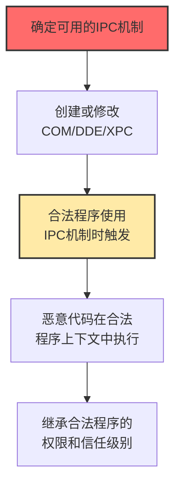

# 进程间通信 (T1559)

## 一句话通俗理解

**攻击者利用程序之间的"对话通道"（COM、DDE等）来让合法程序执行恶意代码——就像冒充老板给员工打电话下命令。**

## 难度等级

⭐️⭐️ 中级（需要一定基础）

需要了解COM、DDE等进程间通信机制的工作原理。

## 技术描述

进程间通信（IPC）是操作系统提供的让不同程序互相"对话"的机制。Windows中最常见的IPC机制包括COM（组件对象模型）、DDE（动态数据交换），macOS有XPC服务。攻击者滥用这些机制来在合法程序的上下文中执行恶意代码，从而绕过安全检测。

**通俗解释：**
想象一个大型办公室（操作系统），不同的员工（程序）之间通过电话（IPC机制）沟通。攻击者就像一个骗子，他可以：（1）篡改电话簿——当员工A打电话给B时，实际接通的是骗子（COM劫持）；（2）冒充老板发传真——让员工以为收到的是老板的指示（DDE攻击）。无论哪种方式，员工都会"合法"地执行骗子的命令。

**技术原理：**
1. COM对象在Windows注册表中注册，其他程序通过CLSID（类标识符）来创建和使用
2. 攻击者修改注册表，将合法COM对象的加载路径指向恶意DLL
3. 当任何程序尝试创建这个COM对象时，实际加载了恶意的DLL
4. DDE是Office应用之间通信的旧协议，支持字段自动更新
5. 攻击者在Office文档中嵌入DDE字段，当打开文档时触发命令执行

**用途与影响：**
主要用于持久化（COM劫持）、防御规避（在合法进程上下文中执行）和无文件攻击。DDE攻击可以绕过宏检测，因为DDE是Office的合法功能。

## 子技术列表

**该技术共有 3 个子技术：**

| 子技术ID | 中文名称 | 通俗解释 |
|----------|----------|----------|
| T1559.001 | COM | 利用Windows组件对象模型在合法进程中执行代码 |
| T1559.002 | DDE | 利用Office的动态数据交换功能执行命令（无需宏） |
| T1559.003 | XPC服务 | 利用macOS的轻量级通信机制进行权限提升 |

## 攻击流程



## 真实案例

### 案例1：COM劫持用于持久化和防御规避（2024）

- **时间**: 2024年
- **目标**: Windows企业环境
- **手法**: 攻击者修改注册表中的COM对象注册信息，使得当常用程序创建特定COM对象时，实际加载的是恶意DLL。不需要修改系统文件，只需修改注册表键值，安全软件通常不会检测。
- **影响**: 长期隐蔽持久化
- **参考链接**: [Mandiant COM劫持分析](https://www.mandiant.com/resources/blog/com-hijacking-windows-persistence)

### 案例2：DDE攻击利用Office文档执行命令（2024）

- **时间**: 2024年
- **目标**: 使用Microsoft Office的企业
- **手法**: 攻击者创建包含恶意DDE字段的Word/Excel文档。当受害者打开文档时，DDE字段尝试连接到cmd.exe或powershell.exe执行命令。不需要宏，绕过基于宏检测的安全方案。
- **影响**: Office用户被远程控制
- **参考链接**: [SensePost DDE分析](https://www.sensepost.com/blog/2017/macro-less-code-execution-in-msword/)

### 案例3：利用COM对象执行无文件攻击（2024-2025）

- **时间**: 2024-2025年
- **目标**: 全球Windows系统
- **手法**: 攻击者修改注册表中的COM对象映射，将常用COM对象指向恶意脚本或DLL。当系统或应用程序使用这些COM对象时，恶意代码在内存中执行，不在磁盘上留下文件。
- **影响**: 无文件攻击难以检测
- **参考链接**: [MITRE ATT&CK T1559.001](https://attack.mitre.org/techniques/T1559/001/)

## 红队视角

> ⚠️ **免责声明**：以下内容仅用于合法的安全测试、渗透测试和教育目的。未经授权对他人系统进行测试是违法行为。

### 常用工具

| 工具名称 | 用途 | 平台 | 链接 |
|----------|------|------|------|
| COMProxy | COM劫持利用工具 | Windows | https://github.com/nccgroup/COMProxy |
| PowerSploit | PowerShell工具集（含COM利用） | Windows | https://github.com/PowerShellMafia/PowerSploit |

## 蓝队视角

### 检测方法

- 监控非预期的COM对象创建，特别关注ShellWindows等危险CLSID
- 检测Office应用使用DDE协议的行为
- 监控跨进程通信中的异常数据访问

## 缓解措施

### 优先级1：关键措施

**措施名称：** 禁用Office动态数据交换（DDE）功能

**具体实施步骤：**
1. 通过组策略禁用Office DDE功能，阻止攻击者利用DDE字段执行恶意命令
2. 在Word、Excel、Outlook中禁用DDEAUTO和DDE字段更新
3. 配置注册表禁用DDE：`HKEY_CURRENT_USER\Software\Microsoft\Office\&lt;version&gt;\Word\Security\DisableDDEServerLookup`

### 优先级2：重要措施

**措施名称：** COM对象访问控制

**具体实施步骤：**
1. 使用AppLocker或WDAC限制COM对象的创建和实例化
2. 监控和管理CLSID注册，阻止非授权的COM类注册
3. 限制对`HKLM\SOFTWARE\Classes\CLSID`和`HKCU\SOFTWARE\Classes\CLSID`的写入权限

**配置示例：**
```bash
# 检查当前COM注册表中可疑的CLSID映射
reg query "HKLM\SOFTWARE\Classes\CLSID" /s | findstr "ShellWindows ShellBrowserWindow"

# PowerShell查看COM对象的DLL加载路径
Get-ItemProperty "HKLM:\SOFTWARE\Classes\CLSID\{CLSID-GUID}\InprocServer32"
```

### MITRE ATT&CK 缓解措施映射

| 缓解措施ID | 缓解措施名称 | 适用性 | 说明 |
|------------|-------------|--------|------|
| M1022 | 应用程序控制 | 适用 | 限制COM对象的创建和使用 |
| M1042 | 禁用功能或服务 | 适用 | 禁用Office DDE功能 |
| M1025 | 保护注册表 | 适用 | 限制对COM注册表的修改权限 |

## 检测建议

### 网络层检测

**检测方法：** 监控与COM/DDE相关的异常网络通信，包括跨进程RPC连接、Office应用程序与外部服务之间的DDE协议流量。

**具体规则/命令示例：**
```bash
# 检测异常的RPC连接用于COM激活
tcpdump -i eth0 port 135 and not host trusted-dc -w com_rpc.pcap

# 检测Office DDE协议相关的HTTP外联（通过Office进程发起的异常出站连接）
netstat -ano | findstr :443 | findstr WINWORD.EXE
```

### 主机层检测

**检测方法：** 监控COM对象创建和激活事件、DDE字段使用、Office进程启动命令行的异常参数。

**Windows事件ID：**
- 4688（进程创建）- 监控使用COM API启动的进程
- 7（Sysmon DLL加载）- 监控COM对象加载的DLL路径
- 12/13/14（注册表事件）- 监控COM类注册表的修改

**Linux日志：**
- （不适用，COM/DDE为Windows特有技术）

**具体命令示例：**
```bash
# 查看Sysmon事件ID 7（DLL加载）中的COM对象加载
wevtutil qe Microsoft-Windows-Sysmon/Operational /q:"Event[System[EventID=7]]" /c:10 /f:text

# 检测Office应用启动时的DDE字段使用
Get-WinEvent -FilterHashtable @{LogName='Microsoft-Windows-Sysmon/Operational'; ID=1} | Where-Object {$_.Properties[10].Value -match "dde|DDEAUTO"} | Select-Object TimeCreated, Message

# 检查注册表异常COM类注册
reg query "HKLM\SOFTWARE\Classes\CLSID" | findstr "ShellWindows ShellBrowserWindow"
```

### 应用层检测

**Sigma规则示例：**

```yaml
title: Suspicious COM Object Instantiation
status: experimental
description: Detects creation of COM objects commonly abused for execution
logsource:
    category: process_creation
    product: windows
detection:
    selection:
        CommandLine|contains:
            - 'ShellWindows'
            - 'ShellBrowserWindow'
            - 'InternetExplorer.Application'
            - 'Excel.Application'
    condition: selection
level: medium
tags:
    - attack.t1559
```

## 动手实验

> ⚠️ **重要提示**：所有实验必须在隔离的实验室环境中进行，禁止对未授权的真实系统进行测试。

### 实验1：查看COM对象注册信息

```powershell
Get-ItemProperty "HKLM:\SOFTWARE\Classes\CLSID\{CLSID-GUID}\InprocServer32"
Get-ItemProperty "HKCU:\SOFTWARE\Classes\CLSID\*\InprocServer32"
```

### 实验2：DDE安全设置检查

```powershell
Get-ItemProperty -Path "HKCU:\Software\Microsoft\Office\16.0\Word\Security" -Name "DDEAllowed"
```

## 术语解释

| 术语 | 英文原名 | 通俗解释 |
|------|----------|----------|
| COM | Component Object Model | Windows的"零件标准化"技术 |
| DDE | Dynamic Data Exchange | Office程序之间的"自动传纸条"功能 |
| XPC | XPC Service | macOS的"程序间通话"服务 |
| COM劫持 | COM Hijacking | 篡改"零件目录"让程序加载恶意版本 |
| IPC | Inter-Process Communication | 程序之间的"对话机制" |

## 参考资料

- [MITRE ATT&CK T1559官方页面](https://attack.mitre.org/techniques/T1559/)
- [COM劫持持久化分析](https://www.mandiant.com/resources/blog/com-hijacking-windows-persistence)
- [DDE无宏代码执行](https://www.sensepost.com/blog/2017/macro-less-code-execution-in-msword/)
- [macOS XPC安全](https://objective-see.com/blog/blog_0x3F.html)
